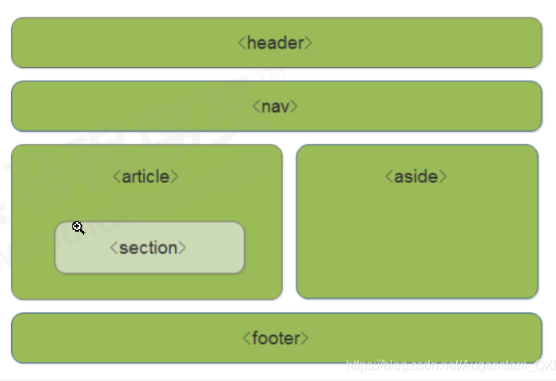
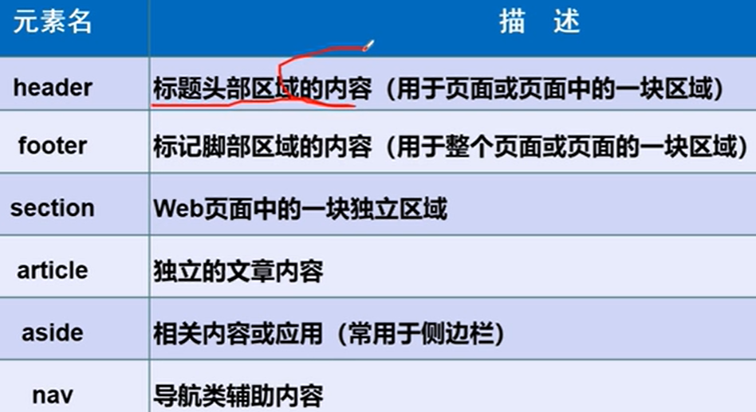

# 1 HTML 页面基本结构标签

每个网页都会有一个基本的结构标签，页面内容都是在这些基本标签上书写。 HTML 页面也叫 HTML 文档。
基本骨架:

```html
<!-- 页面中最大的标签 根标签 -->
<html>
    <!-- 头部标签 -->
    <head>     
        <!-- 标题标签 -->
        <title></title> 
    </head>
    <!-- 文档的主体 -->
    <body>
    </body>
</html>
```

```html

<Dokumenttyp> 	  <!DOCTYPE html>
<Wurzelelement>	  <html>
<Header>	    <head>
(Kopfdaten)	     (…)
</Header>	    </head>
<Body>		    <body>
(…)		     (…)
</Body>		    </body>
</Wurzelelement>  </html>
```

| 标签名             | 定义     | 说明                            |
| --------------- | ------ | ----------------------------- |
| `<html></html>`   | HTML标签 | 页面中的最大的标签，我们称为根标签             |
|x|Dokumenttyp-Deklaration|macht Angaben zur verwendeten HTML-Version|
| `<head><head> `   | 文档的头部  | 注意在head标签中我们必须要设置的标签是title  . Das Wurzelelement ist in einer HTML-Datei immer das `<html>`-Element. enthält die Kopfdaten wie z.B. Angaben zum Titel oder Angaben für Suchmaschinen |
| `<title></title>` | 文档的标题  |  在 head标签里面  让页面拥有一个属于自己的网页标题              |
| `<body></body> `  | 文档的主体  | 元素包含文档的所有内容，页面内容基本都是放到body里面的. enthält den anzuzeigenden Inhalt (Text, Grafiken etc.) |

# 2 文档类型声明标签 <!DOCTYPE>

<!DOCTYPE>

文档类型声明，作用就是告诉浏览器使用哪种HTML版本来显示网页。
<!DOCTYPE html> 这句代码的意思是: 当前页面采取的是 <mark>HTML5 </mark>版本来显示网页.
注意：
<!DOCTYPE> 声明位于文档中的<mark>最前面的位置，处于 <html> 标签之前</mark>。
<!DOCTYPE> 不是一个 HTML 标签，它就是文档类型声明标签。

```html
<!DOCTYPE html>
<html lang="en">
<head>
    <meta charset="UTF-8">
    <meta http-equiv="X-UA-Compatible" content="IE=edge">
    <meta name="viewport" content="width=device-width, initial-scale=1.0">
    <title>Document</title>
</head>
<body>

</body>
</html>
```

# 3 html标签

lang 这个 attribute 
语言种类
```html
<html lang="en">

</html>
```

用来定义当前文档显示的语言

这样的可以，来告诉阅览器这个页面采取html5版本来显示页面

- en 定义语言为英语, 就是定义为英文网页
- zh-CN 定义语言为中文， 就是定义为 中文网页

其实对于文档显示来说， 定义成 en 的文档也可以显示中文， 定义成 zh-CN的文档也可以显示英文

**「lang的作用」**

- 根据根据lang属性来设定不同语言的css样式，或者字体

- 告诉搜索引擎做精确的识别

- 让语法检查程序做语言识别

- 帮助翻译工具做识别

- 帮助网页阅读程序做识别

# 4 Head 标签

Meta 标签 为面属性标签， 它用来标书我们网站的一些信息

Meta标签一般用来作 SEO 

## 4.1 title 网站标题 (双标签 )

`title` 具有不可替代性，是我们内页的第一个重要标签，是搜索引擎了解网页的入口和对网页主题归属的最佳判断点。

## 4.2 Meta 标签 (Standalone-Tag)

In Meta-Tags können Sie Anweisungen für Webserver, Browser oder automatische Suchmaschinen ("Robots") schreiben. 
Meta-Tags können außerdem Angaben zum Autor oder Inhalt der Datei beinhalten, oder HTTP-Befehle, wie z.B. eine Weiterleitung zu einer anderen Adresse. 

### 4.2.1 Syntax 
eine Angabe steht in dem Standalone-Tag `<meta>`
jedes Meta-Tag hat zwei Attribute (1. name oder http-equiv oder charset und 2. content)

Eigenschaften die durch `name` definiert werden richten sich meist an Client-Programme (Browser) oder Suchmaschinen-Robots. 
`http-equiv` bedeutet, dass es sich um Eigenschaften des HTTP handelt, um die Kommunikation zwischen Server und Browser zu beeinflussen.

### 4.2.2 charset 字符集

```html
<head>
    <meta charset="UTF-8">
</head>
```

zeigt dem Browser an, nach welcher Kodierung die Zeichen als Bytes notiert sind
字符集（character set）是多个字符的集合，以便计算机能够识别和存储各种文字。
在`<head>`标签内，可以通过`<meta>`标签的charset 属性来设置文档使用何种字符编码。
charset常用的值有：GB2312 , GBK、UTF-8，其中UTF-8被称为万国码，基本包含了全世界所有国家需要用到的字符。

### 4.2.3 http-equiv属性

```html
<head>
    <meta http-equiv="X-UA-Compatible" content="IE=edge">
</head>
```
ttp-equiv bedeutet, dass es sich um Eigenschaften des HTTP handelt, um die Kommunikation zwischen Server und Browser zu beeinflussen. 

http-equiv相当于http的文件头作用，它可以向浏览器传回一些有用的信息，以帮助正确和精确地显示网页内容

- content-Type 设定网页字符集(Html4用法，不推荐)
- Expires(期限) ,可以用于设定网页的到期时间。一旦网页过期，必须到服务器上重新传输。
- Pragma(cache模式),是用于设定禁止浏览器从本地机的缓存中调阅页面内容，设定后一旦离开网页就无法从Cache中再调出
- Refresh(刷新),自动刷新并指向新页面。Automatische Weiterleitung zu anderer Adresse
    - z.B. für Weiterleitung von einer alten Website auf die neue Adresse
    - die Zahl steht für die Zeit in Sekunden, nach der die Weiterleitung erfolgen soll, 0 lädt die neue Seite sofort
    - URL ist die neue Domain auf die Sie weiterleiten möchten
- cache-control（请求和响应遵循的缓存机制）


### 4.2.4 name 属性


<mark>后面的 content 中的值， 就是只 前面为 name = viewport 的时候， 这个 viewport 对应的取值</mark>


```html
<head>
    <meta name="viewport" content="width=device-width, initial-scale=1.0">
     <meta name="description" content="来这个地方能够学习java">
</head>
```


```html
<head>
    <!-- 网站标题 -->
    <title></title>
    <!-- 网站说明 -->
    <meta name="description" content="">
    <!-- 网站关键词 -->
    <meta name="keywords" content="">
</head>


 1 <!DOCTYPE html>
 2 <html lang="de">
 3   <head>
 4     <meta charset="utf-8">
 5     <title>Den Dateikopf richtig einsetzen</title>
 6     <meta name="author" content="Max Mustermann">
 7     <meta name="description" content="Beschreibung der Seite">
 8     <meta name="keywords" content="HTML, Meta-Tags, Dateikopf">
 9     <meta name="date" content="2016-10-17T09:49:37+01:00">
10     <meta name="robots" content="index,follow">
        <meta name="date" content="2010-12-15T08:49:37+01:00" />
11     <link rel="stylesheet" href="./style.css">
12     <link rel="shortcut icon" type="image/x-icon" href="./favicon.ico">
13   </head>
14   <body>
15   </body>
16 </html>

```


**name属性的取值**

- keywords(关键字) 告诉搜索引擎，该网页的关键字
    - keywords 最好限制为6～8 个关键词，关键词之间用英文逗号隔开，采用关键词1,关键词2 的形式。
    - Trennung der Schlüsselwörter durch Kommata. ein Schlüsselwort kann auch aus zwei oder mehreren Einzelwörtern bestehen, jedoch keine halben oder gar ganzen Sätze
- description(网站内容描述) 用于告诉搜索引擎，你网站的主要内容。
- viewport(移动端的窗口)
  - 通常viewport是指视窗、视口。浏览器上(也可能是一个app中的webview)用来显示网页的那部分区域。在移动端和pc端视口是不同的，pc端的视口是浏览器窗口区域，而在移动端有三个不同的视口概念：布局视口、视觉视口、理想视口
- robots(定义搜索引擎爬虫的索引方式) robots用来告诉爬虫哪些页面需要索引，哪些页面不需要索引
- author(作者): beschreibt den inhaltlich Verantwortlichen
- generator(网页制作软件）
- copyright(版权)
- data (Publikationsdatum ): Das Datum wird wie folgt angegeben: Jahr-Monat-Tag dann folgt ein T und direkt danach die Zeit im Format Stunden:Minuten:Sekunden. Anschließend kann nach einem + die Abweichung zur eigenen Zeit angegeben werden.
- language (Sprache der Webseite)
-  page-topic (Inhalt)
-  reply-to (E-Mail Adresse 
-  audience (Zielgruppe)
- content-type (Art des Inhalts  
-  Content-Script-Type/ Content-Style-Type (Default-Sprachen für Scripts/Stylesheets 

#### 4.2.4.1 robots
Öffentliche Suchdienste beeinflussen

`<meta name="robots" content="[Wert]" />`
kann das Durchsuchen der Webseite und/oder Unterseiten durch Suchmaschinen beeinflussen
- index = aktuelle HTML-Seite darf von Suchmaschinen durchsucht werden
- noindex = aktuelle HTML-Seite darf von Suchmaschinen nicht durchsucht werden
- follow = Links dürfen von Suchmaschinen durchsucht werden
- nofollow = Links dürfen von Suchmaschinen nicht durchsucht werden
- all = sowohl die aktuelle HTML-Seite als auch die Links dürfen von Suchmaschinen durchsucht werden
Mehr dazu unter Suchmaschinenoptimierung

## 4.3 link 标签  (css 文件)
Beziehungen innerhalb der Kopfdaten, stellen eine gute Möglichkeit dar, <mark>um Abhängigkeiten einer HTML-Datei anzugeben. </mark> So z.B. die vorherige oder nächste Seite. Suchdienste können so nahezu komplette Site-Maps der Website erstellen. Allerdings werden Kopfdaten meist für andere Informationen benötigt, wie das CSS-Stylesheet oder einem Favicon.

```html
 1 <!DOCTYPE html>
 2 <html lang="de">
 3   <head>
 4     <meta charset="utf-8">
 5     <title>Beziehungen im Kopfbereich</title>
 6     
 7     <link rel="stylesheet" href="./style.css">
 8     <link rel="shortcut icon" type="image/x-icon" href="./favicon.ico">
 9   </head>
10   <body>
11   </body>
12 </html>
```
### 4.3.1 syntax
` <link rel= ″某个Attributwert″ type="image/x-icon" href="./favicon.ico"> `

有这些 某个Attributwert
- stylesheet bezieht sich auf eine Datei mit Style-Definitionen (Stylesheet, näher im Kapitel „CSS – Cascading Stylesheets“ beschrieben)
- alternate stylesheet steht für eine Datei mit alternativen Style-Definitionen, die neben dem eigentlichen Stylesheet aufgeführt werden
- shortcut icon definiert ein Icon (Favicon), dass in der Adresszeile oder bei den Lesezeichen angezeigt wird
- media dient der Bestimmung eines Ausgabemediums
- fontdef kann eine downloadbare Schriftart einbinden um diese im Dokument verwendbar zu machen


## 4.4 script标签 (引用 js 文件 )

<script src="script/07DOM01.js" async defer></script>


# 5 body 标签内部





这些新增的标签 都可以取代 div 标签 

- < header > :头部标签
- < nav >: 导航标签 
-  < main >: 包含  < article > 和 < section > 和  < aside >
    - < article >： 内容标签
    - < section >:定义文档某个区域
    - < aside >:侧边栏标签
- < footer >: 尾部标签

**–注意：**

- 这种语义化标准主要是针对**搜索引擎**的
- 这些新标签页面中可以使用**多次**
- 在IE9中，需要把这些元素转换为**块级元素**
- 其实，移动端更喜欢使用这些标签anonyme Funktion als Wrapper für Funktionsaufrufe


## 5.1 例子

```html
<!DOCTYPE html>
<html lang="en">

<head>
	<meta charset="UTF-8">
	<meta http-equiv="X-UA-Compatible" content="IE=edge">
	<meta name="viewport" content="width=device-width, initial-scale=1.0">
	<meta name="description" content="Portfolio of Yanbo Zhu">
	<meta name="keywords" content="Portfolio Yanbo Zhu">
	<title>Portfolio-YanboZhu</title>
	<link href="styles/12_css_projekt.css" rel="stylesheet">
	<script src="js/12_javascript_array_hangman.js" defer async></script>
	<script src="js/12_javascript_FormdataUndJson.js" defer async></script>
</head>

<body>
	<h1>Portfolio Yanbo Zhu</h1>
	<hr>
	<div id="yzh_animation"> Welcome</div>
	<hr>
	<div id="Container">
		<nav>
			<h2>Navigation</h2>
			<ul>
				<li><a href="#personal_information">Personal Infomation</a></li>
				<li><a href="#education">Education experience</a></li>
				<li><a href="#skills">Skills</a></li>
				<li><a href="#form">Form of Help Application</a></li>
			</ul>
		</nav>
		<hr>
		<main>
			<article id="personal_infomation">
				<h2>Personal Info </h2>
				<article>
					<h3>Personal Photo</h3>
					<figure>
						
						<!-- <figcaption>Yanbo</figcaption> -->
					</figure>
				</article>
				<h3>General</h3>
				<div>
					<div>Name:<div id="fullname">Yanbo Zhu</div>
					</div>
					<div>Address: Berlin, Germany </div>
					<div>Date of Birth: 01, June, 1900</div>
					<div>Age: &gt; 100 years old</div>
					<div>Email: <a href="mailto:2323232@gmail.com">Send Email</a></div>
				</div>

				<article>
					<h3>Birth Location: Berlin</h3>
					<ul>
						<li><a href="https://de.wikipedia.org/wiki/Berlin" target="_blank">WikiPage of Berlin</a></li>
						<li>Introduction Video: <a href="https://www.youtube.com/embed/ZHHbpy91O2E"
								title="Berlin 4K">Introduction
								of
								Berlin </a></li>
					</ul>
				</article>
			</article>
			<hr>
			
			<article id="formForHelpAplication">
				<h2>Application For Help </h2>
				please give me your infomation so that superman can help you
				<form name="Help Application">
					<fieldset>
						<legend>Ihre Daten</legend>
						<label for="firstName">firstName</label>
						<input id="firstName" name="firstName" type="text" size="20" minlength="3" maxlength="15"
							placeholder="Max" required pattern="[a-zA-Z]{3,10}$">
						<label for="lastName">lastName</label>
						<input id="lastName" name="lastName" type="text" size="20" minlength="3" maxlength="15" required
							placeholder="Mustermann" pattern="[a-zA-Z]{3,10}$">
						<br>
						<label for="mail">E-Mail</label>
						<input id="mail" name="E-mail" type="email" size="40" required
							placeholder="Max.Mustermann@gmail.com" pattern="[a-z0-9._%+-]+@[a-z0-9.-]+\.[a-z]{2,}$">
						<label for="age">Age</label>
						<input id="age" name="age" type="number" max="100" min="10" step="1">
						<br>
						Gender:
						<label for="genderMale">male</label>
						<input id="genderMale" type="radio" name="gender" value="male">
						<label for="genderFemale">female</label>
						<input id="genderFemale" type="radio" name="gender" value="female">
						<br>
						<label for="city">Wählen Sie Ihre Wohnstadt</label>
						<select id="city" name="city_residence">
							<option value="berlin">Berlin</option>
							<option value="hamburg">Hamburg</option>
							<option value="koeln">Köln</option>
						</select>
					</fieldset>
				</form>
			</article>
		
		</main>
	</div>
	
	<footer>
		<hr>
		<h2>Feedback </h2>
		<form name="Feedback">
			<fieldset>
				<legend>Wie ist Deine Stimmung?</legend>
				<figure>
					
				</figure>
				<div>
					<label for="good">Super</label>
					<input type="radio" id="good" value="g" name="mood" checked>
				</div>
				<div>
					<label for="bad"> Bad</label>
					<input type="radio" id="bad" value="b" name="mood">
				</div>
			</fieldset>
			<fieldset>
				<legend>Detail</legend>
				Please give me your Customer Satisfaction to this website:
				<br>
				Satisfaction Rate: 0<input type="range" min="0" max="100" step="10">100
				<br>
				<br>
				<label for="message">Please write here your commitment to this website:</label>
				<br>
				<textarea id="message" rows="3" cols="50">Dieses Formular ist einfach umwerfend!</textarea>
			</fieldset>
			<br>
			<input type="submit">
			<input type="reset">
		</form>
	</footer>
	
</body>

</html>
```


```html
<!DOCTYPE html>
<html lang="zh">
    <head>
        <meta charset="UTF-8">
        <meta http-equiv="X-UA-Compatible" content="IE=edge">
        <meta name="viewport" content="width=device-width, initial-scale=1.0">
        <title>Document</title>
        <style>
            header,
            nav {
                height: 120px;
                background-color: pink;
                border-radius: 15px;
                width: 800px;
                margin: 15px auto;
            }

            section {
                width: 500px;
                height: 300px;
                background-color: skyblue;
            }
        </style>
    </head>
    <body>
        <header>头部标签</header>
        <nav>导航栏标签</nav>
        <section>某个区域</section>
    </body>
</html>
```


# 6 HTML标签的语义化

- 方便代码的阅读和维护，样式丢失的时候能让页面呈现清晰的结构。

- 有利于SEO，搜索引擎根据标签来确定上下文和各个关键字的权重。

- 方便其他设备解析，如盲人阅读器根据语义渲染网页

-  标签：规定页面上所有链接的默认 URL 和设置整体链接的打开状态

# 7 TDK 标签 SEO 优化

https://docs.mphy.top/#/HTML/ch04

SEO（Search Engine Optimization），即搜索引擎优化，是一种利用搜索引擎的规则提高网站在有关搜索引擎内自然排名的方式。

SEO 的目的是对网站进行深度优化，从而帮助网站获得免费流量，进而在搜索引擎上提升网站排名，提高网站知名度。

页面必须有三个标签用来进行 SEO 优化。

- `title`
- `description`
- `keyword`

```html
<head>
    <!-- 网站标题 -->
    <title></title>
    <!-- 网站说明 -->
    <meta name="description" content="">
    <!-- 网站关键词 -->
    <meta name="keywords" content="">
</head>
```

## 7.1 title 网站标题

`title` 具有不可替代性，是我们内页的第一个重要标签，是搜索引擎了解网页的入口和对网页主题归属的最佳判断点。

建议：网站名（产品名）- 网站的介绍（尽量不要超过30个汉字）

例如：

- 京东(JD.COM) - 综合网购首选-正品低价、品质保障、配送及时、轻松购物！
- 小米商城 - 小米5s、红米Note 4、小米MIX、小米笔记本官方网站

## 7.2 description 网站说明

简要说明我们网站主要是做什么的。

我们提倡，description 作为网站的总体业务和主题概括，多采用“我们是…”、“我们提供…”、“×××网作为…”、“电话：010…”之类语句。

例如：

```html
<meta name="description" content="京东JD.COM-专业的综合网上购物商城,销售家电、数码通讯、电脑、家居百货、服装服饰、母婴、图书、食品等数万个品牌优质商品.便捷、诚信的服务，为您提供愉悦的网上购物体验!" />
```

## 7.3 keywords 关键字

- keywords 是页面关键词，是搜索引擎的关注点之一。
- keywords 最好限制为6～8 个关键词，关键词之间用英文逗号隔开，采用关键词1,关键词2 的形式。

例如：

```html
<meta name= " keywords" content="网上购物,网上商城,手机,笔记本,电脑,MP3,CD,VCD,DV,相机,数码,配件,手表,存储卡,京东" />
```

## 7.4 LOGO SEO优化

1. logo 里面首先放一个h1 标签，目的是为了提权，告诉搜索引擎，这个地方很重要。

2. h1 里面再放一个链接，可以返回首页的，把logo 的背景图片给链接即可。

3. 为了搜索引擎收录我们，我们链接里面要放文字（网站名称），但是文字不要显示出来。
- 方法1：text-indent 移到盒子外面（text-indent: -9999px) ，然后overflow:hidden ，淘宝的做法。

- 方法2：直接给font-size: 0; 就看不到文字了，京东的做法。
4. 最后给链接一个title 属性，这样鼠标放到 logo 上就可以看到提示文字了。
