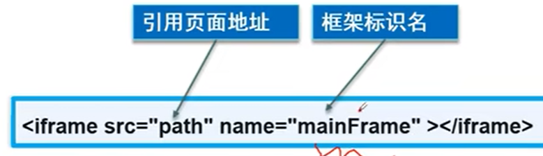
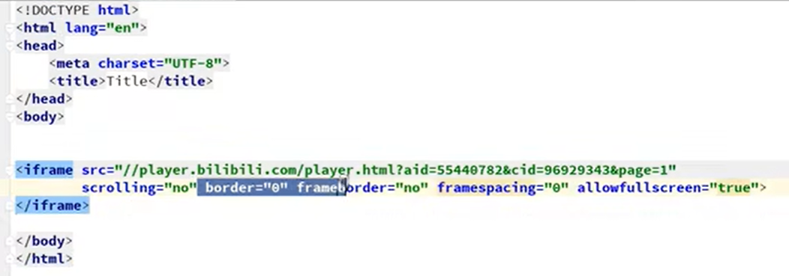
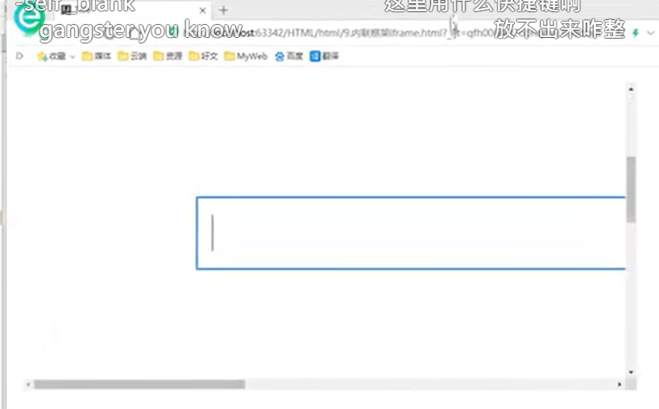
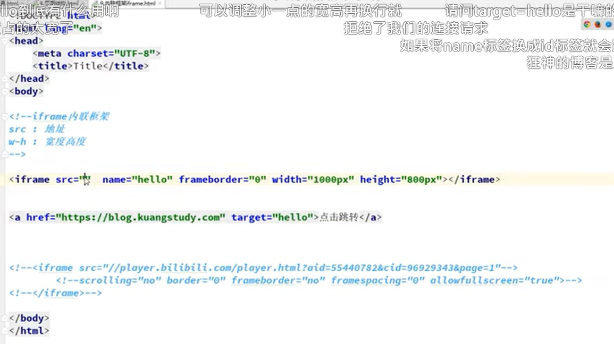
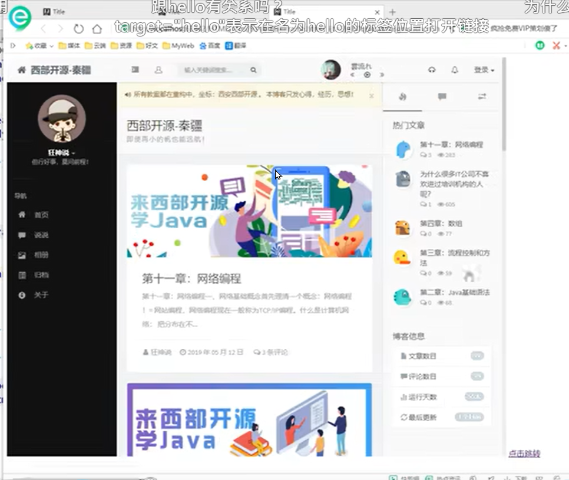

# 1 视频资源

https://www.bilibili.com/video/BV1x4411V75C?p=11&vd_source=55e5cc2f534c16c73bbeb684e98c4195https://www.bilibili.com/video/BV1x4411V75C?p=11&vd_source=55e5cc2f534c16c73bbeb684e98c4195

[HTML页面引入另一个HTML页面，比如各个页面引入通用的网站头部、尾部、导航栏_原来的1024的博客-CSDN博客_html 引入头部](https://blog.csdn.net/yldmkx/article/details/115313765)

# 2 iframe内联框架的基本原理

就是在一个网页里嵌套另一个网页

可以引入其他的html, 或者视频， 等等

# 3 语法
```html
<iframe src="path" name="mainFrame"></iframe>
```


- src： 地址
- name 
- frameborder
- width 宽度高度
- height





# 5 例子

## 5.1 例子0

添加一个bilibili的视频： 



## 5.2 例子1

`<iframe src="https://www.baidu.com" frameborder="0"></frame>`



## 5.3 例子2



点击 “点击跳转”后， 左边会加载iframe 框架内的东西

 

## 5.4 例子3 引入一个自建的html

```html
<!DOCTYPE html>
<html>
<head>
    <meta http-equiv="Content-Type" content="text/html; charset=UTF-8"/>
    <title>首页</title>
</head>
<body>
    <iframe src="centerHeader.html" height="100%" width="100%" scrolling="no" frameborder="0">
    </iframe>
</body>
```
