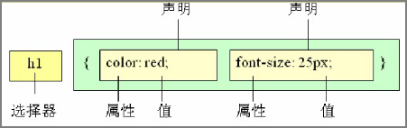

# 1 HTML 的局限性

HTML 是网友的骨架，只关注内容的语义。例如`<h1>`表示大标题，`<p>`表示段落。

早期的时候，HTML 只能做一些简单的样式，网页非常丑，而且使 HTML 代码臃肿。

- HTML满足不了设计者的需求，可以将网页结构与样式相分离，这样就可以在不更改网页结构的前提下，更换网站的样式。

- 操作html属性不方便

- HTML里面添加样式带来的是无尽的臃肿和繁琐

# 2 css简介

CSS 最大价值: 由 HTML 专注去做结构呈现，样式交给 CSS，即 结构 ( HTML ) 与样式( CSS ) 相分离

 CSS 是层叠样式表 ( Cascading Style Sheets ) 的简称.
 有时我们也会称之为 CSS 样式表或级联样式表。
 CSS 是也是一种标记语言
 CSS 主要用于设置 HTML 页面中的文本内容（字体、大小、对齐方式等）、图片的外形（宽高、边框样式、边距等）以及版面的布局和外观显示样式。
 CSS 让我们的网页更加丰富多彩，布局更加灵活自如。简单理解：CSS 可以美化 HTML , 让 HTML 更漂亮， 让页面布局更简单。


# 3 css语法规范

1.使用 HTML 时，需要遵从一定的规范，CSS 也是如此。要想熟练地使用 CSS 对网页进行修饰，首先需要了解CSS 样式规则。
2.CSS 规则由两个主要的部分构成：<mark>选择器 以及 一条或多条声明</mark>。



 1.选择器是用于指定 CSS 样式的 HTML 标签，花括号内是对该对象设置的具体样式
 2.属性和属性值以“键值对”的形式出现
 3.属性是对指定的对象设置的样式属性，例如字体大小、文本颜色等
 4.属性和属性值之间用英文“:”分开
 5.多个“键值对”之间用英文“;”进行区分

Solch eine Anweisung besteht aus zwei Teilen, dem Selektor und der Deklaration. 
- Der Selektor bestimmt, auf welches HTML-Element die Anweisung angewendet werden soll.  h1 就是 Selektor 
- Die Deklaration beschreibt, was auf das Element angewendet wird.  就是 {} 中的内容 为 Deklaration 
    - Sie besteht aus einer Eigenschaft (oder mehreren) die das Element besitzt und meist einem Wert, den die Eigenschaft bekommen soll.

```css
Selektor {Eigenschaft: Wert;}
      h1 {color:#885ac7;}
```


SELEKTOR
- Ein Selektor bestimmt das oder die HTML-Elemente auf welche die CSS-Regel angewendet werden soll
- Viele verschiedene Arten von Selektoren
- Hier: Elementselektor

DEKLARATIONSBLOCK
- Enthält die Deklarationen, die auf die ausgewählten HTMLElemente anzuwenden sind, und wird durch ein Paar geschweifte Klammern umschlossen Eine Deklaration besteht aus folgenden Einzelteilen: 
- der Eigenschaft (Property),
- einem Doppelpunkt, 
- einem oder mehreren Werten (Property Values) und
- einem abschließenden Semikolon.

## 3.1 例子

    所有的样式，都包含在 <style> 标签内，表示是样式表。<style> 一般写到 </head> 上方

```html
<head>
      <style>
          h4 {
              color: blue;
              font-size: 100px;
          }
      </style>
</head>
```

```html
<!DOCTYPE html>
<html lang="zh">
<head>
    <meta charset="UTF-8">
    <meta http-equiv="X-UA-Compatible" content="IE=edge">
    <meta name="viewport" content="width=device-width, initial-scale=1.0">
    <title>体验css语法规法</title>
    <style>
        p {  <!-- 给p这个标签定义样式 -->
            color: red;
            font-size: 20px;
        }

    </style>
</head>
<body>
    <p>
        Hallo
    </p>
</body>
</html>
```

## 3.2 css代码风格

- 展开式
- 选择器，属性名，属性关键字, 全部小写
- 空格规范

### 3.2.1 样式格式书写

2 紧凑格式  : 

```
h3 { color: pink; font-size: 20px;}
```

2 展开格式:  (强烈推荐这种格式， 因为更直观。)

```
h3 {
 color: pink;
 font-size: 20px;  
 }
```

### 3.2.2 样式大小写风格

1.小写格式强烈 (强烈推荐这种格式， 因为更直观。强烈推荐样式选择器，属性名，属性值关键字全部使用小写字母，特殊情况除外。)

    h3 {
         color: pink;
    }

 2 大写格式 

```
H3 {
 COLOR: PINK;
}
```

### 3.2.3 样式空格风格

属性值前面，冒号后面，保留一个空格 选择器（标签）和大括号中间保留空格

```
h3 {  // h3 后面有个空格 
 color: pink;  // 冒号后有一个空格 
}
```


## 3.3 DATENTYPEN


# 4 css样式表引入方式


1 
Style-Definition in separaten CSS-Dateien
```html
<head>
  <!-- andere Definitionen im HTML-Kopfbereich -->
  <link rel="stylesheet" type="text/css" href="stylesheet.css">
  <link rel="stylesheet" type="text/css" href="ie-korrekturen.css">
</head>
```

- Einheitliche(s) Stylesheet(s) für alle Seiten einer Website
- Einbindung in jedes HTML-Dokument möglich
- Änderungen von CSS-Eigenschaften wirken sich auf alle einbindenden HTML-Dokumente aus
- Einbindung mehrerer CSS-Dateien
- Vermischung mit CSS-Definitionen im Kopfbereich oder in style-Attributen möglich


2
Style-Definition im Head-Berteich eines HTML-Dokuments
```html
<head>
  <!-- andere Definitionen im HTML-Kopfbereich -->
  <style type="text/css">
    h1{
      color: #dd9900;
      font-family: arial, helvetica, sans-serif;
      font-weight: normal;
    }
  </style>
</head>
```

- Styles für verschiedene HTML-Elemente einer Webseite werden im Header des Dokuments mit `**<style>**` eingefügt
- Innerhalb von `**<style>**` erfolgt Definition in CSS-Syntax
- Bevorzugt wenn Gestaltung von HTML-Elementen per CSS nur in Ausnahmefällen erfolgt oder wenn es von der für eine Website gültigen Definition abweichende Elemente gibt


3 
Style-Definition innerhalb einzelner HTML-Elemente mittels style-Attributen
```html
<body>
  <h1 style="color: red">
    Die Seite mit dem besonderen Element
  </h1>
  <p style="background-color: #808040; color: #d8fd02;">
    Unser Kopf ist rund, damit das Denken die Richtung wechseln kann.
  </p>
</body>
```

- Formatierung einzelner Elemente innerhalb eines Dokuments mit Hilfe des `**style**`-Attributs
- Innerhalb des Wertebereichs des `**style**`-Attributs erfolgt Definition in CSS-Syntax
- Nur in Ausnahmefällen zu bevorzugen - Mischung von HTML und CSS schwer verständlich und lesbar


---

**Externes CSS** – Das Styling wird über eine externe CSS-Datei definiert, die mit dem `<link>` Element eingebunden wird. Beispiel:
```html
<head>
    <link rel="stylesheet" href="style.css">
</head> 
```


---

**Inline-CSS** – Das Styling wird direkt im HTML-Element mit dem Attribut `style` definiert.    
```html
<p style="color: red;">Das ist ein roter Text.</p>
```


---


**Internes CSS** – Das Styling wird im Kopfbereich des HTML-Dokuments mit dem `<style>` Element definiert.
```html
<head>
    <style>
        p {
            color: blue;
        }
    </style>
</head>
```


## 4.1 外部样式表(链接式)
Formate zentral im externen Stylesheet definieren

```html
<head>
    <link rel="stylesheet" href="index.css">
</head>

<head>
<style type="text/css">
@import url( URL ZUM STYLESHEET );
</style>
</head>

```

  也称链入式，是将所有的样式放在一个或多个以.css为扩展名的外部样式表文件中，通过link标签将外部样式表文件链接到HTML文档中。

- `rel`:定义当前文档与被链接文档之间的关系，在这里需要指定为“stylesheet”，表示被链接的文档是一个样式表文件。
- `href`:定义所链接外部样式表文件的URL，可以是相对路径，也可以是绝对路径。

引入外部样式表的步骤
1. 新建一个.css 文件， 把所有的css 代码都放入此文件中
2. 在html 中， 通过 link 标签引入这个文件

## 4.2 行内样式表(行内式)
Inline-Styles (HTML-Elemente direkt formatieren)

通过标签的style属性来设置元素的CSS样式. 适合于简单的样式修改
- style其实就是标签的属性
- 样式属性和值中间是:
- 多组属性值， 下载 “” 中， 之间直接用;隔开
- 只能控制当前的标签和以及嵌套在其中的字标签，造成代码冗余。
- **缺点:**没有实现样式和结构相分离。

```html
<标签名 style="属性1:属性值1; 属性2:属性值2; 属性3:属性值3;"> 内容 </标签名>
例如：
<div style="color: red; font-size: 12px;">青春不常在，抓紧谈恋爱</div>
```

## 4.3 内部样式表(内嵌式)

Formate zentral für ein Dokument definieren

也称为内嵌式，将CSS代码集中写在HTML文档的head头部标签中，并且用style标签定义。
- style标签一般位于head标签中，当然理论上他可以放在HTML文档的任何地方。
- type="text/css"  在html5中可以省略。
- 只能控制当前的页面 的样式 

- **缺点:**没有彻底分离结构与样式

```html
<head>
<style type="text/CSS">
    选择器（选择的标签） { 
      属性1: 属性值1;
      属性2: 属性值2; 
      属性3: 属性值3;
    }
</style>
</head>


<!DOCTYPE html>
 <html>
 <head>
 <title>Stylesheet im Dokument</title>
 <style type="text/css">
 /* Hier werden die Formate definiert */
 </style>
 </head>
 <body>
 ...
 </body>
 </html>
 
```


# 5 Kommentierung im Stylesheet
```css
/* Dies ist ein Kommentar */

```


# 6 Module

|Modulname|Beschreibung|Link|
|---|---|---|
|Animations|- Ermöglicht einfache Animationen ohne JavaScript  <br>- Einführung einer eigenen DOM-Schnittstelle für erweitertes Event-Handling|[https://www.w3.org/TR/css-animations-1/](https://www.w3.org/TR/css-animations-1/)|
|Background and Borders|- Zuständig für Hintergrund und Rahmen  <br>- Skalieren von Hintergrundbildern  <br>- Definition abgerundeter Ecken  <br>- Grafische Schmuckrahmen|[https://www.w3.org/TR/css-backgrounds-3/](https://www.w3.org/TR/css-backgrounds-3/)|
|Basic User Interface|- Gestaltung interaktiver Elemente wie Formulare, Hyperlinks oder der Cursor  <br>- Interaktive Hervorhebung von Elementen mit outline  <br>- Optische Unterscheidung gültiger und ungültiger Inhalte|[https://www.w3.org/TR/css-ui-4/](https://www.w3.org/TR/css-ui-4/)|
|Basic Box Model|- Definition des grundlegenden Boxmodells zur Festlegung von Innen- und Außenabständen, Rahmenstyles und stärken usw.|[https://www.w3.org/TR/css-box-4/](https://www.w3.org/TR/css-box-4/)|
|Cascading and Inheritance|- Prinzipien von Kaskadierung und Vererbung von CSS-Eigenschaften an Kindelemente|[https://www.w3.org/TR/css-cascade-4/](https://www.w3.org/TR/css-cascade-4/)|
|Color|- Festlegung von Farb- und Transparenzeigenschaften  <br>- Neue Möglichkeiten der Farbdefinition|[https://www.w3.org/TR/css-color-4/](https://www.w3.org/TR/css-color-4/)|
|Flexible Box Layout|- Neue Möglichkeiten der Anordnung von Elementen|[https://www.w3.org/TR/css-flexbox-1/](https://www.w3.org/TR/css-flexbox-1/)|
|Fonts|- Eigenschaften für Schriftarten|[https://www.w3.org/TR/css-fonts-4/](https://www.w3.org/TR/css-fonts-4/)|
|Generated Content for Paged Media|- Gestaltung von Printlayouts und seitenorientierten Ausgaben  <br>- Laufende Kopf- und Fußzeilen mit automatisiertem Überschriftenbezug  <br>- Seiten- und Kapitelnummerierung, Fußnotenautomatik, usw.|[https://www.w3.org/TR/css-gcpm-3/](https://www.w3.org/TR/css-gcpm-3/)|
|Generated and Replaced Content|- Dynamische Anpassung von Inhalten  <br>- Verschiebung von Elementen innerhalb eines HTML-Dokuments|[https://www.w3.org/TR/css-gcpm-3/](https://www.w3.org/TR/css-gcpm-3/)|


|Modulname|Beschreibung|Link|
|---|---|---|
|Grid Positioning|- Erweiterte Konzepte zur rasterbasierten Positionierung von Elementen|[https://www.w3.org/TR/css-grid-2/](https://www.w3.org/TR/css-grid-2/)|
|Hyperlink and Presentation|- Erweiterung des **`target`**-Attributes von HTML zur neuen Definition von Zielen für externe Verweise|[https://www.w3.org/TR/css3-hyperlinks/](https://www.w3.org/TR/css3-hyperlinks/)|
|Image Values and Replaced Content|- Erweiterte Spezifikation von Bildformaten, zum Beispiel Auflösung, alternative Farben, etc.  <br>- Anzeige bestimmter Bildausschnitte|[https://www.w3.org/TR/css-images-3/](https://www.w3.org/TR/css-images-3/)|
|Line Box|- Neue Eigenschaften für die Kontrolle von Eigenschaften einer Zeile  <br>- Berücksichtigung typografischer Basislinien|[https://www.w3.org/TR/css-inline-3/](https://www.w3.org/TR/css-inline-3/)|
|Lists and Counters|- Listeneigenschaften  <br>- Formatierung von Aufzählungszeichen und Nummerierungszahlen|[https://www.w3.org/TR/css-lists-3/](https://www.w3.org/TR/css-lists-3/)|
|Marquee|- Definition von animiertem Lauftext|[https://www.w3.org/TR/css3-marquee/](https://www.w3.org/TR/css3-marquee/)|
|Multi-column Layout|- Mehrspaltiger Textfluss mit automatischem Zeilenumbruch  <br>- Definition von Spalten, Spaltenbreiten, Abständen, Verhaltensweisen, usw.|[https://www.w3.org/TR/css-multicol-1/](https://www.w3.org/TR/css-multicol-1/)|
|Namespaces|- Definition von Namensräumen analog zu XML|[https://www.w3.org/TR/css-namespaces-3/](https://www.w3.org/TR/css-namespaces-3/)|
|Paged Media|- Printlayouts und seitenorientierte Ausgabe  <br>- Definition der Seitengröße, Unterscheidung linke Seite rechte Seite  <br>- Seitenumbruchkontrolle|[https://www.w3.org/TR/css-page-3/](https://www.w3.org/TR/css-page-3/)|
|Presentation Levels|- Laufnummern oder Nummern von Hierarchieebenen für HTML-Elemente  <br>- Benötigt für Gliederungsansicht oder Diashow|[https://www.w3.org/TR/css3-preslev/](https://www.w3.org/TR/css3-preslev/)|
|Ruby|- Ruby: eine im fernöstlichen Sprachen vorkommende Notation um Schriftzeichen mit zusätzlichen Informationen auszustatten, zur Präzisierung der im Kontext gemeinten Bedeutung  <br>- Positionierung von Ruby-Annotationen mit CSS-Eigenschaften|[https://www.w3.org/TR/css-ruby-1/](https://www.w3.org/TR/css-ruby-1/)|
|Speech Module|- Eigenschaften zur Steuerung von Sprachsynthesizern|[https://www.w3.org/TR/css-speech-1/](https://www.w3.org/TR/css-speech-1/)|


|Modulname|Beschreibung|Link|
|---|---|---|
|Syntax|- Beschreibt die allgemeine Syntax, Grammatik und das Fachvokabular von CSS|[https://www.w3.org/TR/css-syntax-3/](https://www.w3.org/TR/css-syntax-3/)|
|Text|- Eigenschaften zur Textkontrolle  <br>- Textumbruchkontrolle  <br>- Grafische Schrifteffekte|[https://www.w3.org/TR/css-text-3/](https://www.w3.org/TR/css-text-3/)|
|Template Layout|- Definition komplexer Webseitenlayouts  <br>- Unterteilung des Anzeigenbereichs in Regionen|[https://www.w3.org/TR/css-template-3/](https://www.w3.org/TR/css-template-3/)|
|2D-Transform, 3D-Transform|- 2- und 3-dimensionale Drehung und Dehnung von Texten|[https://www.w3.org/TR/css-transforms-1/](https://www.w3.org/TR/css-transforms-1/)|
|Transitions|- Definition von Übergängen zwischen verschiedenen Werten einer visuellen CSS-Eigenschaft|[https://www.w3.org/TR/css-transitions-1/](https://www.w3.org/TR/css-transitions-1/)|
|Values and Units|- Beschreibung der Wertetypen für Eigenschaften und Maßeinheiten|[https://www.w3.org/TR/css-values-3/](https://www.w3.org/TR/css-values-3/)|


