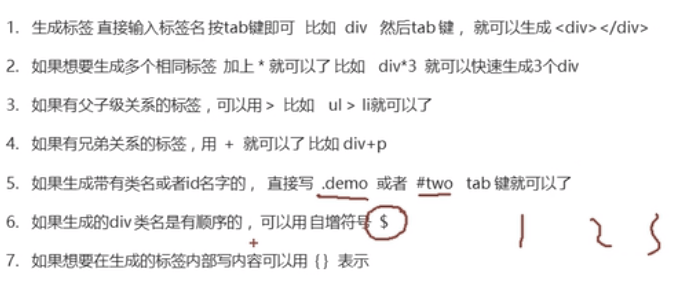
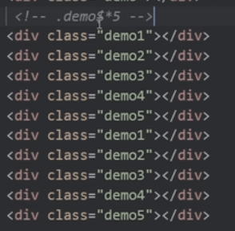
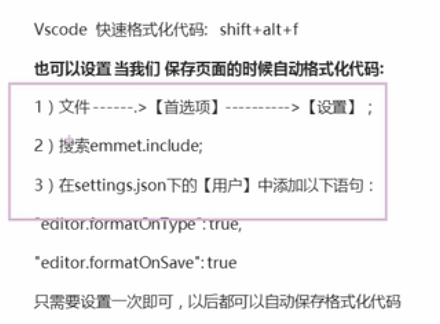

# 1 Emmet 语法

## 1.1 快速生成 HTML 结构代码

### 1.1.1 对于上图的第六点：

.demo$*5 ,然后按tab， 然后深成了 demo1 到 demo5 ，一共5个标签

### 1.1.2 对于上图的第七点：
`div{xxxx}`后，  按下tab 键, 生成`
xxxx
`
`div{yyyy}*5` 后， 生成 五个 `
yyyy
 `
`div{$}*5`, 生成`
1
`  bis `
5
` 

## 1.2 快速生成 CSS 样式代码

采取简写的形式， 然后按tab键

## 1.3 快速格式化代码

