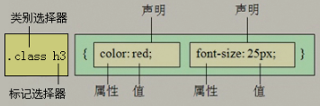
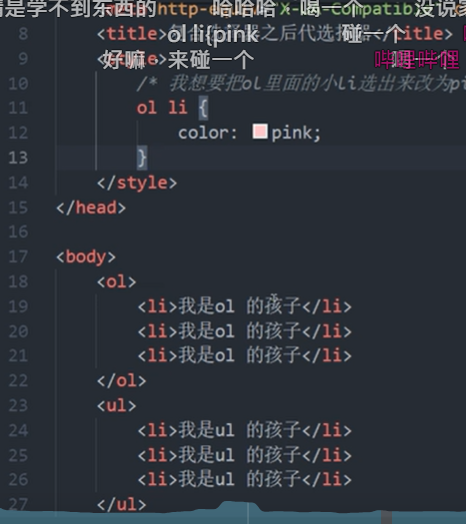
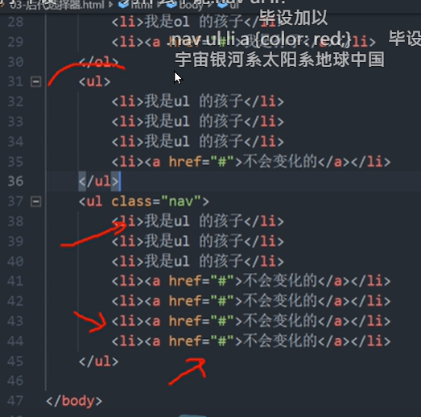
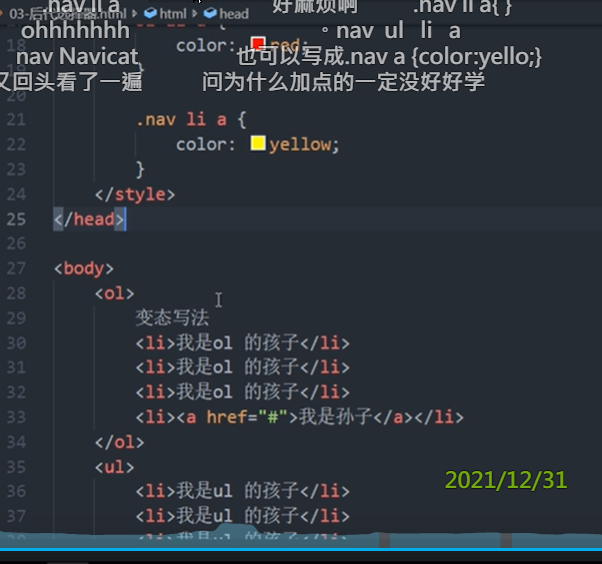
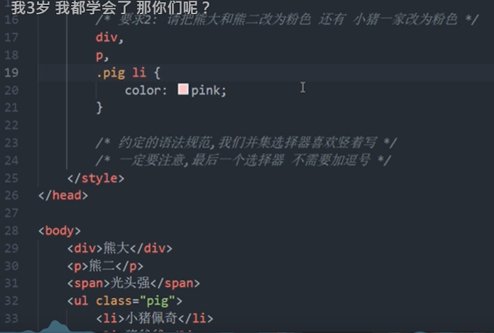
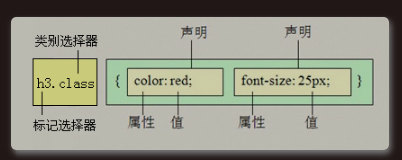

# 1 复合选择器简介

复合选择器是由两个或多个基础选择器，通过不同的方式组合而成的
- 后代选择器
- 子元素选择器
- 并集选择器

这样的话复合选择器可以更准确更高效的选择目标元素（标签）

# 2 复合选择器总结 

| 选择器   |                                                                                    | 隔开符号及用法                                                                                                    | 作用          | 特征                                           | 使用情况 |     |
| ----- | ---------------------------------------------------------------------------------- | ---------------------------------------------------------------------------------------------------------- | ----------- | -------------------------------------------- | ---- | --- |
| 后代选择器 | Descendant combinator / Nachfahrenkombinator                                       | 符号是空格 `.nav a`                                                                                             | 用来选择后代元素    | 可以是子孙后代, 只要后代他本身的他的标签名 是与之前得定义的样式的 标签名字的是一样的 | 较多   |     |
| 子代选择器 | Child combinator  / Kindkombinator                                                 | 符号是大于 `.nav>p`                                                                                             | 选择最近一级元素    | 只能选亲儿子                                       | 较少   |     |
|       | INDIREKTER GESCHWISTERSELEKTOR/ General sibling combinator / Geschwisterkombinator | A ~ B                                                                                                      |             |                                              |      |     |
|       | DIREKTER GESCHWISTERSELEKTOR/ Adjacent sibling combinator / Nachbarkombinator      | A + B                                                                                                      |             |                                              |      |     |
|       | Column combinator                                                                  | A \|\| B                                                                                                   |             |                                              |      |     |
| 并集选择器 | Grouping selectors                                                                 | 符号是逗号，`.nav, a， .header`                                                                                   | 选择某些相同样式的元素 | 可以用于集体声明                                     |      |     |
| 交集选择器 | compound selector                                                                  | 选择器之间没有任何的连接符号 `div#yzh_animation `  选择的是： id为 yzh_animation 的div标签。<br> span.foo 有 `.foo` 类名的 <span> 元素   |             | 交集选择器是并且的意思,即...又...的意思                      |      |     |


**) Kombinationsselektoren**: Ein CSS-Selektor kann mehr als einen einfachen Selektor enthalten. Zwischen den einfachen Selektoren kann ein Kombinator eingefügt werden. Es gibt vier verschiedene Kombinatoren in CSS:

1. Nachfahrenselektor / descendant selector (Leerzeichen)
2. Kindselektor / child selector (>)
3. Direkt benachbarter Geschwisterselektor / adjacent sibling selector (+)
4. Allgemeiner Geschwisterselektor / general sibling selector (~)

# 3 Grouping selectors and Combinators

## 3.1 后代选择器 （Descendant combinator： A B）

后代选择器又称为包含选择器，可以选择父元素里的子元素。
写法是将外层标签写在前面，内层标签写在后面，中间空格分开。当标签发生嵌套的时候，内层标签就成为外层标签的后代。

 **语法**

```css
元素1 元素2 { 样式声明; } 上述语法表示选择元素1里面的元素2
元素1 元素2 元素3{ 样式声明; } 上述语法表示选择元素1里面的元素2里面的与元素3

父级 子级{属性:属性值;属性:属性值;}
.class h3 {color:red;font-size:16px;}   
```

- 上述语法表示选择元素 1 里面所有的元素 2
- 元素 1、2 可以是 任意的基础标签
- 元素1必须是父亲， 元素2必须是孩子 或者孙子 或者后代
- 元素1 元素2 { 样式声明; } 上述语法表示选择元素1里面的元素2， 最终改变的是元素2的样式， 元素1的样式没有被改变
  - 如果有元素2 in 元素8 in 元素1， 就是 元素1-> 元素8 -> 元素2，<mark> 则在此时 这个元素2的样式也会被改变</mark>
  - 如果有元素3 in 元素2， 则在此时 元素3的样式也没有被改变
    - 在这样声明后， 元素3里面的样式才会被改变： 元素1 元素2 元素3{ 样式声明; }
- 有时候可以省略一部分， 在定义样式的时候. 
- 可以连续嵌套，比如可以是孙子等

  ```css
    .nav ul li a {
        color: red; 
    }
    
    上面写成这样，也生效 
    .nav ul a {
        color: red; 
    }
    
    这样也生效 
    .nav a {
        color: red; 
    }
  ```


Der Nachfahrenselektor wählt alle Elemente aus, die Nachfahren eines angegebenen Elements sind.
  
  
 
### 3.1.1 例子
0



1 
```css
/*选择ul 里面的所有 li 标签元素*/
ul li {
    样式声明
}  
```




2
 例子 ： 这样第一组 的 ol>li 不受影响 




## 3.2 亲儿子元素选择器 (direkt Child combinator： A>B)

子元素选择器（子选择器）只能选择作为元素作为元素的最近一级子元素。简单理解就是选亲儿子。 跟孙子没有关系, 虽然孙子也用同名的标签

**child selector:** Der Kindselektor wählt alle Elemente aus, die **direkte** Kinder eines angegebenen Elements sind.


```css
元素1 > 元素2 { 样式声明; }  上述语法表示选择元素1 里面的所有直接后代(子元素)元素2，例如

.class>h3 {color:red;font-size:14px;}

/*选择div里面所有最近一级 P 标签元素*/ 
div > p{
    样式声明
}
```

- 元素之间用大于号 `>` 隔开
- 1 为父级。二为子级，最终选择的是元素 2
- 元素 2 必须是亲儿子。这里的子,指的是亲儿子。不包含孙子 重孙子之类。
  - 比如有 元素1-> 元素2： 则现在这里的元素2的样式会被改变
  - 也有 元素1-> 元素8 -> 元素2， <mark>则现在这里的元素2的样式不会被改变</mark>


## 3.3 DIREKTER GESCHWISTERSELEKTOR (A + B )


Referenziert eine Sequenz von Geschwistern, das heißt mehrere in einem
Element eingebettete Kindelemente
CSS-Deklaration bezieht sich auf das letzte "Geschwisterchen"

## 3.4 General sibling combinator （A ~ B）

向后面看 找B

The general sibling combinator (~) separates two selectors and matches all iterations of the second element, that are following the first element (though not necessarily immediately), and are children of the same parent element.

Der allgemeine Geschwisterselektor wählt alle Elemente aus, die nachfolgende Geschwister eines angegebenen Elements sind.


```css
/* Paragraphs that are siblings of and
   subsequent to any image */
img ~ p {
  color: red;
}
```

Syntax 

```
former_element ~ target_element { style properties }`
```

### 3.4.1 例子
1 
[General sibling combinator - CSS&colon; Cascading Style Sheets | MDN](https://developer.mozilla.org/en-US/docs/Web/CSS/General_sibling_combinator)

```css
p ~ span {
  color: red;
}
```

```html
<span>This is not red.</span>
<p>Here is a paragraph.</p>
<code>Here is some code.</code>
<span>And here is a red span!</span>
<span>And this is a red span!</span>
<code>More code…</code>
<div>How are you?</div>
<p>Whatever it may be, keep smiling.</p>
<h1>Dream big</h1>
<span>And yet again this is a red span!</span>
```


2
Die folgende Verschachtelung gibt an, dass alle weiteren fett formatierten Texte nach dem ersten fett formatierten Text eines p-Elementes grün dargestellt werden sollen.
`p ~ b {color: #02d92f;}`


## 3.5 群组 选择器 (Grouping selectors: A，B)

如果某些选择器定义的相同样式，就可以利用并集选择器，可以让代码更简洁。
并集选择器（CSS选择器分组）是各个选择器通过,连接而成的，通常用于集体声明。

并集选择器可以选择多组标签，同时为他们定义相同的样式。通常用于集体声明。
- 任何形式的选择器（包括标签选择器、class类选择器 id选择器等），都可以作为并集选择器的一部分。
- 并集选择器通常用于集体声明  ，<mark>逗号</mark>隔开的，所有选择器都会执行后面样式，逗号可以理解为和的意思。<mark>最后一个选择器不需要加逗号</mark>

- Elemente mit gleichen Eigenschaften können zusammengefasst werden
- Die verschiedenen Selektoren werden hintereinander geschrieben und durch ein Komma voneinander getrennt


```css
元素1, 元素2 { 样式声明; }
```

### 3.5.1 例子

```css
1 
表示   .one 和 p  和 #test 和 .pig li 这四个选择器都会执行颜色为红色。 通常用于集体声明。 

.one, 
p , 
#test 
.pig li {
    color: #F00;
}  


2 
/*选择  ul  和  div 标签元素 */
ul,div {
    样式声明
} 
```



## 3.6 交集选择器 compound selector (两个选择器之间不能有空格)



其中第一个为标签选择器，第二个为class选择器，两个选择器之间不能有空格，如h3.special。
交集选择器是并且的意思,即...又...的意思  

交集选择器,相交的部分就是要设置属性值的标签
1,格式:
选择器1选择器2...{
    属性:值;
}

2,注意点:
(1)选择器之间没有任何的连接符号
(2),选择器可以是标签名称,也可以是id、class名称
(3)交集选择器仅仅是了解


例子   
p.one   选择的是： 类名为 .one 的p标签。   
div#yzh_animation  选择的是： id为 yzh_animation 的div标签。 

```css
p.hinweis {
 color: red;
 }

<p class="hinweis"> p:  Achtung, hier kommt ein Hinweis!</p>

```


## 3.7 adjacent sibling selector (A+B)


Der direkt benachbarte Geschwisterselektor wird verwendet, um ein Element auszuwählen, das sich direkt nach einem bestimmten anderen Element befindet. Geschwisterelemente müssen dasselbe Elternelement haben, und „benachbart“ bedeutet „direkt folgend“.


# 4 ALLE SELEKTOREN


|Selektor|Selektortyp|Beschreibung|
|---|---|---|
|*|Universalselektor|Steuert alle Elemente auf einer Webseite|
|E|Einfachselektor|Steuert alle Elemente vom Typ E|
|#meine-id|Einfachselektor|Steuert das Element mit dem id-Attribut "meine-id"|
|.meine-klasse|Einfachselektor|Steuert alle Elemente mit dem class-Attribut "meine-klasse"|
|E F|Kombinationsselektor|Steuert alle Elemente vom Typ F, die in einem Element vom Typ E vorkommen|
|E > F|Kombinationsselektor|Steuert Elemente vom Typ F, die direkt unterhalb eines Elements vom Typ E vorkommen (nicht solche, die in der Struktur weiter unten kommen)|
|E+F|Kombinationsselektor|Steuert Elemente vom Typ F, die direkt hinter einem Element vom Typ E stehen (nur das direkte Geschwisterelement)|
|E ~ F|Kombinationsselektor|Steuert alle Elemente vom Typ F, die hinter einem Element vom Typ E stehen (alle Geschwisterelemente)|
|E[attr]|Attributselektor|Steuert alle Elemente mit dem angegebenen Attribut. Dabei spielt es keine Rolle, ob oder welchen Wert dieses hat|
|E[attr="value"]|Attributselektor|Steuert Elemente deren Attribute genau und ausschließlich den angegebenen Wert haben.|
|E[attr~="value"]|Attributselektor|Steuert Elemente deren Attribut den angegeben Wert besitzt, auch wenn mehrere Werte für das Attribut gesetzt sind|
|E[attr^="value"]|Attributselektor|Steuert Elemente deren Attributwerte mit der Zeichenkette des angegebenen Wertes anfangen|
|E[attr$="value"]|Atttributselektor|Steuert Elemente deren Attributwerte mit der Zeichenkette des angegebenen Wertes enden|
|E[attr*="value"]|Attributselektor|Steuert Elemente bei denen die Zeichenkette des angegebenen Wertes im Attributwert vorkommt|
|E[attr\|="value"]|Attributselektor|Steuert Elemente deren Werte des Attributs eine Reihe von mit Minuszeichen getrennten Segmenten haben, wovon das erste Segment "value" ist. Beispiel: Der Selektor [lang="de"] würde jedes HTML-Element finden, das lang="de" aber auch lang="de-ch" beinhaltet.|
|E:link|Pseudoklasse|Steuert Links die noch nicht angeklickt wurden|
|E:visited|Pseudoklasse|Steuert Links die bereits angeklickt wurden und damit in der Historie des Browsers zu finden sind|

|Selektor|Selektortyp|Beschreibung|
|---|---|---|
|E:active|Pseudoklasse|Steuert den Link in dem Moment, wenn er durch den Benutzer angeklickt wird|
|E:hover|Pseudoklasse|Steuert das Element, welches der Benutzer mit der Maus überfährt.|
|E:focus|Pseudoklasse|Steuert das Element an dessen Position sich der Nutzer beim "Tabben" befindet|
|E:target|Target-Pseudoklasse|Steuert eine Sprungmarke in dem Moment wenn sie angesprungen wird|
|E:lang(de)|Sprach-Pseudoklasse|Steuert alle Elemente mit der Sprachauszeichnung "de". Greift auch, wenn die lang-Eigenschaft geerbt wurde|
|E:enabled|UserInterface-Pseudoklasse|Steuert Formularfelder, in die Werte eingegeben werden können bzw. deren Bedienung möglich ist|
|E:disabled|UserInterface-Pseudoklasse|Steuert Formularfelder die über das Attribut disabled für die Eingabe gesperrt sind bzw. deren Bedienung nicht möglich ist|
|E:checked|UserInterface-Pseudoklasse|Steuert aktivierte Checkboxen oder Radioboxen|
|E:root|Strukturpseudoklasse|Wurzelelement eines Dokuments, in HTML immer das html-Tag|
|E:nth-child(n)|Strukturpseudoklasse|Steuert jedes n-te Element innerhalb eines Elternelements E|
|E:nth-last-child(n)|Strukturpseudoklasse|Steuert jedes n-te Kindelement in einem Element, dabei werden die Kindelemente von hinten durchlaufen|
|E:nth-of-type(n)|Strukturpseudoklasse|Steuert jedes n-te Element vom gleichen HTML-Typ auf gleicher Ebene (Geschwisterelemente)|
|E:nth-last-of-Type(n)|Strukturpseudoklasse|Steuert jedes n-te Element auf gleicher Ebene (Geschwisterelemente), dabei werden die Elemente von hinten durchlaufen|
|E:first-child|Strukturpseudoklasse|Steuert das erste Kindelement innerhalb eines Elements|
|E:last-child|Strukturpseudoklasse|Steuert das letzte Kindelement innerhalb eines Elements|
|E:first-of-type|Strukturpseudoklasse|Steuert das erste Element des gleichen HTML-Elementtyps innerhalb eines Elternelements|
|E:last-of-type|Strukturpseudoklasse|Steuert das letzte Element des gleichen HTML-Elementtyps innerhalb eines Elternelements|


|Selektor|Selektortyp|Beschreibung|
|---|---|---|
|E:only-child|Strukturpseudoklasse|Steuert ein Element, das keine Geschwisterlemente hat und damit das einzige Kindelement im übergeordneten Element ist|
|E:only-of-type|Strukturpseudoklasse|Steuert ein Element, das keine Geschwisterelemente vom gleichen HTML-Typ hat und damit das einzige Kindelement dieser Sorte im übergeordneten Element ist|
|E:empty|Strukturpseudoklasse|Steuert leere Elemente|
|E:not(element)|Pseudoklasse|Steuert alle Elemente außer dem Element, welches in der Klammer angegeben ist|
|E::first-line|Pseudoelement|Steuert die erste Zeile in dem Element E|
|E::first-letter|Pseudoelement|Steuert den ersten Buchstaben in dem Element E|
|E::before|Pseudoelement|Steuert die Inhalte vor dem Element E|
|E::after|Pseudoelement|Steuert die Inhalte nach dem Element E|


