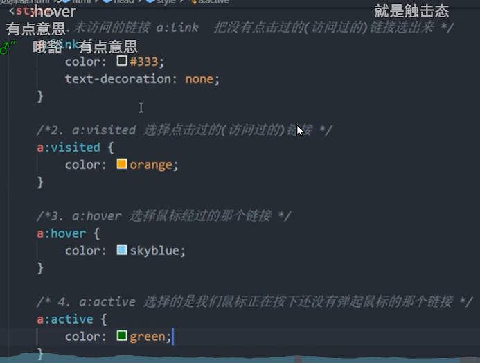
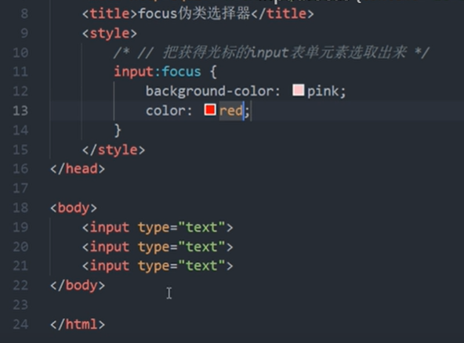
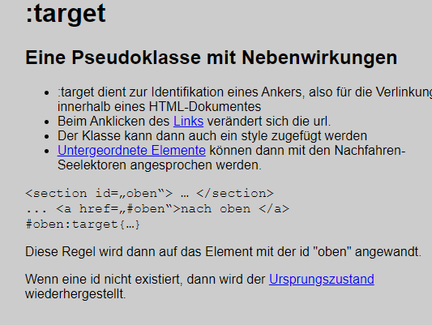
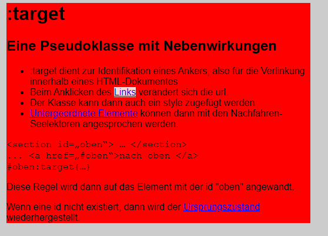
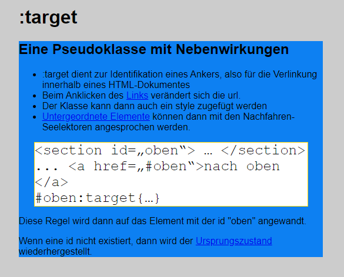
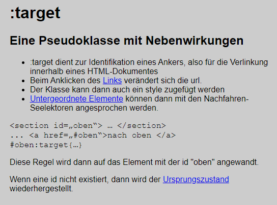
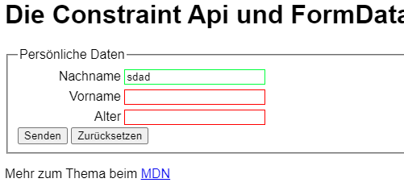

# 1 a:xxx 链接伪类   

用于向某些选择器添加特殊的效果。写的时候，<mark>他们的顺序尽量不要颠倒, 按照lvha的顺序。否则可能引起错误。</mark> ( Der Zustand "visited" überschreibt den Zustand "hover". Es muß bei Pseudoklassen immer die Reihenfolge :link, :visited, :hover, :focus, :active eingehalten werden.)
链接伪类，是利用交集选择器.

```css
a:link /*选择所有未被访问的链接， 这类链接具有什么样的样式 */
a:visited /*选择所有已被访问的链接, 就是说这个链接曾经被访问后， 变成另外一种颜色*/   
a:hover /*选择鼠标指针位于其上的链接， 鼠标放在上面后， 变成另外一种颜色*/
a:active /*选择活动链接（鼠标按下未弹起的链接的时候， 这个 链接具有什么样的样式）*/

:link – Verweise auf noch nicht besuchte Seiten
:visited – Verweise auf besuchte Seiten
:hover – Formatierung beim Darüberfahren mit der Maus („Mouseover“)
:active – gerade angeklickte Verweise

```


1. 确保样式生效，要按照 LVHA 的顺序声明：link,visited,hover, active。不按照这个顺序， 样式 则就没有效果了 
   1. 短语： love hate 或者 lv 抱抱 hao 
2. a 链接在浏览器中有默认样式，所以实际开发都需要给链接单独指定样式。
   - 只给body 定义样式， 不会影响到 a 的样式， 需要单独给 a 定义样式 
   1. 


实际工作中，很少写全四个状态，一般写法如下：

```css
1 
a {
  color: gray;
  text-decoration: none;
}
a:hover {
  color: #369;
  text-decoration: underline;
}


2 

a {   /* a是标签选择器  所有的链接 */
   font-weight: 700;
   font-size: 16px;
   color: gray;
      text-decoration: none; /* 清除链接默认的下划线*/
}
a:hover {   /* :hover 是链接伪类选择器 鼠标经过 */
   color: red; /*  鼠标经过的时候，由原来的 灰色 变成了红色 */
}

====
3 


/* a是标签选择器 */
a {
    color:gray;
}

/* :hover 是链接伪类选择器，鼠标经过 */
a :hover {
    /*鼠标经过的时候，由原来的灰色  变成了红色*/
   color:red; 
}
```

```css
a:link {
  color: #fcfe17;
  font-weight: bold;
  font-variant: small-caps;
  text-decoration: none; 
}

a:visited {
  color: #0f39ff;
  font-weight: lighter;
  font-variant: small-caps;
  text-decoration: none; 
}

a:hover {
  color:#01d823;
  border-bottom: 3px double #01d823; 
}

a:focus{
  color: #000000; 
}

a:active {
  color: #885ac7;
  font-weight: bold;
  font-variant: small-caps;
  text-decoration: line-through; 
}
```

例子



# 2 :focus  
:focus – Elemente, die gerade im Fokus sind (z.B. beim Durchklicken per Tabulator-Taste)
`:focus` 伪类选择器用于获取焦点的表单元素。 

焦点就是光标，一般情况 `<input>` 类表单元素才能获取，因此这个选择器也主要针对表单元素来说。
点击第三个表单， 这个表单上面就有光标了，并且被框起来  这就是 这个选择起的效果 . 
谁获得了光标， 会就是更改他本身的样式 

语法： 
```
input:focus {
  background-color: yellow;
}
```





# 3 :not(p)
https://developer.mozilla.org/zh-CN/docs/Web/CSS/:not

`:not()` 用来匹配不符合一组选择器的元素。由于它的作用是防止特定的元素被选中，它也被称为反选伪类（negation pseudo-class）

```html
<p>I am a paragraph.</p>
<p class="fancy">I am so very fancy!</p>
<div>I am NOT a paragraph.</div>
<h2>
  <span class="foo">foo inside h2</span>
  <span class="bar">bar inside h2</span>
</h2>

```

```css
.fancy {
  text-shadow: 2px 2px 3px gold;
}

/* 类名不是 `.fancy` 的 <p> 元素*/
p:not(.fancy) {
  color: green;
}

/* 非 <p> 元素 */
body :not(p) {
  text-decoration: underline;
}

/* 既不是 <div> 也不是 <span> 的元素 */
body :not(div):not(span) {
  font-weight: bold;
}

/* 不是 <div> 或 `.fancy` 的元素*/
body :not(div, .fancy) {
  text-decoration: overline underline;
}

/* <h2> 元素中不是有 `.foo` 类名的 <span> 元素 */
h2 :not(span.foo) {
  color: red;
}
```

# 4 :target (location pseudo-class)

:target dient zur Identifikation eines Ankers, also für die Verlinkung innerhalb eines HTML-Dokumentes
在 htmL 中Ankers是用  a selector 来定义的, 比如 `<a href="#main">Untergeordnete Elemente</a>` . 在文本 Untergeordnete Elemente 上面 按下鼠标左键, 会跳转到 html 中 id=main 处

例子

```html
<!DOCTYPE html>
<html lang="de">
	<head>
		<meta charset="utf-8">
		<title>Pseudo-Klasse :target</title>
		<link rel="stylesheet" href="target.css">
	</head>
	<body id="wrapper">
		<h1>:target</h1>
		<main id="main">
			<h2>Eine Pseudoklasse mit Nebenwirkungen</h2>
			<ul>
				<li>:target dient zur Identifikation eines Ankers, also für die Verlinkung innerhalb eines HTML-Dokumentes </li>
				<li>Beim Anklicken des <a href="#wrapper">Links</a> verändert sich die url.</li>
				<li>Der Klasse kann dann auch ein style zugefügt werden</li>
				<li><a href="#main">Untergeordnete Elemente</a> können dann mit den Nachfahren-Seelektoren angesprochen werden.</li>
			</ul>
			<code>
				&lt;section id=„oben“&gt; … &lt;/section&gt;				<br>
				...
				&lt;a href=„#oben“&gt;nach oben &lt;/a&gt;<br>
				#oben:target{…}
			</code>
			<p>Diese Regel wird dann auf das Element mit der id "oben" angewandt.</p>
			<p>Wenn eine id nicht existiert, dann wird der <a href="#">Ursprungszustand</a> wiederhergestellt.</p>
		</main>
	</body>
</html>
```

```css
*,
*::after,
*::before{
    box-sizing: border-box;
}

html,
body{
    font-family: sans-serif;
    font-size: 1rem;
    background-color: hsla(0,0%,80%,1);
    width: 80%;
    margin: auto;
}

/* body selektiert, weil die id im body steht */
#wrapper:target{
    background-color: hsla(0,100%,50%,1);
}

#wrapper:target a[href="#wrapper"]{
    background-color: hsla(10,90%,90%,1);
}

#main:target{
    background-color: hsla(210,90%,50%,1);
}

#main:target code{
    display: block;
    margin: 0 5%;
    border: 1px solid gold;
    font-size: 1.5rem;
    background-color: hsla(0,0%,100%,1);
}
```


解释 

0 原本的样子



1 
-   Beim Anklicken des [Links](http://127.0.0.1:3000/%E8%AF%BE%E7%A8%8B%E6%9D%90%E6%96%99/2022.11.12_CSS_target/target.html#wrapper) verändert sich die url.


解释: 
- 因为 `<a href="#wrapper">Links</a> ` , 所以点击 links 后, 跳到 html 文件中 id=wrapper 处
- 因为为点击跳转效果,迎合了 :target ,  所以 `wrapper:target{ } `  块中的定义生效,  而且只对 id = wrapper 的块, 以及他的后代块生效 
- 同理, 因为为点击跳转, 迎合了 :target, 所以 `#wrapper:target a[href="#wrapper"] {} `  块中的定义生效,  而且只对 父代中 有 `#wrapper:target ` 的  `a[href="#wrapper"]` 块, 以及 这个 `a[href="#wrapper"]` 的后代块生效 .  
    - `a[href="#wrapper"] `  为   `#wrapper:target ` 的后代元素.  

2
-   [Untergeordnete Elemente](http://127.0.0.1:3000/%E8%AF%BE%E7%A8%8B%E6%9D%90%E6%96%99/2022.11.12_CSS_target/target.html#main) können dann mit den Nachfahren-Seelektoren angesprochen werden.


- 因为 `<a href="#main">Untergeordnete Elemente</a> ` , 所以点击 Untergeordnete Elemente 后, 跳到 html 文件中 id=main 处
- 因为为点击跳转效果,迎合了 :target , 所以 `#main:target{ } `  块中的定义生效,  而且只对 id = main 的块, 以及他的后代块生效 
- 同理, 因为为点击跳转, 迎合了 :target, 所以 `#main:target code{} `  块中的定义生效,  而且只对 父代中有 `#main:target` 的 `code ` 块,  以及这个 `code `的后代块生效 . 


3 
Wenn eine id nicht existiert, dann wird der [Ursprungszustand](http://127.0.0.1:3000/%E8%AF%BE%E7%A8%8B%E6%9D%90%E6%96%99/2022.11.12_CSS_target/target.html#) wiederhergestellt.



-  `<a href="#">Ursprungszustand</a>`  , 可以看见 Ursprungszustand处,  # 后边没有后面没有给出任何信息, 
    - 所以 id nicht existiert
- 在这种情况下,  界面的显示让回到原始状态, 就是下面的内容
```css
*,
*::after,
*::before{
    box-sizing: border-box;
}

html,
body{
    font-family: sans-serif;
    font-size: 1rem;
    background-color: hsla(0,0%,80%,1);
    width: 80%;
    margin: auto;
}

```

# 5 :valid and :invalid

:valid :
Matches an element with valid contents. 
For example, an input element with the type 'email' that contains a validly formed email address or an empty value if the control is not required.
就是说, 当这个 feld 填入的信息是 一个符合规则的信息的时候,  会使用 在 :valid{} 中定义的格式  去渲染这个 tag中的内容


:invalid: 
Matches an element with invalid contents. 
For example, an input element with type 'email' with a name entered.

就是说, 当这个 feld 填入的信息是 一个不符合规则的信息的时候,  会采取 在 :invalid{} 中定义的格式, 去渲染这个 tag中的内容


 例子



```css
input:invalid{
	border: 1px solid hsla(0,100%,50%,1);
}


input:valid:not([type=submit]){
	border: 1px solid hsla(134,100%,50%,1);
}

```

```html
<fieldset>
    <legend>Persönliche Daten</legend>
    <div>
        <label	for="ln">Nachname</label>
        <input	id="ln"
                name="lastname"
                type="text" 
                required 
                minlength="3" 
                pattern="[a-z,A-Z, ,-]{3,25}">
    </div>
    <div>
        <label	for="fn">Vorname</label>
        <input	id="fn" 
                name="firstname" 
                type="text" 
                required 
                minlength="3" 
                maxlength="50">
    </div>
    <div>
        <label	for="age">Alter</label>
        <input	id="age"
                name="age" 
                type="number" 
                min="16" 
                required>
    </div>
    <div>
        <input type="submit">
        <input type="reset">
    </div>
</fieldset>

```

效果


# 6 结构伪类选择器

见 [Pseudo-classes - CSS&colon; Cascading Style Sheets | MDN](https://developer.mozilla.org/en-US/docs/Web/CSS/Pseudo-classes?retiredLocale=de) 

## 6.1 总结

结构伪类选择器主要根据文档结构来选择器元素，常用于根据父级选择器里面的子元素。

| 选择符                 | 简介                  |
| ------------------- | ------------------- |
| `:root`    | für das Wurzelelement     |
| `:empty `    | für leere Elemente     |
| `E:first-child`    | 匹配父元素中的第一个子元素E      |
| `E:last-child`     | 匹配父元素中最后一个E元素       |
|:only-child||
| `E:nth-child(n)`   | 匹配父元素中的第n个子元素E (重点) |
| `E:first-of-type`  | 指定类型E的第一个           |
| `E:last-of-type`   | 指定类型E的最后一个          |
| `E:nth-of-type(n)` | 指定类型E的第n个           |

```css
ul li:first-child {
    background-color: pink;
}
ul li:last-child {
    background-color: pink;
}
ul li:nth-child(5) {
    background-color: skyblue;
}
```

1. 结构伪类选择器一般用于选择父级里面的第几个孩子

2. nth-child 对父元素里面所有孩子排序选择（序号是固定的），先找到第n个孩子，然后看看是否和E匹配

3. nth-of-type 对父元素里面指定子元素进行排序选择，先去匹配E，然后再根据E找第n个孩子

4. 关于nth-child(n)， 我们要知道n是从0开始计算的，要记住常用的公式

5. 如果是无序列表，我们肯定用 nth-child 更多

6. 类选择器，属性选择器，伪类选择器，权重为10

## 6.2 一个重点的错误
https://stackoverflow.com/questions/2717480/css-selector-for-first-element-with-class

```css
#flexContainer>.flexitem:first-of-type{
    border-style: solid;
     flex: 1 1 auto;
     
}

#flexContainer>.flexitem:last-of-type{
    border-style: dotted;
    flex: 2 1 auto; 
} 
```

## 6.3 E:first-child 和 E:last-child

`:first-child` 是 CSS 伪类，表示匹配的是某父元素的第一个子元素，可以说是结构上的第一个子元素
`:last-child` CSS 伪类 代表父元素的最后一个子元素。

```css
<head>
    <style>
        /* 1.选择ul里面的第一个孩子 小li */

        ul li:first-child {
            background-color: pink;
        }
        /* 2.选择ul里面的最后一个孩子 小li */

        ul li:last-child {
            background-color: pink;
        }
    </style>
</head>


<body>
    <ul>
        <li>我是第1个孩子</li>
        <li>我是第2个孩子</li>
        <li>我是第3个孩子</li>
        <li>我是第4个孩子</li>
        <li>我是第5个孩子</li>
        <li>我是第6个孩子</li>
        <li>我是第7个孩子</li>
        <li>我是第8个孩子</li>
    </ul>
```


## 6.4 E:nth-child(n)

nth-child(n)选择某个父级元素的一个或多个特定的子元素（重点）

`:nth-child(an+b)` 这个 CSS 伪类首先找到所有当前元素的兄弟元素，然后按照位置先后顺序从 1 开始排序，选择的结果为 CSS 伪类 `:nth-child`括号中表达式 `(an+b)` 匹配到的元素集合 `(n=0，1，2，3...)`

- `n` 可以是整数、关键字（`even/odd`）、公式（`n/2n/2n+1`）
- n如果是数字，就是选择第n个子元素，里面数字从1开始
- n可以是关键字：**even** 偶数，**odd**奇数
- n可以是公式：常见的公式如下（如果n是公式，则从0开始计算，但是第0个元素或者超出了元素的个数会被忽略）
    - 但是第 0 个元素或者超出了元素的个数会被忽略
| 公式   | 取值          |
| ---- | ----------- |
| 2n   | 偶数          |
| 2n-1 | 奇数          |
| 5n   | 5 10 15 ... |
| n+   | 5 6 7 8 ... |
| -n+5 | 前五个         |

### 6.4.1 例子

```html
<head>
    <style>
        /* 选择ul里面的第2个孩子 小li */
        ul li:nth-child(2) {
            background-color: pink;
        }
    </style>
</head>


<body>
    <ul>
        <li>我是第1个孩子</li>
        <li>我是第2个孩子</li>
        <li>我是第3个孩子</li>
        <li>我是第4个孩子</li>
        <li>我是第5个孩子</li>
        <li>我是第6个孩子</li>
        <li>我是第7个孩子</li>
        <li>我是第8个孩子</li>
    </ul>
</body>
```

```css
<style>  
  /* 偶数 */  
  ul li:nth-child(even) {  
    background-color: aquamarine;  
  }  
  
  /* 奇数 */  
  ul li:nth-child(odd) {  
    background-color: blueviolet;  
  }  
  
  /*n 是公式，从 0 开始计算 */  
  ul li:nth-child(n) {  
    background-color: lightcoral;  
  }  
  
  /* 偶数 */  
  ul li:nth-child(2n) {  
    background-color: lightskyblue;  
  }  
  
  /* 奇数 */  
  ul li:nth-child(2n + 1) {  
    background-color: lightsalmon;  
  }  
  
  /* 选择第 0 5 10 15, 应该怎么选 */  
  ul li:nth-child(5n) {  
    background-color: orangered;  
  }  
  
  /* n + 5 就是从第5个开始往后选择 */  
  ul li:nth-child(n + 5) {  
    background-color: peru;  
  }  
  
  /* -n + 5 前五个 */  
  ul li:nth-child(-n + 5) {  
    background-color: tan;  
  }  
</style>
```

```html
<style>
        /* 1.把所有的偶数 even的孩子选出来 */
        ul li:nth-child(even) {
            background-color: #ccc;
        }

        /* 2.把所有的奇数 odd的孩子选出来 */
        ul li:nth-child(odd) {
            background-color: gray;
        }
        /* 3.nth-child(n) 从0开始 每次加1 往后面计算  这里面必须是n 不能是其他的字母 选择了所有的孩子*/
        /* ol li:nth-child(n) {
            background-color: pink;
        } */
        /* 4.nth-child(2n)母选择了所有的偶数孩子 等价于 even*/
        /* ol li:nth-child(2n) {
            background-color: pink;
        }
        ol li:nth-child(2n+1) {
            background-color: skyblue;
        } */
        /* ol li:nth-child(n+3) {
            background-color: pink;
        } */
        ol li:nth-child(-n+3) {
            background-color: pink;
        }
    </style>
</head>

<body>
    <ul>
        <li>我是第1个孩子</li>
        <li>我是第2个孩子</li>
        <li>我是第3个孩子</li>
        <li>我是第4个孩子</li>
        <li>我是第5个孩子</li>
        <li>我是第6个孩子</li>
        <li>我是第7个孩子</li>
        <li>我是第8个孩子</li>
    </ul>
    <ol>
        <li>我是第1个孩子</li>
        <li>我是第2个孩子</li>
        <li>我是第3个孩子</li>
        <li>我是第4个孩子</li>
        <li>我是第5个孩子</li>
        <li>我是第6个孩子</li>
        <li>我是第7个孩子</li>
        <li>我是第8个孩子</li>
    </ol>
</body>
```


## 6.5 E:first-of-type和E:last-of-type

| E:first-of-type | 指定类型E的第一个  |
| --------------- | ---------- |
| E:last-of-type  | 指定类型E的最后一个 |

E:first-of-type: 
- 首先，该选择符要匹配的是类型为E的子元素，这意味着E元素必须作为某个元素的子元素存在（E元素的父元素最高是html，也就是说E元素本身最高只能是body，这表示任何非html的元素都符合这个约束，因为html元素是根元素. 
- 其次，该选择符要匹配的是父元素第一个类型为E的子元素，这意味着被命中的元素不一定是父元素的第一个子元素（因为排在父元素首位的不一定是E元素，E元素可能在子元素列表中的任何位置）。
- 如果不给出E, 则匹配所有

```html
<head>
    <style>
        ul li:first-of-type {
            background-color: pink;
        }

        ul li:last-of-type {
            background-color: pink;
        }

        ul li:nth-last-child(2) {
            background-color: pink;
        }
    </style>
</head>


<body>
    <ul>
        <li>我是第1个孩子</li>
        <li>我是第2个孩子</li>
        <li>我是第3个孩子</li>
        <li>我是第4个孩子</li>
        <li>我是第5个孩子</li>
        <li>我是第6个孩子</li>
        <li>我是第7个孩子</li>
        <li>我是第8个孩子</li>
    </ul>
</body>
```


## 6.6 E:nth-of-type

## 6.7  `:first-of-type` 与 `firs-child` 的差异
https://www.cnblogs.com/2050/p/3569509.html
https://blog.csdn.net/qq_29207823/article/details/82019910

1
:first-child选择器是css2中定义的选择器，从字面意思上来看也很好理解，就是第一个子元素。
比如有段代码：
[](https://images0.cnblogs.com/blog/130623/201402/261609099832424.png)

- p:first-child  匹配到的是p元素,因为p元素是div的第一个子元素；
- h1:first-child  匹配不到任何元素，因为在这里h1是div的第二个子元素，而不是第一个；
- span:first-child  匹配不到任何元素，因为在这里两个span元素都不是div的第一个子元素；

2
在css3中又定义了:first-of-type这个选择器
- p:first-of-type  匹配到的是p元素,因为p是div的所有类型为p的子元素中的第一个；
- h1:first-of-type  匹配到的是h1元素，因为h1是div的所有类型为h1的子元素中的第一个；
- span:first-of-type  匹配到的是第三个子元素span。这里div有两个为span的子元素，匹配到的是它们中的第一个。

3 
所以，通过以上两个例子可以得出结论：
- :first-child 匹配的是某父元素的第一个子元素，可以说是结构上的第一个子元素。
- :first-of-type 匹配的是某父元素下相同类型子元素中的第一个，比如 p:first-of-type，就是指所有类型为p的子元素中的第一个。这里不再限制是第一个子元素了，只要是该类型元素的第一个就行了。

同样类型的选择器 :last-child  和 :last-of-type、:nth-child(n)  和  :nth-of-type(n) 也可以这样去理解。


### 6.7.1 `:first-type` 与 `:first-of-child` 和 其他条件连用 组成 compound selector
https://stackoverflow.com/questions/2717480/css-selector-for-first-element-with-class

- `first-of-type` 会考虑到 other conditions or attributes in compound selector
- `first-child` 不会 考虑到 other conditions or attributes in compound selector;
    - `first-child` won't work, though, if you've nested your tags under different parent tags, or if your tags of class `red` aren't the first tags under the parent.

#### 6.7.1.1 为什么 `:first-child` 不会 考虑到 other conditions or attributes in compound selector


解释: 
- as with :first-child, it does not look at any other conditions or attributes. In HTML, the element type is represented by the tag name. In the question, that type is p.   
    - - 就是说 ` :first-child` 只看 p, 根本就不看 class 到底指定的是哪个
- `first-child` won't work, though, if you've nested your tags under different parent tags, or if your tags of class `red` aren't the first tags under the parent.
- 根本就不存在  `:first-of-class` :   there is no similar `:first-of-class` pseudo-class for matching the first child element of a given class.

例子1 
出现的问题 I have a bunch of elements with a class name red, but I can't seem to select the first element with the class="red" using the following CSS rule: 
```css
.home .red:first-child {
    border: 1px solid red;
}
```

```html
<div class="home">
    <span>blah</span>
    <p class="red">first</p>
    <p class="red">second</p>
    <p class="red">third</p>
    <p class="red">fourth</p>
</div>
```

例子2: parent tags 多次出现 
Notice also that this doesn't only apply to the first such tag in the whole document, but every time a new parent is wrapped around it, like:

```xml
<div>
    <p class="red">first</p>
    <div class="red">second</div>
</div>
<div>
    <p class="red">third</p>
    <div class="red">fourth</div>
</div>
```

`first` and `third` will be red then.

##### 6.7.1.1.1 workaround
针对上面例子 有一个 workaround

```css
/* 
 * Select all .red children of .home, including the first one,
 * and give them a border.
 */
.home > .red {
    border: 1px solid red;
}
```

... then "undo" the styles for elements with the class that come after the first one, using the general sibling combinator ~ in an overriding rule:
```css
/* 
 * Select all but the first .red child of .home,
 * and remove the border from the previous rule.
 */
.home > .red ~ .red {
    border: none;
}
```

Now only the first element with class="red" will have a border.

Here's an illustration of how the rules are applied:
```css
.home > .red {
    border: 1px solid red;
}

.home > .red ~ .red {
    border: none;
}
```

```html
<div class="home">
  <span>blah</span>         <!-- [1] -->
  <p class="red">first</p>  <!-- [2] -->
  <p class="red">second</p> <!-- [3] -->
  <p class="red">third</p>  <!-- [3] -->
  <p class="red">fourth</p> <!-- [3] -->
</div>
```


1. No rules are applied; no border is rendered.
    1. This element does not have the class red, so it's skipped.
2. Only the first rule is applied; a red border is rendered.
    1. This element has the class red, but it's not preceded by any elements with the class red in its parent. Thus the second rule is not applied, only the first, and the element keeps its border.
3. Both rules are applied; no border is rendered.
    1. This element has the class red. It is also preceded by at least one other element with the class red. Thus both rules are applied, and the second border declaration overrides the first, thereby "undoing" it, so to speak.

#### 6.7.1.2 为什么 `:first-of-type` 会考虑到 other conditions or attributes in  compound selector

Although the `.red:nth-of-type(1)` solution in the original accepted answer by [Philip Daubmeier](https://stackoverflow.com/questions/2717480/css-selector-for-first-element-with-class/2717515#2717515) works (which was originally written by [Martyn](https://stackoverflow.com/users/264276/martyn) but deleted since), it does not behave the way you'd expect it to.

For example, if you only wanted to select the `p` here:
```css
.red:nth-of-type(1) {
    border: 1px solid red;
}

或者 
.red:first-of-type {
    border: 1px solid red;
}

上面两者等效 
```

```xml
<p class="red"></p>
<div class="red"></div>
```

then you can't use `.red:first-of-type` (equivalent to `.red:nth-of-type(1)`), because each element is the first (and only) one of its type (`p` and `div` respectively), so both will be matched by the selector.
When the first element of a certain class is also the first of its type, the pseudo-class will work, but **this happens only by coincidence**. This behavior is demonstrated in Philip's answer. 
The moment you stick in an element of the same type before this element, the selector will fail. 

Taking the markup from the question:

```xml
<div class="home">
  <span>blah</span>
  <p class="red">first</p>
  <p class="red">second</p>
  <p class="red">third</p>
  <p class="red">fourth</p>
</div>
```

Applying a rule with `.red:first-of-type` will work, but once you add another `p` without the class:

```xml
<div class="home">
  <span>blah</span>
  <p>dummy</p>
  <p class="red">first</p>
  <p class="red">second</p>
  <p class="red">third</p>
  <p class="red">fourth</p>
</div>
```

the selector will immediately fail, because 
1.  the first `.red` element is now the second `p` element. 
2. <mark> `:first-of-type` 这个 pesudo-class 还是依附于 某个 tag type of html 的  的, 并不是依附于 class  selector </mark>
3. 如果 first  `p` element 中有  `.red` element. ,  则 `.red:first-of-type {} ` 中的定义就会对他生效 
4. 如果 first  `p` element 中没有  `.red` element. , 而是 scond `p` element 中有  `.red` element. .  则 `.red:first-of-type {} ` 中的定义就会对 second p element 不生效 

## 6.8  `:nth-of-type` 与 `:nth-of-child` 的差异
https://stackoverflow.com/questions/5545649/can-i-combine-nth-child-or-nth-of-type-with-an-arbitrary-selector/5546296#5546296

1. `div: nth-child` 会把所有的盒子都排列序号 执行的时候首先看 `:nth-child(1)`, 之后回去看 前面的 `div`
    1. the :nth-child() pseudo-class counts elements among all of their siblings under the same parent. It does not count only the siblings that match the rest of the selector.
2. `div: nth-of-type` 会把指定元素的盒子排列序号 执行的时候首先看 div指定的元素 之后回去看 `:nth-of-type(1)` 第几个孩子
    1.  :nth-of-type() pseudo-class counts siblings sharing the same element type, which refers to the tag name in HTML (就是 element type), and not the rest of the selector.

区别：

1. nth-child对父元素里面所有孩子排序选择（序号是固定的）先找到第n个孩子，然后看看是否和E匹配
2. nth-of-type对父元素里面指定子元素进行排序选择。先去匹配E ，然后再根据E找第n个孩子


什么时候这两个有一样的效果: 

1. This also means that if all the children of the same parent are of the same element type, 
2. for example in the case of a table body whose only children are tr elements or a list element whose only children are li elements, then :nth-child() and :nth-of-type() will behave identically, 
    1. i.e. for every value of An+B, :nth-child(An+B) and :nth-of-type(An+B) will match the same set of elements.

```css
<table class="myClass">
  <tr>
    <td>Row
  <tr class="row"> <!-- I want this -->
    <td>Row
  <tr class="row">
    <td>Row
  <tr class="row"> <!-- And this -->
    <td>Row
</table>
```

### 6.8.1 例子
```css
<style>  
  div :nth-child(1) {  
    background-color: lightblue;  
  }  
  
  div :nth-child(2) {  
    background-color: lightpink;  
  }  
  
  div span:nth-of-type(2) {  
    background-color: lightseagreen;  
  }  
  
  div span:nth-of-type(3) {  
    background-color: #fff;  
  }  
</style>
```

### 6.8.2 `:nth-of-type` 与 `:nth-of-child` 和 其他条件连用 组成 compound selector

1 
`nth-of-type` 与 `nth-of-child` 都会考虑到 other conditions or attributes in  compound selector


2
here is no notion of order among simple selectors within each individual compound selector1, which means for example the following two selectors are equivalent:
`table.myClass tr.row:nth-child(odd)`
`table.myClass tr:nth-child(odd).row`

Translated to English, they both mean:
Select any `tr` element that matches all of the following independent conditions: 
-   it is an odd-numbered child of its parent;
-   it has the class "row"; and
-   it is a descendant of a `table` element that has the class "myClass".

3
 `:nth-child(An+B of S)`
 
 Selectors level 4 seeks to rectify this limitation by allowing `:nth-child(An+B of S)` to accept an arbitrary selector argument S, again due to how selectors operate independently of one another in a compound selector as dictated by the existing selector syntax. 
 So in your case, it would look like this:
`table.myClass tr:nth-child(odd of .row)`

