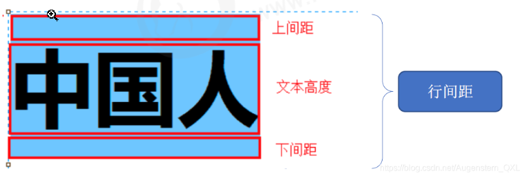
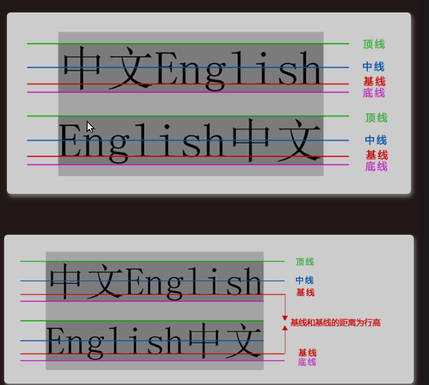
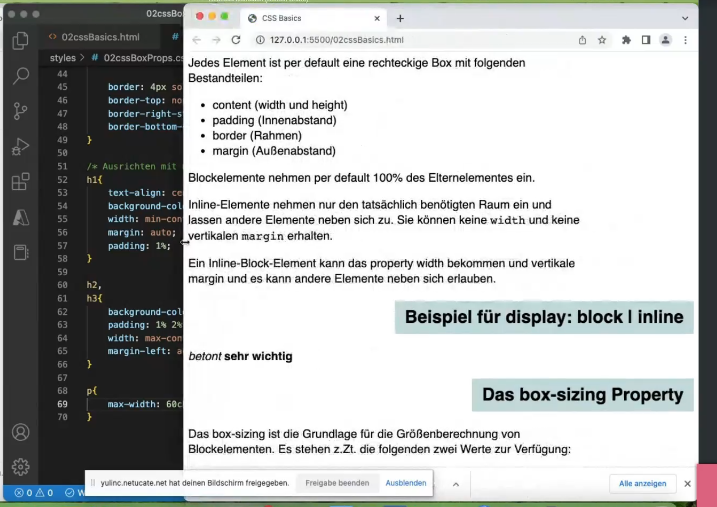
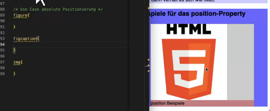
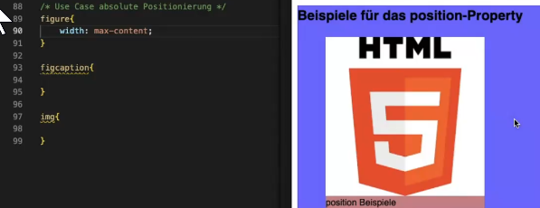

# 1 文本属性: 高度

## 1.1 文本高度 height/min-height/max-height

```css
height: 800px;

min-height: 600px ;
max-height: 768px;
```


## 1.2 行间距/行高/Zeilenhöhe: line-height 

`line-height` 设置行间的距离，行间距=文本高度+上间距+下间距
上下间距 是等值的。 改变行高的时候 是改变的上下间距的值， 文本的高度没有变化
line-height常用的属性值单位有三种，分别为像素px，相对值em和百分比%，实际工作中使用最多的是像素px

一般情况下，行距比字号大7--8像素左右就可以了。 line-height: 24px;
line-height: 120%;




### 1.2.1 行高检测

`行高测量方法`行高我们利用最多的一个地方是：可以让单行文本在盒子中垂直居中对齐。
文字的行高等于盒子的高度。行高   =  上距离 +  内容高度  + 下距离。 上距离和下距离总是相等的，因此文字看上去是垂直居中的。




### 1.2.2 行高与高度的三种关系

- <mark>如果 行高 等 高度  文字会 垂直居中</mark>
```css
.box {
    height: 200px; 
    /* 行高控制垂直居中 */
    line-height: 200px;
}
```


- 如果行高 大于 高度   文字会 偏下
- 如果行高小于高度   文字会  偏上
```css
  /*line-height 要设置在font属性下面，否则无效，例如：*/
  height: 80px;
  text-align: center;
  font: normal bold 30px "宋体";
  line-height: 80px;
```


可以使用display:flex;布局方式让文字水平垂直居中
```css
display: flex;
align-items: center;     /* 侧轴对齐方式*/
justify-content: center; /* 主轴对齐方式 */
```


# 2 文本属性: 宽度 
max-width 会覆盖width设置，但 min-width设置会覆盖 max-width.

## 2.1 min-width / max-width

max-width: 定义整个界面内, 一行最大容纳的宽度. 而且是从左边边界 开始计数

```css
max-width: 60ch;  // ch代表的字符数

min-width: 150px;
max-width: 425px;
```



可以通过 max-width:100% 来限定 某个元素的最大尺寸. 这样当阅览器缩放的时候, 这个元素不会变得过大, 超过 可视界面的最大宽度

## 2.2 width
`width: 5px`

https://www.zhangxinxu.com/wordpress/2016/05/css3-width-max-contnet-min-content-fit-content/

### 2.2.1 CSS2 中的尺寸体系 
1 充分利用可用空间 (对应 CSS3 的 fill-available)
例如，一些`div`元素默认宽度100%父元素，这种充分利用可用空间的行为就称为“`fill-available`”。

2  收缩与包裹 (对应 CSS3 的 fit-content)
典型代表就是浮动，绝对定位以及`inline-block`，英文称为“shrink-to-fit”，直译为“收缩到合适”，这种直译往往都是不准确的，这种行为表现确实很难描述，有些只可意会不能言传的感觉，而我自己一直以“包裹性”作为理解。在CSS3中有个专有的关键名称，`fit-content`.

3 收缩到最小 (对应 CSS3 的 min-content)
这个基本上就出现在`table-layout`为`auto`的表格中，想必有经验的小伙伴一定见过下面这样一柱擎天的盛况的吧！


大家空间都不够的时候，文字能断的就断，中文是随便断的，英文单词不能断。于是乎，第一列被无情地每个字都断掉，形成一柱擎天。这种行为称之为“preferred minimum width”或者“minimum content width”。

也就是本文的重点角色之一`min-content`，换了一个更加规范好听的名字了。
实际上，大家也看到了，`min-content`这种尺寸特性，`display:table-cell`实际上就有，但是，由于没有明确的名词或概念，大家都不知道，都是稀里糊涂有此表现，究其根本就不清楚了。

4  2.2.1.4 超出容器限制 (max-content)
上面1~3情况，除非有明确的`width`相关设置，否则尺寸都不会主动超过容器宽度的，但是，存在一些特殊情况，例如，连续的英文数字，好长好长；或者内联元素被设置了`white-space:nowrap`，则表现为一江春水向东流。

`max-content`的表现与之有些类似，具有收缩特性，同时最大内容宽度。


例如下面：
```css
.box {
    display: inline-block;
    width: 100px; height: 20px; 
    padding: 10px;
    background-color: #f0f3f9;
    white-space: nowrap;
}


_尺寸主动超过容器宽度，恰如一江春水向东流。_
```


#### 2.2.1.1 CSS3中重新对上面特性定义的好处 

好了，至此，大家会发现，`fill-available`, `max-content`, `min-content`, 以及`fit-content`确实在CSS2.1的时候，就有类似概念。

下面问题来了，既然CSS2.1这些特性都有了，那还要额外弄一些新值过来干嘛呢？岂不是白白增加学习成本啊？

好处: 
1.  方便某些布局的实现；
2.  **最重要的作用：** 在原有的display水平不变的情况下拥有元素其他display值才有的特性！
3.  让整个CSS世界的size体系更加直观和完善；

### 2.2.2 CSS3 中 width的属性值

#### 2.2.2.1 元素尺寸: 内部尺寸和外部尺寸
CSS中的元素尺寸分为两类，
一类叫做“内部尺寸”，英文写作”Intrinsic Sizing”，尺寸由内部元素决定；
还有一类叫做“外部尺寸”，英文写作”Extrinsic Sizing”，宽度由外部元素决定。


只有fit-available是外部尺寸；其余三个，都是根据内部内容来决定自己的宽度！！
fill-available 外部尺寸
max-content 内部尺寸
min-content 内部尺寸
fit-content 外部尺寸+内部尺寸


#### 2.2.2.2 总结
fill-availabele：设置的这个元素表现相当于没有设置样式的div，宽度自动充满父级
max-content：设置了这个属性的元素，会自动伸展或者收缩宽度，使自身宽度和最大宽度的子元素宽度一致
min-content：设置了这个属性的元素，会自动伸展或者收缩宽度，所有子元素 中 分别能收缩到 最小的宽度.  在这些 最小的宽度的数值里面,  取最大值, 作为min-content 的输出 


#### 2.2.2.3 width:fill-available
`width:fill-available`比较好理解，比方说，我们在页面中扔一个没有其他样式的`<div>`元素，则，此时，该`<div>`元素的`width`表现就是`fill-available`自动填满剩余的空间。也就是我们平常所说的盒模型的`margin`,`border`,`padding`的尺寸填充。

出现`fill-available`关键字值的价值在于，我们可以让元素的100%自动填充特性不仅仅在`block`水平元素上，其他元素，例如，我们一直认为的包裹收缩的`inline-block`元素上：

div { display:inline-block; width:fill-available; }

此时，元素兼具了块状元素的自动填充特性以及内联元素的定位对齐等特性。于是，（例如）我们就可以直接使用`line-height`让一个块状表现的元素垂直居中。

##### 2.2.2.3.1 例子
您可以狠狠地点击这里：[CSS3 width:fill-available下的垂直居中demo](https://www.zhangxinxu.com/study/201605/width-fill-available.html)


完整关键CSS代码如下：
```css
.box {
    height: 200px; 
    /* 行高控制垂直居中 */
    line-height: 200px;
}
.fill-available {
    /* 元素内联，响应行高和vertical-align控制 */
    display: inline-block;
    vertical-align: middle;
    
    /* 宽度如块状元素般表现 */
    width: -webkit-fill-available;
    width: -moz-fill-available;
    width: -moz-available;    /* FireFox目前这个生效 */
    width: fill-available;
}
```

正如上面注释所提到的，FireFox浏览器下，目前(2016-05-20)不是标准的`-moz-fill-available`，而是`-moz-available`，估计过个几个版本可能会调整过来。

#### 2.2.2.4 width:fit-content
`width:fit-content`也是应该比较好理解的，“shrink-to-fit”表现，
换句话说，和CSS2.1中的`float`, `absolute`, `inline-block`的尺寸收缩表现是一样的。
<mark>display: inline-block元素默认是fit-content</mark> , 你如果不加上fill-available的话，红色背景应该是不会填充的


OK，然后，有小伙伴会疑问，既然跟很多CSS声明有一样的表现，那为什么还要再弄个新东西呢？

就拿水平居中效果举例，首先浮动肯定不行，因为只有左浮动和右浮动；绝对定位压根不占据空间，普通流中根本无法应用，而`inline-block`需要父级使用`text-align:center`，而本身可能还需要`text-align:left`略烦。

而`width:fit-content`可以没有这些烦恼，因为，`width:fit-content`可以实现元素收缩效果的同时，保持原本的block水平状态，于是，就可以直接使用`margin:auto`实现元素向内自适应同时的居中效果了。

##### 2.2.2.4.1 例子
您可以狠狠地点击这里：[CSS3 width:fit-content使用与margin auto下水平居中demo](https://www.zhangxinxu.com/study/201605/width-fit-content.html)

结果，简简单单就居中了，也不要担心其他元素会跟在后面一行显示了：


#### 2.2.2.5 width:max-content
`max-content`的行为表现可以这么理解，
假设我们的容器有足够的宽度，足够的空间，此时，所占据的宽度是就是`max-content`所表示的尺寸。
<mark>会考虑所有内部元素的宽度, 在内部元素的宽度中去一个最大值, 作为这个父元素本身的宽度</mark>

```css
width: min-content;
width: max-content;
```

##### 2.2.2.5.1 如果文字内容的宽度小于图片宽度




如果 caption 中的问题很长


##### 2.2.2.5.2 如果文字内容的宽度大于图片宽度

您可以狠狠地点击这里：[CSS3 width:max-content对比测试demo](https://www.zhangxinxu.com/study/201605/width-max-content.html)

这是一个`display:inline-block`和`width:max-content`的对比demo, 如果妹子下面的文字描述短，大家是看不出区别的。

但是，如果文字内容像demo所展示的这么长, 会发现，<mark>`width:max-content`表现得好像设置了white-space:nowrap一样</mark>，文字一马平川下去，元素的宽度也变成了这些文字一行显示的宽度！

为什么会这么表现呢？定义就是这样的，对吧，我们对照下，首先，假设我们的容器有足够的空间，你想呀，容器足够空间，那下面的描述文字肯定一行显示了，此时，上面的图片和下面的文字那个内容宽度大，自然是文字啦，所谓`max-content`就是值采用宽度大的那个内容的宽度。


#### 2.2.2.6 width:min-content
`min-content`宽度表示的并不是内部那个宽度小就是那个宽度，而是，采用内部元素最小宽度值最大的那个元素的宽度作为最终容器的宽度。

首先，我们要明白这里的“最小宽度值”是什么意思。
- 替换元素，例如图片的最小宽度值就是图片呈现的宽度，
- 对于文本元素
    - 如果全部是中文，则最小宽度值就是一个中文的宽度值； 
    - 如果包含英文，因为默认英文单词不换行，所以，最小宽度可能就是里面最长的英文单词的宽度。


##### 2.2.2.6.1 对比例子
您可以狠狠地点击这里：[CSS3 width:min-content对比demo](http://www.zhangxinxu.com/study/201605/width-min-content.html)

1
同样的是和`display:inline-block`做比较，`display:inline-block`虽然也具有收缩特性，<mark>但宽度随最大长度长的那一个（同时不超过可用宽度）</mark>
<mark>而`width:min-content`的最终宽度是图片和文字最小宽度值里面大的那一个。</mark>

2 
在本例子中，图片的宽度最小值是256像素，不能再缩了；
而文字的最小宽度值是字符`display:inline-`所占据的宽度，因为`inline-block`后面的`block`可以换行.  中文不用谈，天生被换行的命，显然`display:inline-`所占据的宽度要远远小于256像素，
因此，最终我们元素的宽度就是256像素，肉眼看到的就是自适应图片宽度的一个效果。在CSS2.1的世界里，这种效果实际上是不好实现的，要借助单元格特性。


下图为对比效果截图：


