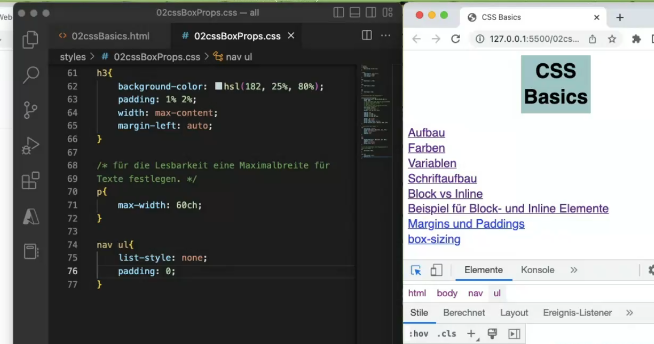

https://www.w3schools.com/css/css_table.asp

# 1 表格属性

```css
td {
    text-align: left;
    vertical-align: top;
    border-bottom: 1px solid #ddd;
    padding: 5px;
}

tr:hover {background-color: coral;}  /* Use the :hover selector on <tr> to highlight table rows on mouse over: */

```

## 1.1 表格的细线边框 border-collapse  (合并相邻的边框)

border-collapse 属性控制浏览器绘制表格边框的方式。它控制相邻单元格的边框。

语法
border-collapse: collapse;

- collapse 是合并的意思
- border-collapse:collapse; 表示将相邻边框合并在一起

通过表格的`cellspacing="0"`,将单元格与单元格之间的距离设置为0. 
但是两个单元格之间的边框会出现重叠，从而使边框变粗
通过css属性：table{ border-collapse:collapse; } : `collapse` 单词是合并的意思,`border-collapse: collapse;`表示相邻边框合并在一起。

```css
<style> 
  table {  
   width: 500px;  
   height: 300px;  
   border: 1px solid red;  
   /* border-width:5px*/
   /* border-style:soild*/
   /* border-color:pink*/
 }  
 td {  
  border: 1px solid red;  
  text-align: center;  
 }  
 table, td， th {  
  border-collapse: collapse;  /*合并相邻边框*/  
  border: 1px solid pink;
  font-size: 14px
  text-aligh: center 
 }
 
 </style>
```


# 2 列表属性 Listenformatierung: list-style

## 2.1 Listenformatierung als Sammeleigenschaft
```css
Selektor{list-style:
        [list-style-type]
        [list-style-position]
        [list-style-image];}
body    {list-style:
         upper-roman
         inside
         URL(list.png);}
```

## 2.2 list-style-type
```css
ul{
    list-style: none; 
}

ul { list-style-type: disc; }
ol { list-style-type: decimal; }

```

1 有序列表
decimal – Nummerierung mit Zahlen
lower-alpha oder lower-latin – Nummerierung mit Buchstaben (a, b, c…)
upper-alpha oder upper-latin – Nummerierung mit Großbuchstaben (A, B, C…)
lower-roman – römische Nummerierung (i, ii, iii…)
upper-roman – römische Nummerierung (Großbuchstaben) (I, II, III…)
lower-greek – kleine, griechische Buchstaben
hebrew – hebräische Buchstaben
decimal-leading-zero – Zahlen als Nummerierung mit führender Null
cjk-ideographic – ideographische Zeichen
hiragana – Alphabetische Aufzählung japanischer Silbenschrift
katakana – Alphabetische Aufzählung japanischer Silbenschrift (für Fremdwörter)
none – keine Nummerierung


2 无序列表
Für Aufzählungsszeichen sind diese Angaben möglich:

disc – gefüllter Kreis (Standard)
circle – leerer Kreis
square – rechteckiges Aufzählungszeichen
none – kein Aufzählungszeichen

none 代表 列表左边的的 点 或者 数字, 不再被显示了



## 2.3 list-style-position
Mit der Listeneinrückung bestimmen Sie, an welcher Position die zweite Zeile des Inhalts eines Listenpunktes steht. Sie können zwischen den Werten inside und outside wählen.

inside – eingerückt
outside – ausgerückt (Standardeinstellung)

[](https://vfhwebp.eduloop.de/mediawiki/images/vfhwebp.eduloop.de/9/9a/4_3_listeneinrueckung.jpg)

## 2.4 list-style-image
Haben Sie eigene Ideen für Aufzählungszeichen, können Sie diese in Form von Grafiken verwirklichen.

ul { list-style-image: URL([Pfad zur Datei]); }

Sie können hier sowohl den Pfad zur Datei, als auch none angeben. Die Grafiktypen sind die HTML-üblichen: *.gif, *.png, *.jpg.

[](https://vfhwebp.eduloop.de/mediawiki/images/vfhwebp.eduloop.de/8/88/4_3_listenbild.jpg)

 Beispiel für ein eigenes Aufzählungszeichen

## 2.5 例子: 列表去掉左边的点 和 左边的空间

```html
        <nav>
            <ul>
                <li><a href="#aufbau">Aufbau</a></li>
                <li><a href="#farben">Farben</a></li>
                <li><a href="#variablen">Variablen</a></li>
                <li><a href="#schrift-aufbau">Schriftaufbau</a></li>
                <li><a href="#block-inline">Block vs Inline</a></li>
                <li><a href="#bsp-block-inline">Beispiel für Block- und Inline Elemente</a></li>
                <li><a href="#margPad">Margins und Paddings</a></li>
                <li><a href="#box-sizing">box-sizing</a></li>
            </ul>
        </nav>
```

```css
p{
    max-width: 60ch;
}

nav ul{
    list-style: none;
    padding: 0;
}

nav li{
    background-color: hsla(182,0%,80%,1);
    margin: 1% 0;
    text-align: center;
}

  
nav a{
    display: block;
}
```


# 3 表单属性

| 属性   | 用途            | 用途                                    |
| ---- | ------------- | ------------------------------------- |
| 轮廓线  | 表单默认outline   | outline 轮廓线，我们一般直接去掉，border是边框，我们会经常用 |
| 防止拖拽 | 主要针对文本域resize | 防止用户随意拖拽文本域，造成页面布局混乱，我们resize:none    |

## 3.1 input 的 表单轮廓 outline


是绘制于元素周围的一条线，位于边框边缘的外围，可起到突出元素的作用。

```css
outline : outline-color ||outline-style || outline-width 
```

但是我们都不关心可以设置多少，我们平时都是去掉的。最直接的写法是 ： outline: 0;   或者   outline: none;
给表单添加 outline:0; 或者outline: none;样式后，就可以去掉默认的蓝色边框

```css
input {
  outline: none;
}
```

## 3.2 文本域textarea 的 缩放 resize

防止拖拽文本域resize


```css
textarea {
  outline: none;
  resize: none;
}

==============
<textarea  style="resize: none;"></textarea>
```

