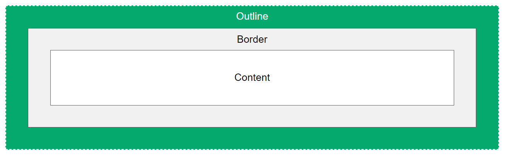

# 1 总览 Rahmengestaltung 

Es gibt drei Möglichkeiten, wie Sie einen Rahmen um ein Element bringen können:
border, outline, shadow.

[](https://vfhwebp.eduloop.de/mediawiki/images/vfhwebp.eduloop.de/c/cd/4_3_rahmen_komplett.jpg)




# 2 边框 border

border 可以设置元素边框。边框有三个组成：border-width、border-style、border-color
border: width | style | color

Genaueres entnehmen Sie der Beispieldatei und dem der Spezifikation [border](https://developer.mozilla.org/de/docs/Web/CSS/border) und [border-style](https://developer.mozilla.org/de/docs/Web/CSS/border-style)


语法：

```
/*属性可连写*/
border: border-width || border-style || border-color;
```

| 属性           | 作用           |
| ------------ | ------------ |
| border-width | 定义边框粗细，单位 px |
| border-style | 边框样式         |
| border-color | 边框颜色         |

## 2.1 border-style
none：没有边框即忽略所有边框的宽度（默认值）
solid：边框为单实线(最为常用的)
dashed：边框为虚线
dotted：边框为点线


## 2.2 边框属性简写和分写

### 2.2.1 边框属性简写

```
顺序无所谓
/*习惯顺序*/ 
border: 5px solid pink;
```

### 2.2.2 边框属性分写

```
/*注意层叠性*/
border-top: 1px solid red;
border-buttom
border-left
border-right
```

很多情况下，我们不需要指定4个边框，我们是可以单独给4个边框分别指定的。

| 上边框                  | 下边框                      | 左边框                   | 右边框                    |
| -------------------- | ------------------------ | --------------------- | ---------------------- |
| border-top-style:样式; | border-bottom-style:样式;  | border-left-style:样式; | border-right-style:样式; |
| border-top-width:宽度; | border- bottom-width:宽度; | border-left-width:宽度; | border-right-width:宽度; |
| border-top-color:颜色; | border- bottom-color:颜色; | border-left-color:颜色; | border-right-color:颜色; |
| border-top:宽度 样式 颜色; | border-bottom:宽度 样式 颜色;  | border-left:宽度 样式 颜色; | border-right:宽度 样式 颜色; |

### 2.2.3 注意就近原则， 下面定义的会覆盖掉上面定义的


# 3 outline

outline: width | style | color

Es gelten dieselben Regeln wie bei border. Näheres finden Sie in der Spezifikation zu [outline](https://developer.mozilla.org/de/docs/Web/CSS/outline). 
Der outline geht, anders als die border, nicht in die Größenberechnung eines Elementes ein und kann auch einen offset bekommen, so daß er außerhalb oder mit negativem Wert auch innerhalb des padding eines Elementes angesiedelt werden kann. Auch hierfür schauen Sie in die Beispiel-Datei. Für die Größenberechnung eines Elementes lesen das Kapitel Box-Modell.


-   `dotted` - Defines a dotted outline
-   `dashed` - Defines a dashed outline
-   `solid` - Defines a solid outline
-   `double` - Defines a double outline
-   `groove` - Defines a 3D grooved outline
-   `ridge` - Defines a 3D ridged outline
-   `inset` - Defines a 3D inset outline
-   `outset` - Defines a 3D outset outline
-   `none` - Defines no outline
-   `hidden` - Defines a hidden outline

```css
outline: solid;
outline: dashed red;
outline: 1rem solid;
outline: thick double #32a1ce;
outline: 8px ridge rgba(170, 50, 220, .6); border-radius: 2rem;
```

# 4 盒子阴影 box-shadow

CSS3 新增盒子阴影，使用 `box-shadow` 属性。

语法
``` css
bxo-shadow: h-shadow v-shadow blur spread color inset;
box-shadow: offset-x | offset-y | blur-radius | spread-radius | color

```
| 值        | 描述                      |
| -------- | ----------------------- |
| h-shadow | 必需，水平阴影的位置，允许负值         |
| v-shadow | 必需，垂直阴影的位置，允许负值         |
| blur     | 可选，模糊距离                 |
| spread   | 可选，阴影的尺寸                |
| color    | 可选，阴影的颜色                |
| inset    | 可选，将外部阴影改为内部阴影（默认是外部阴影） |
-   模糊距离：影子的虚实
-   阴影尺寸：影子的大小

注意：

1. 默认是外阴影，但是不可以写这个单词（outset）, 否则导致阴影无效
2. 盒子阴影不占空间，不会影响其他盒子排列

## 4.1 常用的阴影格式
原先盒子没有影子，当我们鼠标经过盒子就添加阴影效果

```css
div:hover {
      box-shadow:10px 10px 10px -4px rgba(0,0,0,.3);     

}
```

