# 1 内边距Innenabstand  padding

padding 属性用于设置**内边距**,**即盒子边框与内容之间的距离**

| 属性             | 作用   |
| -------------- | ---- |
| padding-left   | 左内边距 |
| padding-right  | 右内边距 |
| padding -top   | 上内边距 |
| padding-bottom | 下内边距 |

## 1.1 padding属性(简写属性)

可以有一到四个值, <u>数值之前千万不能有逗号</u>, 否则失效了

| 值的个数                        | 表达意思                                           |
| --------------------------- | ---------------------------------------------- |
| padding : 5px;              | 1个值，上下左右。 代表上下左右都有5像素内边距                       |
| padding :5px 10px;          | 2个值，上下，左右。代表上下内边距是5像素，左右内边距是10像素               |
| padding: 5px 10px 20px;     | 3个值，上，左右，下。 代表上内边距5像素，左右内边距10像素，下内边距20像素       |
| padding :5px 10px 20px 30px | 4个值，上，右，下，左，顺时针。 上是5像素，右是10像素，下20像素，左是30像素，顺时针 |

## 1.2 padding 会影响盒子实际大小

如果盒子本身没有指定width/height属性，则此时padding不会撑开盒子大小 （让 padding 不影响盒子大小）

当盒子已经有了宽度 (width 元素 = 内容宽度)和 高度 （height 元素 = 内容高度），再指定内边距，会撑大盒子。整个盒子的宽高还需要再加上 padding 的宽高

当给盒子指定了 padding 值以后，发生了两件事情：
1. 内容和边框有了距离，增加内边距
2. padding 值影响了盒子实际大小
 

```
div {
width: 200px
height: 200px;
blackground-color: pink;
padding: 20px 
}
```

但是，有时候 padding 影响盒子是有好处的，比如我们要做导航： 因为每个导航栏里面的字数不一样多,我们可以不用给每个盒子宽度了,直接给 padding 最合适.
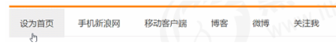

### 1.2.1 解决方案， 让padding不会影响盒子实际大小：
1. 要保证盒子和效果图一样大，则让   width/height-多出来的内边距大小  即可。
2. 如果盒子本身没有指定width/height属性，则此时padding不会撑开盒子大小 （让 padding 不影响盒子大小）

#### 1.2.1.1 例子1
```css
<h1> {
/*width: 100% ;*/* // width 没有被指定
height: 200px;
bakcground-color: pink;
padding: 30px;  // 此时只有整个盒子的的高度被增长， 宽度没有被增长
}
```

#### 1.2.1.2 例子2 (重要)： 
这种情况下 p中没有直接给出 height 和 width， p继承 div 的 height 和 width, ， p 不会因为 p 的padding而变大， 会仍为300px x 100px: 

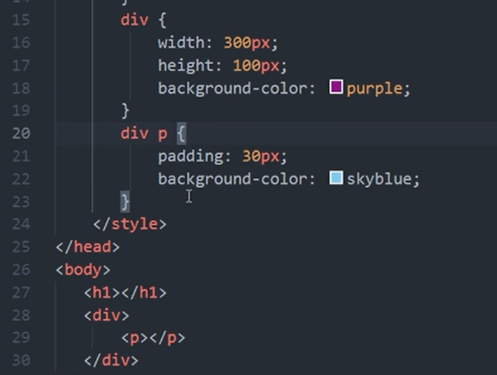
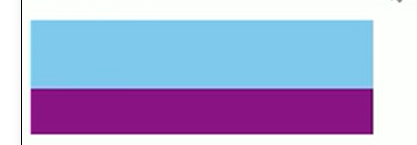

#### 1.2.1.3 例子3 (重要)： 
<mark> 孩子继承父亲的宽度，孩子设置padding 不会撑开盒子， 除非孩子自己设置了 height 和 width 元素  </mark>
这种情况下 p中直接给出  width， 没有直接给出 height
p继承 div 的 height 和 width。
但是  p这个盒子的整个 宽度会因为 子元素的padding而变大。高度不会会因为子元素padding而变大、   p 为230px x 100px: 
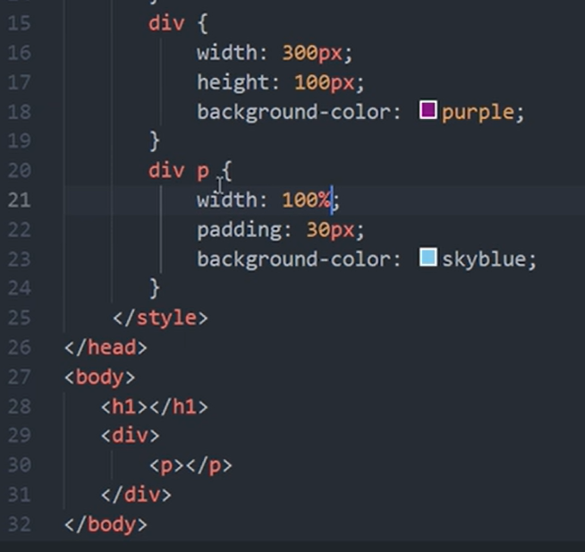
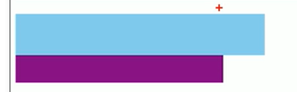

## 1.3 例子: 新浪导航栏
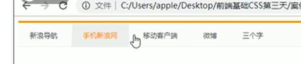
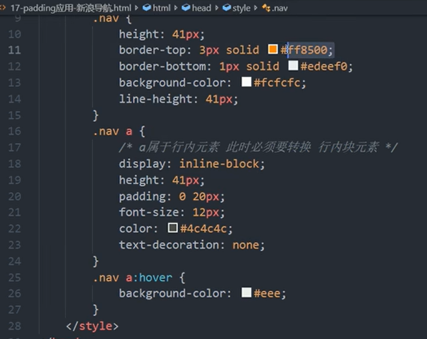
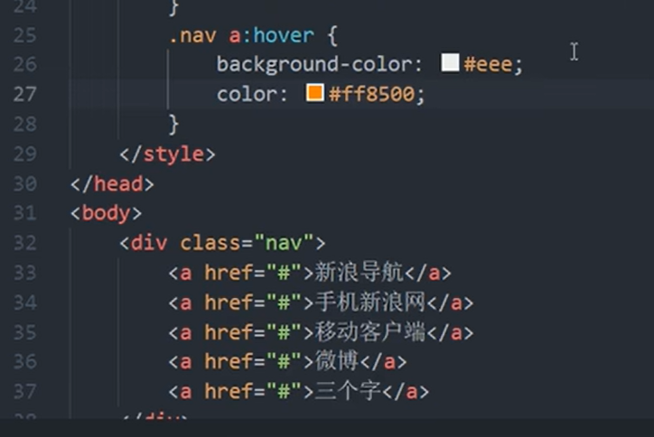

# 2 box-sizing 属性 (css3新属性)
content-box, border-box oder padding-box

引子
- 在设置了一个盒子的 `width/height` 后，再设置其 `border/padding` 会影响盒子实际大小。当进行响应式布局时，这个尤其烦人。
- 若盒子没有指定 `width/height` 属性，则此时 `padding` 不会撑开盒子大小。

box-sizing 被写在哪个位置
- Das box-sizing sollte für alle Elemente gleich sein und wird deshalb im <mark>Universal Selektor </mark> notiert. 
- So kann es später auch für einzelne Elemente überschrieben werden.

## 2.1 content-box, border-box
CSS 中的 `box-sizing` 属性定义了 `user agent` 应该如何计算一个元素的总宽度和总高度。 box-sizing 属性可以被用来调整这些表现。
CSS3中可以通过 box-sizing 来指定盒模型，有2个值：即可指定为 content-box，border-box ，这样我们计算盒子大小的方式就发生了改变。

可以分成两种情况：

1.  传统模式宽度计算: `box-sizing：content-box` 
    1.  tatsächliche Breite = width （内容的宽度） + 2 * margin + 2 * border + 2 * padding
    2. tatsächliche height = height (内容的宽度） + 2 * margin + 2 * border + 2 * padding
2.  CSS3盒子模型: `box-sizing: border-box` 
    1.  盒子大小为 CSS中设置的宽度width= content 自己的宽度 
    2. 盒子大小里面不包含了 border 和 padding,
        1.  border-box ，那padding 和 border就不会撑大盒子了（前提 padding 和 border 不会超过 width 宽度）


### 2.1.1 content-box (默认的, 传统的)
`content-box` 是默认值。

```css
box-sizing: content-box;
```

-   第一种情况是 CSS 的盒子模型，盒子大小为 width + padding + border
-   此种情况盒子大小为 宽度 + 内边距 + 边框，这也是我们之前写盒子所默认的

在 设置了 box-sizing: content-box; 情况下， 如果你设置一个元素的宽为`100px`，那么这个元素的内容区会有 `100px` 宽，并且任何边框和内边距的宽度都会被增加到最后绘制出来的元素宽度中。
  
  尺寸计算公式： 
  - tatsächliche Breite = width （内容的宽度） + 2 * margin + 2 * border + 2 * padding
  - tatsächliche height = height (内容的宽度） + 2 * margin + 2 * border + 2 * padding

### 2.1.2 border-box (css3 新特性)

-   你想要设置的边框和内边距的值是包含在 `width` 内的。
-   此种情况盒子大小为 宽度width，包括内边距和边框在内，这样 padding 和 border 就不会撑大盒子了(前提是 padding 和 border 不会超过 width 宽度)
  - tatsächliche Breite = width + 2 * margin
  - tatsächliche height = Height + 2 * margin

```css
* {
   margin: 0;
   padding: 0;
   box-sizing: border-box;
   /*  这样的话padding和border就不会撑大盒子了 */
}
```

`border-box` 告诉浏览器：你想要设置的边框和内边距的值是包含在 `width` 内的。
也就是说，如果你将一个元素的 `width` 设为 `100px`，那么这 100px 会包含它的 `border` 和 `padding`，内容区的实际宽度是 `width` 减去 `(border + padding)` 的值。
大多数情况下，这使得我们更容易地设定一个元素的宽高。
  
  ```
  box-sizing: border-box;
  ```
  
  - tatsächliche Breite = width + 2 * margin
  - tatsächliche height = Height + 2 * margin


## 2.2 padding-box


# 3 外边距 margin

margin（外边距）属性用于设置外边距，即控制盒子和盒子之间的距离

## 3.1 margin 不会影响盒子的实际尺寸
- <mark> margin 不考虑在盒子的尺寸内， margin 不会撑大盒子的尺寸 </mark>
- <mark> 因为margin可用于大盒子中的 儿子盒子的分离， 而不用考虑对大盒子的影响  </mark>

## 3.2 margin的属性

| 属性            | 作用   |
| ------------- | ---- |
| margin-left   | 左外边距 |
| margin-right  | 右外边距 |
| margin-top    | 上外边距 |
| margin-bottom | 下外边距 |

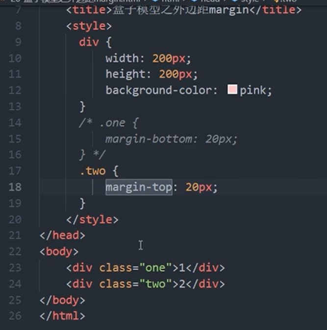

## 3.3 margin 简写属性

margin 简写方式代表的意义跟 padding 完全一致
可以有一到四个值

| 值的个数                       | 表达意思                                           |
| -------------------------- | ---------------------------------------------- |
| margin : 5px;              | 1个值，上下左右。 代表上下左右都有5像素外边距                       |
| margin :5px 10px;          | 2个值，上下，左右。代表上下外边距是5像素，左右外边距是10像素               |
| margin: 5px 10px 20px;     | 3个值，上，左右，下。 代表上外边距5像素，左右外边距10像素，下外边距20像素       |
| margin :5px 10px 20px 30px | 4个值，上，右，下，左，顺时针。 上是5像素，右是10像素，下20像素，左是30像素，顺时针 |

## 3.4 keyword auto
https://www.php.cn/css-tutorial-412560.html


### 3.4.1 auto 在什么情况下无效 
重点: <mark>auto只适用于水平边距，它不适用于浮动和内联元素，并且它本身也不能用于绝对和固定定位元素</mark>

- auto在浮动，内联和绝对元素中不起作用。所有这些元素已经决定了它们的布局，所以没有auto用于边距并期望它像这样集中。
    - 这将破坏使用类似float的最初目的。因此设置这些元素的auto值为0px。
- 如果它的容器为块元素, 但是这个若其没有宽度，auto 也不会对典型的块元素起作用。到目前为止我向你展示的所有例子都有宽度。


### 3.4.2 auto 在宽度方面的作用 

- 如果一侧定值，一侧auto，则auto为剩余空间大小
- 如果两侧均是auto，则平分剩余空间
    - 假如一个DIV我们设置宽度为500px，然后设置margin:0 auto样式后，假如你浏览器窗口宽度为1000px宽，这个时候此DIV靠左和靠右间距为（auto）这个时候浏览器会自动辨析DIV靠左和靠右各250px宽度间距，此时这个DIV盒子自然而然就水平居中浏览器中。

#### 3.4.2.1 为什么auto能实现水平居中
这是因为水平方向的 auto，其计算值取决于可用空间（剩余空间）。

想象这样一个场景，一个宽100px的p被包含在一个宽500px的div内，此时设置 p 的 margin-left 值为 auto
margin-left:auto; 自动占据了包含块的可用空间，即 500 - 100px = 400px。也就是说auto最后的计算值为400px，即margin-left:400px;。
所以 margin-left:auto; 的结果会相当于右对齐。


#### 3.4.2.2 例子 

##### 3.4.2.2.1 两侧一样
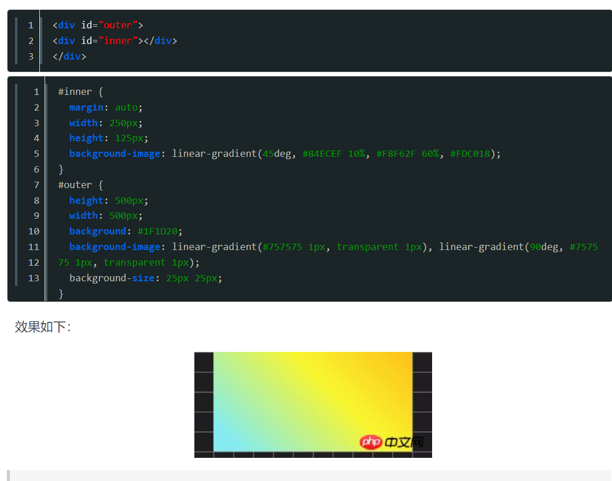
##### 3.4.2.2.2 两侧不平均 
```css
<style>
    .father {
      width: 300px;
      background-color: #f0f3f9;
    }
    .son {
      width: 200px;
      height: 120px;
      margin-right: 80px;
      margin-left: auto;
      background-color: #cd0000;
    }
  </style>

<div class="father">
    <div class="son"></div>
  </div>

```
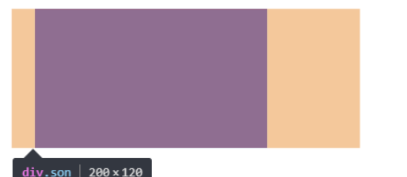

##### 3.4.2.2.3 margin-left:auto
代替float:right实现右对齐
```css
.father {
      width: 300px;
      background-color: #f0f3f9;
    }
    .son {
      width: 200px;
      height: 120px;
      margin-left: auto;
      background-color: #cd0000;
    }

<div class="father">
    <div class="son"></div>
  </div>

```

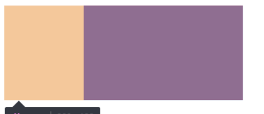


### 3.4.3 margin: auto 在 垂直方面的作用 

不论是 margin: auto; 还是 margin: 0 auto; 效果都是一样的，都是让 #demo 水平居中了，<mark>但纵向并没有任何变化。</mark>
- margin: auto; 其实相当于 margin: auto auto auto auto;
- margin: 0 auto;相当于margin: 0 auto 0 auto;，四个值分别对应上右下左。至于CSS中的上、右、下、左顺序就不做赘述了。
- 还可拆分为：margin-left:auto;  margin-right: auto;  margin-top: 0;   margin-bottom: 0;

#### 3.4.3.1 margin-top: auto; 和 margin-bottom: auto;，其计算值为0: 

<mark>根据规范，margin-top: auto; 和 margin-bottom: auto;，其计算值为0 </mark>
这也就解释了为什么margin: auto; 等同于 margin: 0 auto;

但仅此而已吗？让我们来看看规范描述：
原文：On the A edge and C edge, the used value of ‘auto’ is 0.

<strong>为什么将 margin-top: auto; 和 margin-bottom: auto; 的auto 值设置为0: </strong>
这可能是因为典型的垂直页面流，页面大小在高度方面增加。
因此，相对于页面本身而言，将元素垂直居中于其容器中不会使其显示为垂直方向的额句容居中，这与水平完成（在大多数情况下）不同。

<strong>为什么 绝对定位的元素可以在整个页面的高度上, 垂直居中: </strong>
猜想1: 也许是因为同样的原因，他们决定为绝对定位的元素 添加一个例外，使绝对定位的元素可以在整个页面的高度上, 垂直居中。
猜想2: 这也可能是由于边缘坍塌效应（相邻元素“边缘”的崩溃），这是垂直边距的另一个例外。猜想2是一个不太可能的情况 - 因为不会折叠其边距的元素 - 如Floats和overflow其他元素visible，仍然为其分配0px垂直边距auto。

### 3.4.4 绝对定位的元素的 水平和垂直方向居中

将元素转换为绝对定位只是为了使它可以垂直居中可能不是一个好主意。还有其他选项，如flexbox和CSS变换，更适合那些。

<strong>水平方向上的规定:</strong>
- 如果”left“，”width“和”right“中的所有三个都是”auto“：首先将”margin-left“和”margin-right“的任何”auto“值设置为0 ... ”
- 如果三者中没有一个是”自动“：如果”margin-left“和”margin-right“都是”auto“，则在额外约束条件下解决方程式，即两个边距得到相等的值
- <mark>总结: 对水平auto的利用，抓住间隔相等，则对值left，width并且right不应该写为auto ( auto是他们的默认值).  因此，我们所要做的就是在绝对定位的元素中赋予它们一些价值。left并且right应该具有相同的值以实现完美的居中。 </mark>


<strong>垂直 方向上的规定:</strong>

- 如果”top“，”height“和”bottom“中的所有三个都是auto，则将”top“设置为静态位置...”
- 如果三者中没有一个是”自动“：如果”margin-top“和”margin-bottom“都是”auto“，则在额外约束下解决方程式，即两个边距得到相等的值......”
- 总结: 对于一个绝对元件被垂直居中，其top，height和bottom值不应该auto。我们所要做的就是在绝对定位的元素中赋予它们一些价值。left并且right应该具有相同的值以实现完美的居中。


#### 3.4.4.1 块级元素水平垂直居中的技巧

5 种技巧 https://blog.csdn.net/qq_34295211/article/details/105929606 

###### 3.4.4.1.1.1 magin:auto配合绝对定位实现水平和垂直方向居中
```css
.father {
      width: 300px;
      height: 150px;
      background-color: #f0f3f9;
      position: relative;
    }

    .son {
      position: absolute;
      top: 0;  // 必须给出 top, right, bottum. left 的值, 否则无效 
      right: 0;
      bottom: 0;
      left: 0;
      width: 200px;
      height: 100px;
      background-color: #cd0000;
      margin: auto;
    }


<div class="father">
    <div class="son"></div>
  </div>

```

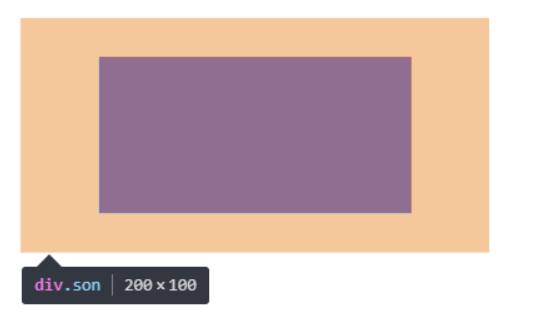

例子2: 
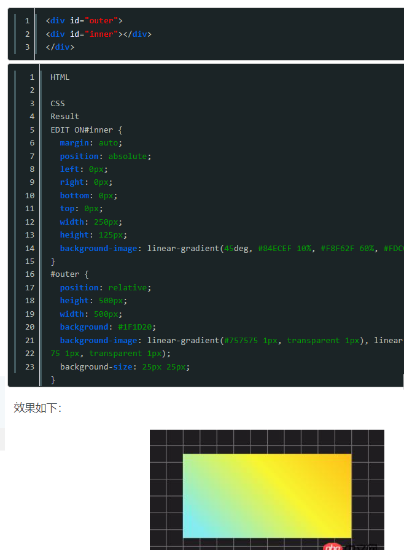

## 3.5 外边距典型应用

### 3.5.1 块级元素 水平轴方向上居中

外边距可以让块级盒子 **水平轴方向上居中**，但是必须满足两个条件：

1. 盒子必须指定宽度（width）
2. 盒子左右的外边距都设置为 `auto`

```
.header {
  width: 960px;
  margin: 0 auto;
}
```

常见的写法，以下下三种都可以。

- margin-left: auto;   margin-right: auto
- margin: auto;
- margin: 0 auto;

### 3.5.2 行内元素和行内块元素 的水平居中 

1 行内元素和行内块元素是没有高度和宽度的， 所以下面这么定义的话， 对 span 是没有效果的 
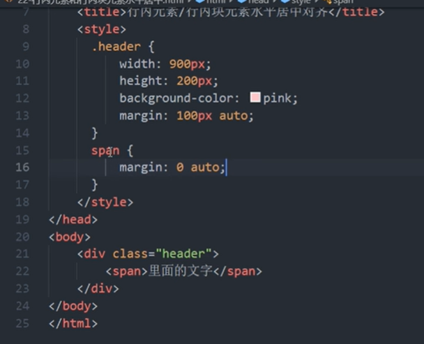


2 如何使使行内元素或行内块元素水平居中
给行内元素和行内块元素 的 父元素添加  text-align: center;
1. 盒子内的文字水平居中是 text-align: center; 而且还可以让 行内元素和行内块居中对齐
2. 块级盒子水平居中  左右margin 改为 auto

##### 3.5.2.1.1 例子
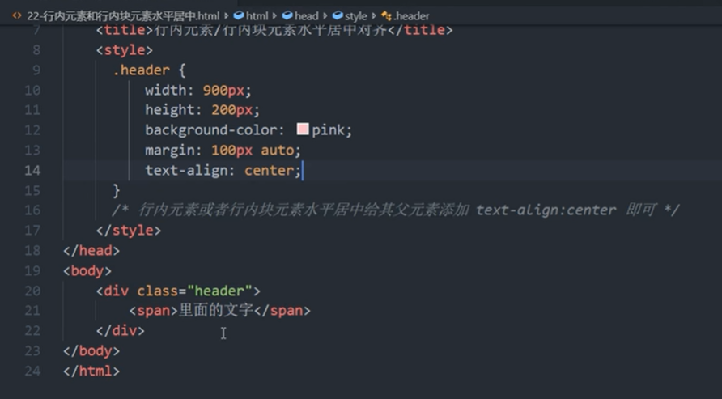
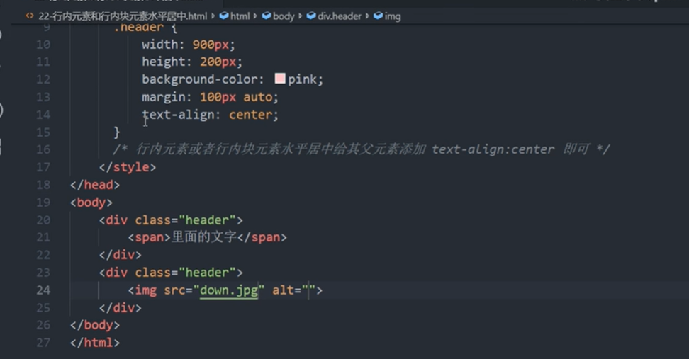

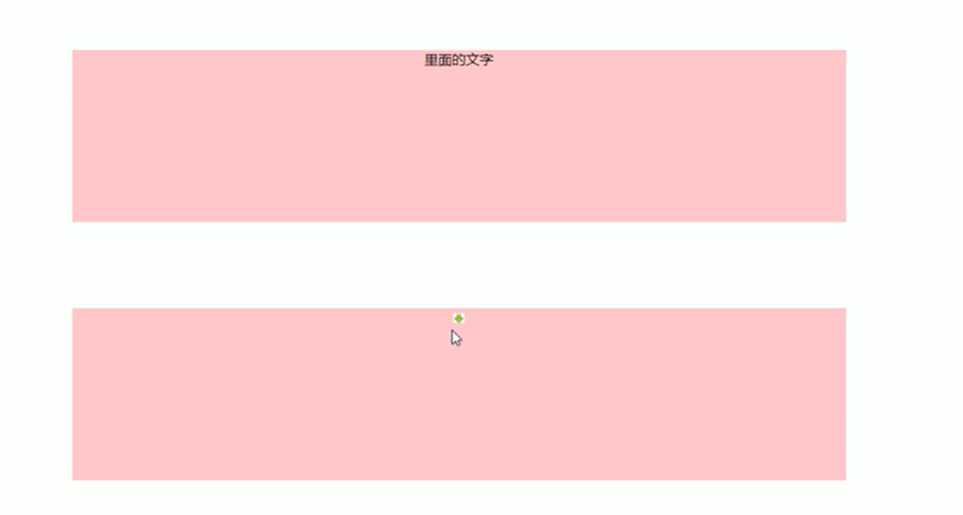
### 3.5.3 插入图片和背景图片区别

1. `插入图片`我们用的最多 比如产品展示类  移动位置只能靠盒模型 padding margin

2. `背景图片`我们一般用于小图标背景或者超大背景图片、背景图片，移动位置只能通过  background-position

## 3.6 外边距合并

### 3.6.1 相邻元素垂直外边距的合并

当上下相邻块元素相遇时，若上面的元素有下外边距margin-bottom，下面的元素有上外边距margin-top，则他们之间的垂直间距不是 `margin-bottotm` 与 `margin-top` 之和。

取两个值中的较大者这种现象被称为相邻元素垂直外边距的合并。

解决方法： 「解决方案：尽量给只给一个盒子添加margin值」


### 3.6.2 嵌套块元素垂直外边距的塌陷
使用 margin 定于块元素的水边外边距的时候， 可能会出现外边距的合并
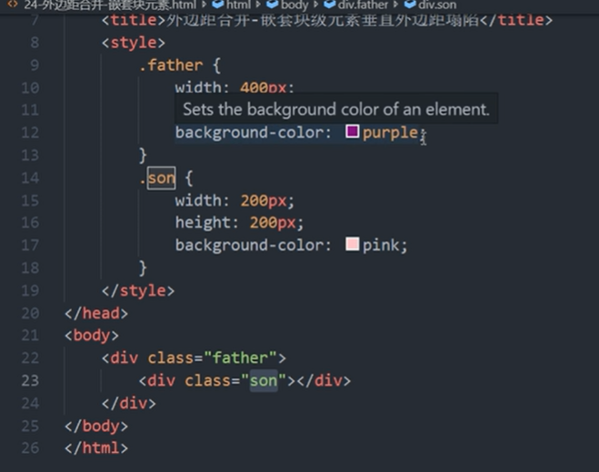
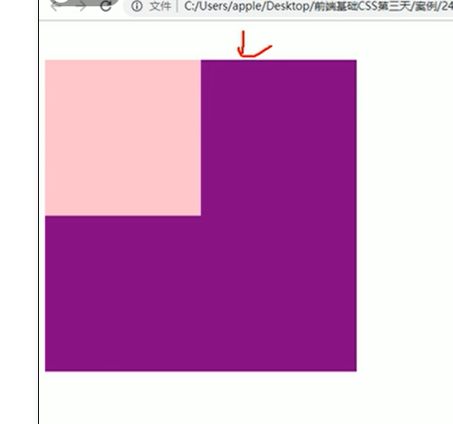

对于两个嵌套关系（父子关系）的块元素，父元素有上外边距同时子元素也有上外边距，此时父元素会塌陷较大的外边距值。
在设置了子元素的 margin-top:10px后， 带着父元素的上边界一起向下平移了10px。 本来希望 父元素的上边界不动
此时谁的外边距大 ， 就塌陷谁的外边距。 
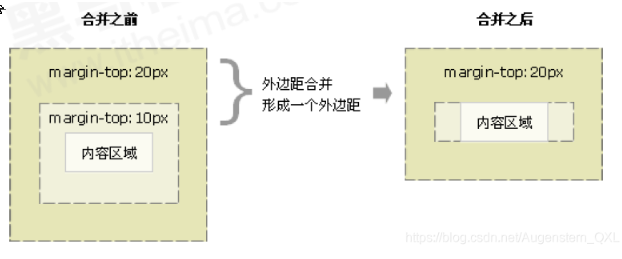

解决方案
1. 方案1： 为父元素定义上边框
2. 方法2： 为父元素定义上内边距
3. 方法3： 为父元素添加 `overflow:hidden`
4. 还有其他方法，比如浮动、固定、绝对定位的盒子不会有塌陷问题。后面会进行总结。
before:
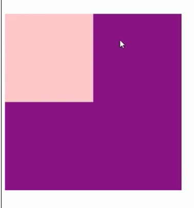
正确的after
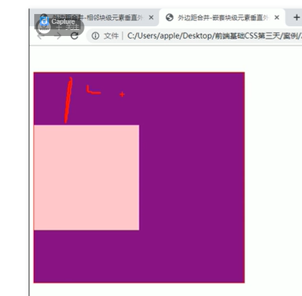
错误的after 
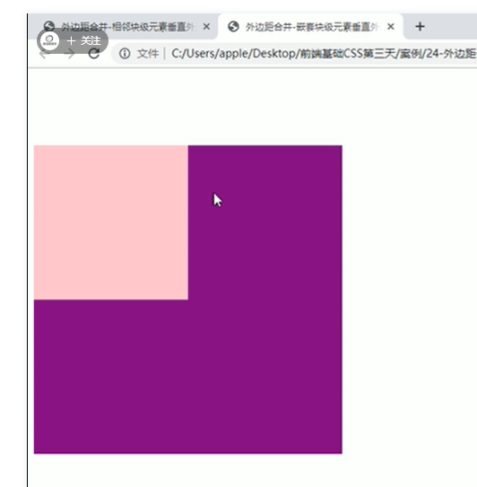

## 3.7 清除内外边距

网页元素很多都带有默认内外边距，而且不同浏览器默认的也不一致，因此在布局前，要先清除网页元素的内外边距。
注意：
- 块元素，和行内块元素 可以 随意设置 上下左右 内外边距
- 行内元素为了照顾兼容性，尽量只设置上下左右内边距，和设置左右外边距
    - 不要设置上下外边距, 设置了也根本不起作用
    - 但是转换为块级和行内块元素， 就可以设置随意这只上下左右 内外边距。


语法

```css
<style>
* {
  margin: 0; 清除外编剧
  padding: 0; 清除内边距
}
</style>
```
