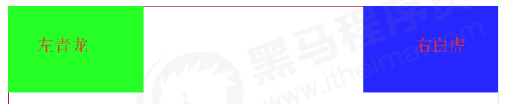
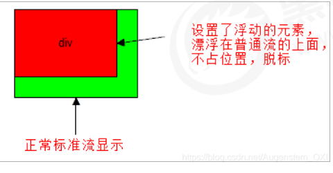
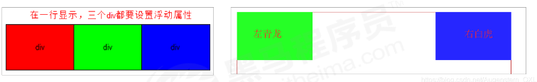
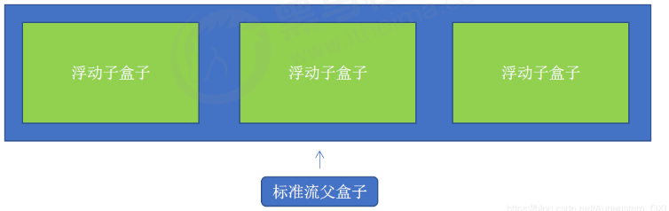
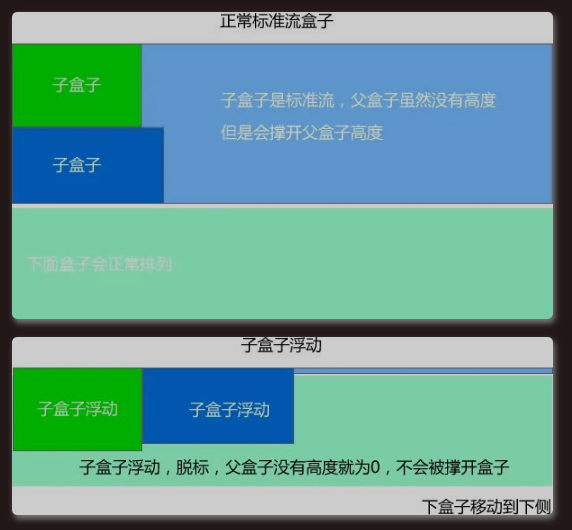

# 1 浮动（float)

## 1.1 为什么需要浮动？

很多布局效果，标准流没办法完成，此时就可以利用浮动完成布局。浮动可以改变元素标签默认排列方式。

1. 提问：如何让多个块级盒子(div)水平排列成一行？
   1. 比较难，虽然转换为行内块元素可以实现一行显示，但是他们之间会有大的空白缝隙，很难控制。
   2. 水平排列成一行.png)
2. 提问：如何实现两个盒子的左右对齐？
   1. 总结： 有很多的布局效果，标准流没有办法完成，此时就可以利用浮动完成布局。 因为浮动可以改变元素标签默认的排列方式.
   2. 

## 1.2 什么是浮动

In CSS, float ist eine Eigenschaft, die ursprünglich verwendet wurde, ==um Elemente aus dem normalen Fluss eines Dokuments zu entfernen== und sie seitlich auszurichten, sodass der nachfolgende Text und Inline-Elemente um sie herum fließen können.
就是说 nachfolgende Text 还是会自动的包裹在 这个float element 周围.  这是float element 不是直接盖在 text 上面的 , 不是 从而覆盖掉 某些text

元素的浮动是指设置了浮动属性的元素会
- 脱离标准普通流的控制,不占位置，脱标
- 移动到指定位置。

作用

1. 让多个盒子(div)水平排列成一行，使得浮动称为布局的重要手段。
2. 可以实现盒子的左右对齐等等。
3. 浮动最早是用来控制图片，实现文字环绕图片效果。
4. float属性会改变元素的display属性，任何元素都可以浮动。浮动元素会生成一个块级框，而不论它本身是何种元素。生成的块级框和我们前面的行内块极其相似。
   
## 1.3 浮动最典型应用

浮动最典型应用: 让多个块级元素一行显示。
网页布局第一准则：多个块级元素纵向排列找标准流，多个块级元素找浮动。
网页布局第二准则：先设置盒子大小，再设置盒子位置。

## 1.4 浮动的语法

`float` 属性用于创建浮动框，将其移动到一边，直到左边缘或右边缘及包含块或另一个浮动框的边缘。

语法

```
选择器 { float: 属性值; }
```

| 属性值     | 描述          |
| ------- | ----------- |
| none    | 元素不浮动 （默认值） |
| left    | 元素向左浮动      |
| right   | 元素向右浮动      |
| inherit |             |

- left
    - Das Element wird nach links verschoben und der Text fließt rechts um das Element herum.
    - der Bereich steht links, die nachfolgenden Elemente „fließen“ rechts von ihm
- right: 
    - Das Element wird nach rechts verschoben und der Text fließt links um das Element herum.
    - der Bereich steht rechts, die nachfolgenden Elemente „fließen“ links von ihm
- none: 
    - Das Element wird nicht verschoben und bleibt an seiner normalen Position im Dokumentenfluss.
    - bewirkt keinen Umfluss
- inherit: 
    - Das Element übernimmt den floatWert seines übergeordneten Elements.

## 1.5 浮动特性（重点）

| 特点  | 说明                                                  |
| --- | --------------------------------------------------- |
| 浮   | 加了浮动的盒子**「是浮起来」**的，漂浮在其他标准流盒子的上面。                   |
| 漏   | 加了浮动的盒子**「是不占位置的」**，它原来的位置**「漏给了标准流的盒子」**。          |
| 特   | **「特别注意」**：浮动元素会改变display属性， 类似转换为了行内块，但是元素之间没有空白缝隙 |

加了浮动之后的元素，会具有一些特性。

1. 脱标：浮动元素会脱离标准流
   1. 脱离文档流的控制（浮）移动到指定位置（动），脱标 脱离文档流的盒子，会漂浮在文档流的盒子上面，不占位置。浮动的盒子不再保留原先的位置
   2. 
2. 如果多个盒子都设置了浮动，则它们会按照属性值**一行内显示并且顶端对齐排列**
   1. 浮动的元素是相互贴在一起的（没有间隙），若父级宽度放不下盒子，多出的盒子会另起一行对齐。
   2. 
3. 浮动的元素会具有行内块元素的特性
   1. 浮动元素具有行内块元素特性。 任何元素都可以浮动，设置了后元素都具有行内块元素性质。
      1. 若块级元素没有设置宽度，则默认和父级一样宽
      2. 浮动盒子中间无间隙，紧挨着
      3. 行内块元素同理

# 2 浮动的注意点

1. 浮动元素经常和标准流父级元素搭配使用： 为了约束浮动元素位置, 我们网页布局一般采取的策略是:
   
   1. 先用标准流的父元素排列上下位置，之后内部子元素采取浮动排列左右位置。符合网页布局第一准则。
   2. 

2. 一个元素浮动了，理论上其余兄弟元素也要浮动
   
   1. 一个盒子里有多个盒子，其中一个盒子浮动，其他兄弟也应该浮动，防止引起问题。

3. 浮动的盒子只会影响浮动盒子后面的标准流，不会引起前面的标准流。
   
   1. 


# 3 例子

```html
<html>
<head>
<style>
	#container {
		background-color: yellow;
		padding: 10px;
	}
	
	#red {

		
	}
	
	#green {


	}
	
</style>
</head>
<body>
<p id="container">
	
	
	Lorem ipsum dolor sit amet, consectetur adipiscing elit, sed do eiusmod tempor incididunt ut labore et dolore magna aliqua. Ut enim ad minim veniam, quis nostrud exercitation ullamco laboris nisi ut aliquip ex ea commodo consequat. Duis aute irure dolor in reprehenderit in voluptate velit esse cillum dolore eu fugiat nulla pariatur.
</p>
</body>
</html>

```


---
1 
```css
#red {
}
	
#green {
	display: none;
}

```


----
2  “Fügen Sie dem Bild nun das CSS-Attribut `display: block` hinzu.”
Das rote Bild wird nun in einer eigenen Zeile oberhalb des Textes angezeigt, da das `display: block` das Bild aus dem Inline-Layout herausnimmt.

```css
#red {
	display: block;
}
	
#green {
	display: none;
}
```


---
3  “Fügen Sie nun dem roten Bild die CSS-Property `float: left` hinzu.”
Das rote Bild wird links vom Text ausgerichtet und ragt aus dem Elternelement aus.
herausragen 突出 

加上了 `float: left` 后 红块 Elemente aus dem normalen Fluss eines Dokuments zu entfernen==

```css
#red {
	display: block;
	float: left;
}
	
#green {
	display: none;
}
```


---

4 Entfernen Sie das display: none des grünen Bilds.

Da das grüne Bild nach dem Roten kommt und noch keine CSS-Properties hat, verursacht optisch das Standardverhalten für beider Bilder.


`display: block` ensures that the element has block-level behavior==, but `float: left` overrides the default block-level stacking behavior==. Instead of taking up the full width of the parent container, the element is floated to the left, allowing other content to wrap around it.

- **`display: block;`**:
    - Makes the element behave like a block-level element.
    - Block-level elements take up the full width of their parent container by default, forcing a new line before and after the element.
- **`float: left;`**:
    - Moves the element to the left within its container.
    - Other content (text or inline elements) will flow to the right of the floated element unless explicitly cleared.


```js
#red {
	display: block;
	float: left;  // 这时候只有 float 起作用了,  the behavior of display: block;  is already overrided 
}
	
#green {

}
```


如果
```css
#red {
    float: right;
    display: block;
}

#green {
}
```


---

5 Fügen Sie dem grünen Bild zuerst die CSS-Property float: left und anschließend float: right hinzu.

5.1 
```css
#red {
	display: block;
	float: left;
}
	
#green {
	float: left;
}
```


compare with following 

```css
#red {
	display: block;
	float: left;
}
	
#green {
	float: right;
}
```


---
 


# 4 清除浮动

## 4.1 为什么需要清除浮动

我们前面浮动元素有一个标准流的父元素, 他们有一个共同的特点, 都是有高度的.但是, 所有的父盒子都必须有高度吗? 
理想中的状态, 让子盒子撑开父亲. 有多少孩子,我父盒子就有多高. 但是不给父盒子高度会有问题吗?..…
由于父级盒子很多情况下，不方便给高度，当时盒子浮动又不占有位置，最后父级盒子高度为 0 时，就会影响下面的盒子，对后面元素排版产生影响。

- 由于浮动元素不再占用原文档流的位置，所以它会对后面的元素排版产生影响
- 理想中的状态，让子盒子撑开父亲，有多少孩子，我父盒子就有多高
  

## 4.2 清除浮动的本质

- 由于浮动元素不再占用原文档流的位置，所以它会对后面的元素排版产生影响
- 清除浮动的本质是清除浮动元素造成的影响

为什么需要清除浮动？

- 如果父盒子本身具有高度，则不需要清除浮动
- 除浮动主要为了解决父级元素因为子级浮动引起内部高度为0 的问题
- 清除浮动之后，父级会根据浮动的子盒子自动检测高度，父级有了高度，就不会影响下面的标准流了。
  什么时候用清除浮动呢？
- 父级没高度， 子盒子浮动了， 影响下面布局了，应该清除浮动。

## 4.3 清除浮动语法

语法：

```
选择器: {
  clear: 属性值;
}
```

| 属性值   | 描述         |
| ----- | ---------- |
| left  | 不允许左侧有浮动元素 |
| right | 不允许右侧有浮动元素 |
| both  | 同时清除左右两侧浮动 |

- 我们实际工作中，几乎只用`clear:both`
- 清除浮动的策略是：**闭合浮动**： 只让浮动在父盒子内部影响，不影响父盒子外面的其他盒子。

## 4.4 清除浮动的方法：

1. **额外标签法（隔墙法）**，是 W3C 推荐的方法
2. 父级添加 overflow 属性
3. 父级添加 after 伪元素
4. 父级添加双伪元素

| 清除浮动方式             | 优点        | 缺点                     |
| ------------------ | --------- | ---------------------- |
| 额外标签法(隔墙法)         | 通俗易懂，书写方便 | 添加许多无意义的标签，结构化较差       |
| 父级overflow:hidden; | 书写简单      | 溢出隐藏                   |
| 父级after伪元素         | 结构语义化正确   | 由于IE6-7不支持：after，兼容性问题 |
| 父级双伪元素             | 结构语义化正确   | 由于IE6-7不支持：after，兼容性问题 |

### 4.4.1 清除浮动 额外标签法

也成为隔墙法，是 W3C 推荐的方法。

额外标签法是在最后一个浮动元素末尾添加一个 **空块级元素**，给其赋以属性 `clear:both;`。

- 优点：通俗易懂，书写方便
- 缺点：添加许多无意义的标签，结构化差
- 使用场景： 实际开发中可能会遇到，但是不常用。

```
<style>
  clear: both;
</style>
<div class="clear"></div>
```

### 4.4.2 清除浮动 父级添加 overflow

- 可以给父级添加 `overflow` 属性，将其属性设置为 `hidden`、`auto`或`scroll`。 注意是给父元素添加代码
- 优点：代码简洁
- 缺点：无法显示溢出部分. 内容增多时候容易造成不会自动换行导致内容被隐藏掉，无法显示需要溢出的元素。

### 4.4.3 清除浮动 :after 伪元素法

实际上也是额外标签法的一种。:after 方式是额外标签法的升级版。也是给父元素添加

- 优点：没有增加标签，结构更简单
- 缺点：需要照顾低版本浏览器。由于IE6-7不支持:after，使用 zoom:1触发 hasLayout。
- 代表网站：百度、淘宝、网易等

```
.clearfix {
  content: "";
  display: block;
  height: 0;
  clear: both;
  visibility: hidden;
}
.clearfix {
  /*IE6、7专有*/
  *zoom: 1;
}
```


#### 4.4.3.1 例子

Wie können Sie gewährleisten, dass die beiden Bilder trotz float nicht aus ihrem Elternelement herausragen?


**1. `content: ""`**
- Dies erstellt tatsächlich das `::after` Pseudo-Element. Ohne diese Eigenschaft würde das Pseudo-Element nicht erscheinen.
- Hier wird es mit einem leeren String (`""`) initialisiert, sodass kein sichtbarer Inhalt eingefügt wird.

**2. `clear: both`**
- Die `clear` Eigenschaft wird verwendet, um sicherzustellen, dass kein anderes "float"-Element (in diesem Fall die beiden Bilder, die `float: left` und `float: right` haben) neben diesem Pseudo-Element platziert wird.
- Durch `clear: both` wird der "Fluss" des Dokuments nach den gefloateten Elementen wiederhergestellt. Es zwingt das Pseudo-Element, unter den beiden Bildern positioniert zu werden und nicht neben ihnen.
- Dies ist notwendig, um das sogenannte "Collapsing" (倒塌 Zusammenbrechen) von Containern zu vermeiden, wenn sie nur gefloatete Inhalte enthalten.

**3. `display: table`**
- Diese Eigenschaft sorgt dafür, dass das Pseudo-Element wie ein "Block"-Element wirkt, aber auch seine eigenen Layout-Eigenschaften beibehält, ähnlich einer Tabellenzelle.

**Was bewirken diese Eigenschaften zusammen?**

Der Zweck des `::after` Pseudo-Elements in diesem Fall ist es, das Problem zu beheben, das durch gefloatete Elemente entsteht. Wenn man das `::after`-Element hinzufügt und `clear: both` und `display: table` verwendet, verhindert man, dass der Container (hier das `<p>`-Element) „in sich zusammenfällt“, weil seine Kinder (die Bilder) aus dem normalen Dokumentfluss herausgenommen wurden (durch `float`). Dies stellt sicher, dass das `<p>`-Element die richtige Höhe hat und den Inhalt vollständig umschließt.


---


```css
#red {
	display: block;
	float: left;
}
	
#green {
	float: right;
}

p::after {
	content: "AFTER";
}
```


---


```css
#red {
	display: block;
	float: left;
}
	
#green {
	float: right;
}

p::after {
	content: "AFTER";
	clear: both;
	display: table;
}
```


---


```css
#red {
	display: block;
	float: left;
}
	
#green {
	float: right;
}

p::after {
	content: "";
	clear: both;
	display: table;
}
```


### 4.4.4 清除浮动 双伪元素法

-也是给父元素添加

- 优点：代码更简洁
- 缺点：照顾低版本浏览器。由于IE6-7不支持:after，使用 zoom:1触发 hasLayout。
- 代表网站：小米、腾讯

语法

```
.clearfix::before,.clearfix::after {
  content: "";
  display: table;
}
.clearfix::after {
  clear: both;
}
.clearfix {
  *zoom: 1;
}
```

