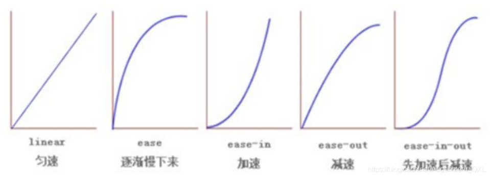

# 1 属性的过渡 (transition)

过渡（transition）是CSS3中具有颠覆性的特征之一，我们可以在不使用Flash动画或JavaScript的情况下，当元素从一种样式变换为另一种样式时为元素添加效果。
过渡动画：是从一个状态渐渐的过渡到另外一个状态 可以让我们页面更好看，更动感十足，虽然低版本浏览器不支持（ie9以下版本）但是不会影响页面布局。

我们现在经常和 :hover 一起搭配使用。

Eine Transition stellt den weichen, d.h. zeitlich linearen, Übergang von einem Zustand einer Eigenschaft in einen anderen Zustand her. 


## 1.1 transition 的属性
「定义」过渡transition是一个复合属性，包括transition-property、transition-duration、transition-timing-function、transition-delay这四个子属性。通过这四个子属性的配合来完成一个完整的过渡效果。

```css
transition: 要过渡的属性 花费时间 运动曲线 何时开始;

或者
transition-property: 过渡属性(默认值为all)
transition-duration: 过渡持续时间(默认值为0s)
transiton-timing-function: 过渡函数(默认值为ease函数)
transition-delay: 过渡延迟时间(默认值为0s)

```

过渡的口诀：谁做过渡给谁加
1. 属性：想要变化的css属性，宽度高度背景颜色内外边距都可以。如果想要所有的属性都变化过渡，写一个all就可以。
2. 花费时间：单位是秒（必须写单位）比如 0.5s
3. 运动曲线：默认是ease （可以省略）
   1. 
4. 何时开始：单位是秒（必须写单位）可以设置延迟触发时间默认是Os （可以省略）

```css
.test{
    height: 100px;
    width: 100px;
    background-color: pink;
    transition-duration: 3s;
/*     以下三值为默认值，稍后会详细介绍 */
    transition-property: all;
    transition-timing-function: ease;
    transition-delay: 0s;
}    
.test:hover{
    width: 500px;
}
~~~html
<div class="test"></div>
```

### 1.1.1 过渡属性 transition-property
-   值: none | all | `<transition-property>[,<transition-property>]`
    -   none: 没有指定任何样式
    -  all: 默认值，表示指定元素所有支持transition-property属性的样式
    -  width: https://mp.weixin.qq.com/s?__biz=MzU0Mjg0MzI1Nw==&mid=2247484170&idx=1&sn=7e524ed872a5242e3cd5c9595afb7ff1&chksm=fb15cb1ccc62420a5ee1ed5735e069a63fe04512e6d219effc28d794c8a7a323cfc44e9bc325&scene=178&cur_album_id=1517142067985088512#rd
    - background: 见上面
    - width, background: 见上面 
-   初始值: all
-   应用于: 所有元素
-   继承性: 无
-   `<transition-property>`: 可过渡的样式，可用逗号分开写多个样式


### 1.1.2 过渡持续时间 transition-duration
Demo 见 https://mp.weixin.qq.com/s?__biz=MzU0Mjg0MzI1Nw==&mid=2247484170&idx=1&sn=7e524ed872a5242e3cd5c9595afb7ff1&chksm=fb15cb1ccc62420a5ee1ed5735e069a63fe04512e6d219effc28d794c8a7a323cfc44e9bc325&scene=178&cur_album_id=1517142067985088512#rd

-   值: `<time>[,<time>]*`
-   初始值: 0s
-   应用于: 所有元素
-   继承性: 无
-   [注意]该属性不能为负值
-   [注意]若该属性为0s则为默认值，若为0则为无效值。所以必须带单位
-   [注意]该值为单值时，即所有过渡属性都对应同样时间；该值为多值时，过渡属性按照顺序对应持续时间

### 1.1.3 过渡时间函数 timing-function
过渡时间函数用于定义元素过渡属性随时间变化的过渡速度变化效果

-   值: `<timing-function>[,<timing-function>]*`
-   初始值: ease
-   应用于: 所有元素
-   继承性: 无

**「取值」**:  过渡时间函数共三种取值，分别是关键字、steps函数和bezier函数
**「关键字」**: 
其实是bezier函数或steps函数的特殊值
- `ease: 开始和结束慢，中间快。  
- linear: 匀速。   
- ease-in: 开始慢。   
- ease-out: 结束慢。   
- ease-in-out: 和ease类似，但比ease幅度大。`


## 1.2 复合写法
```css
transition: 要过渡的属性 花费时间 运动曲线 何时开始;
```

- transition的这四个子属性之间不能用逗号隔开，只能用空格隔开。因为逗号隔开的代表不同的属性(transition属性支持多值，多值部分稍后介绍)；而空格隔开的代表不同属性的四个关于过渡的子属性。
- 过渡transition的这四个子属性只有transition-duration是必需且不能为0。
- transition-duration和transition-delay都是时间
    - 当两个时间同时出现时，第一个是transition-duration，第二个是transition-delay；
    - 当只有一个时间时，它是transition-duration，而transition-delay为默认值0s


```css
div {
    width: 200px;
    height: 100px;
    background-color: pink;
    /* transition: width .5s, height .5s; */
    transition: all .5s;
    /*代表持续时间为2s，延迟时间为默认值0s*/  
    transition；2s;
    /*代表持续时间为1s，延迟时间为2s*/  
    transition: 1s 2s;
}
div:hover {
    width: 400px;
    height: 200px;
    background-color: skyblue;
}


=================
<div class="test"></div>

```

```css
<head>
   <style>
        div {
            width: 200px;
            height: 100px;
            background-color: pink;
            /* transition: 变化的属性 花费时间 运动曲线 何时开始; */
            /* 如果想要写多个属性，利用逗号进行分割 */
            transition: width 0.5s, height 0.5s;
            /* 如果想要多个属性都变化，属性写all就可以了 */
            transition: all 0.5s;
        }

        div:hover {
            width: 400px;
            height: 200px;
            background-color: red;
        }
    </style>
</head>

<body>
    <div></div>
</body>
```


## 1.3 例子
Folgend sehen Sie ein komplexeres Beispiel das eine Transition im CSS verwendet, um ein Accordion zu implementieren (ausklappbaren Seitenteil), wenn die Möglichkeit des details-Tags nicht ausreicht.


Das Beispiel arbeitet folgendermaßen:
1.  Definiere zwei verschachtelte Div-Elemente wobei das innere anfangs die Höhe 0em hat
2.  Im ausgeklappten Zustand soll das innere Div-Element 5.5em Einheiten hoch sein
3.  Die Transition in der vorletzten Zeile des CSS besagt, dass die Höhe binnen einer halben Sekunde linear verändert wird
4.  Durch Druck des Links "Referenzen" wird in die Pseudoklasse .optarea:target verzweigt
5.  Der Link HIDE verzweigt wieder in die Klasse .optarea

```html
    <div id="accordion">
    <p>
    <a href="index.html#details" class="upper">Referenzen</a> </p>
    <div class="optarea" id="details">
    <ol>
        <li>
        http://www.experimentalchemie.de/01-d-02.htm (Zugriff am 26.11.13)
        </li>
        <li>
        http://de.wikipedia.org/wiki/Schwarzpulver (Zugriff am 26.11.13)
        </li>         
    </ol>
    <a href="index.html#" class="upper, small">HIDE</a>
    </div>
    </div>
```

```css
  #accordion {border-style: solid; border-color: #555555; border-width: 1px;}
  .optarea {height: 0px; overflow: hidden; width: 500px;}
  .optarea {transition: height 0.5s;}
  .optarea:target {height: 5.5em;}
```

# 2 动画 animation

动画( animation ) 是 CSS3 中具有颠覆性的特征之一，可通过设置多个节点来精确控制一个或一组动画，常用来实现复杂的动画效果。
相比较过渡，动画可以实现更多变化，更多控制，连续自动播放等效果。

## 2.1 动画的基本使用

分为两步：

1. 定义动画 (动画序列 `%α`)
2. 使用/调用动画

### 2.1.1 用keyframs定义一个动画

```css
 /* 1. 定义动画 */
@keyframes move {
    /*开始状态*/
    0% {
        transform: translateX(0px);
    }
    /*结束状态*/
    100% {
        transform: translateX(1000px);
    }
}
```

### 2.1.2 调用动画

```css
div {
    width: 200px;
    height: 200px;
    background-color: pink;
    /* 2. 调用动画 */
    /* 动画名称 */
    animation-name: move;
    /* 持续时间 */
    animation-duration: 5s;
}
```

## 2.2 动画序列 (@keyframes 规则)

- 0% 是动画的开始，100% 是动画的完成。这样的规则就是动画序列。
- 在 @keyframes 中规定某项 CSS 样式，就能创建由当前样式逐渐改为新样式的动画效果。
- 动画是使元素从一种样式逐渐变化为另一种样式的效果。您可以改变任意多的样式任意多的次数。
- 请用百分比来规定变化发生的时间，或用关键词"from"和“to”，等同于0%和100%。

注意:

1. 可以做多个状态的变化 `keyframes` 关键帧
2. 百分比必须是整数
3. 百分比是总时间 `animation-duration` 的划分
4. 不怎么用 left, top. 而 常用 transform: translate(). 因为 Das ist performanter.

@keyframes 规则用来定义动画各个阶段的属性值，类似于 flash 动画中的关键帧，语法格式如下：
语法说明如下：
animationName：表示动画的名称；
from：定义动画的开头，相当于 0%；
percentage：定义动画的各个阶段，为百分比值，可以添加多个；
to：定义动画的结尾，相当于 100%；
properties：不同的样式属性名称，例如 color、left、width 等等。

```css
@keyframes animationName {
    from {
        properties: value;
    }
    percentage {
        properties: value;
    }
    to {
        properties: value;
    }
}
// 或者
@keyframes animationName {
    0% {
        properties: value;
    }
    percentage {
        properties: value;
    }
    100% {
        properties: value;
    }
}
```

```css
下面我们来看一个简单的 @keyframes 规则示例：

@keyframes ball {
    0% { top: 0px; left: 0px;}
    25% { top: 0px; left: 350px;}
    50% { top: 200px; left: 350px;}
    75% { top: 200px; left: 0px;}
    100% { top: 0px; left: 0px;} 
}
```

```css
<style>  
    div {  
      width: 100px;  
      height: 100px;  
      background-color: aquamarine;  
      animation-name: move;  
      animation-duration: 0.5s;  
    }  
  
    @keyframes move{  
      0% {  
        transform: translate(0px)  
      }  
      100% {  
        transform: translate(500px, 0)  
      }  
    }  
  </style>
```

## 2.3 动画常用属性
http://c.biancheng.net/css3/animation.html

| 属性                          | 描述                                        |
| --------------------------- | ----------------------------------------- |
| `keyframes`                 | 规定动画。                                     |
| `animation`                 | 所有动画属性的简写属性,除了animation-play-state属性。     |
| `animation-name`            | (必须的) 规定@keyframes动画的名称. . animation-duration 属性的默认值为 0, 无动画效果. 要绑定到 HTML 元素的动画名称，可以同时绑定多个动画，动画名称之间使用逗号进行分隔.  none 表示表示无动画效果 |
| `animation-duration`        | (必须的) 规定动画完成一个周期所花费的秒或毫秒，默认是0。        |
| `animation-timing-function` | 规定动画的速度曲线，默认是“ease” .                     |
| `animation-delay`           | 规定动画何时开始，默认是0.                            |
| `animation-iteration-count` | 规定动画被播放的次数，默认是1，还有infinite                |
| `animation-direction`       | 规定动画是否在下一周期逆向播放，默认是 "normal",alternate逆播放 |
| `animation-play-state`      | 设置动画是否正在运行或暂停。默认是"running",还有"paused".    |
| `animation-fill-mode`       | 规定动画结束后状态,保持forwards回到起始backwards         |

```
name -- Name --/* Zu selektierendes Keyframe */
duration -- Dauer --/* sec oder msec als Dauer der Animation */
timing-function -- Timing-Funktion -- /* die Geschwindigkeitskurve, z. B. nichtlinear */
delay -- Verzögerung -- /* Wartezeit bis Animationsbeginn */
iteration-count -- Iterationen --/* Anzahl der Animationsduchläufe */
direction -- Richtung --/* normale, umgekehrte oder wiederholende Animation */
fill-mode -- Füll-Modus -- /* Standard-Werte der animierten Eigenschaften */
play-state -- Abspielzustand --/* Flag: spielt oder pausiert z. Z. */;
```

```css
div {  
  width: 100px;  
  height: 100px;  
  background-color: aquamarine;  
  /* 动画名称 */  
  animation-name: move;  
  /* 动画花费时长 */  
  animation-duration: 2s;  
  /* 动画速度曲线 */  
  animation-timing-function: ease-in-out;  
  /* 动画等待多长时间执行 */  
  animation-delay: 2s;  
  /* 规定动画播放次数 infinite: 无限循环 */  
  animation-iteration-count: infinite;  
  /* 是否逆行播放 */  
  animation-direction: alternate;  
  /* 动画结束之后的状态 */  
  animation-fill-mode: forwards;  
}  
  
div:hover {  
  /* 规定动画是否暂停或者播放 */  
  animation-play-state: paused;  
}
```

### 2.3.1 动画简写属性

```css
animation: animation-name animation-duration animation-timing-function animation-delay animation-iteration-count animation-direction animation-fill-mode animation-play-state;
animation: 动画名称 持续时间 运动曲线 何时开始 播放次数 是否反方向 动画起始或者结束的状态;
animation: myfirst 5s linear 2s infinite alternate;
```

知识要点
- 简写属性里面不包含 `animation-play-state`
- 暂停动画: `animation-play-state: puased;`
- 经常和鼠标经过等其他配合使用想要动画走回来，而不是直接跳回来: `animation-direction: alternate`
- 盒子动画结束后，停在结束位置:  `animation-fill-mode: forwards`


### 2.3.2 速度曲线细节 animation-timing-function

`animation-timing-function`：规定动画的速度曲线，默认是“ease”. 用来设置动画播放的速度曲线，通过速度曲线的设置可以使动画播放的更为平滑

| **值**       | **描述**                  |
| ----------- | ----------------------- |
| linear      | 动画从头到尾的速度是相同的。匀速        |
| ease        | 默认。动画以低速开始，然后加快，在结束前变慢。 |
| ease-in     | 动画以低速开始。                |
| ease-out    | 动画以低速结束。                |
| ease-in-out | 动画以低速开始和结束。             |
| steps()     | 指定了时间函数中的间隔数量（步长）       |
|cubic-bezier(n, n, n, n)	| 使用 cubic-bezier() 函数来定义动画的播放速度，参数的取值范围为 0 到 1 之间的数值 |

```css
/*打字机效果*/  
div {  
  width: 0px;  
  height: 50px;  
  line-height: 50px;  
  white-space: nowrap;  
  overflow: hidden;  
  background-color: aquamarine;  
  animation: move 4s steps(24) forwards;  
}  
  
@keyframes move {  
  0% {  
    width: 0px;  
  }  
  
  100% {  
    width: 480px;  
  }  
}
```

```html
<!DOCTYPE html>
<html>
<head>
    <style>
        @keyframes ball {
            0% {left: 0px;}
            50% {left: 350px;}
            100% {left: 0px;}
        }
        div {
            width: 100px;
            height: 100px;
            border-radius: 50%;
            border: 3px solid black;
            text-align: center;
            line-height: 100px;
            position: relative;
            animation-name: ball;
            animation-duration: 2s;
        }
        .one {
            animation-timing-function: ease;
        }
        .two {
            animation-timing-function: ease-in;
        }
        .three {
            animation-timing-function: ease-out;
        }
        .four {
            animation-timing-function: ease-in-out;
        }
    </style>
</head>
<body>
    <div class="one">ease</div>
    <div class="two">ease-in</div>
    <div class="three">ease-out</div>
    <div class="four">ease-in-out</div>
</body>
</html>
```

运行结果如下图所示：  


### 2.3.3 animation-fill-mode
animation-fill-mode 属性用来设置当动画不播放时（开始播放之前或播放结束之后）动画的状态（样式），属性的可选值如下：

|值	|描述|
|---|---|
|none	|不改变动画的默认行为|
|forwards	|当动画播放完成后，保持动画最后一个关键帧中的样式|
|backwards	|在 animation-delay 所指定的时间段内，应用动画第一个关键帧中的样式|
|both|	同时遵循 forwards 和 backwards 的规则|

```html
<!DOCTYPE html>
<html>
<head>
    <style>
        @keyframes box {
            0% {transform: rotate(0);}
            50% {transform: rotate(0.5turn);}
            100% {transform: rotate(1turn);}
        }
        div {
            width: 100px;
            height: 100px;
            border-radius: 50%;
            float: left;
            border: 3px solid black;
            text-align: center;
            line-height: 100px;
            position: relative;
            animation-name: box;
            animation-duration: 2s;
            animation-iteration-count: 1;
            animation-fill-mode: forwards;
        }
    </style>
</head>
<body>
    <div>forwards</div>
</body>
</html>
```

### 2.3.4 animation-delay

animation-delay 属性用来定义动画开始播放前的延迟时间，单位为秒或者毫秒，属性的语法格式如下：
animation-delay: time;

其中参数 time 就是动画播放前的延迟时间，参数 time 既可以为正值也可以为负值。参数值为正时，表示延迟指定时间开始播放；参数为负时，表示跳过指定时间，并立即播放动画。

```html
<!DOCTYPE html>
<html>
<head>
    <style>
        @keyframes ball {
            0% {left: 0px;}
            50% {left: 350px;}
            100% {left: 0px;}
        }
        div {
            width: 100px;
            height: 100px;
            border-radius: 50%;
            border: 3px solid black;
            text-align: center;
            line-height: 100px;
            position: relative;
            animation-name: ball;
            animation-duration: 2s;
        }
        .one {
            animation-delay: 0.5s;
        }
        .two {
            animation-delay: -0.5s;
        }
    </style>
</head>
<body>
    <div class="one">0.5s</div>
    <div class="two">-0.5s</div>
</body>
</html>
```


### 2.3.5 animation-direction
animation-direction 属性用来设置是否轮流反向播放动画，属性的可选值如下：

|值	|描述|
|---|---|
|normal	|以正常的方式播放动画|
|reverse	|以相反的方向播放动画|
|alternate	|播放动画时，奇数次（1、3、5 等）正常播放，偶数次（2、4、6 等）反向播放|
|alternate-reverse	|播放动画时，奇数次（1、3、5 等）反向播放，偶数次（2、4、6 等）正常播放|


## 2.4 整体示例

### 2.4.1 例子1

需求：我们想页面一打开，一个盒子就从左边走到右边

```css
<head> 
   <style>
        /* 需求：我们想页面一打开，一个盒子就从左边走到右边 */
        /* 1.定义动画 */

        @keyframes move {
            /* 开始状态 */
            0% {
                transform: translateX(0px);
            }
            /* 结束状态 */
            100% {
                transform: translateX(1000px);
            }
        }

        div {
            width: 200px;
            height: 200px;
            background-color: pink;
            /* 使用动画 */
            animation-name: move;
            /* 持续时间 */
            animation-duration: 2s;
        }
    </style>
</head>

<body>
    <div></div>
</body>
```

from to 语法

```html
<head>  
   <style>
        /* 需求：我们想页面一打开，一个盒子就从左边走到右边 */
        /* 1.定义动画 */

        @keyframes move {
            from {
                transform: translate(0, 0);
            }
            to {
                transform: translate(1000px, 0);
            }
        }

        div {
            width: 200px;
            height: 200px;
            background-color: pink;
            /* 使用动画 */
            animation-name: move;
            /* 持续时间 */
            animation-duration: 2s;
        }
    </style>
</head>

<body>
    <div></div>
</body>
```


### 2.4.2 例子2
Ein kleines Beispiel soll einige Möglichkeiten der Animations-Eigenschaft veranschaulichen:

```html
<!DOCTYPE html>
  <html>
    <head>
      <title>CSS Level 3 Animations-Tests</title>
      <style>
        div {
          width: 200px;
          height: 50px;
          padding: 10px;
          font-size: 0.7em;
          font-family: sans-serif;}
        .shadowed {
          border: 2px solid;
          background-color: yellow;
          box-shadow: 12px 12px 3px #888888;}
        .animated {
          -webkit-animation-name: myanim; /* Chrome, Safari, Opera */
          -webkit-animation-duration: 1s;
          -webkit-animation-iteration-count: infinite;
          -webkit-animation-direction: alternate;
          animation-name: myanim;
          animation-duration: 1s;
          animation-iteration-count: infinite;
          animation-direction: alternate;}
        /* Chrome, Safari, Opera */
        @-webkit-keyframes myanim {
            from {box-shadow: 0px 0px 3px #888888;}
            to {box-shadow: 0px 60px 30px #888888;}}
        /* Standard syntax */
        @keyframes myanim {
          from {box-shadow: 0px 0px 3px #888888;}
          to {box-shadow: 0px 60px 30px #888888;}}
  </style></head>
  <body><div class="shadowed animated"/></body>
  </html>
```


### 2.4.3 例子3  Parallax-Effekt.
Ein weiterer Animationseffekt ist der Parallax-Effekt. Hierbei werden verschiedene Objekte auf verschiedenen Ebenen voreinander positioniert und mit unterschiedlicher Geschwindigkeit zueinander bewegt. Durch die Bewegung entsteht für den Betracher Räumlichkeit.

```css
body, html {
    height: 100%;
}

.parallax {
    /* The image used */
    background-image: url("parallax.jpg");

    /* Full height */
    height: 100%;

    /* Create the parallax scrolling effect */
    background-attachment: fixed;
    background-position: center;
    background-repeat: no-repeat;
    background-size: cover;
}
```