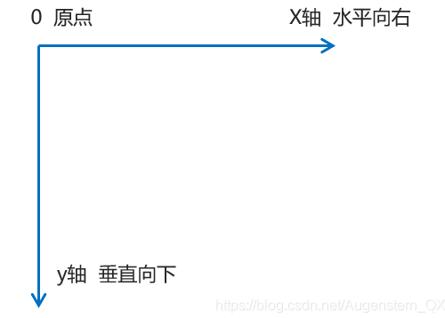
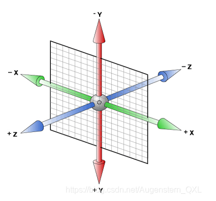
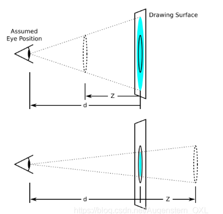
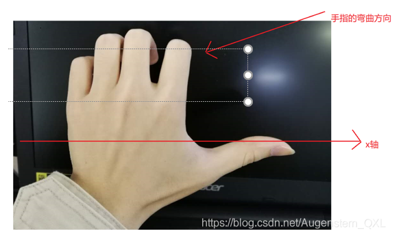
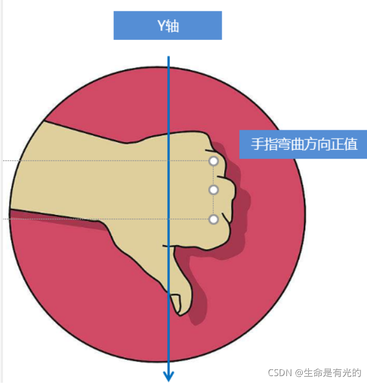
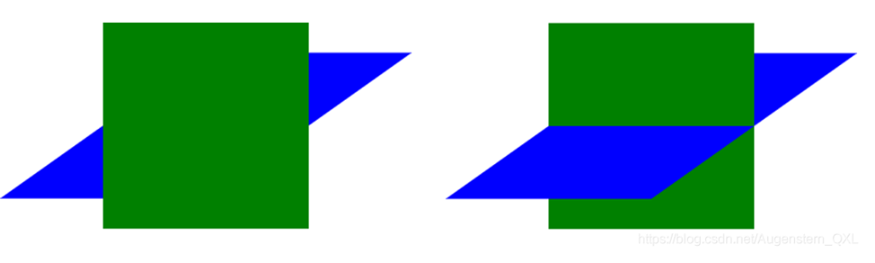

# 1 Transform, transition, animation 区别
1 transform
Transforms sind veränderungen von Form, Größe, Ausrichtung und Position eines Elementes.
Das property transform erwartet eine von vier Funktionen und jede Funktion einen oder zwei Argumente. translate() scale() rotate() skew()

2 transition
Transitions sind Veränderungen über einen Zeitraum. Für eine transition sind also ein Anfangs- und ein Endzustand notwendig.
Das property transition erwartet ein oder mehrere properties. Zusätzlich wird eine Zeitspanne erwartet und eine timing-function.
Fast alle properties lassen sich für transition nutzen (width, font-size, color, ...), dies sind die animatable properties. Allerdings sind nicht alle animatable properties auch wirklich für transition geeignet.
Drei properties eigenen sich am besten für transition und animation die animation-friendly properties: - opacity - filter - transform


3 Animation
Eine CSS-Animation hat immer zwei Komponenten.
animation-call
@keyframes, animation-declaration

Werden mehrere Animationen auf dasselbe property angewandt, dann überschreibt die letzte Animation alle vorherigen (sequentielle Abarbeitung). Eine Animation kann entweder beim Laden oder beim Wechsel eines CSS-Property's (z.B. beim :hover) stattfinden.

Keyframes sind unterschiedliche Stadien einer Animation und sie haben einen Bezeichner (z.B. slide).

# 2 2D 转换 transform

转换（`transform`）是 CSS3 中具有颠覆性的特征之一，可以实现元素的位移、旋转、缩放等效果。

2D转换是改变标签在二维平面上的位置和形状, 转换可以理解为变形。
- 移动：`translate`
- 旋转：`rotate`
- 缩放：`scale`
- skew:  `transform: skew(10deg, 0); /* 10 Pixel auf X-Achse, 0 Pixel auf Y-Achse */`
- matrix

## 2.1 总结

1. 转换transform 我们简单理解就是变形 有2D 和 3D 之分
2. 我们暂且学了三个 分别是 位移 旋转 和 缩放
3. 2D 移动 translate(x, y) 最大的优势是不影响其他盒子， <mark>里面参数用%，是相对于自身宽度和高度来计算的 </mark> (When using percentage in translate, it refers to width or height of itself. )
    1. you can use vw and vh to translate based on the viewport size. https://stackoverflow.com/questions/11160227/translate-x-and-y-percentage-values-based-on-elements-height-and-width
    2. `@keyframes bubbleup { 0% { transform: translateY(100vh); } 100% { transform: translateY(0vh); }}`
4. 可以分开写比如 translateX(x) 和 translateY(y)
5. 2D 旋转 rotate(度数) 可以实现旋转元素 度数的单位是deg
6. 2D 缩放 sacle(x,y) 里面参数是数字 不跟单位 可以是小数 最大的优势 不影响其他盒子
7. 设置转换中心点 transform-origin : x y; 参数可以百分比、像素或者是方位名词
8. l当我们进行综合写法，同时有位移和其他属性的时候，记得要将位移放到最前

## 2.2 二维坐标系



## 2.3 移动 transform: translate(x, y)

2D移动是2D转换里面的一种功能，可以改变元素在页面中的位置，**类似**定位。

语法

```css
transform: translate(x, y);
transform: translateX(x);
transform: translateY(y);

transform:translate(100px,100px); /* 如果只移动X轴 */ 
transform:translate(100px,0); 
translateX(100px);
```


重点
- 定义 2D 转换中的移动，沿着X和Y轴移动元素. 2D 移动 translate(x, y) 最大的优势是不影响其他盒子，
- 对行内标签没有效果
- 可以分开写比如 translateX(x) 和 translateY(y)
- translate 最大的优点：不会影响到其他元素的位置
- 参数 `x, y` 可以是百分数，为盒子自身的宽度或高度。 translate 中的百分比单位是相对于 本身元素 的宽度和高度来计算的:  `trainslate:(50%，50%)`
    - you can use vw and vh to translate based on the viewport size. https://stackoverflow.com/questions/11160227/translate-x-and-y-percentage-values-based-on-elements-height-and-width
    - `@keyframes bubbleup { 0% { transform: translateY(100vh); } 100% { transform: translateY(0vh); }}`


```css
div {
  background-color: lightseagreen;
  width: 200px;
  height: 100px;
  /* 平移 */
  /* 水平垂直移动 100px */
  /* transform: translate(100px, 100px); */

  /* 水平移动 100px */
  /* transform: translate(100px, 0) */

  /* 垂直移动 100px */
  /* transform: translate(0, 100px) */

  /* 水平移动 100px */
  /* transform: translateX(100px); */

  /* 垂直移动 100px */
  transform: translateY(100px);
  /*百分比用法*/
  transform: translateY(100%);  
   /*vh 用法*/
  transform: translateY(40vh);  
  transform: translateX(70vh);
}
```

### 2.3.1 让盒子实现水平和垂直居中

```css
/*子绝父相*/
position: absolute;
top: 50%;
left: 50%;
transform: translate(-50%, -50%);


========================
div {  
    position: relative;  
    width: 500px;  
    height: 500px;  
    background-color: pink;  
    /* 1. 我们tranlate里面的参数是可以用 % */  
    /* 2. 如果里面的参数是 % 移动的距离是 盒子自身的宽度或者高度来对比的 */  
    /* 这里的 50% 就是 50px 因为盒子的宽度是 100px */  
    /* transform: translateX(50%); */  
    }  
          
p {  
    position: absolute;  
    top: 50%;  
    left: 50%;  
    width: 200px;  
    height: 200px;  
    background-color: purple;  
    /1.* margin-top: -100px;  
    margin-left: -100px; */  
    
    /2.* translate(-50%, -50%)    
      盒子往上走自己高度的一半   */  
    transform: translate(-50%, -50%);  
  }  
          
span {  
    /* translate 对于行内元素是无效的 */  
    transform: translate(300px, 300px);  
     }

```


## 2.4 旋转 transform: rotate()

值为正数则顺时针旋转，为负数则逆时针旋转。

1. rotate 里面跟度数，单位是 deg 比如 rotate(45deg)
2. **角度为正时，顺时针，负时，为逆时针**
3. 默认旋转的中心点是元素的中心点

语法：

```css
transform: rotate(45deg);

/* 单位是：deg */
img:hover {
  transform: rotate(360deg)
}

```

例子：

```html
<head>
   <style>
        img {
            width: 150px;
            border-radius: 50%;
            border: 5px solid pink;
            /* 过渡写到本身，谁做动画给谁加 */
            transition: all 0.3s;
        }

        img:hover {
            transform: rotate(360deg);
        }
    </style>
</head>

<body>
    
</body>
```

### 2.4.1 2D转换中心点 transform-origin

我们可以通过设置 `transform-origin` 设置元素转换的中心点。

语法

```css
transform-origin: x y;
```

 重点

- 注意后面的参数 x 和 y 用空格隔开
- x y 默认转换的中心点是元素的中心点（50% 50%）
- 还可以给 x y 设置像素或者方位名词（top bottom left right center）

例子

```css
<head>
   <style>
        div {
            width: 200px;
            height: 200px;
            background-color: pink;
            margin: 100px auto;
            transition: all 1s;
            /* 1.可以跟方位名词 ,以左下角为轴进行旋转*/
            transform-origin: left bottom;
        }

        div:hover {
            transform: rotate(360deg);
        }
    </style>
</head>

<body>
    <div></div>
</body>
```

## 2.5 缩放 transform: scale(x, y)

缩放：`scale`,只要给元素添加上了这个属性就能控制它放大还是缩小

```css
 transform: scale(x, y);
```

- 注意其中的x和y用逗号分割
- sacle缩放最大的优势：
    - 不占空间. 
    - 可以设置转换中心点缩放，默认以中心点缩放的，而且不影响其他盒子
    - 可以配合 `transform-origin` 使用，改变缩放中心。

### 2.5.1 例子
transform: scale(1, 1): 宽高都放大一倍，相当于没有放大
transform: scale(2, 2): 宽和高都放大了二倍
transform: scale(2): 如果只写了一个参数，第二个参数就和第一个参数一致
transform: scale(0.5, 0.5): 缩小

- 参数大于 `1` 则放大，小于 `1` 则缩小。
- `x, y` 不跟单位的话，是指缩放的倍数。

  ```css
  transform: scale(2,1);

   div:hover {  
    /* 注意，数字是倍数的含义，所以不需要加单位 */  
    /* transform: scale(2, 2) */  
     
    /* 实现等比缩放，同时修改宽与高 */  
    /* transform: scale(2) */  
     
    /* 小于 1 就等于缩放*/  
    transform: scale(0.5, 0.5)  
   }

  ```


```css
<head>
   <style>
        div {
            width: 200px;
            height: 200px;
            background-color: pink;
            margin: 100px auto;
        }

        div:hover {
            /* 1.里面写的数字不跟单位 就是倍数的意思 1就是1倍，2就是2倍 */
            transform: scale(2, 2);
        }
    </style>
</head>

<body>
    <div></div>
</body>
```

## 2.6 2D 转换综合写法

注意：
1. 同时使用多个转换，其格式为： `transform: translate(), rotate() scale()`
2. 其顺序会影转换的效果。（先旋转会改变坐标轴方向）
3. 当我们同时有位移和其他属性的时候，记得要将位移放到最前.

```css
<head>   
   <style>
        div {
            width: 200px;
            height: 200px;
            background-color: pink;
            transition: all .5s;
        }

        div:hover {
            /* 我们同时有位移和其他属性，我们需要把位移放到最前面 位移，旋转，缩放*/
            transform: translate(150px, 50px) rotate(180deg) scale(1.2);
        }
    </style>
</head>

<body>
    <div></div>
</body>
```


# 3 3D 转换

我们生活的环境是3D的，照片就是3D物体在2D平面呈现的例子.

3D转换的特点：
- 近大远小。
- 物体后面遮挡不可见

当我们在网页上构建3D效果的时候参考这些特点就能产出3D效果。

## 3.1 三维坐标系

三维坐标系其实就是指立体空间，立体空间是由3个轴共同组成的。


- x轴：水平向右 **注意： x 右边是正值，左边是负值**
- y轴：垂直向下 **注意： y 下面是正值，上面是负值**
- z轴：垂直屏幕 **注意： 往外面是正值，往里面是负值**

## 3.2 3D 转换知识要点
3D 转换我们主要学习工作中最常用的 3D 位移 和 3D 旋转
-   `3D` 位移：`translate3d(x, y, z)`
-   `3D` 旋转：`rotate3d(x, y, z)`
-   `透视` ：`perspctive`
-   `3D`呈现 `transfrom-style`

## 3.3 3D位移translate3d
```css
  transform: translate3d(100px, 100px, 100px)  
  /* 注意：x, y, z 对应的值不能省略，不需要填写用 0 进行填充 */  
  transform: translate3d(100px, 100px, 0)
```

3D移动在2D移动的基础上多加了一个可以移动的方向，就是z轴方向

- translform:translateX(100px)：仅仅是在x轴上移动
- translform:translateY(100px)：仅仅是在Y轴上移动
- translform:translateZ(100px)：仅仅是在Z轴上移动（注意：translateZ一般用px单位）
- transform:translate3d(x,y,z)：其中 x、y、z 分别指要移动的轴的方向的距离
-  注意：x, y, z 对应的值不能省略，不需要填写用 0 进行填充

因为z轴是垂直屏幕，由里指向外面，所以默认是看不到元素在z轴的方向上移动

## 3.4 透视perspective

透视：在2D平面产生近大远小视觉立体，但是只是效果二维的. 如果想要在网页产生3D效果需要透视（理解成3D物体投影在2D平面内）
- 模拟人类的视觉位置，可认为安排一只眼睛去看
- 透视我们也称为视距：视距就是人的眼睛到屏幕的距离
- 距离视觉点越近的在电脑平面成像越大，越远成像越小
- 透视的单位是像素

透视写在被观察元素的父盒子上面的


知识要点
- 透视需要写在被视察元素的父盒子上面
- d：就是视距，视距就是一个距离人的眼睛到屏幕的距离。
- z：就是 z轴，物体距离屏幕的距离，z轴越大（正值） 我们看到的物体就越大

### 3.4.1 perspective的语法
```css
body {
  /*透视需要写在被视察元素的父盒子上面 */
  perspective: 1000px;
}
```

### 3.4.2 translateZ
- perspecitve 给父级进行设置视距的，translateZ 给 子元素进行设置不同的大小  
- translform:translateZ(100px)：仅仅是在Z轴上移动。
-   有了透视，就能看到translateZ 引起的变化了
    -   translateZ：近大远小
    -   translateZ：往外是正值
    -   translateZ：往里是负值

## 3.5 3D旋转 rotate3d

### 3.5.1 语法
3D旋转：3D旋转指可以让元素在三维平面内沿着 x轴，y轴，z轴或者自定义轴进行旋转。
- transform: rotateX(45deg) ：沿着X轴正方向旋转45度
- transform: rotateY(45deg) ：沿着Y轴正方向旋转45度
- transform: rotateZ(45deg) ：沿着Z轴正方向旋转45度
- transform: rotate3d(x,y,z,deg) ：沿着自定义轴旋转 deg为角度(了解即可)

xyz是表示旋转轴的矢量，是标示你是否希望沿着该轴旋转，最后一个标示旋转的角度。

```css
/*沿着X轴旋转45deg*/
transform: rotate3d(1,0,0,45deg) 
/*沿着对角线旋转45deg*/
transform: rotate3d(1,1,0,45deg) 
```


### 3.5.2 rotateX: 左手准则

-   左手的手拇指指向 x轴的正方向
-   其余手指的弯曲方向就是该元素沿着x轴旋转的方向



```css
div {
  /*透视写在被视察元素的父盒子上面 */
  perspective: 300px;
}
/*被观察元素*/
img {
  display: block;
  margin: 100px auto;
  transition: all 1s;
}

img:hover {
  transform: rotateX(-45deg)
}
```

### 3.5.3 rotateY: 左手准则

-   左手的手拇指指向 y轴的正方向
-   其余手指的弯曲方向就是该元素沿着y轴旋转的方向（正值）



```css
div {  
  perspective: 500px;  
}  
  
img {  
  display: block;  
  margin: 100px auto;  
  transition: all 1s;  
}  
  
img:hover {  
  transform: rotateY(180deg)  
}
```

### 3.5.4 rotateZ
```css
div {  
  perspective: 500px;  
}  
  
img {  
  display: block;  
  margin: 100px auto;  
  transition: all 1s;  
}  
  
img:hover {  
  transform: rotateZ(180deg)
```

### 3.5.5 rotate3d
-   transform: rotate3d(x, y, z, deg) -- 沿着自定义轴旋转 deg 为角度
-   x, y, z 表示旋转轴的矢量，是标识你是否希望沿着该轴进行旋转，最后一个标识旋转的角度
    -   transform: rotate3d(1, 1, 0, 180deg) -- 沿着对角线旋转 45deg
    -   transform: rotate3d(1, 0, 0, 180deg) -- 沿着 x 轴旋转 45deg

```
div {
  perspective: 500px;
}

img {
  display: block;
  margin: 100px auto;
  transition: all 1s;
}

img:hover {
  transform: rotate3d(1, 1, 0, 180deg)
}

```


## 3.6 3D呈现transform-style


- 这个属性很重要, 控制子元素是否开启三维立体环境
- transform-style: flat 子元素不开启3d立体空间 默认的
- transform-style: preserve-3d 子元素开启立体空间
- 代码写给父级，但是影响的是子盒子



```html
<body>  
    <div class="box">  
        <div></div>  
        <div></div>  
    </div>  
</body>
```

```css
<style>  
    body {  
        perspective: 500px;  
        }  
          
    .box {  
        position: relative;  
        width: 200px;  
        height: 200px;  
        margin: 100px auto;  
        transition: all 2s;  
        /* 让子元素保持3d立体空间环境 */  
        transform-style: preserve-3d;  
        }  
          
    .box:hover {  
        transform: rotateY(60deg);  
    }  
          
    .box div {  
        position: absolute;  
        top: 0;  
        left: 0;  
        width: 100%;  
        height: 100%;  
        background-color: pink;  
    }  
          
    .box div:last-child {  
        background-color: purple;  
        transform: rotateX(60deg);  
    }  
</style>
```