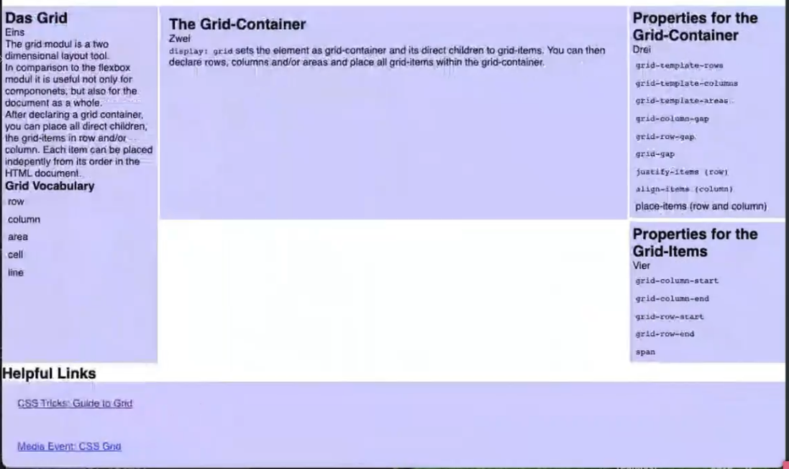
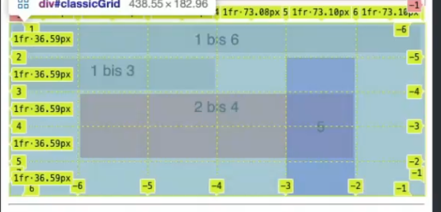
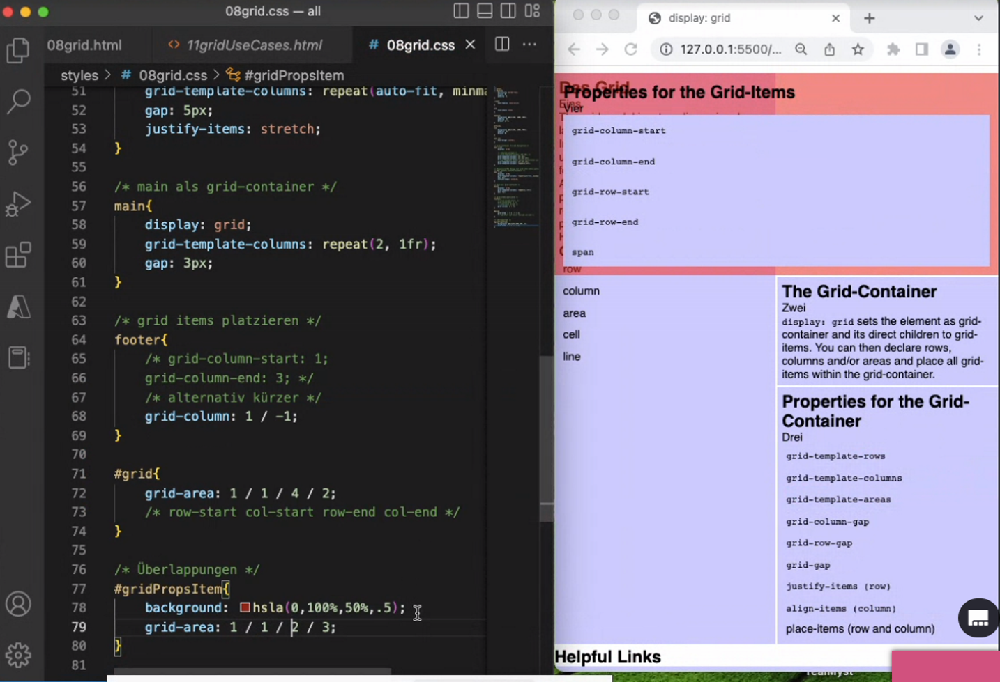

# 1 帖子
https://css-tricks.com/snippets/css/complete-guide-grid/
https://www.mediaevent.de/css/grid.html
https://www.youtube.com/watch?v=qNtJ5p3h2A4

中文帖子
https://juejin.cn/post/6854573220306255880#heading-2
https://www.ruanyifeng.com/blog/2019/03/grid-layout-tutorial.html

# 2 什么是 GridBox

The grid modul is a two dimensional layout tool.
In comparison to the flexbox modul it is useful not only for compononets, but also for the document as a whole.
After declaring a grid container, you can place all direct children, the grid-items in row and/or column. Each item can be placed independently from its order in the HTML document.

Grid 布局即网格布局，是一种新的 CSS 布局模型，比较擅长将一个页面划分为几个主要区域，以及定义这些区域的大小、位置、层次等关系。号称是最强大的的 CSS 布局方案


# 3 Grid布局和Flex布局的区别
讲到布局，我们就会想到 flex 布局，甚至有人认为竟然有 flex 布局了，似乎没有必要去了解 Grid 布局。
但 flex 布局和 Grid 布局有实质的区别，那就是 <mark> flex 布局是一维布局，Grid 布局是二维布局。 </mark> 
Die Ausrichtung ist innerhalb eines Containers im Gegensatz zur Flex-Box zweidimensional. D.h. es können Spalten und Zeilen gleichzeitig angelegt werden.
flex 布局一次只能处理一个维度上的元素布局，一行或者一列。
Grid 布局是将容器划分成了“行”和“列”，产生了一个个的网格，我们可以将网格元素放在与这些行和列相关的位置上，从而达到我们布局的目的。
Grid 布局远比 flex 布局强大！

  
flex布局示例:


Grid 布局示例：


# 4 基础概念/Grind Vocabulary

## 4.1 容器和项目 (Container and item)
采用网格布局的区域，称为"容器"（container）。容器内部采用网格定位的子元素，称为"项目"（item）。

```html
<div>
  <div><p>1</p></div>
  <div><p>2</p></div>
  <div><p>3</p></div>
</div>

上面代码中，最外层的`<div>`元素就是容器，内层的三个`<div>`元素就是项目。
```

注意：<mark>项目只能是容器的顶层子元素，不包含项目的子元素</mark>，这个性质和flexbox是一样的, 比如上面代码的`<p>`元素就不是项目。Grid 布局只对项目(顶层子元素)生效

## 4.2 网格轨道 ( row和column )
grid-template-columns 和 grid-template-rows 属性来定义网格中的行和列。
容器内部的水平区域称为行，垂直区域称为列。
容器里面的水平区域称为"行"（row），垂直区域称为"列"（column）。

图中，水平的深色区域就是"行"，垂直的深色区域就是"列"。

上图中 `One`、`Two`、`Three` 组成了一行，`One`、`Four` 则是一列


## 4.3 网格线/line
line 的数量 = row+ 1, 或者 coulmn + 1, 在不同方向上 
划分网格的线，称为"网格线"。
应该注意的是，当我们定义网格时，我们定义的是网格轨道，而不是网格线。Grid 会为我们创建编号的网格线来让我们来定位每一个网格元素。m 列有 m + 1 根垂直的网格线，n 行有 n + 1 跟水平网格线。比如上图示例中就有 4 根垂直网格线。
一般而言，是从左到右，从上到下，1，2，3 进行编号排序。
当然也可以从右到左，从下到上，按照 -1，-2，-3...顺序进行编号排序


## 4.4 网格单元/cell
一个网格单元是在一个网格元素中最小的单位， 从概念上来讲其实它和表格的一个单元格很像。上图中 `One`、`Two`、`Three`、`Four`...都是一个个的网格单元

## 4.5 AREA
area:  多个 cell 的集合 

1 
areas 必须是 在一起, 而且cell连起来的 的区域, 必须是 矩形的, 有四个角,  这个 area 才能生效.  
如果cell连起来的 的区域 是 L 型的, 则这个 area 根本就不生效, 就不成立.  根本就没有这个 area 

2 
muss eine area zusammenhängend sein oder kann sie von einem anderen Element unterbrochen werden?
z.b. sidebar sidebar item1 sidebar -> area 名字 一致, 但是不连载一起 就无效 , 就连不成一个area 


# 5 Grid-Container

## 5.1 语法
`display: grid`
`display：inline-grid `
display 后 只能给一个值 

我们通过在元素上声明 display：grid 或 display：inline-grid 来创建一个网格容器。
<mark>一旦我们这样做，这个元素的所有直系子元素将成为网格项目。</mark>
sets the element as grid-container and its direct children to grid-items. 
You can then declare rows, columns and/or areas and place all grid-items within the grid-container.

## 5.2 Properties

display

grid-template-rows
grid-template-columns
grid-template-areas

grid-column-gap
grid-row-gap
grid-gap

grid-auto-flow 

justify-items (row)
align-items (column)
place-items (row and column)


grid-container Eltern-Container, der mit display:grid festgelegt wird.
grid-items alle direkten Nachfahren des grid-containers
grid-row Zeilen, die im grid-container angelegt werden, mit grid-template-rows
grid-column Spalten, die im grid-container angelegt werden, mit grid-template-columns
grid-area Zellen, die über mehrere rows oder columns reichen, angelegt über grid-template-areas
grid-line die Trennlinien zwischen rows und columns, beginnend mit 1 vor der ersten row bzw. column. Jede row bzw. column hat zwei grid-lines.
grid-gap der Abstand zwischen zwei Zeilen bzw. Spalten.

### 5.2.1 display：grid or inline-grid

我们通过在元素上声明 `display：grid` 或 `display：inline-grid` 来创建一个网格容器。
 - `display：grid` 则该容器是一个块级元素，
 - `display: inline-grid` 则容器元素为行内元素
 - 注意，设为网格布局以后，容器子元素（项目）的`float`、`display: inline-block`、`display: table-cell`、`vertical-align`和`column-*`等设置都将失效。

```css
.wrapper {
  display: grid;
}
```


```css
.wrapper-1 {
  display: inline-grid;
}
```


### 5.2.2 grid

grid属性是grid-template-rows、grid-template-columns、grid-template-areas、 grid-auto-rows、grid-auto-columns、grid-auto-flow这六个属性的合并简写形式。
从易读易写的角度考虑，还是建议不要合并属性，所以这里就不详细介绍这两个属性了。

### 5.2.3 grid-template-rows,  grid-template-columns   (in 显式网格)

|properties|解释|
|--|--|
|grid-template-rows|声明每一行的高度, 上下方向的,  grid-template-rows: 100px 200px;  |
|grid-template-columns|声明每一列的宽度 , 左右方向的, repeat(3, 200px); |
|grid-template-areas||
|grid-template|是grid-template-columns、grid-template-rows和grid-template-areas这三个属性的合并简写形式|

#### 5.2.3.1 值的给出
我们最想要的 Responsive Webdesign (RWD) mit grid: 
Mehrere Elemente sollen nebeneinander auf dem großen Bildschirm platziert sein und untereinander auf dem kleinen. Dafür verwenden wir die repeat-Funktion in Verbindung mit der column-Antzahl autofit und der minmax-Funktion.

```css
grid-template-columns: repeat(auto-fill,minmax(20em,1fr));

Lege wiederholend soviele Spalten an wie in den Container passen, mit einer Mindestbreite von 20em und einer Höchstbreite von 1fr.

```

**固定的列宽和行高 (绝对单位)**

```css
.wrapper {
  display: grid;
  /*  声明了三列，宽度分别为 200px 100px 200px */
  grid-template-columns: 200px 100px 200px;
  grid-gap: 5px;
  /*  声明了两行，行高分别为 50px 50px  */
  grid-template-rows: 50px 50px;
}
复制代码
```

以上表示固定列宽为 200px 100px 200px，行高为 50px 50px


<br>

**固定的列宽和行高 (百分比)**
```css
.container {
  display: grid;
  grid-template-columns: 33.33% 33.33% 33.33%;
  grid-template-rows: 33.33% 33.33% 33.33%;
}

```


<br>

**repeat() 函数**：
可以简化重复的值。该函数接受两个参数，第一个参数是重复的次数，第二个参数是所要重复的值。比如上面行高都是一样的，我们可以这么去实现，实际效果是一模一样的

```css
.wrapper-1 {
  display: grid;
  grid-template-columns: 200px 100px 200px;
  grid-gap: 5px;
  /*  2行，而且行高都为 50px  */
  grid-template-rows: repeat(2, 50px);

  /*上面代码定义了6列，第一列和第四列的宽度为100px，第二列和第五列为20px，第三列和第六列为80px */
  grid-template-columns: repeat(2, 100px 20px 80px);

}


.container {
  display: grid;
  grid-template-columns: repeat(3, 33.33%);
  grid-template-rows: repeat(3, 33.33%);
}

```

<br>

**auto-fill 关键字**：
表示自动填充，让一行（或者一列）中尽可能的容纳更多的单元格。
有时，单元格的大小是固定的，但是容器的大小不确定。如果希望每一行（或每一列）容纳尽可能多的单元格，这时可以使用auto-fill关键字表示自动填充。

`grid-template-columns: repeat(auto-fill, 200px)` 
- 表示列宽是 200 px，但列的数量是不固定的，只要浏览器能够容纳得下，就可以放置元素.
- 表示每列宽度 200 px，然后自动填充，直到容器不能放置更多的列。

```css
.wrapper-2 {
  display: grid;
  grid-template-columns: repeat(auto-fill, 200px);
  grid-gap: 5px;
  grid-auto-rows: 50px;
}
```


<br>

**fr 关键字**： (fraction)
Mit dem grid kommt eine neue Einheit, die fraction (fr). Die fr ist ähnlich dem property flex: grow shrink basis aus dem Flex-Modul zu verwenden. Sie nutzt den zur Verfügung stehenden Platz aus, im Verhältnis zu benachbarten grid-items.
`Grid` 布局还引入了一个另外的长度单位来帮助我们创建灵活的网格轨道。`fr` 单位代表网格容器中可用空间的一等份。`grid-template-columns: 200px 1fr 2fr` 表示第一个列宽设置为 200px，后面剩余的宽度分为两部分，宽度分别为剩余宽度的 1/3 和 2/3。代码以及效果如下图所示：

```css
.wrapper-3 {
  display: grid;
  grid-template-columns: 200px 1fr 2fr;
  grid-gap: 5px;
  grid-auto-rows: 50px;
}
复制代码
```


<br>

**minmax() **：
我们有时候想给网格元素一个最小和最大的尺寸，`minmax()` 函数产生一个长度范围，表示长度就在这个范围之中都可以应用到网格项目中。
它接受两个参数，分别为最小值和最大值。
`grid-template-columns: 1fr 1fr minmax(300px, 2fr)` 的意思是，第三个列宽最少也是要 300px，但是最大不能大于第一第二列宽的两倍. 

```css
.wrapper-4 {
  display: grid;
  grid-template-columns: 1fr 1fr minmax(300px, 2fr);
  grid-gap: 5px;
  grid-auto-rows: 50px;
}
复制代码
```


<br>

**auto 关键字**：
由浏览器决定长度。通过 `auto` 关键字，我们可以轻易实现三列或者两列布局。
`grid-template-columns: 100px auto 100px` 
- 表示第一第三列为 100px，中间由浏览器决定长度.  
- 第二列的宽度，基本上等于该列单元格的最大宽度，除非单元格内容设置了min-width，且这个值大于最大宽度。：

```css
.wrapper-5 {
  display: grid;
  grid-template-columns: 100px auto 100px;
  grid-gap: 5px;
  grid-auto-rows: 50px;
}
复制代码
```


#### 5.2.3.2 网格线的名称

grid-template-columns属性和grid-template-rows属性里面，还可以使用方括号，指定每一根网格线的名字，方便以后的引用。

```css
.container {
  display: grid;
  grid-template-columns: [c1] 100px [c2] 100px [c3] auto [c4];
  grid-template-rows: [r1] 100px [r2] 100px [r3] auto [r4];
}
```

上面代码指定网格布局为3行 x 3列，因此有4根垂直网格线和4根水平网格线。方括号里面依次是这八根线的名字。

网格布局允许同一根线有多个名字，比如[fifth-line row-5]。
  
#### 5.2.3.3 例子
```css
1 
#gridRWD{
	display: grid;
	grid-template-columns: repeat(auto-fit,minmax(20em,1fr));
}

2 
#sidebar{
    min-height: 40vh;
    display: grid;
    grid-template-columns: minmax(150px,25%) 1fr;
    align-items: stretch;
    gap: 2%;
}

3 
.wrapper {
  display: grid;
  grid-template-columns: 70% 30%;
}
上面代码将左边栏设为70%，右边栏设为30%。

4 
传统的十二网格布局，写起来也很容易。
grid-template-columns: repeat(12, 1fr);

```


### 5.2.4 grid-template-areas (联合 子项中的 grid-area 使用)

[grid-area 以及 grid-template-areas演示地址](https://link.juejin.cn?target=https%3A%2F%2Fcodepen.io%2Fgpingfeng%2Fpen%2FRwrObEJ%3Feditors%3D1100 "https://codepen.io/gpingfeng/pen/RwrObEJ?editors=1100")

`grid-template-areas` 属性用于定义区域，一个区域由一个或者多个单元格组成
一般这个属性跟网格元素的 `grid-area` 一起使用，我们在这里一起介绍。 `grid-area` 属性指定项目放在哪一个区域

1 
areas 必须是 在一起, 而且cell连起来的 的区域, 必须是 矩形的, 有四个角,  这个 area 才能生效.  
如果cell连起来的 的区域 是 L 型的, 则这个 area 根本就不生效, 就不成立.  根本就没有这个 area 

2 
muss eine area zusammenhängend sein oder kann sie von einem anderen Element unterbrochen werden?
z.b. sidebar sidebar item1 sidebar -> area 名字 一致, 但是不连在一起 就无效 , 就连不成一个area 

3 
注意，区域的命名会影响到网格线。每个区域的起始网格线，会自动命名为区域名-start，终止网格线自动命名为区域名-end。
比如，区域名为header，则起始位置的水平网格线和垂直网格线叫做header-start，终止位置的水平网格线和垂直网格线叫做header-end。

#### 5.2.4.1 例子1

```css
.wrapper {
  display: grid;
  grid-gap: 10px;
  grid-template-columns: 120px  120px  120px;
  grid-template-areas:
    ". header  header"
    "sidebar content content";
  background-color: #fff;
  color: #444;
}
```

上面代码表示划分出 6 个单元格，其中值得注意的是 `.` 符号代表空的单元格，也就是没有用到该单元格。

```css
.sidebar {
  grid-area: sidebar;
}

.content {
  grid-area: content;
}

.header {
  grid-area: header;
}

```

以上代码表示将类 `.sidebar` `.content` `.header`所在的元素放在上面 `grid-template-areas` 中定义的 `sidebar` `content` `header` 区域中


#### 5.2.4.2 例子2

1 代码先划分出9个单元格，然后将其定名为a到i的九个区域，分别对应这九个单元格。
```css
.container {
  display: grid;
  grid-template-columns: 100px 100px 100px;
  grid-template-rows: 100px 100px 100px;
  grid-template-areas: 'a b c'
                       'd e f'
                       'g h i';
}
```


2 多个单元格合并成一个区域的写法如下。
```css
grid-template-areas: 'a a a'
                     'b b b'
                     'c c c';
```

上面代码将9个单元格分成a、b、c三个区域。


3 下面是一个布局实例。
```css
grid-template-areas: "header header header"
                     "main main sidebar"
                     "footer footer footer";
```


上面代码中，顶部是页眉区域header，底部是页脚区域footer，中间部分则为main和sidebar。


4 
如果某些区域不需要利用，则使用"点"（.）表示。
```css
grid-template-areas: 'a . c'
                     'd . f'
                     'g . i';
```

上面代码中，中间一列为点，表示没有用到该单元格，或者该单元格不属于任何区域。
所以当 在 某个 gird-item 中 使用 gird-area 去指定 这个gird-item 到底使用 gird-area的时候,  .所代表的区域, 不会有任何的 grid-item 能够去使用这个区域. 


#### 5.2.4.3 例子3

```css
main{
    display: grid;
    /* template mit benannten area  deklarieren*/
    grid-template-areas: 
        "sidebar    cont   item1"
        "sidebar    cont   item2"
        "sidebar    .      item3"
        "foot       foot    foot"
        ;
    
    grid-template-columns: 1fr 3fr 1fr;
    gap: 3px;

}

/* grid items den area zuweisen */
#grid{
    grid-area: sidebar;
}

footer{
    grid-area: foot;
}

#gridContainer{
    grid-area: cont;
}

#gridItem{
    grid-area: item1;
}

#gridPropsContainer{
    grid-area: item2;
}

#gridPropsItem{
    grid-area: item3;
}
```



#### 5.2.4.4 例子4

```css
#classicGrid{
	display: grid;
	grid-template-columns: repeat(6,1fr);
	grid-template-rows: repeat(5, 1fr);
}

#eins{
	grid-column: 1/7;
}

#zwei{
	grid-column: 1/4;
}

#drei{
	grid-row: 3/5;
	grid-column: 2/6;
	background-color: hsla(5,100%,50%,.5);
}

#vier{
	grid-row: 2/6;
	grid-column: 5/6;
	background-color: hsla(240,100%,50%,.5);
	display: grid;
	place-items: center;
}

@media (max-device-width: 20em){
	#classicGrid{
		display: block;
	}
}
```

```html
			<div id="classicGrid">
				<div id="eins">1 bis 6</div>
				<div id="zwei">1 bis 3</div>
				<div id="drei">2 bis 4</div>
				<div id="vier">5</div>
			</div>
```



### 5.2.5 grid-auto-flow 
[grid-auto-flow 属性演示地址](https://link.juejin.cn?target=https%3A%2F%2Fcodepen.io%2Fgpingfeng%2Fpen%2FMWKRWKj%3Feditors%3D1100 "https://codepen.io/gpingfeng/pen/MWKRWKj?editors=1100")

`grid-auto-flow` 属性控制着自动布局算法怎样运作，精确指定在网格中被自动布局的元素怎样排列。
默认的放置顺序是"先行后列"，即先填满第一行，再开始放入第二行，即下图英文数字的顺序 `one`,`two`,`three`...。
这个顺序由 `grid-auto-flow` 属性决定，默认值是 `row`。

<mark>若项目都没有指定位置，由浏览器自动布局，这时它们的位置由容器的grid-auto-flow属性决定，这个属性的默认值是row，因此会"先行后列"进行排列。 </mark>

#### 5.2.5.1 grid-auto-flow: row 或者 row dense
```css
.wrapper {
  display: grid;
  grid-template-columns: 100px 200px 100px;
  grid-auto-flow: row;
  grid-gap: 5px;
  grid-auto-rows: 50px;
}
```


<br>

细心的同学可能发现了一个问题，就是第五个项目和第六个项目之间有个空白（如下图所示），这个是由于第六块的长度大于了空白处的长度，被挤到了下一行导致的。


```css
.wrapper-2 {
  display: grid;
  grid-template-columns: 100px 200px 100px;
  grid-auto-flow: row dense;
  grid-gap: 5px;
  grid-auto-rows: 50px;
}
```

在实际应用中，我们可能想让下面长度合适的填满这个空白，这个时候可以设置 `grid-auto-flow: row dense`，表示尽可能填满表格。代码以及效果如下所示：


#### 5.2.5.2 grid-auto-flow: column 或者 column dense

可以设置 `grid-auto-flow: column`，表示先列后行，代码以及效果如下图所示：

```css
.wrapper-1 {
  display: grid;
  grid-auto-columns: 100px;
  grid-auto-flow: column;
  grid-gap: 5px;
  grid-template-rows:  50px 50px;
}
复制代码
```


### 5.2.6 grid-auto-columns 属性和 grid-auto-rows 属性 (in 隐式网格)

[grid-auto-columns 属性和 grid-auto-rows 属性演示地址](https://link.juejin.cn?target=https%3A%2F%2Fcodepen.io%2Fgpingfeng%2Fpen%2FzYrXvYZ%3Feditors%3D1100 "https://codepen.io/gpingfeng/pen/zYrXvYZ?editors=1100")

在讲 `grid-auto-columns` 属性和 `grid-auto-rows` 属性之前，先来看看隐式和显式网格的概念

**隐式和显式网格**：
1. 显式网格包含了你在 `grid-template-columns` 和 `grid-template-rows` 属性中定义的行和列。
2. 如果你在网格定义之外又放了一些东西，或者因为内容的数量而需要的更多网格轨道的时候，网格将会在隐式网格中创建行和列

隐式网格中使用 `grid-auto-columns` 和 `grid-auto-rows` : 
假如有多余的网格（也就是上面提到的隐式网格），那么它的行高和列宽可以根据 `grid-auto-columns` 属性和 `grid-auto-rows` 属性设置。它们的写法和`grid-template-columns` 和 `grid-template-rows` 完全相同。
如果不指定这两个属性，浏览器完全根据单元格内容的大小，决定新增网格的列宽和行高

#### 5.2.6.1 例子

```css
.wrapper {
  display: grid;
  grid-template-columns: 200px 100px;
/*  只设置了两行，但实际的数量会超出两行，超出的行高会以 grid-auto-rows 算 */
  grid-template-rows: 100px 100px;
  grid-gap: 10px 20px;
  grid-auto-rows: 50px;
}
```

`grid-template-columns` 属性和 `grid-template-rows` 属性只是指定了两行两列，但实际有九个元素，就会产生隐式网格。通过 `grid-auto-rows` 可以指定隐式网格的行高为 50px


### 5.2.7 grid-xxx-gap
不是每个块的 长宽, 而是每个块之间的间隔, 那道缝隙是多长
<mark>根据最新标准，上面三个属性名的grid-前缀已经删除，grid-column-gap和grid-row-gap写成column-gap和row-gap，grid-gap写成gap。</mark>

|properties|解释|
|--|--|
|grid-column-gap|  声明列间距  |
|grid-row-gap| 声明行间距|
|grid-gap|声明行间距和列间距 |

`grid-row-gap` 属性、`grid-column-gap` 属性分别设置行间距和列间距。`grid-gap` 属性是两者的简写形式。

[grid-row-gap 属性、grid-column-gap 属性以及 grid-gap 属性演示地址](https://link.juejin.cn?target=https%3A%2F%2Fcodepen.io%2Fgpingfeng%2Fpen%2FjOWRNeg "https://codepen.io/gpingfeng/pen/jOWRNeg")


`grid-row-gap: 10px` 表示行间距是 10px，`grid-column-gap: 20px` 表示列间距是 20px。`grid-gap: 10px 20px` 实现的效果是一样的

```css
.wrapper {
  display: grid;
  grid-template-columns: 200px 100px 100px;
  grid-gap: 10px 20px;
  grid-auto-rows: 50px;
}
```

```css
.wrapper-1 {
  display: grid;
  grid-template-columns: 200px 100px 100px;
  grid-auto-rows: 50px;
  grid-row-gap: 10px;
  grid-column-gap: 20px;
}

```

以上两种写法效果是一样的。


### 5.2.8 x-items: Ausrichtung von items im grid 

单元格 (grid-item) 内的文本 在本本身单元格内的状态

|Properties|解释|
|---|--|
|justify-items|Richtet die items an row aus. Gilt für alle items zusammen.| 
|align-items|Richtet die items an column aus. Gilt für alle items zusammen|
|place-items|Richtet die items an row und column aus|

`justify-items` 属性设置单元格内容的水平位置（左中右），
`align-items` 属性设置单元格的垂直位置（上中下）

值有start, end , center , stretch
-   start：对齐单元格的起始边缘。
-   end：对齐单元格的结束边缘。
-   center：单元格内部居中。
-   stretch：拉伸，占满单元格的整个宽度（默认值）。

[justify-items 属性、align-items 属性演示地址](https://link.juejin.cn?target=https%3A%2F%2Fcodepen.io%2Fgpingfeng%2Fpen%2FzYrXYrz%3Feditors%3D1100 "https://codepen.io/gpingfeng/pen/zYrXYrz?editors=1100")


#### 5.2.8.1 justify-items 和 align-items
下面以 justify-items 属性为例进行讲解，
align-items 属性同理，只是方向为垂直方向。
它们都有如下属性：

```scss
.container {
  justify-items: start | end | center | stretch;
  align-items: start | end | center | stretch;
}
复制代码
```

-   start：对齐单元格的起始边缘


-   end：对齐单元格的结束边缘


-   center：单元格内部居中


-   stretch：拉伸，占满单元格的整个宽度（默认值）


例子: 

```scss
.wrapper, .wrapper-1, .wrapper-2, .wrapper-3 {
  display: grid;
  grid-template-columns: 100px 200px 100px;
  grid-gap: 5px;
  grid-auto-rows: 50px;
  justify-items: start;
}
.wrapper-1 {
  justify-items: end;
}
.wrapper-2 {
  justify-items: center;
}
.wrapper-3 {
  justify-items: stretch;
}
```


#### 5.2.8.2 place-items

place-items属性是align-items属性和justify-items属性的合并简写形式。
`place-items: <align-items> <justify-items>;`
如果省略第二个值，则浏览器认为与第一个值相等。

例子:  `place-items: start end;`


### 5.2.9 x-content: Ausrichtung von ceontent im grid 

所有单元格 (grid-item)  在本本身容器 (grid-container) 内的状态

justify-content 属性、align-content 属性以及 place-content 属性

[justify-content 属性、align-content 属性演示地址](https://link.juejin.cn?target=https%3A%2F%2Fcodepen.io%2Fgpingfeng%2Fpen%2FqBbwBZx%3Feditors%3D1100 "https://codepen.io/gpingfeng/pen/qBbwBZx?editors=1100")

`justify-content` 属性是整个内容区域在容器里面的水平位置（左中右）  
`align-content` 属性是整个内容区域的垂直位置（上中下）
`place-content`属性是`align-content`属性和`justify-content`属性的合并简写形式。

#### 5.2.9.1 place-content
`place-content`属性是`align-content`属性和`justify-content`属性的合并简写形式。

`place-content: <align-content> <justify-content>`

下面是一个例子。
`place-content: space-around space-evenly;`
如果省略第二个值，浏览器就会假定第二个值等于第一个值。

#### 5.2.9.2 justify-content 和align-content

`justify-content` 属性是整个内容区域在容器里面的水平位置（左中右）
`align-content` 属性是整个内容区域的垂直位置（上中下）

它们都有如下的属性值。

```sql
.container {
  justify-content: start | end | center | stretch | space-around | space-between | space-evenly;
  align-content: start | end | center | stretch | space-around | space-between | space-evenly;  
}

```

##### 5.2.9.2.1 start/end/center
-   start - 对齐容器的起始边框
-   end - 对齐容器的结束边框
-   center - 容器内部居中

```css
.wrapper, .wrapper-1, .wrapper-2, .wrapper-3, .wrapper-4, .wrapper-5, .wrapper-6 {
  display: grid;
  grid-template-columns: 100px 200px 100px;
  grid-gap: 5px;
  grid-auto-rows: 50px;
  justify-content: start;
}
.wrapper-1 {
  justify-content: end;
}
.wrapper-2 {
  justify-content: center;
}
```


- start - 对齐容器的起始边框。


- end - 对齐容器的结束边框。


- center - 容器内部居中。


##### 5.2.9.2.2 space-x/ stretch
-   space-around - 每个项目两侧的间隔相等。所以，项目之间的间隔比项目与容器边框的间隔大一倍
-   space-between - 项目与项目的间隔相等，项目与容器边框之间没有间隔
-   space-evenly - 项目与项目的间隔相等，项目与容器边框之间也是同样长度的间隔
-   stretch - 项目大小没有指定时，拉伸占据整个网格容器

```css
.wrapper-3 {
  justify-content: space-around;
}
.wrapper-4 {
  justify-content: space-between;
}
.wrapper-5 {
  justify-content: space-evenly;
}
.wrapper-6 {
  justify-content: stretch;
}
```


- stretch - 项目大小没有指定时，拉伸占据整个网格容器。


- space-around - 每个项目两侧的间隔相等。所以，项目之间的间隔比项目与容器边框的间隔大一倍。


- space-between - 项目与项目的间隔相等，项目与容器边框之间没有间隔。


- space-evenly - 项目与项目的间隔相等，项目与容器边框之间也是同样长度的间隔。


# 6 Grid-items

## 6.1 Properties
grid-column-start
grid-column-end
grid-row-start
grid-row-end
grid-area

justify-self 属性、align-self 属性以及 place-self 属性
span

### 6.1.1 grid-column-start/ grid-column-end/ grid-row-start/ grid-row-end 
Grid-items platzieren sich automatisch innerhalb des grid-containers von oben nach unten und von links nach rechts

[演示地址](https://link.juejin.cn?target=https%3A%2F%2Fcodepen.io%2Fgpingfeng%2Fpen%2FPoZgopr "https://codepen.io/gpingfeng/pen/PoZgopr")


可以指定网格项目所在的四个边框，分别定位在哪根网格线，从而指定项目的位置

- grid-column-start 属性：左边框所在的垂直网格线
- grid-column-end 属性：右边框所在的垂直网格线
- grid-column
- grid-row-start 属性：上边框所在的水平网格线
- grid-row-end 属性：下边框所在的水平网格线
- grid-row

值的给出: 
- 给出数字 , 整数, 负数都可以 
- 给出网格线的名字
```css
.item-1 {
  grid-column-start: header-start;
  grid-column-end: header-end;
}

p{

   grid-column-start: 1;
   grid-column-end: 4;
}


```
- 可以使用span关键字，表示"跨越"，即左右边框（上下边框）之间跨越多少个网格。
```css
代码表示，1号项目的左边框距离右边框跨越2个网格。
.item-1 {
  grid-column-start: span 2;
}

这与下面的代码效果完全一样。
.item-1 {
  grid-column-end: span 2;
}
```
- 使用这四个属性，如果产生了项目的重叠，则使用z-index属性指定项目的重叠顺序。


#### 6.1.1.1 例子

```css
.wrapper {
  display: grid;
  grid-template-columns: repeat(3, 1fr);
  grid-gap: 20px;
  grid-auto-rows: minmax(100px, auto);
}
.one {
  grid-column-start: 1;
  grid-column-end: 2;
  background: #19CAAD;
}
.two { 
  grid-column-start: 2;
  grid-column-end: 4;
  grid-row-start: 1;
  grid-row-end: 2;
  /*   如果有重叠，就使用 z-index */
  z-index: 1;
  background: #8CC7B5;
}
.three {
  grid-column-start: 3;
  grid-column-end: 4;
  grid-row-start: 1;
  grid-row-end: 4;
  background: #D1BA74;
}
.four {
  grid-column-start: 1;
  grid-column-end: 2;
  grid-row-start: 2;
  grid-row-end: 5;
  background: #BEE7E9;
}
.five {
  grid-column-start: 2;
  grid-column-end: 2;
  grid-row-start: 2;
  grid-row-end: 5;
  background: #E6CEAC;
}
.six {
  grid-column: 3;
  grid-row: 4;
  background: #ECAD9E;
}
复制代码
```

上面代码中，类 `.two` 所在的网格项目，垂直网格线是从 2 到 4，水平网格线是从 1 到 2。其中它跟 `.three` （垂直网格线是从3 到 4，水平网格线是从 1 到 4） 是有冲突的。可以设置 `z-index` 去决定它们的层级关系


### 6.1.2 grid-column, grid-row
grid-column属性是grid-column-start和grid-column-end的合并简写形式
grid-row属性是grid-row-start属性和grid-row-end的合并简写形式。

```css
.item {
  grid-column: <start-line> / <end-line>;
  grid-row: <start-line> / <end-line>;
}
```

例子: 
```css

1
.item-1 {
  grid-column: 1 / 3;
  grid-row: 1 / 2;
}
/* 等同于 */
.item-1 {
  grid-column-start: 1;
  grid-column-end: 3;
  grid-row-start: 1;
  grid-row-end: 2;
}
上面代码中，项目item-1占据第一行，从第一根列线到第三根列线。


2 
这两个属性之中，也可以使用span关键字，表示跨越多少个网格。
.item-1 {
  background: #b03532;
  grid-column: 1 / 3;
  grid-row: 1 / 3;
}
/* 等同于 */
.item-1 {
  background: #b03532;
  grid-column: 1 / span 2;
  grid-row: 1 / span 2;
}
上面代码中，项目item-1占据的区域，包括第一行 + 第二行、第一列 + 第二列。

斜杠以及后面的部分可以省略，默认跨越一个网格。


3 
.item-1 {
  grid-column: 1;
  grid-row: 1;
}
上面代码中，项目item-1占据左上角第一个网格。
```


### 6.1.3 grid-area 

1. `grid-area` 属性指定项目放在哪一个区域，在上面介绍 `grid-template-areas` 的时候有提到过，这里不再具体展开，

grid-area属性指定项目放在哪一个区域: 
```css
.item-1 {
  grid-area: e;
}

上面代码中，1号项目位于e区域，效果如下图。
```

具体的使用可以参考演示地址：
[grid-area 以及 grid-template-areas 属性演示地址](https://link.juejin.cn?target=https%3A%2F%2Fcodepen.io%2Fgpingfeng%2Fpen%2FRwrObEJ "https://codepen.io/gpingfeng/pen/RwrObEJ")


2. grid-area属性还可用作grid-row-start、grid-column-start、grid-row-end、grid-column-end的合并简写形式，直接指定项目的位置。
```css
.item {
  grid-area: <row-start> / <column-start> / <row-end> / <column-end>;
}
```

合并简写的例子: 
```css
.item-1 {
  grid-area: 1 / 1 / 3 / 3;
}
```

3 不同的 grid-item 之间可以 überlappen



### 6.1.4 justify-self / align-self/ place-self

[justify-self 属性/ align-self 属性/ place-self 属性演示地址](https://link.juejin.cn?target=https%3A%2F%2Fcodepen.io%2Fgpingfeng%2Fpen%2FZEQZEJK%3Feditors%3D1100 "https://codepen.io/gpingfeng/pen/ZEQZEJK?editors=1100")

- `justify-self` 属性设置单元格中的内容的水平位置（左中右），跟 `justify-items` 属性的用法完全一致，但只作用于单个项目
- `align-self` 属性设置单元格中的内容的垂直位置（上中下），跟`align-items`属性的用法完全一致，也是只作用于单个项目
- `place-self` 是设置 `align-self` 和 `justify-self` 的简写形式. `place-self: <align-self> <justify-self>;`
    - `place-self: center center;`, 如果省略第二个值，place-self属性会认为这两个值相等。

两者很相像，这里只拿 `justify-self` 属性演示，`align-self` 属性同理，只是作用于垂直方向。
```css
.item {
  justify-self: start | end | center | stretch;
  align-self: start | end | center | stretch;
}
```

```css
.item {
  justify-self: start;
}
.item-1 {
  justify-self: end;
}
.item-2 {
  justify-self: center;
}
.item-3 {
  justify-self: stretch;
}

```

-   start：对齐单元格的起始边缘


-   end：对齐单元格的结束边缘


-   center：单元格内部居中
    
    
    
-   stretch：拉伸，占满单元格的整个宽度（默认值）
    
    
    


# 7 Grid 实战——实现响应式布局

经过上面的介绍，相信大家都可以看出，Grid 是非常强大的。一些常见的 CSS 布局，如居中，两列布局，三列布局等等是很容易实现的。我们接下来看看 Grid 布局是如何实现响应式布局的

## 7.1 fr 实现等分响应式

[fr 实现等分响应式](https://link.juejin.cn?target=https%3A%2F%2Fcodepen.io%2Fgpingfeng%2Fpen%2FwvMZKpB%3Feditors%3D1100 "https://codepen.io/gpingfeng/pen/wvMZKpB?editors=1100")

`fr` 等分单位，可以将容器的可用空间分成想要的多个等分空间。利用这个特性，我们能够轻易实现一个等分响应式。`grid-template-columns: 1fr 1fr 1fr` 表示容器分为三等分

```css
.wrapper {
  margin: 50px;
  display: grid;
  grid-template-columns: 1fr 1fr 1fr;
  grid-gap: 10px 20px;
  grid-auto-rows: 50px;
}
复制代码
```


## 7.2 repeat + auto-fit——固定列宽，改变列数量

等分布局并不只有 `Grid` 布局才有，像 `flex` 布局也能轻松实现，接下来看看更高级的响应式

上面例子的始终都是三列的，但是需求往往希望我们的网格能够固定列宽，并根据容器的宽度来改变列的数量。这个时候，我们可以用到上面提到 `repeat()` 函数以及 `auto-fit` 关键字。`grid-template-columns: repeat(auto-fit, 200px)` 表示固定列宽为 200px，数量是自适应的，只要容纳得下，就会往上排列，代码以及效果实现如下：

[演示地址](https://link.juejin.cn?target=https%3A%2F%2Fcodepen.io%2Fgpingfeng%2Fpen%2FeYJopVE%3Feditors%3D1100 "https://codepen.io/gpingfeng/pen/eYJopVE?editors=1100")

```css
.wrapper {
  margin: 50px;
  display: grid;
  grid-template-columns: repeat(auto-fit, 200px);
  grid-gap: 10px 20px;
  grid-auto-rows: 50px;
}
复制代码
```


## 7.3 repeat+auto-fit+minmax 去掉右侧空白

上面看到的效果中，右侧通常会留下空白，这是我们不希望看到的。如果列的宽度也能在某个范围内自适应就好了。`minmax()` 函数就帮助我们做到了这点。将 `grid-template-columns: repeat(auto-fit, 200px)` 改成 `grid-template-columns: repeat(auto-fit, minmax(200px, 1fr))` 表示列宽至少 200px，如果还有空余则一起等分。代码以及效果如下所示：

[演示地址](https://link.juejin.cn?target=https%3A%2F%2Fcodepen.io%2Fgpingfeng%2Fpen%2FdyGLYdQ "https://codepen.io/gpingfeng/pen/dyGLYdQ")

```css
.wrapper {
  margin: 50px;
  display: grid;
  grid-template-columns: repeat(auto-fit, minmax(200px, 1fr));
  grid-gap: 10px 20px;
  grid-auto-rows: 50px;
}
复制代码
```


## 7.4 repeat+auto-fit+minmax-span-dense 解决空缺问题

似乎一切进行得很顺利，但是某天 UI 来说，每个网格元素的长度可能不相同，这也简单，通过 `span` 关键字进行设置网格项目的跨度，`grid-column-start: span 3`，表示这个网格项目跨度为 3。具体的代码与效果如下所示：

```css
.item-3 {
  grid-column-start: span 3;
}
复制代码
```

[演示地址](https://link.juejin.cn?target=https%3A%2F%2Fcodepen.io%2Fgpingfeng%2Fpen%2FBajEoxy%3Feditors%3D1100 "https://codepen.io/gpingfeng/pen/BajEoxy?editors=1100")


不对，怎么右侧又有空白了？原来是有一些长度太长了，放不下，这个时候就到我们的 `dense` 关键字出场了。`grid-auto-flow: row dense` 表示尽可能填充，而不留空白，代码以及效果如下所示：

```css
.wrapper, .wrapper-1 {
  margin: 50px;
  display: grid;
  grid-template-columns: repeat(auto-fit, minmax(200px, 1fr));
  grid-gap: 10px 20px;
  grid-auto-rows: 50px;
}

.wrapper-1 {
  grid-auto-flow: row dense;
}
复制代码
```


# 8 Grid 布局兼容性

最后，聊聊 `Grid` 布局兼容性问题，在 [caniuse](https://link.juejin.cn/?target=https%3A%2F%2Fcaniuse.com%2F%23search%3Dgrid "https://caniuse.com/#search=grid") 中，我们可以看到的结果如下，总体兼容性还不错，但在 IE 10 以下不支持。个人建议在公司的内部系统运用起来是没有问题的，但 TOC 的话，可能目前还是不太合适

