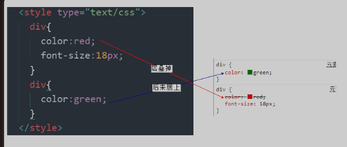
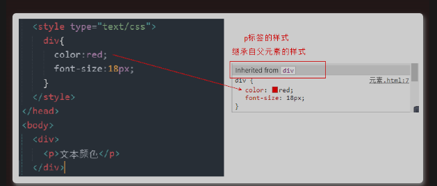
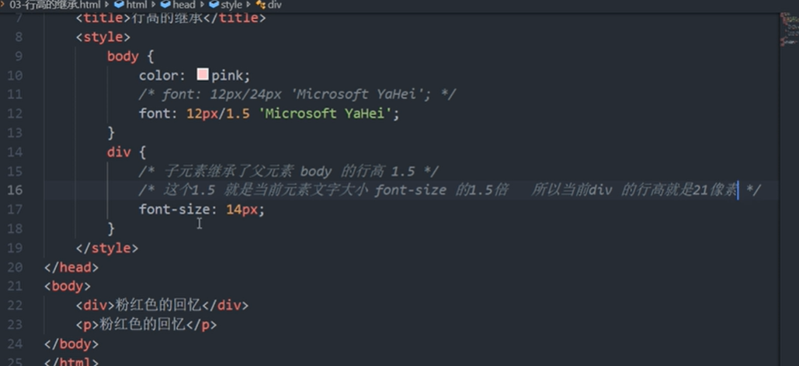
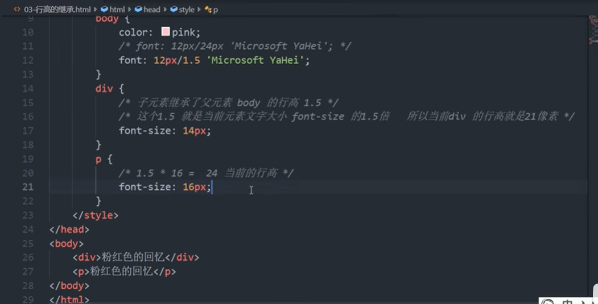
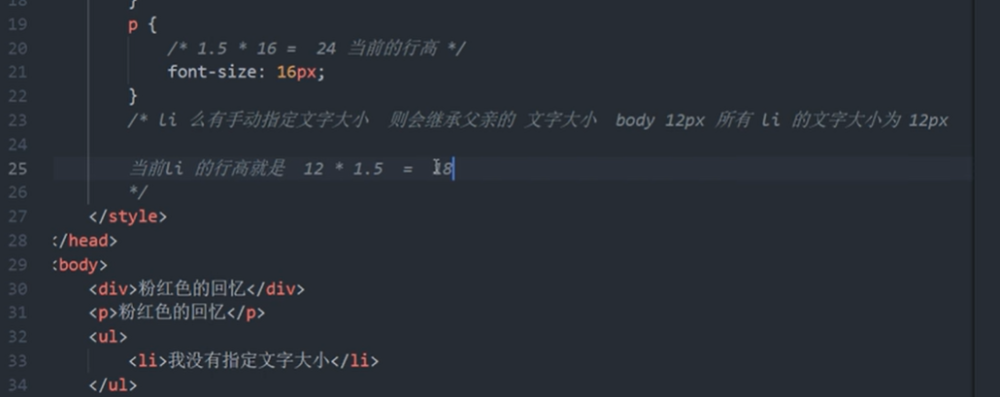
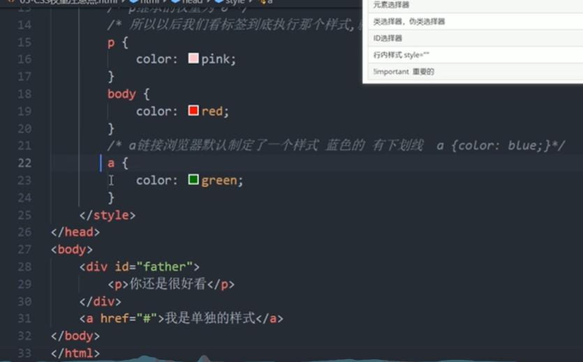

CSS 有三个非常重要的特性：层叠性、继承性、优先级。
# 1 层叠性
相同选择器设置相同的样式，此时一个样式就会覆盖另一个冲突的样式。层叠性主要解决样式冲突的问题。
概念：
-   所谓层叠性是指多种CSS样式的叠加
-   是浏览器处理冲突的一个能力,如果一个属性通过两个相同选择器设置到同一个元素上，那么这个时候一个属性就会将另一个属性层叠掉

层叠性原则：
- 样式冲突：先看 两个selector权重的大小, 然后 遵循的原则是就近原则
- 当两个selector权重一样的时候， 哪个样式离结构近，就执行哪个样式、
- <mark> 后一个div 的样式的代码 距离 body 里面的 div近， 所以后一个定义的div 的样式就被采样 </mark>


# 2 继承性

概念：
-   子标签会继承父标签的某些样式，如文本颜色和字号。
-   想要设置一个可继承的属性，只需将它应用于父元素即可。

注意：
-   恰当地使用继承可以简化代码，降低CSS样式的复杂性。比如有很多子级孩子都需要某个样式，可以给父级指定一个，这些孩子继承过来就好了。    
-   子元素可以继承某些父元素的样式（**text-，font-，line-这些元素开头的可以继承，以及color属性**）
    - 在css中唯一例外的是font-size属性，它的em和ex值指的是相对父元素的字体大小。 不是这个元素本身的字体大小的， 见 章节“em 和 rem比较” in [Chapter2_选择器_字体文本属性](../Chapter2_选择器_字体文本属性/Chapter2_02_字体文本属性.md)
- <mark>子元素不会继承的样式： 行高， 盒子边距 </mark>



## 2.1 行高的继承性（line-height）
- <mark>子元素不会继承的样式： 行高， 盒子边距 </mark>
```css
<style>
    body {
          font: 12px/24px Microsoft Yahei;  12px 为字体大小， 24px 为行高 
    }
</style>


body {
  font: 12px/1.5 Microsoft Yahei;  // 1.5为行高， 没有跟单位， 1.5的意思：让里面body标签内的所有的子标签的行高是， 子标签自己的文字大小的1.5倍
}
```

-   行高可以跟单位也可以不跟
-   如果子元素没有设置行高，则会继承父元素的行高为 1.5
-   此时子元素的行高是：当前子元素的文字大小*1.5
-   body 行高 1.5 这样写法最大优势就是里面的子元素可以根据文字大小自动调整行高


div:

p:

ul>li:



# 3 优先级/权重 SelectorWeight/Specificity/ Wertigkeit

概念： 当一个元素指定多个选择器时，就会有有优先级的产生。
-   选择器相同，则执行层叠性
-   选择器不同，则根据选择器权重执行


## 3.1 权重计算公式
关于CSS权重，我们需要一套计算公式来去计算，这个就是 CSS Specificity（特殊性）
[Specificity - CSS&colon; Cascading Style Sheets | MDN](https://developer.mozilla.org/en-US/docs/Web/CSS/Specificity)
The selector weight categories are listed here in the order of decreasing specificity:

- 权重是由4组数字组成的
- 值从左到右，左面的最大，一级大于一级，如果某一位数值相同，则判断下一位数值 
- 第一位i最重要， 只有当第一位 的值， 相等时， 才会比较第二位的值
- 权重可以叠加。 数位之间没有进制，级别之间不可超越。
    - 如果是复合选择器，则会有权重的叠加，需要计算权重， 但是没有进位

越往下权重越大

|选择器	|权重|
|--|--|
|继承 或者 \*选择器  |0，0，0，0|
|元素选择器（标签选择器） (Type selektor)   |0，0，0，1|
|类选择器，属性选择器, 伪类选择器 (class selektor， attribute selectors，  pseudo-classes) |0，0，1，0|
|ID选择器 (Id selektor  )|0，1，0，0|
|行内样式style=""|1，0，0，0|
|！important重要的|无穷大， 某个标签加上这个！important， 他会权重会变得无权大|

注意点: 
-  我们修改样式，一定要看该标签有没有被选中
-  如果选中了，那么以上面的公式来计权重。谁大听谁的。
- 继承的权重为 0，如果该元素没有直接选中，不管父元素的权重多高，父元素对于子元素的权重是0，因为继承的权重为0. 即使父元素加了 important 权重也还0。
    - 此时 元素的样式一子元素的为准， 父元素的样式对于子元素的权重是0， 父元素的样式不再被考虑
- a (link-tag)，浏览器默认指定了一个样式，蓝色，下划线，不会继承父级样式
    - 


### 3.1.1 ID column

Includes only ID selectors, such as #example. 
For each ID in a matching selector, add 1-0-0 to the weight value.

### 3.1.2 CLASS column

Includes

-  [class selectors](https://developer.mozilla.org/en-US/docs/Web/CSS/Class_selectors), such as .myClass,
- attribute selectors like [type="radio"] and [lang|="fr"],
- pseudo-classes, such as :hover, :nth-of-type(3n), and :required.

For each class, attribute selector, or pseudo-class in a matching selector, add 0-1-0 to the weight value.

### 3.1.3 TYPE column

Includes 

- type selectors, such as p, h1, and td, and 
- pseudo-elements like ::before, ::placeholder, and 
- all other selectors with double-colon notation. 

For each type or pseudo-element in a matching selector, add 0-0-1 to the weight value.

###4.4 No value

Includes

- The universal selector (*) and 
- the pseudo-class :where() and its parameters 
  aren't counted when calculating the weight so their value is 0-0-0, but they do match elements. 

These selectors do not impact the specificity weight value.

Combinators, such as +, >, ~, " ", and ||, may make a selector more specific in what is selected but they don't add any value to the specificity weight.

The negation pseudo-class, [`:not()`](https://developer.mozilla.org/en-US/docs/Web/CSS/:not), itself has no weight. Neither do the [`:is()`](https://developer.mozilla.org/en-US/docs/Web/CSS/:is) or the [`:has()`](https://developer.mozilla.org/en-US/docs/Web/CSS/:has) pseudo-classes. The parameters in these selectors, however, do. The values of both come from the parameter in the list of parameters that has the highest specificity. The [`:not()`, `:is()` and `:has()` exceptions](https://developer.mozilla.org/en-US/docs/Web/CSS/Specificity?retiredLocale=de#the-is-not-and-has-exceptions) are discussed below.


## 3.2 Die Verwendung von !important
有 die höchstest Wertigkeit 

!important wird i.d.R. nur verwendet, wenn third-party-styles verwendet werden, also fremde styles aus frameworks, die überschrieben werden sollen. Verwendet man nur eigene styles ist die Verwendung von !important unbedingt zu vermeiden.

Nach der CSS Spezifität hat die Anweisung `#content ul li` hat die höchste Wertigkeit und der Listenpunkt würde mit rot dargestellt. Mit !important erhält die zweite Anweisung die höhere Wertigkeit und Listenpunkte werden in blau dargestellt.

```css
p {
  color: pink !important;
}

#content ul li{
  color: red;
}

ul li {
  color : blue !important;
}


```


## 3.3 权重计算例子
### 3.3.1 元素选择器和类选择器的权重的比较

```css
<head>
<style>	
     div{
        color:pink;
     }
     .text {
     color:red;
     }
</style>
</head>
<body>
      <div class="text">你笑起来真好看</div>
</body>
```

### 3.3.2 复合选择器权重的叠加

权重叠加：如果是复合选择器，则会有权重的叠加，需要计算权重， 但是没有进位
```css
<head>
<style>
/* li 的权重是 0,0,0,1  */
     li {
        color:green;
     }

/* 复合选择器权重叠加，ul li权重 0,0,0,1 + 0,0,0,1 =0,0,0,2 */
     ul li{
        color :red;
     }

/*  .nav li 权重 0,0,1,0 + 0,0,0,1 = 0,0,1,1 */
.nav li{
    color:pink;
}

<style>
</head>
<body>
    <ul  class="nav">
          <li>大猪蹄子</li>
          <li>大肘子</li>
          <li>猪尾巴</li>
    </ul>
</body>
```
1.  `div ul li`----------> 0,0,0,3
2.  `.nav ul li` -------------->0,0,1,2
3.  `a:hover` ---------------->0,0,1,1 /* 伪类选择器*/
4.  `.nav a`-------------------->0,0,1,1


