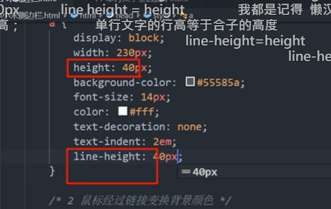
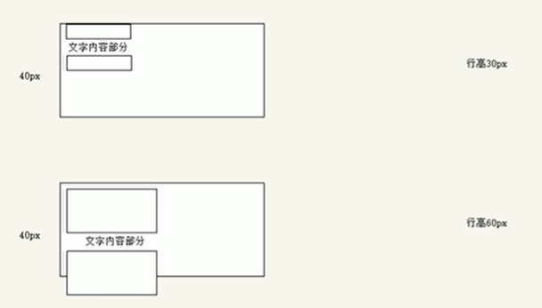
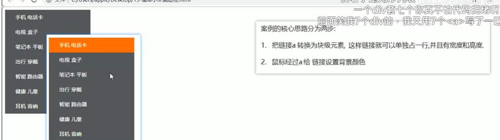
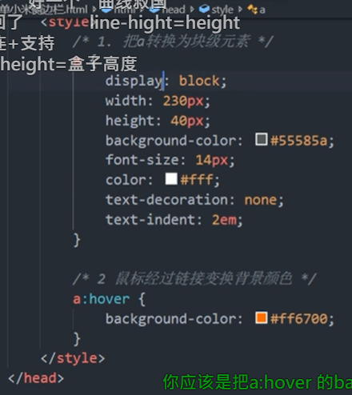
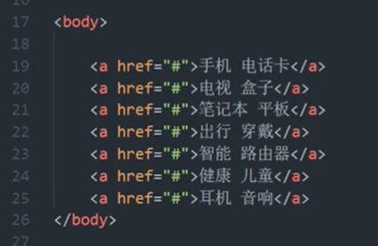

# 1 标签(Selector)/元素显示模式

作用：网页的标签非常多，不同地方使用不同，了解其特点可以更好布局。
HTML 元素分为<mark>块元素和行内元素</mark>。 也称 <mark>块标签和行内标签</mark>

# 2 元素显示模式总结

| 元素模式  | 元素排列          | 设置样式      | 默认宽度     | 包含           |
| ----- | ------------- | --------- | -------- | ------------ |
| 块级元素  | 一行只能放一个块级元素   | 可以设置高度宽度  | 容器的 100% | 可以包含任何标签     |
| 行内元素  | 一行可以放多个行内元素   | 不可以设置宽度高度 | 本身内容宽度   | 容纳文本或者其他行内元素 |
| 行内块元素 | 一行可以放置多个行内块元素 | 可以设置高度宽度  | 本身内容宽度   |              |

# 3 块元素/块标签/ block

常见的块元素有 `h1-h6`、`p`、`div`、`ul`、`ol`、`li`等。 其中<div>标签是最典型的块元素。

块级元素的特点：

1. 独占一行。
2. 高度、宽度、外边距以及内边距都可以控制。
3. 块元素的任何属性是容器（父级宽度）的 100% 继承的。
    1. 块元素 width是是容器（父级宽度）的 100%
4. 是一个容器及盒子，里面可以方行内或块级元素。

注意：

- 文字类的元素内不能使用块级元素
- 只有文字才能组成段落，p标签里捏主要用于存放文字， 因此p标签里面不能放块级元素，特别是p不能放div。
  - 试了一下<p> 中放了<div>, 结果没有用
- 文字类元素有 `p`，`h1-h6`。 它们都是文字类块级标签，里面不能放其他块级元素。尤其不能放 `div` 元素

# 4 行内元素/行内标签（也叫内联元素）/inline

常见行内元素：`a`、`strong`、`b`、`em`、`i`、`del`、`s`、`ins`、`u`、`span`
典型行内元素是 `span`

行内元素的特点： 

1. 相邻行内元素在一行上，一行可以显示多个。
   
   1. `<span>pink</span> <strong>品如的衣服</strong> `

2. <mark> 高、宽直接设置是无效的。行内元素没有高、宽 这两个属性 </mark>
   
   1. `span {width:100px; height:100px; background-color: hotpink }` 这里面width 和 height 都无效， 只有 对于color的设置有效 

3. 默认宽度就是它本身内容宽度。
   
   1. 比如 span 中内含文本越多， 则这个 span 标签 就越来越宽 

4. <mark>行内元素只能容纳文本或其他行内元素。</mark>

**注意**

- a 链接（a 标签）里面不能放 a链接
- 特殊情况链接 a 里面可以放块级元素，但是给 a 转换一下成为块级元素， 这样 最安全。

# 5 行内块元素/ inline-block

在行内元素中有几个特殊标签——``, `<input/>`、`<td/>`，它们同时具有块元素和行内元素的特点。

有些资料称为行内块元素。

行内块元素的特点：

1. 和相邻元素（行内块）在一行上，之间存在空白缝隙，一行可以显示多个。
   
   1. ```html
      <input type="text">
      <input type="text">
      
      在外面显示的为 两个输入块并排显示， 但是中间有个空隙
      ```

2. 高度、行高、外边距、内边距都可以控制（块级元素特点）。
   
   1. ```html
      <head>
          <style>
              input { 
                  width: 249px;
                  height: 35px;
      
              }
          </style>
      </head>
      
      <body>
      <input type="text">
      <input type="text">
      </body>
      ```


# 6 元素模式转换

特殊情况下，需要将一个元素的模式转换为另外一中模式，使其具有另外一种模式的特性。
比如想要增加链接 a 的触发范围。需要调大 a标签的宽度。但是a 本身为行内元素 ， 无法设置宽度和高度

行内元素可以转换为块元素，块元素也能转换为行内元素。

- 块转行内：display:inline;

- 行内转块：display:block;

- 块、行内元素转换为行内块：display: inline-block;

## 6.1 行内->块级

```css
a {
  width:100px;  // 本来这句话无效， 加上 display: block; 就有效了
  height:100px; // 本来这句话无效 ，  加上 display: block; 就有效了
  background-color: hotpink
  display: block;
}
```

## 6.2 块级->行内

```css
div {
   width:100px;  // 本来这句话无效， 加上 display: inline; 就无效了
  height:100px; // 本来这句话无效 ，  加上 display: inline; 就无效了
  background-color: hotpink
  display: inline;
}
```

## 6.3 行内/块级-> 行内块元素

```css
span {
  display: inline-block;
}
```

# 7 一个小技巧——单行文字垂直居中

css没有提供垂直居中 的代码
解决方案：让文字的行高等于盒子的高度。用 line-height 和 height 相等


原理分析：
行高=文字本身高度+上空隙+下空隙=盒子高度. 行高的上空隙和下空隙把文字挤到中间了
当行高小于盒子高度，则文字偏上；
当行高大于盒子高度，文字偏下。


## 7.1 例子
当行高小于盒子高度，则文字偏上；
当行高大于盒子高度，文字偏下。


# 8 例子



代码： 


