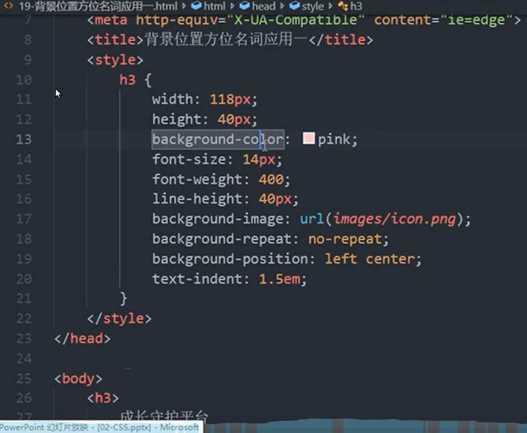
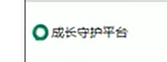
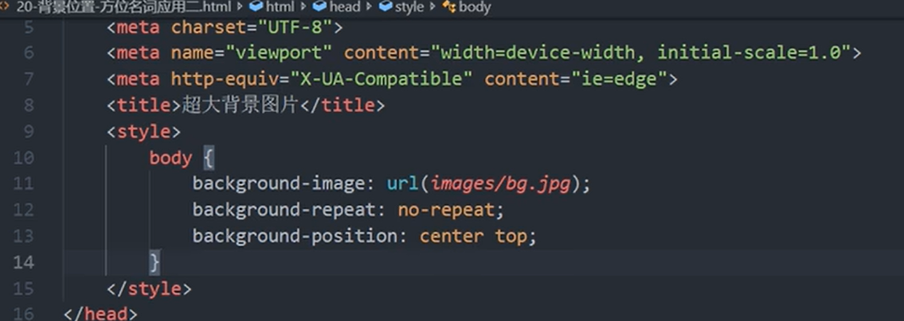

# 1 CSS 的背景

CSS 背景属性可以给元素添加背景样式。
背景属性可以设置背景颜色、背景图片、背景平铺、背景图片位置、背景图像固定等。
使用背景属性的有点是非常便于控制位置

# 2 背景总结

背景图片:实际开发常见于 logo 或者一些装饰性的小图片或者是超大的背景图片, 优点是非常便于控制位置.

| 属性                    | 作用            | 值                                                            |
| --------------------- | ------------- | ------------------------------------------------------------ |
| background-color      | 背景颜色          | 预定义的颜色值/十六进制/RGB代码. 默认的值是 transparent， 啥也不写的话就是透明的，没有颜色      |
| background-image      | 背景图片          | none 或者 url(图片路径)                                            |
| background-repeat     | 是否平铺          | repeat(默认)/no-repeat/repeat-x/repeat-y                       |
| background-position   | 背景位置          | length/position    分别是x  和 y坐标， 切记 如果有 精确数值单位，则必须按照先X 后Y 的写法 |
| background-attachment | 背景固定还是滚动      | scroll/fixed                                                 |
| 背景简写                  | 更简单，所有属性都写在一行 | 背景颜色 背景图片地址 背景平铺 背景滚动 背景位置;  他们没有顺序                          |
| 背景透明                  | 让盒子半透明        | background: rgba(0,0,0,0.3);   后面必须是 4个值 ， rgba必须写a          |

# 3 背景颜色 background-color

`background-color` 定义了元素的背景颜色。

默认的值是 transparent  透明的

```css
background-color: 颜色值;
```

一般而言，颜色默认值是 `transparent`（透明），我们也可以指定背景颜色为透明色或其他色。

# 4 背景图片 background-image

`background-image` 属性描述了元素的背景图像，实际开发用于 logo 或者一些装饰性开发的小图片或者是超大的背景图片，优点是便于控制位置。（也用于精灵图）
默认值为none

```css
background-image: none|url(图片url);

例如:
background-image: url(images/1.png);
```

# 5 背景平铺 background-repeat

若需要在 HTML 页面上对背景图进行平铺，可以使用 `background-repeat` 属性。
<mark>就是 选用 repeat 属性的时候， 如果 图片尺寸小于盒子（div标签）的尺寸， 则这个图片被多次显示， 填满整个盒子</mark>

```css
background-repeat: repeat(默认) | no-repeat | repeat-x | repeat-y;
```

**注意**
<mark>页面元素·既可以添加背景图片，也可以添加背景颜色，图片会覆盖颜色。背景图片在背景颜色之上</mark>

| 参数值       | 作用                  |
| --------- | ------------------- |
| repeat    | 背景图像在纵向和横向上平铺(默认的)  |
| no-repeat | 背景图像不平铺， 图片只显示一次    |
| repeat-x  | 背景图像在横向上平铺 ， 沿着x轴平铺 |
| repeat-y  | 背景图像在纵向平铺，沿着y轴平铺    |

# 6 背景图片位置 background-position

`background-position` 可以改变图片在背景中的位置。

```css
background-position: x y;

例子： 
可以写成 background-position: center top;  或者 left center 
```

参数 x 和 y 指 x 左边和 y 坐标，可以使用方位名词或者精确定位。

| 参数值      | 说明                                                                          |
| -------- | --------------------------------------------------------------------------- |
| length   | 百分数 / 由浮点数字和单位字符组成的长度值                                                      |
| position | x 上下的位置可以写为： top / center / bottom.  y 左右的位置可以写为 left / center / right 方位名词 |

**1.参数是方位名词**

- 若两个值都是方位名词，则两个值前后顺序无关，比如`left top`和`top left` 效果一致。

- 若只指定了一个方位名词，另一个值省略，则<mark>第二个值默认居中对齐</mark>。

**2.参数是精确单位**

- 第一个必定是 x 坐标 水平轴 （图片左边距离 最左边的距离）。第二个是 y 坐标， 垂直轴。
- 
- 若只指定一个数值，则这个指定的数值一定是x。则另一个必定是 y 轴居中
  
  ```css
  background-position: 20px 50px; 
  background-position: 50px 20px;  // 这个和上面不一样 
  ```

**3.参数是混合单位**

- 若是混合单位，则第一个值必定是 x 坐标，第二个值必定是 y 坐标。
  
  ```css
  background-position: 20px center; 
  ```

## 6.1 例子 背景图片居中


成效后： 


## 6.2 例子 超大图片 水平轴居中显示



# 7 背景图像固定 background-attachment

- `background-attachment` 属性设置背景图像是否随着页面其余部分滚动。
  - 位置 fixed 的， 不随着scrollbar 改变位置， scroll 的时候， 网页上其余元素都在上下动， 背景图片一直不动， 图片被显示的内容一直一样
- `background-attachment` 后期可以制作视差滚动效果。

```css
background-attachment: scroll | fixed;
```

| 参数     | 作用           |
| ------ | ------------ |
| scroll | 背景图像随着对象内容滚动 |
| fixed  | 背景图像固定       |

# 8 背景属性复合写法

background：属性的值的书写顺序官方没有强制的标准. 

简化代码，将属性写在同一个属性 `background` 下。 写在同一行中。

一般按照约定顺序编写: background 背景颜色 背景图片地址 背景平铺 背景图像滚动 背景图片位置

```css
/* 有背景图片背景颜色可以不用写*/
background: transparent url(image.jpg) repeat-y fixed top;
```

# 9 背景颜色半透明

CSS3 提供 `background: rgba(r,g,b,a)` 属性设置图片透明度。

```css
background: rgba(0, 0, 0, 0.3);
background: rgba(0, 0, 0, .3);

div{
    background: rgba(0, 0, 0, .3);
}
```

- CSS3 新增属性，IE9+支持. 低于IE 9的版本不支持

- <mark>最后一个参数是`alpha` 透明度 ，取值范围在0~1之间</mark>

- 我们习惯把0.3的 0省略掉，写为`background(0,0,0,.3)`;

- 注意：**背景半透明是指盒子背景颜色半透明，盒子里面的内容不受影响， 盒子里面的文字没有因此有半透明的效果**

## 9.1 盒子半透明 opacity

设置opacity元素的所有后代元素会随着一起具有透明性，一般用于调整图片或者模块的整体不透明度

`opacity: .2;`

# 10 背景颜色渐变(css3中的新特性)
CSS 渐变是 CSS3 图像模块中添加的新类型的图像。CSS 渐变允许您在 **两个或多个指定颜色之间显示平滑过渡**。 浏览器支持两种类型的渐变：

-   线性渐变（Linear Gradients）：向下/向上/向左/向右/对角方向，用 `linear-gradient()` 函数定义
-   径向渐变（Radial Gradients）：由它们的中心定义，用 `radial-gradient()` 函数定义

## 10.1 线性渐变 Linear Gradients
 
语法

```
background: linear-gradient(direction, color1, color2, ...);
```

参数

-   `direction`：指定了颜色过度的方向，不写默认为从上到下，值可以为 `to bottom`、`to top`、`to right`、`to left`、`to bottom right` 等。
-   `color1`：可以有多个 `color` 值，指定了颜色变化的范围。