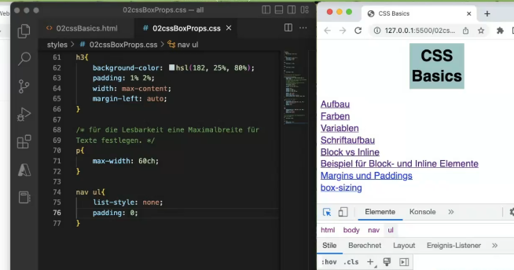

https://www.w3schools.com/css/css_table.asp

# 1 表格属性

```css
td {
    text-align: left;
    vertical-align: top;
    border-bottom: 1px solid #ddd;
    padding: 5px;
}

tr:hover {background-color: coral;}  /* Use the :hover selector on <tr> to highlight table rows on mouse over: */

```

## 1.1 表格的细线边框 border-collapse  (合并相邻的边框)

border-collapse 属性控制浏览器绘制表格边框的方式。它控制相邻单元格的边框。

语法
border-collapse: collapse;

- collapse 是合并的意思
- border-collapse:collapse; 表示将相邻边框合并在一起

通过表格的`cellspacing="0"`,将单元格与单元格之间的距离设置为0. 
但是两个单元格之间的边框会出现重叠，从而使边框变粗
通过css属性：table{ border-collapse:collapse; } : `collapse` 单词是合并的意思,`border-collapse: collapse;`表示相邻边框合并在一起。

```css
<style> 
  table {  
   width: 500px;  
   height: 300px;  
   border: 1px solid red;  
   /* border-width:5px*/
   /* border-style:soild*/
   /* border-color:pink*/
 }  
 td {  
  border: 1px solid red;  
  text-align: center;  
 }  
 table, td， th {  
  border-collapse: collapse;  /*合并相邻边框*/  
  border: 1px solid pink;
  font-size: 14px
  text-aligh: center 
 }
 
 </style>
```


# 2 列表属性
## 2.1 list-style
```css
ul{
    list-style: none; 
}
```

none 代表 列表左边的的 点 或者 数字, 不再被显示了


## 2.2 例子: 列表去掉左边的点 和 左边的空间

```html
        <nav>
            <ul>
                <li><a href="#aufbau">Aufbau</a></li>
                <li><a href="#farben">Farben</a></li>
                <li><a href="#variablen">Variablen</a></li>
                <li><a href="#schrift-aufbau">Schriftaufbau</a></li>
                <li><a href="#block-inline">Block vs Inline</a></li>
                <li><a href="#bsp-block-inline">Beispiel für Block- und Inline Elemente</a></li>
                <li><a href="#margPad">Margins und Paddings</a></li>
                <li><a href="#box-sizing">box-sizing</a></li>
            </ul>
        </nav>
```

```css
p{
    max-width: 60ch;
}

nav ul{
    list-style: none;
    padding: 0;
}

nav li{
    background-color: hsla(182,0%,80%,1);
    margin: 1% 0;
    text-align: center;
}

  
nav a{
    display: block;
}
```
