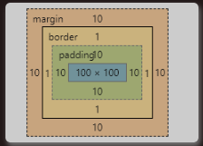
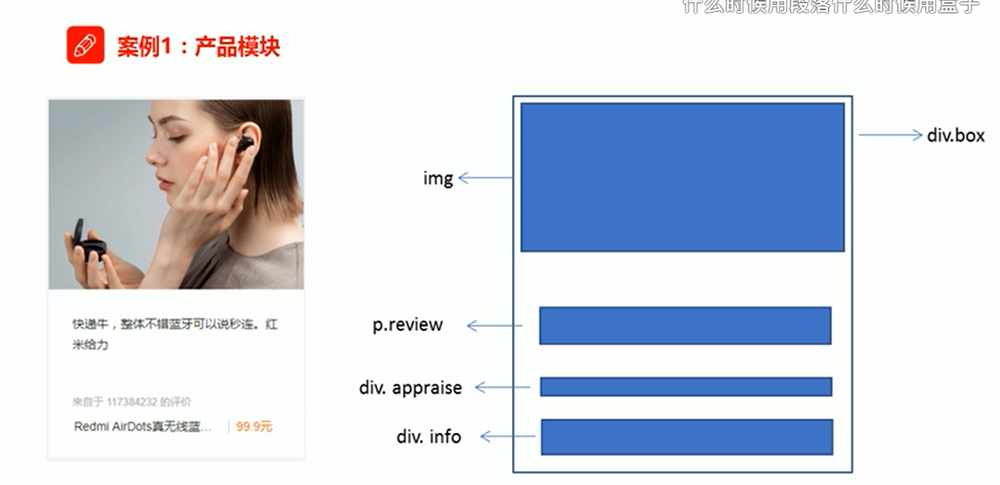

# 1 css学习三大重点：

 css 盒子模型 、 浮动 、 定位  
 
**网页布局的本质**

- 首先利用CSS设置好盒子的大小，然后摆放盒子的位置。    

- 最后把网页元素比如文字图片等等，放入盒子里面。

# 2 盒子中的属性

- content(内容): 盒子里面的文字和图片等元素是 内容区域

- border(边框): 盒子的厚度 我们称为为盒子的边框

- padding(内边距): 盒子内容与边框的距离是内边距

- margin(外边距): 盒子与盒子之间的距离是外边距
  
  

# 3 内盒尺寸 width,height,padding,border
## 3.1 content 和 width 和 height
在 CSS 中，width 和 height 指的是内容区域的宽度和高度。
增加内边距、边框和外边距不会影响内容区域的尺寸，但是会增加元素框的总尺寸。

## 3.2 盒子尺寸计算(元素实际大小)

盒子的实际大小：**内容的宽度和高度 +  内边距   +  边框**

- 盒子总宽度：Element Height = content height (元素名为 height 内容高度， 不含有边框的高度)+ 2* padding + 2* border  （height 为 content 的高度）
- 盒子总高度：Element  Width = content width (元素名为 width 内容宽度, 不含有边框的宽度) + 2*  padding + 2*  border （Width为内容宽度）
- <mark> margin 不考虑在盒子的尺寸内， margin 不会撑大盒子的尺寸 </mark>

## 3.3 边框会额外增加盒子的实际大小
因此有两种方案解决。
1. 测量盒子大小的时候，不测边框。
2. 若测量的时候包含了边框，则需要 width/height-边框宽度。

## 3.4 盒子模型布局稳定性

优先使用  宽度 （width）  其次 使用内边距（padding）    再次  外边距（margin）
`width >  padding  >   margin`   

**原因：**

- margin 会有外边距合并 还有 ie6下面margin 加倍的bug（讨厌）所以最后使用。
- padding  会影响盒子大小， 需要进行加减计算（麻烦） 其次使用。
- width   没有问题（嗨皮）我们经常使用宽度剩余法 高度剩余法来做。

# 4 综合案例
## 4.1 案例 产品模块


注意点

```html
<!DOCTYPE html>
<html lang="en">
<head>
    <meta charset="UTF-8">
    <meta name="viewport" content="width=device-width, initial-scale=1.0">
    <meta http-equiv="X-UA-Compatible" content="ie=edge">
    <title>综合案例-产品模块</title>
    <style>
      * {
          margin: 0;
          padding: 0;
      }
      body {
          background-color: #f5f5f5;
      }
      a {
          color: #333;
          text-decoration: none;
      }
      .box {
          width: 298px;
          height: 415px;
          background-color:#fff;
          /* 让块级的盒子水平居中对齐 */
          margin: 100px auto;
      }
      .box img {
          /* 图片的宽度和父亲一样宽 , 不让图片超过盒子的大小*/
          width: 100%;
      }
      .review {
          height: 70px;
          font-size: 14px;
          /* 因为这个段落没有 width属性 所有 padding不会撑开盒子的宽度 */
          padding: 0 28px; /* 左右两个有些留白 */
          margin-top: 30px; /*  margin 不考虑在盒子的尺寸内， margin 不会撑大盒子的尺寸 */
      }
      .appraise {
          font-size: 12px;
          color: #b0b0b0;
          margin-top: 20px;
          padding: 0 28px;
      }
      .info {
          font-size: 14px;
          margin-top: 15px;
          padding: 0 28px;
      }
      .info h4 {
          display: inline-block;
          font-weight: 400;
         
      }
      .info span {
          color: #ff6700;    
      }
      .info em {
          font-style: normal;
          color: #ebe4e0;
          margin: 0 6px 0 15px;
      }
    </style>
</head>
<body>
    <div class="box">
        
        <p class="review">快递牛，整体不错蓝牙可以说秒连。红米给力</p>
        <div class="appraise">来自于 117384232 的评价</div>
        <div class="info">
               <h4> <a href="#">Redmi AirDots真无线蓝...</a></h4>
               <em>|</em>
               <span> 99.9元</span>
        </div>
    </div>
</body>
</html>
```
## 4.2 新闻快报
d:\File_Storage\File_Markdown\HTML5_CSS3_HeiMaPink_别人的笔记\基础部分\06-前端基础CSS第四天\案例\01-综合案例-新闻快报.html


大盒子里面有两个小盒子 

```html
<!DOCTYPE html>
<html lang="en">

<head>
    <meta charset="UTF-8">
    <meta name="viewport" content="width=device-width, initial-scale=1.0">
    <meta http-equiv="X-UA-Compatible" content="ie=edge">
    <title>新闻快报模块</title>
    <style>
        * {
            margin: 0;
            padding: 0;
        }

        li {
            /* 去掉 列表selector li前面的小圆点 */
            list-style: none;
        }

        .box {
            width: 248px;
            height: 163px;
            border: 1px solid #ccc;
            margin: 100px auto;
        }

        .box h3 {
            height: 32px;
            border-bottom: 1px dotted #ccc;
            font-size: 14px;
            font-weight: 400;
            line-height: 32px;
            padding-left: 15px;
            /* 这里不能用 margin-left: 15px; 来取代  padding-left: 15px; 
            padding-left: 15px; ：  因为 .box h3 中没有各处指定的width 的值， 所以 padding-left: 15px;  不会撑开盒子
            margin-left: 15px; 会使得 border-bottom 也和左边有了距离。 这个效果我们不想要。 
            我们只想要 品优购快报 这5个字和左边有距离 */ 
        }

        .box ul li a {
            font-size: 12px;
            color: #666;
            text-decoration: none;
        }

        .box ul li a:hover {
            text-decoration: underline;
        }

        .box ul li {
            height: 23px;
            line-height: 23px;
            padding-left: 20px;
        }

        .box ul {
            margin-top: 7px;
        }
    </style>
</head>

<body>
    <div class="box">
        <h3>品优购快报</h3>
        <ul>
            <li><a href="#">【特惠】爆款耳机5折秒！</a></li>
            <li><a href="#">【特惠】母亲节，健康好礼低至5折！</a></li>
            <li><a href="#">【特惠】爆款耳机5折秒！</a></li>
            <li><a href="#">【特惠】9.9元洗100张照片！</a></li>
            <li><a href="#">【特惠】长虹智能空调立省1000</a></li>
        </ul>

    </div>
</body>

</html>
```