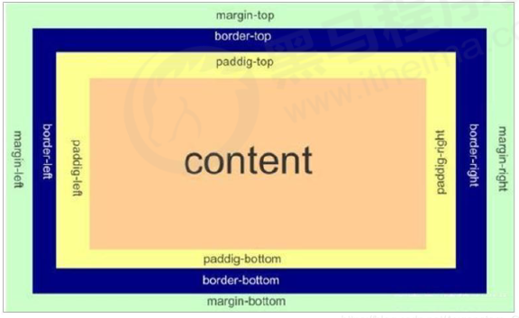
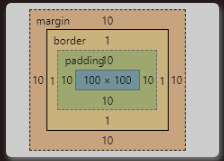
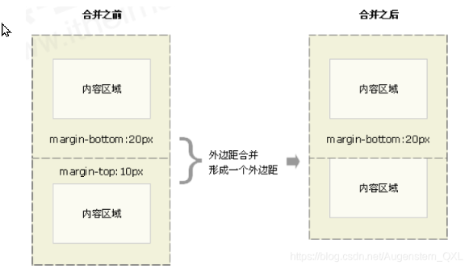

# 1 css学习三大重点：

 css 盒子模型 、 浮动 、 定位  
 
**网页布局的本质**

- 首先利用CSS设置好盒子的大小，然后摆放盒子的位置。    

- 最后把网页元素比如文字图片等等，放入盒子里面。

# 2 盒子模型布局稳定性

优先使用  宽度 （width）  其次 使用内边距（padding）    再次  外边距（margin）
`width >  padding  >   margin`   

**原因：**

- margin 会有外边距合并 还有 ie6下面margin 加倍的bug（讨厌）所以最后使用。
- padding  会影响盒子大小， 需要进行加减计算（麻烦） 其次使用。
- width   没有问题（嗨皮）我们经常使用宽度剩余法 高度剩余法来做。

# 3 盒子中的属性

- content(内容): 盒子里面的文字和图片等元素是 内容区域

- border(边框): 盒子的厚度 我们称为为盒子的边框

- padding(内边距): 盒子内容与边框的距离是内边距

- margin(外边距): 盒子与盒子之间的距离是外边距
  
  

## 3.1 内盒尺寸计算(元素实际大小)

- 宽度：Element Height = content height + padding + border （Height为内容高度）
- 高度：Element  Width = content width + padding + border （Width为内容宽度）
- 盒子的实际大小：**内容的宽度和高度 +  内边距   +  边框**
- 

# 4 边框 border

border 可以设置元素边框。边框有三个组成：border-width、border-style、border-color

语法：

```
/*属性可连写*/
border: border-width || border-style || border-color;
```

| 属性           | 作用           |
| ------------ | ------------ |
| border-width | 定义边框粗细，单位 px |
| border-style | 边框样式         |
| border-color | 边框颜色         |

## 4.1 border-style

none：没有边框即忽略所有边框的宽度（默认值）
solid：边框为单实线(最为常用的)
dashed：边框为虚线
dotted：边框为点线

## 4.2 边框属性简写和分写

**边框属性简写**

```
/*习惯顺序*/
border: 5px solid pink;
```

**边框属性分写**

```
/*注意层叠性*/
border-top: 1px solid red;
```

很多情况下，我们不需要指定4个边框，我们是可以单独给4个边框分别指定的。

| 上边框                  | 下边框                      | 左边框                   | 右边框                    |
| -------------------- | ------------------------ | --------------------- | ---------------------- |
| border-top-style:样式; | border-bottom-style:样式;  | border-left-style:样式; | border-right-style:样式; |
| border-top-width:宽度; | border- bottom-width:宽度; | border-left-width:宽度; | border-right-width:宽度; |
| border-top-color:颜色; | border- bottom-color:颜色; | border-left-color:颜色; | border-right-color:颜色; |
| border-top:宽度 样式 颜色; | border-bottom:宽度 样式 颜色;  | border-left:宽度 样式 颜色; | border-right:宽度 样式 颜色; |

## 4.3 表格的细线边框

border-collapse 属性控制浏览器绘制表格边框的方式。它控制相邻单元格的边框。

语法
border-collapse: collapse;

- collapse 是合并的意思
- border-collapse:collapse; 表示将相邻边框合并在一起

通过表格的`cellspacing="0"`,将单元格与单元格之间的距离设置为0. 
但是两个单元格之间的边框会出现重叠，从而使边框变粗
通过css属性：table{ border-collapse:collapse; } : `collapse` 单词是合并的意思,`border-collapse: collapse;`表示相邻边框合并在一起。

```css
<style> table {  
  width: 500px;  
  height: 300px;  
  border: 1px solid red;  
 }  
 td {  
  border: 1px solid red;  
  text-align: center;  
 }  
 table, td {  
  border-collapse: collapse;  /*合并相邻边框*/  
 }</style>
```

## 4.4 边框会影响盒子实际大小

边框会额外增加盒子的实际大小，因此有两种方案解决。

1. 测量盒子大小的时候，不测边框。
2. 若测量的时候包含了边框，则需要 width/height-边框宽度。

# 5 内边距 padding

padding 属性用于设置**内边距**,**即盒子边框与内容之间的距离**

| 属性             | 作用   |
| -------------- | ---- |
| padding-left   | 左内边距 |
| padding-right  | 右内边距 |
| padding -top   | 上内边距 |
| padding-bottom | 下内边距 |

## 5.1 padding属性(简写属性)

可以有一到四个值

| 值的个数                        | 表达意思                                           |
| --------------------------- | ---------------------------------------------- |
| padding : 5px;              | 1个值，上下左右。 代表上下左右都有5像素内边距                       |
| padding :5px 10px;          | 2个值，上下，左右。代表上下内边距是5像素，左右内边距是10像素               |
| padding: 5px 10px 20px;     | 3个值，上，左右，下。 代表上内边距5像素，左右内边距10像素，下内边距20像素       |
| padding :5px 10px 20px 30px | 4个值，上，右，下，左，顺时针。 上是5像素，右是10像素，下20像素，左是30像素，顺时针 |

## 5.2 padding 会影响盒子实际大小

当给盒子指定了 padding 值以后，发生了两件事情：

1. 内容和边框有了距离，增加内边距
2. padding 值影响了盒子实际大小
3. 也就是说，当盒子已经有了宽度和高度，再指定内边距，会撑大盒子。

解决方案： 要保证盒子和效果图一样大，则让 width/height-多出来的内边距大小即可。
但是，有时候 padding 影响盒子是有好处的，比如我们要做导航：
因为每个导航栏里面的字数不一样多,我们可以不用给每个盒子宽度了,直接给 padding 最合适.


## 5.3 padding 不影响盒子大小

如果盒子本身没有指定width/height属性，则此时padding不会撑开盒子大小

## 5.4 box-sizing 属性解决方案

CSS 中的 `box-sizing` 属性定义了 `user agent` 应该如何计算一个元素的总宽度和总高度。

在设置了一个盒子的 `width/height` 后，再设置其 `border/padding` 会影响盒子实际大小。当进行响应式布局时，这个尤其烦人。

box-sizing 属性可以被用来调整这些表现。

- `content-box` 是默认值。如果你设置一个元素的宽为`100px`，那么这个元素的内容区会有 `100px` 宽，并且任何边框和内边距的宽度都会被增加到最后绘制出来的元素宽度中。
  
  ```
  box-sizing: content-box;
  ```

- `border-box` 告诉浏览器：你想要设置的边框和内边距的值是包含在 `width` 内的。也就是说，如果你将一个元素的 `width` 设为 `100px`，那么这 100px 会包含它的 `border` 和 `padding`，内容区的实际宽度是 `width` 减去 `(border + padding)` 的值。大多数情况下，这使得我们更容易地设定一个元素的宽高。
  
  ```
  box-sizing: border-box;
  ```
  
  尺寸计算公式： `width = border + padding + 内容的宽度` `height = border + padding + 内容的高度`

若盒子没有指定 `width/height` 属性，则此时 `padding` 不会撑开盒子大小。

# 6 外边距 margin

margin（外边距）属性用于设置外边距，即控制盒子和盒子之间的距离

| 属性            | 作用   |
| ------------- | ---- |
| margin-left   | 左外边距 |
| margin-right  | 右外边距 |
| margin-top    | 上外边距 |
| margin-bottom | 下外边距 |

## 6.1 margin属性(简写属性)

margin 简写方式代表的意义跟 padding 完全一致
可以有一到四个值

| 值的个数                       | 表达意思                                           |
| -------------------------- | ---------------------------------------------- |
| margin : 5px;              | 1个值，上下左右。 代表上下左右都有5像素外边距                       |
| margin :5px 10px;          | 2个值，上下，左右。代表上下外边距是5像素，左右外边距是10像素               |
| margin: 5px 10px 20px;     | 3个值，上，左右，下。 代表上外边距5像素，左右外边距10像素，下外边距20像素       |
| margin :5px 10px 20px 30px | 4个值，上，右，下，左，顺时针。 上是5像素，右是10像素，下20像素，左是30像素，顺时针 |

## 6.2 外边距典型应用

### 6.2.1 块级盒子水平居中

外边距可以让块级盒子 **水平居中**，但是必须满足两个条件：

1. 盒子必须指定宽度（width）
2. 盒子左右的外边距都设置为 `auto`

```
.header {
  width: 960px;
  margin: 0 auto;
}
```

常见的写法，以下下三种都可以👇👇。

- margin-left: auto;   margin-right: auto;

- margin: auto;

- margin: 0 auto;

### 6.2.2 文字居中和盒子居中区别

使行内元素或行内块元素水平居中

1. 盒子内的文字水平居中是 text-align: center; 而且还可以让 行内元素和行内块居中对齐

2. 块级盒子水平居中  左右margin 改为 auto

```
text-align: center;
```

### 6.2.3 插入图片和背景图片区别

1. `插入图片`我们用的最多 比如产品展示类  移动位置只能靠盒模型 padding margin

2. `背景图片`我们一般用于小图标背景或者超大背景图片、背景图片，移动位置只能通过  background-position\

## 6.3 外边距合并

### 6.3.1 相邻元素垂直外边距的合并

当上下相邻块元素相遇时，若上面的元素有下外边距margin-bottom，下面的元素有上外边距margin-top，则他们之间的垂直间距不是 `margin-bottotm` 与 `margin-top` 之和。

取两个值中的较大者这种现象被称为相邻元素垂直外边距的合并。

解决方法： 「解决方案：尽量给只给一个盒子添加margin值」


### 6.3.2 嵌套块元素垂直外边距的塌陷

对于两个嵌套关系的块元素，父元素有上外边距同时子元素也有上外边距，此时父元素会塌陷较大的外边距值。


解决方案

1. 为父元素定义上边框
2. 为父元素定义上内边距
3. 为父元素添加 `overflow:hidden`
   还有其他方法，比如浮动、固定、绝对定位的盒子不会有塌陷问题。后面会进行总结。

## 6.4 清除内外边距

网页元素很多都带有默认内外边距，而且不同浏览器默认的也不一致，因此在布局前，要先清除网页元素的内外边距。
注意：行内元素为了照顾兼容性，尽量只设置左右内外边距，不要设置上下内外边距。但是转换为块级和行内块元素就可以设置。

语法

```
* {
  margin: 0;
  padding: 0;
}
```
