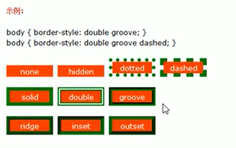
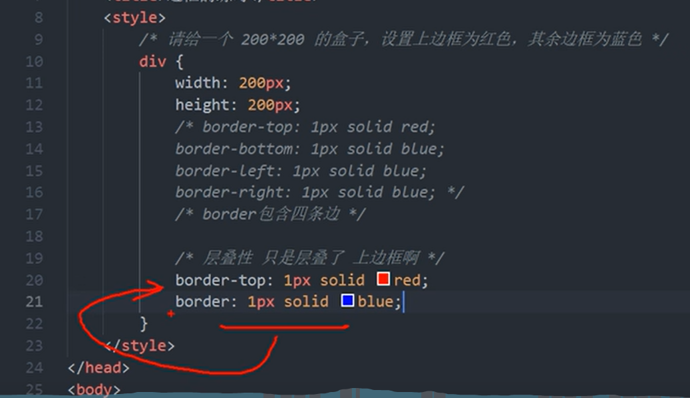

# 1 Width 和Height
在 CSS 中，width 和 height 指的是内容区域的宽度和高度。
增加内边距、边框和外边距不会影响内容区域的尺寸，但是会增加元素框的总尺寸。

可以分成两种情况：

1.  传统模式宽度计算: `box-sizing：content-box` 
    1.  盒子大小为  CSS中设置的 width + padding + border （以前默认的）
2.  CSS3盒子模型: `box-sizing: border-box` 
    1.  盒子大小为 CSS中设置的宽度width，里面包含了 border 和 padding
    2.  如果盒子模型我们改为了 box-sizing： border-box ，那padding 和 border就不会撑大盒子了（前提 padding 和 border 不会超过 width 宽度）

详细见: 
obsidian://open?vault=HTML5_CSS3_HeiMaPink_YZHNote&file=CSS%2FChapter2_%E9%80%89%E6%8B%A9%E5%99%A8_%E5%AD%97%E4%BD%93%E6%96%87%E6%9C%AC%E5%B1%9E%E6%80%A7%2FChapter2_02_%E5%AD%97%E4%BD%93%E6%96%87%E6%9C%AC%E5%B1%9E%E6%80%A7_%E9%AB%98%E5%BA%A6%E5%92%8C%E5%AE%BD%E5%BA%A6

# 2 边框 border

border 可以设置元素边框。边框有三个组成：border-width、border-style、border-color

语法：

```
/*属性可连写*/
border: border-width || border-style || border-color;
```

| 属性           | 作用           |
| ------------ | ------------ |
| border-width | 定义边框粗细，单位 px |
| border-style | 边框样式         |
| border-color | 边框颜色         |

## 2.1 border-style
none：没有边框即忽略所有边框的宽度（默认值）
solid：边框为单实线(最为常用的)
dashed：边框为虚线
dotted：边框为点线



## 2.2 边框属性简写和分写

### 2.2.1 边框属性简写

```
顺序无所谓
/*习惯顺序*/ 
border: 5px solid pink;
```

### 2.2.2 边框属性分写

```
/*注意层叠性*/
border-top: 1px solid red;
border-buttom
border-left
border-right
```

很多情况下，我们不需要指定4个边框，我们是可以单独给4个边框分别指定的。

| 上边框                  | 下边框                      | 左边框                   | 右边框                    |
| -------------------- | ------------------------ | --------------------- | ---------------------- |
| border-top-style:样式; | border-bottom-style:样式;  | border-left-style:样式; | border-right-style:样式; |
| border-top-width:宽度; | border- bottom-width:宽度; | border-left-width:宽度; | border-right-width:宽度; |
| border-top-color:颜色; | border- bottom-color:颜色; | border-left-color:颜色; | border-right-color:颜色; |
| border-top:宽度 样式 颜色; | border-bottom:宽度 样式 颜色;  | border-left:宽度 样式 颜色; | border-right:宽度 样式 颜色; |

### 2.2.3 注意就近原则， 下面定义的会覆盖掉上面定义的


## 2.3 表格的细线边框 (合并相邻的边框)

border-collapse 属性控制浏览器绘制表格边框的方式。它控制相邻单元格的边框。

语法
border-collapse: collapse;

- collapse 是合并的意思
- border-collapse:collapse; 表示将相邻边框合并在一起

通过表格的`cellspacing="0"`,将单元格与单元格之间的距离设置为0. 
但是两个单元格之间的边框会出现重叠，从而使边框变粗
通过css属性：table{ border-collapse:collapse; } : `collapse` 单词是合并的意思,`border-collapse: collapse;`表示相邻边框合并在一起。

```css
<style> 
  table {  
   width: 500px;  
   height: 300px;  
   border: 1px solid red;  
   /* border-width:5px*/
   /* border-style:soild*/
   /* border-color:pink*/
 }  
 td {  
  border: 1px solid red;  
  text-align: center;  
 }  
 table, td， th {  
  border-collapse: collapse;  /*合并相邻边框*/  
  border: 1px solid pink;
  font-size: 14px
  text-aligh: center 
 }
 
 </style>
```

