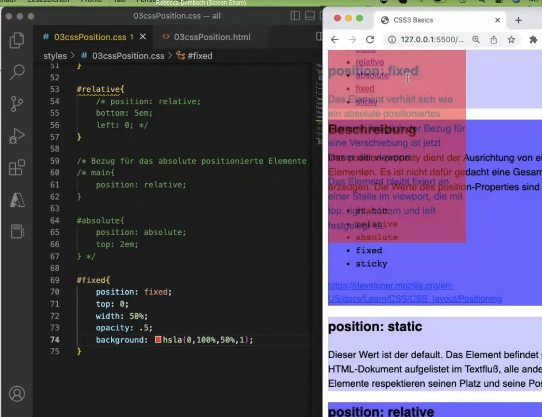

# 1 什么是元素的显示与隐藏

本质：让一个元素在页面中隐藏或者显示出来。
**目的:**让一个元素在页面中消失或者显示出来    
**场景:**类似网站广告，当我们点击关闭就不见了，但是我们重新刷新页面，会重新出现！

# 2 总结

| 属性         | 区别          | 用途                                        |
| ---------- | ----------- | ----------------------------------------- |
| display    | 隐藏对象，不保留位置  | 配合后面js做特效，比如下拉菜单，原先没有，鼠标经过，显示下拉菜单， 应用极为广泛 |
| visibility | 隐藏对象，保留位置   | 使用较少                                      |
| overflow   | 只是隐藏超出大小的部分 | 1. 可以清除浮动 2. 保证盒子里面的内容不会超出该盒子范围           |

# 3 display 属性

- `display` 属性用于设置一个元素应如何显示。
  - ** display 隐藏元素后，不再占有原来的位置**
- `display： none;` 隐藏对象， 
- `display ： block;` 除了转换为块级元素之外，**同时还有显示元素的意思**

后面应用及其广泛，搭配 JS 可以做很多的网页特效。
实际开发场景：配合后面js做特效，比如下拉菜单，原先没有，鼠标经过，显示下拉菜单， 应用极为广泛


# 4 visibility 可见性

visibility 属性用于指定一个元素应可见还是隐藏。

- visibility : visible;元素可视
  - 如果隐藏元素不想要原来位置，就用 `display ： none` （用处更多重点）
- visibility : hidden;元素隐藏
  - 隐藏元素后，继续占有原来的位置
  - 如果隐藏元素想要原来位置，就用 `visibility ： hidden` 


# 5 overflow 溢出

overflow 属性指定了如果内容溢出一个元素的框（超过其指定高度及宽度）时，会发生什么。
`实际开发场景`：

1. 清除浮动
2. 隐藏超出内容，隐藏掉,  不允许内容超过父盒子。

| 属性值     | 描述                      |
| ------- | ----------------------- |
| visible | 不剪切内容也不添加滚动条            |
| hidden  | 不显示超过对象尺寸的内容            |
| scroll  | 超出的部分隐藏掉不管超出内容否，总是显示滚动条 |
| auto    | 超出自动显示滚动条，不超出不显示滚动条     |

一般情况下，我们都不想让溢出的内容显示出来，因为溢出的部分会影响布局。
但是如果有定位的盒子，请慎用`overflowhidden` 因为它会隐藏多余的部分。


# 6 Opacity 半透明效果

## 6.1 Opacity
Opacity wirkt sich auf das Element selbst und <mark>alle Kinderelemente</mark> aus. 

1 代表没有半透明效果
0 代表完全透明的效果

```css
#fixed{
    position: fixed;
    top:0;
    width: 50% ; 
    opacity: 0.5; // 也可以携程 .5
}
```


## 6.2 background 中的 opcatity效果
background 标签中也可以给出 半透明效果
background 中给出只作用域自己, 不作用与子元素和孙子元素wirkt sich nur auf das Element selbst und <mark> nicht nur auf alle Kinderelemente</mark> aus. 

```css
#fixed{
    background: hsla(0, 100%, 50%, .5) // 最后一个就是 opcatity效果
}
```


# 7 Filter Funtion
https://developer.mozilla.org/en-US/docs/Web/CSS/filter-function

The `<filter-function>` data type is specified using one of the filter functions listed below. Each function requires an argument which, if invalid, results in no filter being applied.

filter CSS属性将模糊或颜色偏移等图形效果应用于元素。


使用 

```css
filter: blur(0px);
```


属性

|argument| explanantion |
|---|---|
|blur()|Blurs the image. `filter： blur(5px);` blur 模糊处理数值越大越模糊 |
|brightness()|Makes the image brighter or darker.|
|contrast()|Increases or decreases the image's contrast.|
|drop-shadow()|Applies a drop shadow behind the image.|
|grayscale()|Converts the image to grayscale.|
|hue-rotate()|Changes the overall hue of the image.|
|invert()|  Inverts the colors of the image. 变色  https://developer.mozilla.org/en-US/docs/Web/CSS/filter-function/invert|
|opacity()|Makes the image transparent.|
|saturate()| Super-saturates or desaturates the input image.|
| sepia()| Converts the image to sepia.|


例如： 
```html
<head>
   <style>
        img {
            /* blur 是一个函数，小括号里面的数值越大，图片越模糊，注意数值要加px单位 */
            filter: blur(5px);
        }
    </style>
</head>

<body>
    
</body>
```


