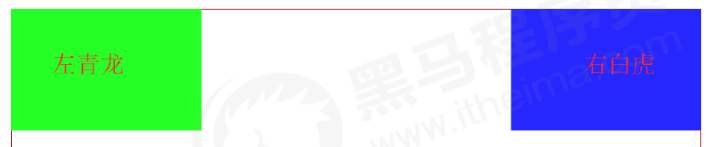
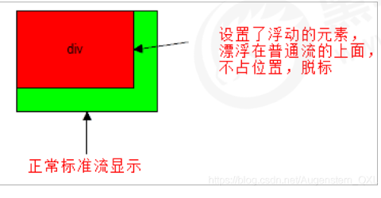
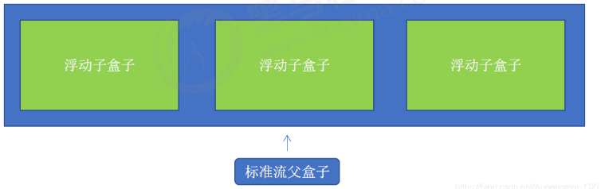
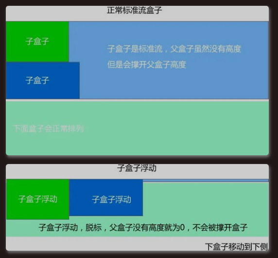

# 1 传统网页布局方式

网页布局的本质——用 CSS 来摆放盒子，把盒子放到相应位置。

CSS 提供了三种传统布局方式：

- 普通流/普通流/文档流
- 浮动
- 定位

**Ａ　普通流/普通流/文档流：**

所谓的标准流，就是标签按照规定好的默认方式排列。

1. 块级元素会独占一行，从上到下顺序排列 
   1. 常用元素：div、hr、p、h1-h6、ul、ol、dl、form、table
2. 行内元素会按照顺序，从左到右顺序排列，碰到父元素边缘则自动换行。 
   1. 常用元素：span、a、i、em

标准流是最基本的布局方式。

**B 浮动**

- 让盒子从普通流中浮起来,主要作用让多个块级盒子一行显示。

**C. 定位**

- 将盒子定在浏览器的某一个位置——CSS 离不开定位，特别是后面的 js 特效。

**D 总结：**

以上三种方式都是来摆放盒子的，盒子摆到合适位置，布局自然就完成了。

实际开发中，一个页面基本包含三种布局方式。

# 2 网页布局总结

通过盒子模型, 清楚知道大部分 html 标签是一个盒子。 
通过 CSS 浮动、定位可以让每个盒子排列成为网页。 
一个完整的网页, 是标准流、浮动、定位一起完成布局的, 每个都有自己的专门用法。
1. 标准流 可以让盒子上下排列或者左右排列, 垂直的块级盒子显示就用标准流布局。
2. 浮动 可以让多个块级元素一行显示或者左右对齐盒子, 多个块级盒子水平显示就用浮动布局。
3. 定位 定位最大的特点是有层叠的概念, 就是可以让多个盒子前后暑压来显示。如果元素自由在某个盒子内移动就用定位布局。

# 3 浮动（float)

## 3.1 为什么需要浮动？

很多布局效果，标准流没办法完成，此时就可以利用浮动完成布局。浮动可以改变元素标签默认排列方式。

1. 提问：如何让多个块级盒子(div)水平排列成一行？
   1. 比较难，虽然转换为行内块元素可以实现一行显示，但是他们之间会有大的空白缝隙，很难控制。
   2. 水平排列成一行.png)
2. 提问：如何实现两个盒子的左右对齐？
   1. 总结： 有很多的布局效果，标准流没有办法完成，此时就可以利用浮动完成布局。 因为浮动可以改变元素标签默认的排列方式.
   2. 

## 3.2 什么是浮动

元素的浮动是指设置了浮动属性的元素会

- 脱离标准普通流的控制,不占位置，脱标
- 移动到指定位置。

作用

1. 让多个盒子(div)水平排列成一行，使得浮动称为布局的重要手段。

2. 可以实现盒子的左右对齐等等。

3. 浮动最早是用来控制图片，实现文字环绕图片效果。

4. float属性会改变元素的display属性，任何元素都可以浮动。浮动元素会生成一个块级框，而不论它本身是何种元素。生成的块级框和我们前面的行内块极其相似。
   
   ## 2.3 浮动最典型应用

浮动最典型应用: 让多个块级元素一行显示。

网页布局第一准则：多个块级元素纵向排列找标准流，多个块级元素找浮动。

网页布局第二准则：先设置盒子大小，再设置盒子位置。

## 3.3 浮动的语法

`float` 属性用于创建浮动框，将其移动到一边，直到左边缘或右边缘及包含块或另一个浮动框的边缘。

语法

```
选择器 { float: 属性值; }
```

| 属性值   | 描述          |
| ----- | ----------- |
| none  | 元素不浮动 （默认值） |
| left  | 元素向左浮动      |
| right | 元素向右浮动      |

## 3.4 浮动特性（重点）

| 特点  | 说明                                                  |
| --- | --------------------------------------------------- |
| 浮   | 加了浮动的盒子**「是浮起来」**的，漂浮在其他标准流盒子的上面。                   |
| 漏   | 加了浮动的盒子**「是不占位置的」**，它原来的位置**「漏给了标准流的盒子」**。          |
| 特   | **「特别注意」**：浮动元素会改变display属性， 类似转换为了行内块，但是元素之间没有空白缝隙 |

加了浮动之后的元素，会具有一些特性。

1. 脱标：浮动元素会脱离标准流
   1. 脱离文档流的控制（浮）移动到指定位置（动），脱标 脱离文档流的盒子，会漂浮在文档流的盒子上面，不占位置。浮动的盒子不再保留原先的位置
   2. 
2. 如果多个盒子都设置了浮动，则它们会按照属性值**一行内显示并且顶端对齐排列**
   1. 浮动的元素是相互贴在一起的（没有间隙），若父级宽度放不下盒子，多出的盒子会另起一行对齐。
   2. 
3. 浮动的元素会具有行内块元素的特性
   1. 浮动元素具有行内块元素特性。 任何元素都可以浮动，设置了后元素都具有行内块元素性质。
      1. 若块级元素没有设置宽度，则默认和父级一样宽
      2. 浮动盒子中间无间隙，紧挨着
      3. 行内块元素同理

# 4 浮动的注意点

1. 浮动元素经常和标准流父级元素搭配使用： 为了约束浮动元素位置, 我们网页布局一般采取的策略是:
   
   1. 先用标准流的父元素排列上下位置，之后内部子元素采取浮动排列左右位置。符合网页布局第一准则。
   2. 

2. 一个元素浮动了，理论上其余兄弟元素也要浮动
   
   1. 一个盒子里有多个盒子，其中一个盒子浮动，其他兄弟也应该浮动，防止引起问题。

3. 浮动的盒子只会影响浮动盒子后面的标准流，不会引起前面的标准流。
   
   1. 

# 5 清除浮动

## 5.1 为什么需要清除浮动

我们前面浮动元素有一个标准流的父元素, 他们有一个共同的特点, 都是有高度的.但是, 所有的父盒子都必须有高度吗? 
理想中的状态, 让子盒子撑开父亲. 有多少孩子,我父盒子就有多高. 但是不给父盒子高度会有问题吗?..…
由于父级盒子很多情况下，不方便给高度，当时盒子浮动又不占有位置，最后父级盒子高度为 0 时，就会影响下面的盒子，对后面元素排版产生影响。

- 由于浮动元素不再占用原文档流的位置，所以它会对后面的元素排版产生影响
- 理想中的状态，让子盒子撑开父亲，有多少孩子，我父盒子就有多高
  

## 5.2 清除浮动的本质

- 由于浮动元素不再占用原文档流的位置，所以它会对后面的元素排版产生影响
- 清除浮动的本质是清除浮动元素造成的影响

为什么需要清除浮动？

- 如果父盒子本身具有高度，则不需要清除浮动
- 除浮动主要为了解决父级元素因为子级浮动引起内部高度为0 的问题
- 清除浮动之后，父级会根据浮动的子盒子自动检测高度，父级有了高度，就不会影响下面的标准流了。
  什么时候用清除浮动呢？
- 父级没高度， 子盒子浮动了， 影响下面布局了，应该清除浮动。

## 5.3 清除浮动语法

语法：

```
选择器: {
  clear: 属性值;
}
```

| 属性值   | 描述         |
| ----- | ---------- |
| left  | 不允许左侧有浮动元素 |
| right | 不允许右侧有浮动元素 |
| both  | 同时清除左右两侧浮动 |

- 我们实际工作中，几乎只用`clear:both`
- 清除浮动的策略是：**闭合浮动**： 只让浮动在父盒子内部影响，不影响父盒子外面的其他盒子。

## 5.4 清除浮动的方法：

1. **额外标签法（隔墙法）**，是 W3C 推荐的方法
2. 父级添加 overflow 属性
3. 父级添加 after 伪元素
4. 父级添加双伪元素

| 清除浮动方式             | 优点        | 缺点                     |
| ------------------ | --------- | ---------------------- |
| 额外标签法(隔墙法)         | 通俗易懂，书写方便 | 添加许多无意义的标签，结构化较差       |
| 父级overflow:hidden; | 书写简单      | 溢出隐藏                   |
| 父级after伪元素         | 结构语义化正确   | 由于IE6-7不支持：after，兼容性问题 |
| 父级双伪元素             | 结构语义化正确   | 由于IE6-7不支持：after，兼容性问题 |

### 5.4.1 清除浮动 额外标签法

也成为隔墙法，是 W3C 推荐的方法。

额外标签法是在最后一个浮动元素末尾添加一个 **空块级元素**，给其赋以属性 `clear:both;`。

- 优点：通俗易懂，书写方便
- 缺点：添加许多无意义的标签，结构化差
- 使用场景： 实际开发中可能会遇到，但是不常用。

```
<style>
  clear: both;
</style>
<div class="clear"></div>
```

### 5.4.2 清除浮动 父级添加 overflow

- 可以给父级添加 `overflow` 属性，将其属性设置为 `hidden`、`auto`或`scroll`。 注意是给父元素添加代码
- 优点：代码简洁
- 缺点：无法显示溢出部分. 内容增多时候容易造成不会自动换行导致内容被隐藏掉，无法显示需要溢出的元素。

### 5.4.3 清除浮动 :after 伪元素法

实际上也是额外标签法的一种。:after 方式是额外标签法的升级版。也是给父元素添加

- 优点：没有增加标签，结构更简单
- 缺点：需要照顾低版本浏览器。由于IE6-7不支持:after，使用 zoom:1触发 hasLayout。
- 代表网站：百度、淘宝、网易等

```
.clearfix {
  content: "";
  display: block;
  height: 0;
  clear: both;
  visibility: hidden;
}
.clearfix {
  /*IE6、7专有*/
  *zoom: 1;
}
```

### 5.4.4 清除浮动 双伪元素法

-也是给父元素添加

- 优点：代码更简洁
- 缺点：照顾低版本浏览器。由于IE6-7不支持:after，使用 zoom:1触发 hasLayout。
- 代表网站：小米、腾讯

语法

```
.clearfix::before,.clearfix::after {
  content: "";
  display: table;
}
.clearfix::after {
  clear: both;
}
.clearfix {
  *zoom: 1;
}
```
