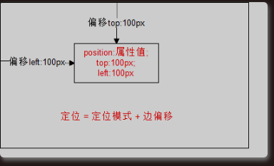
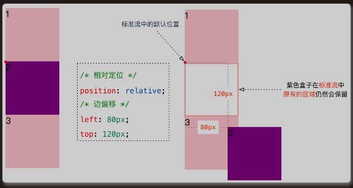
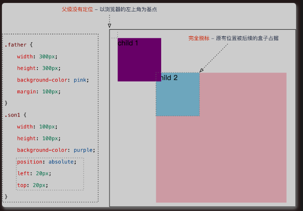
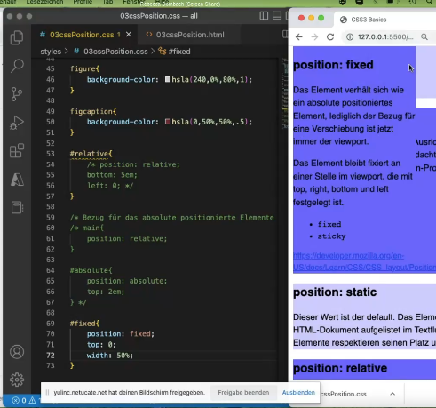
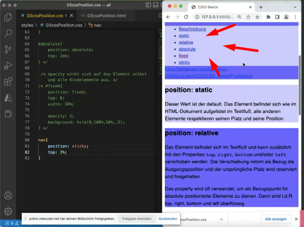
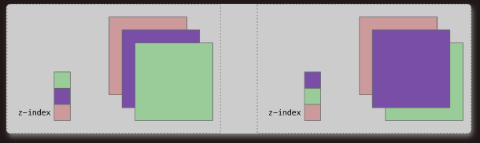
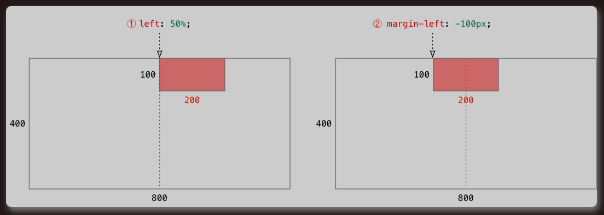

# 1 为什么需要定位
将盒子**「定」**在某一个**「位」**置  自由的漂浮在其他盒子(包括标准流和浮动)的上面。

提问：以下情况使用标准流或者浮动能实现吗？

1. 某个元素可以自由的在一个盒子内移动位置，并且压住其他盒子。
2. 当我们滚动窗口的时候，盒子是固定屏幕某个位置的。

以上效果，一些固定盒子的效果，标准流或浮动都无法快速实现，，此时需要定位来实现

1. 浮动可以让多个块级盒子一行没有缝隙的排列显示，经常用于横向排列盒子
2. 定位则是可以让盒子自由的在某个盒子内移动位置或固定屏幕中某个位置，并且可以压住其他盒子
3. 定位：将盒子定在某一个位置，所以定位也是在摆放盒子，按照定位的方式移动盒子

# 2 定位组成
所以，我们脑海应该有三种布局机制的上下顺序👇👇  
<mark>标准流在最底层 (海底)  -------    浮动 的盒子 在 中间层  (海面)  -------   定位的盒子 在 最上层  （天空)</mark>

定位：将盒子定在某一个位置，所以定位也是在摆放盒子，按照定位的方式移动盒子。
<mark>定位=定位模式+边偏移。</mark>
- 定位模式用于指定一个元素在文档中的定位方式。
- 边偏移则决定了该元素的最终位置。


## 2.1 定位模式 position

定位模式决定元素的定位方式，它通过 CSS 的 position 属性来设置，其值可以分为四个值：

| 值        | 语义   |
| -------- | ---- |
| static   | 静态定位 |
| relative | 相对定位 |
| absolute | 绝对定位 |
| fixed    | 固定定位 |

## 2.2 边偏移 left

边偏移就是定位的盒子移动到最终位置。有 top， bottom， left 和 right 4 个属性
<mark>对于任何 posotion形式, 脱离 position 这个标签 , 使用 有 top， bottom， left 和 right 4 个属性, 则这个4个属性的给入, 一点作用都没有 </mark>

| 边偏移属性  | 示例             | 描述                       |
| ------ | -------------- | ------------------------ |
| top    | `top:80px`     | 顶端偏移量，定义元素相对于其父元素上边线的距离。 这里给出的如果是正值的话, 元素会向下移动|
| bottom | `bottom: 80px`,  `bottom: 5%`, `bottom: 5` | 底部偏移量，定义元素相对于其父元素下边线的距离。这里给出的如果是正值的话, 元素会向上移动 |
| left   | `left： 80px`   | 左侧偏移量，定义元素相对于其父元素左边线的距离。这里给出的如果是正值的话, 元素会右偏移 |
| right  | `right: 80px`  | 右侧偏移量，定义元素相对于其父元素右边线的距离。 |

# 3 定位模式总结

| 定位模式         | 是否脱标     | 移动位置      | 是否常用   |
| ------------ | -------- | --------- | ------ |
| static静态定位   | 否        | 不能使用边偏移   | 很少, 默认定位方式, 默认定位方式    |
| relative相对定位 | 否（占有位置）  | 相对于自身位置移动 | 常用     |
| absolute绝对定位 | 是（不占有位置） | 相对于定位父级移动位置   | 常用     |
| fixed固定定位    | 是（不占有位置） | 相对于浏览器移动位置    | 常用     |
| sticky       | 否 （占有位置）        | 相对于浏览器移动位置   | ？ |

- 一定要记住相对定位，固定定位，绝对定位的两个大特点：
    1.是否占有位置（脱标否）
    2.以谁为基准点移动
- 重点学会子绝父相（儿子绝对定位，父亲必须相对定位）
-  `边偏移` 需要和 `定位模式` 联合使用，`单独使用无效`；
- 边偏移:
    - `top` 和 `bottom` 不要同时使用；
    - `left` 和 `right` 不要同时使用。

## 3.1 静态定位 static (了解)
Dieser Wert ist der default. Das Element befindet sich wie im HTML-Dokument aufgelistet im Textfluß, alle anderen Elemente respektieren seinen Platz und seine Position.

- 静态定位是元素的默认定位方式，默认定位方式。
- 静态定位按照标准流特性摆放位置，它没有边偏移
- 静态定位按照标准流特性摆放位置，它没有边偏移静态定位在布局时很少用到。

语法：

```
选择器 {
  position: static;
}
```

## 3.2 相对定位 relative（重要）

相对定位是元素在移动位置的时候，是相对于它原来的位置来说的（自恋型）。
Das Element befindet sich im Textfluß und kann zusätzlich mit den Properties top, right, bottom und/oder left verschoben werden. Die Verschiebung nimmt als Bezug die Ausgangsposition und der ursprüngliche Platz wird reserviert und freigehalten.

Das property wird oft verwendet, um als Bezugspunkt für absolute positionierte Elemente zu dienen. Dann sind i.d.R. top, right, bottom und left überflüssig.



语法：

```
选择器 {
  position: relative;
  top: 5em;
  left: 7em;  
}
```

Properties: 
 top, right, bottom , left 

**相对定位的特点：（务必记住）**

1. 它是相对于自己原来的位置来移动的（移动位置的时候参照点是自己原来的位置）。

2. <mark>原来在标准流的位置继续占有</mark>，后面的盒子仍然以标准流的方式对待它。（不脱标，继续保留原来位置因） 

3. 相对定位并没有脱标。它最典型的应用是给绝对定位当爹的。

## 3.3 绝对定位 absolute （重要）

绝对定位是元素在移动位置的时候，是相对于它祖先元素来说的（拼爹型）。
Das Element wird aus dem Textfluß entfernt und von Folgeelementen und Elternelementen ignoriert, die seinen Platz einnehmen. 
Zusätzlich schrumpft 收缩 es auf seine tatsächliche Größe. 
Es wird zum Block-Element und kann deshalb eine width zugewiesen bekommen.

Das Element kann mit den Properties top, right, bottom und/oder left verschoben werden. 
Bezugspunkt für die Verschiebung ist hier der nächste Vorfahre (祖先), der selbst positioniert ist, also nicht static.

语法：

```
选择器 {
  position: absolute;
}
```

绝对定位的特点： （务必记住）
1. 绝对定位不再占有原先的位置。（脱标）
    1. 所以绝对定位是脱离标准流的
2. 绝对定位是元素以带有定位的父级元素来移动位置
    1. 如果 **没有祖先元素** 或者 **祖先元素没有定位**，则以 **浏览器整个界面** 为准定位（ Document 文档）。
        1. 
    2. 如果祖先元素有定位（相对、绝对、固定定位） ，则以最近一级的<mark>有定位的祖先元素</mark>为参考点 (bezugspunkt) 移动位置。没有定位的祖先元素不考虑
        1. xx richt sich nach Vorfahre aus : 以 Vorfahre为 基准点 移动
        2. 

   
   ### 3.3.1 绝对定位盒子水平居中
- 加了绝对定位的盒子不能通过`margin: 0 auto`水平居中
- 但是可以通过以下计算方法实现水平和垂直居中
  - `left:50%` ； 让盒子的左侧移动到父级元素的水平中心位置
  - `margin-left: -100px`; 让盒子向左移动自身宽度的一半

```
.box {
    position: absolute;
    /* 1.left走50%，父容器宽度的一半 */
    left: 50%;
    /* 2.margin 负值往左边走 自己盒子宽度的一半 */
    margin-left: -xx;
}
```

## 3.4 子绝父相 (绝对定位和相对定位 的使用场景)

弄清楚这个口诀，就明白了绝对定位和相对定位的使用场景。

这个“子绝父相”太重要了，是我们学习定位的口诀，是定位中最常用的一种方式这句话的意思是：子级是绝对定位的话，父级要用相对定位
总结： 因为父级需要占有位置，因此是相对定位，子盒子不需要占有位置，则是绝对定位

- 子级绝对定位，不会占有位置，可以放到父盒子里面的任何一个地方，不会影响其他的兄弟盒子。

- 父盒子需要加定位, 给父盒子自己 占一个位置，父盒子就有一个确定的 左上角的点 的坐标了 ，
    - 子盒子为 absolute 的定位模式 ， 以父盒子的位置（左上角点）为bezugspunkt 
    - 这样就可以的以此来限制子盒子在父盒子内显示。

- 父盒子布局时，需要占有位置，因此父亲只能是相对定位。
  
  这就是子绝父相的由来，所以相对定位经常用来作为绝对定位的父级。 
  


## 3.5 固定定位 fixed （绝对定位的一种特殊形式）

固定定位是元素固定于浏览器可视区的位置。 <mark> 以阅览器的viewport 为基准, 不以某个元素为基准 </mark>
<mark>注意这里说的是 可视窗口, 不是整个页面内容全部的窗口. 当 页面向下滚动, 有些内容就不可视了, 就不在可视窗口中了</mark>
 
主要使用场景：可以在浏览器页面滚动时元素的位置不会改变。
Das Element verhält sich wie ein absolute positioniertes Element, lediglich der Bezug für eine Verschiebung ist jetzt immer der viewport.
Das Element bleibt fixiert an einer Stelle im viewport, die mit top, right, bottom und left festgelegt ist.

语法：

```
选择器 {
  position: fixed;
}
```

固定定位的特点： （务必记住）

1. 以浏览器的可视窗口为参照点移动元素： 浏览器可视窗口+边偏移属性来设置元素的位置
   - 跟父元素没有任何关系
   - 不随滚动条滚动
2. 完全脱标： 固定定位不 占有原先的位置。
   1. 固定定位也可以看做是一种特殊的绝对定位。

### 3.5.1 固定定位小技巧：固定在版心右侧位置。

1. 让固定定位的盒子 left： 50%，走到浏览器可视区（也可以看做版心）的一半位置。
2. 让固定定位的盒子 margin—left）板心宽度的一半距离。多走版心宽度的一半位置就可以让固定定位的盒子贴着版心右侧对弃了

就可以让固定定位的盒子贴着版心右侧对齐了。

```css
.box {
    position: absolute;
    /* 1.left走50%，父容器宽度的一半 */
    left: 50%;
    /* 2.margin 负值往左边走 自己盒子宽度的一半 */
    margin-left: -xx;
}
```

### 3.5.2 例子2


## 3.6 粘性定位 sticky (了解)

Das Element verhält sich relative, bis zu einem gegebenen offset, dann verhält es sich wie fixed.
基本上，可以看出是position:relative和position:fixed的结合体
当元素在屏幕内，表现为relative. 随着页面的滚动，当导航距离上边缘0距离的时候，黏在了上边缘，表现如同position:fixed。

### 3.6.1 粘性定位的特点：

1. 以浏览器的可视窗口为参照点移动元素（固定定位特点）
    1. 注意这里说的是 可视窗口, 不是整个页面内容全部的窗口. 当 页面向下滚动, 有些内容就不可视了, 就不在可视窗口中了 
2. 但sticky元素效果完全受制于父级元素
    1. 一般html 来说 , 阅览器中可视的内容 都是从 body 标签中的内容开始的
    2. 但如果这个sticky 元素的父元素不是 body 标签, 而是某个 body 标签的的后代便签.  
    3.  sticky元素是 有占有相对位置的, 相对于父标签(如果这个父标签 有 position 属性)
    4.   sticky元素虽然能够固定在 viewport 的某处一时. 但是则随着 页面的上下移动, 父标签 逐渐不在浏览器的可视窗口被显示, 则sticky元素 也不会一直 能够固定在 viewport 的某处. 
    5. 会随着 鼠标的上下移动,   父亲标签 在 可视窗口 中 显示 height 一点点减少的同时, 若小于 sticky元素的 总的 height. 则sticky元素一点点减少的 显示在 可视范围内. 直到完全不显示在可视范围内, (因为父元素也因为鼠标的上下移动, 不显示在可视范围内了  ) 
3. 粘性定位占有原先的位置（相对定位特点）
    1. 是相对于父元素的 左上面 作为其 bezugpunkt 
    
4. 必须添加 top， left， right， bottom 其中一个才有效
5. 跟页面滚动搭配使用。兼容性较差， IE 不支持。

### 3.6.2 Sticky 粘性的 语法：

```
选择器 {
  position: sticky; 
  top: 10px;
}
```

### 3.6.3 sticky元素效果完全受制于父级元素
https://www.zhangxinxu.com/wordpress/2018/12/css-position-sticky/

sticky效果 和`position:fixed`定位有着根本性的不同. fixed元素直抵页面根元素，其他父元素对 fixed元素 的left/top定位无法限制。

根据我简单的测试，发现了sticky元素以下一些特性表现：

1.  父级元素不能有任何`overflow:visible`以外的overflow设置，否则没有粘滞效果。因为改变了滚动容器（即使没有出现滚动条）。因此，如果你的`position:sticky`无效，看看是不是某一个祖先元素设置了`overflow:hidden`，移除之即可。
2.  `2019-05-22新增`  
    父级元素设置和粘性定位元素等高的固定的`height`高度值，或者高度计算值和粘性定位元素高度一样，也没有粘滞效果。我专门写了篇文章深入讲解了粘性效果无效的原因，可以[点击这里查看](https://www.zhangxinxu.com/wordpress/2020/03/position-sticky-rules/)。
3.  同一个父容器中的sticky元素，如果定位值相等，则会重叠；如果属于不同父元素，且这些父元素正好紧密相连，则会鸠占鹊巢，挤开原来的元素，形成依次占位的效果。至于原因需要理解粘性定位的计算规则，同样[点击这里查看](https://www.zhangxinxu.com/wordpress/2020/03/position-sticky-rules/)。
4.  sticky定位，不仅可以设置`top`，基于滚动容器上边缘定位；还可以设置`bottom`，也就是相对底部粘滞。如果是水平滚动，也可以设置`left`和`right`值。


### 3.6.4 例子1  (重要)

层级结构: body > nav> ul 
sticky 属性 赋给nav
向下滚动的时候, nav 这一部分一直都不动, 有点类似浮在上面, 但是都会随着页面动起来 
nav 这部分被固定在可视窗口中, 所以他页面下滚的时候, nav tag 中的内容总是 可视的, 可以出现的. 

### 3.6.5 例子2  (重要)
层级结构: body > nav> ul 
sticky 属性赋给ul

效果:  ul元素 会随着 鼠标的上下移动,   父亲标签 在 可视窗口 中 显示 height 一点点减少的同时, 若小于 sticky元素的 总的 height. 则sticky元素一点点减少的 显示在 可视范围内. 直到完全不显示在可视范围内, (因为父元素也因为鼠标的上下移动, 不显示在可视范围内了  ) 
解释: 本页中的 3.6.1 粘性定位的特点 的 点2 

### 3.6.6 例子2 (很重要 )

见 https://www.zhangxinxu.com/wordpress/2018/12/css-position-sticky/

由于每一段短新闻都在section标签中，属于不同的父元素，因此，滚动的时候，后面的新闻标题才能把前面已经sticky定位的新闻标题推开，这是sticky定位天然的特性，无需任何JavaScript的帮助。
```html
<article>
    <section>
        <h4>网曝王宝强殴打马蓉</h4>
        <content>
            <p>12月2日，有网友爆料称...</p>
        </content>
        <footer>网友评论：...</footer>
    </section>
    <section>
        <h4>知情人爆料称马蓉闯入王宝强家拿剪刀对峙</h4>
        <content>
            <p>...</p>
        </content>
        <footer>网友评论：...</footer>
    </section>
    ...
</article>
```

```css
article h4, 
h4 {
    position: sticky;
    top: 0;
    z-index: 1;
}
content {
    position: relative;
}
footer {
    position: sticky;
    bottom: 50vh;
    z-index: -1;
}
```

如果，我们这里的HTML结构做调整，标题都是平级的，如下：
则最终效果是所有sticky定位的新闻标题都会重叠在一起，这并不是我们想要的效果。所以，记住了，position:sticky布局的时候，使用合适的HTML结构很重要。
```html
<article>
    <section>
        <h4>网曝王宝强殴打马蓉</h4>
        <content>
            <p>12月2日，有网友爆料称...</p>
        </content>
        <footer>网友评论：...</footer>
        <!-- 下一个短新闻 -->
        <h4>知情人爆料称马蓉闯入王宝强家拿剪刀对峙</h4>
        <content>
            <p>...</p>
        </content>
        <footer>网友评论：...</footer>
    </section>
    ...
</article>
```

效果中，网友评论从后面钻出来的效果又是如何实现的呢？
两个关键点：

1.  定位用的`bottom`，效果和`top`正好是对立的。设置`top`粘滞的元素随着往下滚动，是先滚动后固定；而设置`bottom`粘滞的元素则是先固定，后滚动；
2.  `z-index:-1`让网友评论footer元素藏在了content的后面，于是才有了“犹抱琵琶半遮面”的效果。

# 4 定位叠放次序 z-index

在使用定位布局时，可能会出现盒子重叠的情况。加了定位的盒子，默认**「后来者居上」**， 后面的盒子会压住前面的盒子。此时，可以使用 z—index 来控制盒子的前后次序（z 轴）


语法：

```
选择器 {
  z-index: 1;
}
```

z-index的特性如下:
- 数值可以是正整数、负整数或 0. 默认是 auto , 就是为0
- 数值越大，盒子越靠上
- 如果属性值相同，则按照书写顺序，后来居上
- 数字后面不能加单位
- 只有定位的盒子才有 z-index 属性
- z-index只能用于相对定位、绝对定位和固定定位的元素，其他标准流、浮动和静态定位无效。

# 5 定位的拓展

## 5.1 绝对定位的盒子居中

加了绝对定位的盒子不能通过 margin：auto 水平居中，但是可以通过以下计算方法实现水平和垂直居中。

- left： 50% ：让盒子的左侧移动到父级元素的水平中心位置。
- margin-left：-100px； ：让盒子向左移动自身宽度的一半。
- 1.  同理垂直居中。



## 5.2 定位特殊特性

绝对定位和固定定位也和浮动类似。

1. 行内元素添加绝对或者固定定位，可以直接设置高度和完度。
2. 块级元素添加绝对或者固定定位，如果不给宽度或者高度，默认大小是内容的大小。

## 5.3 脱标的盒子不会触发外边距塌陷

浮动元素、绝对定位（固定定位）元素的都不会触发外边距合并的问题。

## 5.4 绝对定位（固定定位）会完全压住盒子

1. 浮动元素不同，只会压住它下面标准流的盒子，但是不会压住下面标准流盒子里面的文字（图片）
2. 但是绝对定位（固定定位）会压住下面标准流所有的内容。
3. 浮动之所以不会压住文字，因为浮动产生的目的最初是为了做文字环绕效果的。文字会围绕浮动元素

## 5.5 定位改变display属性
前面提过， display 是 显示模式， 可以通过以下方式改变显示模式:

-   可以用inline-block  转换为行内块
    
-   可以用浮动 float 默认转换为行内块（类似，并不完全一样，因为浮动是脱标的）
    
-   绝对定位和固定定位也和浮动类似， 默认转换的特性 转换为行内块。
    

所以说， 一个行内的盒子，如果加了**「浮动」**、**「固定定位」**和**「绝对定位」**，不用转换，就可以给这个盒子直接设置宽度和高度等。
