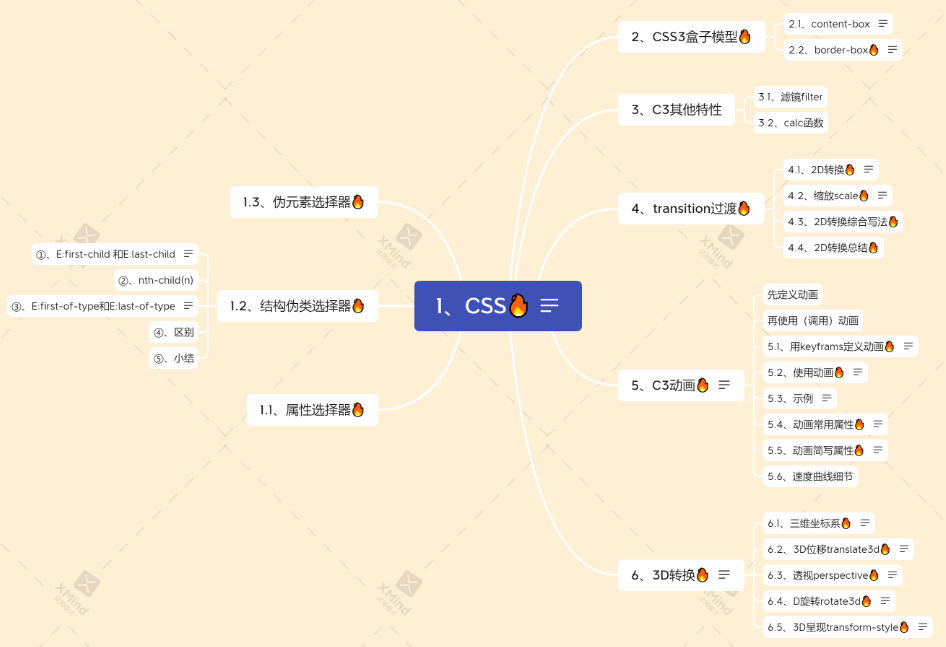

# 1 新特性 总结





# 2 浏览器私有属性

浏览器私有前缀是为了兼容老版本的写法，比较新版本的浏览器无须添加。

1. 私有前缀
   
   - `-moz-`: 代表firefox浏览器私有属性
   - `-ms-`: 代表ie浏览器私有属性
   - `-webkit-`: 代表safari、chrome私有属性-o-∶代表Opera私有属性

2. 提倡的写法
   
   ```
   -moz-border-radius: 10px;
   -webkit-border-radius: 10px;
   -o-border-radius: 10px;
   border-radius: 10px;
   ```

# 3 属性的过渡 (transition)

过渡（transition）是CSS3中具有颠覆性的特征之一，我们可以在不使用Flash动画或JavaScript的情况下，当元素从一种样式变换为另一种样式时为元素添加效果。
过渡动画：是从一个状态渐渐的过渡到另外一个状态 可以让我们页面更好看，更动感十足，虽然低版本浏览器不支持（ie9以下版本）但是不会影响页面布局。

我们现在经常和 :hover 一起搭配使用。

## 3.1 transition 的属性
「定义」过渡transition是一个复合属性，包括transition-property、transition-duration、transition-timing-function、transition-delay这四个子属性。通过这四个子属性的配合来完成一个完整的过渡效果。

```css
transition: 要过渡的属性 花费时间 运动曲线 何时开始;

或者
transition-property: 过渡属性(默认值为all)
transition-duration: 过渡持续时间(默认值为0s)
transiton-timing-function: 过渡函数(默认值为ease函数)
transition-delay: 过渡延迟时间(默认值为0s)

```

过渡的口诀：谁做过渡给谁加
1. 属性：想要变化的css属性，宽度高度背景颜色内外边距都可以。如果想要所有的属性都变化过渡，写一个all就可以。
2. 花费时间：单位是秒（必须写单位）比如 0.5s
3. 运动曲线：默认是ease （可以省略）
   1. 
4. 何时开始：单位是秒（必须写单位）可以设置延迟触发时间默认是Os （可以省略）

```css
.test{
    height: 100px;
    width: 100px;
    background-color: pink;
    transition-duration: 3s;
/*     以下三值为默认值，稍后会详细介绍 */
    transition-property: all;
    transition-timing-function: ease;
    transition-delay: 0s;
}    
.test:hover{
    width: 500px;
}
~~~html
<div class="test"></div>
```
### 3.1.1 过渡属性 transition-property
-   值: none | all | `<transition-property>[,<transition-property>]`
    -   none: 没有指定任何样式
    -  all: 默认值，表示指定元素所有支持transition-property属性的样式
    -  width: https://mp.weixin.qq.com/s?__biz=MzU0Mjg0MzI1Nw==&mid=2247484170&idx=1&sn=7e524ed872a5242e3cd5c9595afb7ff1&chksm=fb15cb1ccc62420a5ee1ed5735e069a63fe04512e6d219effc28d794c8a7a323cfc44e9bc325&scene=178&cur_album_id=1517142067985088512#rd
    - background: 见上面
    - width, background: 见上面 
-   初始值: all
-   应用于: 所有元素
-   继承性: 无
-   `<transition-property>`: 可过渡的样式，可用逗号分开写多个样式


### 3.1.2 过渡持续时间 transition-duration
Demo 见 https://mp.weixin.qq.com/s?__biz=MzU0Mjg0MzI1Nw==&mid=2247484170&idx=1&sn=7e524ed872a5242e3cd5c9595afb7ff1&chksm=fb15cb1ccc62420a5ee1ed5735e069a63fe04512e6d219effc28d794c8a7a323cfc44e9bc325&scene=178&cur_album_id=1517142067985088512#rd

-   值: `<time>[,<time>]*`
-   初始值: 0s
-   应用于: 所有元素
-   继承性: 无
-   [注意]该属性不能为负值
-   [注意]若该属性为0s则为默认值，若为0则为无效值。所以必须带单位
-   [注意]该值为单值时，即所有过渡属性都对应同样时间；该值为多值时，过渡属性按照顺序对应持续时间

### 3.1.3 过渡时间函数 timing-function
过渡时间函数用于定义元素过渡属性随时间变化的过渡速度变化效果

-   值: `<timing-function>[,<timing-function>]*`
-   初始值: ease
-   应用于: 所有元素
-   继承性: 无

**「取值」**:  过渡时间函数共三种取值，分别是关键字、steps函数和bezier函数
**「关键字」**: 
其实是bezier函数或steps函数的特殊值
- `ease: 开始和结束慢，中间快。  
- linear: 匀速。   
- ease-in: 开始慢。   
- ease-out: 结束慢。   
- ease-in-out: 和ease类似，但比ease幅度大。`


## 3.2 复合写法
```css
transition: 要过渡的属性 花费时间 运动曲线 何时开始;
```

- transition的这四个子属性之间不能用逗号隔开，只能用空格隔开。因为逗号隔开的代表不同的属性(transition属性支持多值，多值部分稍后介绍)；而空格隔开的代表不同属性的四个关于过渡的子属性。
- 过渡transition的这四个子属性只有transition-duration是必需且不能为0。
- transition-duration和transition-delay都是时间
    - 当两个时间同时出现时，第一个是transition-duration，第二个是transition-delay；
    - 当只有一个时间时，它是transition-duration，而transition-delay为默认值0s

### 3.2.1 例子


```css
div {
    width: 200px;
    height: 100px;
    background-color: pink;
    /* transition: width .5s, height .5s; */
    transition: all .5s;
    /*代表持续时间为2s，延迟时间为默认值0s*/  
    transition；2s;
    /*代表持续时间为1s，延迟时间为2s*/  
    transition: 1s 2s;
}
div:hover {
    width: 400px;
    height: 200px;
    background-color: skyblue;
}


=================
<div class="test"></div>

```

```css
<head>
   <style>
        div {
            width: 200px;
            height: 100px;
            background-color: pink;
            /* transition: 变化的属性 花费时间 运动曲线 何时开始; */
            /* 如果想要写多个属性，利用逗号进行分割 */
            transition: width 0.5s, height 0.5s;
            /* 如果想要多个属性都变化，属性写all就可以了 */
            transition: all 0.5s;
        }

        div:hover {
            width: 400px;
            height: 200px;
            background-color: red;
        }
    </style>
</head>

<body>
    <div></div>
</body>
```

# 4 2D 转换 transform

转换（`transform`）是 CSS3 中具有颠覆性的特征之一，可以实现元素的位移、旋转、缩放等效果。

2D转换是改变标签在二维平面上的位置和形状, 转换可以理解为变形。
- 移动：`translate`
- 旋转：`rotate`
- 缩放：`scale`

## 4.1 总结

1. 转换transform 我们简单理解就是变形 有2D 和 3D 之分
2. 我们暂且学了三个 分别是 位移 旋转 和 缩放
3. 2D 移动 translate(x, y) 最大的优势是不影响其他盒子， <mark>里面参数用%，是相对于自身宽度和高度来计算的 </mark> (When using percentage in translate, it refers to width or height of itself. )
    1. you can use vw and vh to translate based on the viewport size. https://stackoverflow.com/questions/11160227/translate-x-and-y-percentage-values-based-on-elements-height-and-width
    2. `@keyframes bubbleup { 0% { transform: translateY(100vh); } 100% { transform: translateY(0vh); }}`
4. 可以分开写比如 translateX(x) 和 translateY(y)
5. 2D 旋转 rotate(度数) 可以实现旋转元素 度数的单位是deg
6. 2D 缩放 sacle(x,y) 里面参数是数字 不跟单位 可以是小数 最大的优势 不影响其他盒子
7. 设置转换中心点 transform-origin : x y; 参数可以百分比、像素或者是方位名词
8. l当我们进行综合写法，同时有位移和其他属性的时候，记得要将位移放到最前

## 4.2 二维坐标系


## 4.3 移动 transform: translate(x, y)

2D移动是2D转换里面的一种功能，可以改变元素在页面中的位置，**类似**定位。

语法

```css
transform: translate(x, y);
transform: translateX(x);
transform: translateY(y);

transform:translate(100px,100px); /* 如果只移动X轴 */ 
transform:translate(100px,0); 
translateX(100px);
```


重点
- 定义 2D 转换中的移动，沿着X和Y轴移动元素. 2D 移动 translate(x, y) 最大的优势是不影响其他盒子，
- 对行内标签没有效果
- 可以分开写比如 translateX(x) 和 translateY(y)
- translate 最大的优点：不会影响到其他元素的位置
- 参数 `x, y` 可以是百分数，为盒子自身的宽度或高度。 translate 中的百分比单位是相对于 本身元素 的宽度和高度来计算的:  `trainslate:(50%，50%)`
    - you can use vw and vh to translate based on the viewport size. https://stackoverflow.com/questions/11160227/translate-x-and-y-percentage-values-based-on-elements-height-and-width
    - `@keyframes bubbleup { 0% { transform: translateY(100vh); } 100% { transform: translateY(0vh); }}`


```css
div {
  background-color: lightseagreen;
  width: 200px;
  height: 100px;
  /* 平移 */
  /* 水平垂直移动 100px */
  /* transform: translate(100px, 100px); */

  /* 水平移动 100px */
  /* transform: translate(100px, 0) */

  /* 垂直移动 100px */
  /* transform: translate(0, 100px) */

  /* 水平移动 100px */
  /* transform: translateX(100px); */

  /* 垂直移动 100px */
  transform: translateY(100px);
  /*百分比用法*/
  transform: translateY(100%);  
   /*vh 用法*/
  transform: translateY(40vh);  
  transform: translateX(70vh);
}
```

### 4.3.1 让盒子实现水平和垂直居中

```css
/*子绝父相*/
position: absolute;
top: 50%;
left: 50%;
transform: translate(-50%, -50%);


========================
div {  
    position: relative;  
    width: 500px;  
    height: 500px;  
    background-color: pink;  
    /* 1. 我们tranlate里面的参数是可以用 % */  
    /* 2. 如果里面的参数是 % 移动的距离是 盒子自身的宽度或者高度来对比的 */  
    /* 这里的 50% 就是 50px 因为盒子的宽度是 100px */  
    /* transform: translateX(50%); */  
    }  
          
p {  
    position: absolute;  
    top: 50%;  
    left: 50%;  
    width: 200px;  
    height: 200px;  
    background-color: purple;  
    /1.* margin-top: -100px;  
    margin-left: -100px; */  
    
    /2.* translate(-50%, -50%)    
      盒子往上走自己高度的一半   */  
    transform: translate(-50%, -50%);  
  }  
          
span {  
    /* translate 对于行内元素是无效的 */  
    transform: translate(300px, 300px);  
     }

```


## 4.4 旋转 transform: rotate()

值为正数则顺时针旋转，为负数则逆时针旋转。

1. rotate 里面跟度数，单位是 deg 比如 rotate(45deg)
2. **角度为正时，顺时针，负时，为逆时针**
3. 默认旋转的中心点是元素的中心点

语法：

```css
transform: rotate(45deg);

/* 单位是：deg */
img:hover {
  transform: rotate(360deg)
}

```

例子：

```html
<head>
   <style>
        img {
            width: 150px;
            border-radius: 50%;
            border: 5px solid pink;
            /* 过渡写到本身，谁做动画给谁加 */
            transition: all 0.3s;
        }

        img:hover {
            transform: rotate(360deg);
        }
    </style>
</head>

<body>
    
</body>
```

### 4.4.1 2D转换中心点 transform-origin

我们可以通过设置 `transform-origin` 设置元素转换的中心点。

语法

```css
transform-origin: x y;
```

 重点

- 注意后面的参数 x 和 y 用空格隔开
- x y 默认转换的中心点是元素的中心点（50% 50%）
- 还可以给 x y 设置像素或者方位名词（top bottom left right center）

例子

```css
<head>
   <style>
        div {
            width: 200px;
            height: 200px;
            background-color: pink;
            margin: 100px auto;
            transition: all 1s;
            /* 1.可以跟方位名词 ,以左下角为轴进行旋转*/
            transform-origin: left bottom;
        }

        div:hover {
            transform: rotate(360deg);
        }
    </style>
</head>

<body>
    <div></div>
</body>
```

## 4.5 缩放 transform: scale(x, y)

缩放：`scale`,只要给元素添加上了这个属性就能控制它放大还是缩小

```css
 transform: scale(x, y);
```

- 注意其中的x和y用逗号分割
- sacle缩放最大的优势：
    - 不占空间. 
    - 可以设置转换中心点缩放，默认以中心点缩放的，而且不影响其他盒子
    - 可以配合 `transform-origin` 使用，改变缩放中心。

## 4.6 使用 transform: scale(x, y)
transform: scale(1, 1): 宽高都放大一倍，相当于没有放大
transform: scale(2, 2): 宽和高都放大了二倍
transform: scale(2): 如果只写了一个参数，第二个参数就和第一个参数一致
transform: scale(0.5, 0.5): 缩小

- 参数大于 `1` 则放大，小于 `1` 则缩小。
- `x, y` 不跟单位的话，是指缩放的倍数。

  ```css
  transform: scale(2,1);

   div:hover {  
    /* 注意，数字是倍数的含义，所以不需要加单位 */  
    /* transform: scale(2, 2) */  
     
    /* 实现等比缩放，同时修改宽与高 */  
    /* transform: scale(2) */  
     
    /* 小于 1 就等于缩放*/  
    transform: scale(0.5, 0.5)  
   }

  ```


```css
<head>
   <style>
        div {
            width: 200px;
            height: 200px;
            background-color: pink;
            margin: 100px auto;
        }

        div:hover {
            /* 1.里面写的数字不跟单位 就是倍数的意思 1就是1倍，2就是2倍 */
            transform: scale(2, 2);
        }
    </style>
</head>

<body>
    <div></div>
</body>
```

## 4.7 2D 转换综合写法

注意：
1. 同时使用多个转换，其格式为： `transform: translate(), rotate() scale()`
2. 其顺序会影转换的效果。（先旋转会改变坐标轴方向）
3. 当我们同时有位移和其他属性的时候，记得要将位移放到最前.

```css
<head>   
   <style>
        div {
            width: 200px;
            height: 200px;
            background-color: pink;
            transition: all .5s;
        }

        div:hover {
            /* 我们同时有位移和其他属性，我们需要把位移放到最前面 位移，旋转，缩放*/
            transform: translate(150px, 50px) rotate(180deg) scale(1.2);
        }
    </style>
</head>

<body>
    <div></div>
</body>
```

# 5 动画 animation

动画( animation ) 是 CSS3 中具有颠覆性的特征之一，可通过设置多个节点来精确控制一个或一组动画，常用来实现复杂的动画效果。
相比较过渡，动画可以实现更多变化，更多控制，连续自动播放等效果。

## 5.1 动画的基本使用

分为两步：

1. 定义动画 (动画序列 `%α`)
2. 使用/调用动画

### 5.1.1 用keyframs定义一个动画

```css
 /* 1. 定义动画 */
@keyframes move {
    /*开始状态*/
    0% {
        transform: translateX(0px);
    }
    /*结束状态*/
    100% {
        transform: translateX(1000px);
    }
}
```

### 5.1.2 调用动画

```css
div {
    width: 200px;
    height: 200px;
    background-color: pink;
    /* 2. 调用动画 */
    /* 动画名称 */
    animation-name: move;
    /* 持续时间 */
    animation-duration: 5s;
}
```

## 5.2 动画序列 (@keyframes 规则)

- 0% 是动画的开始，100% 是动画的完成。这样的规则就是动画序列。
- 在 @keyframes 中规定某项 CSS 样式，就能创建由当前样式逐渐改为新样式的动画效果。
- 动画是使元素从一种样式逐渐变化为另一种样式的效果。您可以改变任意多的样式任意多的次数。
- 请用百分比来规定变化发生的时间，或用关键词"from"和“to”，等同于0%和100%。

注意:

1. 可以做多个状态的变化 `keyframes` 关键帧
2. 百分比必须是整数
3. 百分比是总时间 `animation-duration` 的划分
4. 不怎么用 left, top. 而 常用 transform: translate(). 因为 Das ist performanter.

@keyframes 规则用来定义动画各个阶段的属性值，类似于 flash 动画中的关键帧，语法格式如下：
语法说明如下：
animationName：表示动画的名称；
from：定义动画的开头，相当于 0%；
percentage：定义动画的各个阶段，为百分比值，可以添加多个；
to：定义动画的结尾，相当于 100%；
properties：不同的样式属性名称，例如 color、left、width 等等。

```css
@keyframes animationName {
    from {
        properties: value;
    }
    percentage {
        properties: value;
    }
    to {
        properties: value;
    }
}
// 或者
@keyframes animationName {
    0% {
        properties: value;
    }
    percentage {
        properties: value;
    }
    100% {
        properties: value;
    }
}
```

```css
下面我们来看一个简单的 @keyframes 规则示例：

@keyframes ball {
    0% { top: 0px; left: 0px;}
    25% { top: 0px; left: 350px;}
    50% { top: 200px; left: 350px;}
    75% { top: 200px; left: 0px;}
    100% { top: 0px; left: 0px;} 
}
```

```css
<style>  
    div {  
      width: 100px;  
      height: 100px;  
      background-color: aquamarine;  
      animation-name: move;  
      animation-duration: 0.5s;  
    }  
  
    @keyframes move{  
      0% {  
        transform: translate(0px)  
      }  
      100% {  
        transform: translate(500px, 0)  
      }  
    }  
  </style>
```

## 5.3 动画常用属性
http://c.biancheng.net/css3/animation.html

| 属性                          | 描述                                        |
| --------------------------- | ----------------------------------------- |
| `keyframes`                 | 规定动画。                                     |
| `animation`                 | 所有动画属性的简写属性,除了animation-play-state属性。     |
| `animation-name`            | (必须的) 规定@keyframes动画的名称. . animation-duration 属性的默认值为 0, 无动画效果. 要绑定到 HTML 元素的动画名称，可以同时绑定多个动画，动画名称之间使用逗号进行分隔.  none 表示表示无动画效果 |
| `animation-duration`        | (必须的) 规定动画完成一个周期所花费的秒或毫秒，默认是0。        |
| `animation-timing-function` | 规定动画的速度曲线，默认是“ease” .                     |
| `animation-delay`           | 规定动画何时开始，默认是0.                            |
| `animation-iteration-count` | 规定动画被播放的次数，默认是1，还有infinite                |
| `animation-direction`       | 规定动画是否在下一周期逆向播放，默认是 "normal",alternate逆播放 |
| `animation-play-state`      | 设置动画是否正在运行或暂停。默认是"running",还有"paused".    |
| `animation-fill-mode`       | 规定动画结束后状态,保持forwards回到起始backwards         |

```css
div {  
  width: 100px;  
  height: 100px;  
  background-color: aquamarine;  
  /* 动画名称 */  
  animation-name: move;  
  /* 动画花费时长 */  
  animation-duration: 2s;  
  /* 动画速度曲线 */  
  animation-timing-function: ease-in-out;  
  /* 动画等待多长时间执行 */  
  animation-delay: 2s;  
  /* 规定动画播放次数 infinite: 无限循环 */  
  animation-iteration-count: infinite;  
  /* 是否逆行播放 */  
  animation-direction: alternate;  
  /* 动画结束之后的状态 */  
  animation-fill-mode: forwards;  
}  
  
div:hover {  
  /* 规定动画是否暂停或者播放 */  
  animation-play-state: paused;  
}
```

### 5.3.1 动画简写属性

```css
animation: animation-name animation-duration animation-timing-function animation-delay animation-iteration-count animation-direction animation-fill-mode animation-play-state;
animation: 动画名称 持续时间 运动曲线 何时开始 播放次数 是否反方向 动画起始或者结束的状态;
animation: myfirst 5s linear 2s infinite alternate;
```

知识要点
- 简写属性里面不包含 `animation-play-state`
- 暂停动画: `animation-play-state: puased;`
- 经常和鼠标经过等其他配合使用想要动画走回来，而不是直接跳回来: `animation-direction: alternate`
- 盒子动画结束后，停在结束位置:  `animation-fill-mode: forwards`


### 5.3.2 速度曲线细节 animation-timing-function

`animation-timing-function`：规定动画的速度曲线，默认是“ease”. 用来设置动画播放的速度曲线，通过速度曲线的设置可以使动画播放的更为平滑

| **值**       | **描述**                  |
| ----------- | ----------------------- |
| linear      | 动画从头到尾的速度是相同的。匀速        |
| ease        | 默认。动画以低速开始，然后加快，在结束前变慢。 |
| ease-in     | 动画以低速开始。                |
| ease-out    | 动画以低速结束。                |
| ease-in-out | 动画以低速开始和结束。             |
| steps()     | 指定了时间函数中的间隔数量（步长）       |
|cubic-bezier(n, n, n, n)	| 使用 cubic-bezier() 函数来定义动画的播放速度，参数的取值范围为 0 到 1 之间的数值 |

```css
/*打字机效果*/  
div {  
  width: 0px;  
  height: 50px;  
  line-height: 50px;  
  white-space: nowrap;  
  overflow: hidden;  
  background-color: aquamarine;  
  animation: move 4s steps(24) forwards;  
}  
  
@keyframes move {  
  0% {  
    width: 0px;  
  }  
  
  100% {  
    width: 480px;  
  }  
}
```

```html
<!DOCTYPE html>
<html>
<head>
    <style>
        @keyframes ball {
            0% {left: 0px;}
            50% {left: 350px;}
            100% {left: 0px;}
        }
        div {
            width: 100px;
            height: 100px;
            border-radius: 50%;
            border: 3px solid black;
            text-align: center;
            line-height: 100px;
            position: relative;
            animation-name: ball;
            animation-duration: 2s;
        }
        .one {
            animation-timing-function: ease;
        }
        .two {
            animation-timing-function: ease-in;
        }
        .three {
            animation-timing-function: ease-out;
        }
        .four {
            animation-timing-function: ease-in-out;
        }
    </style>
</head>
<body>
    <div class="one">ease</div>
    <div class="two">ease-in</div>
    <div class="three">ease-out</div>
    <div class="four">ease-in-out</div>
</body>
</html>
```

运行结果如下图所示：  


### 5.3.3 animation-fill-mode
animation-fill-mode 属性用来设置当动画不播放时（开始播放之前或播放结束之后）动画的状态（样式），属性的可选值如下：

|值	|描述|
|---|---|
|none	|不改变动画的默认行为|
|forwards	|当动画播放完成后，保持动画最后一个关键帧中的样式|
|backwards	|在 animation-delay 所指定的时间段内，应用动画第一个关键帧中的样式|
|both|	同时遵循 forwards 和 backwards 的规则|

```html
<!DOCTYPE html>
<html>
<head>
    <style>
        @keyframes box {
            0% {transform: rotate(0);}
            50% {transform: rotate(0.5turn);}
            100% {transform: rotate(1turn);}
        }
        div {
            width: 100px;
            height: 100px;
            border-radius: 50%;
            float: left;
            border: 3px solid black;
            text-align: center;
            line-height: 100px;
            position: relative;
            animation-name: box;
            animation-duration: 2s;
            animation-iteration-count: 1;
            animation-fill-mode: forwards;
        }
    </style>
</head>
<body>
    <div>forwards</div>
</body>
</html>
```

### 5.3.4 animation-delay

animation-delay 属性用来定义动画开始播放前的延迟时间，单位为秒或者毫秒，属性的语法格式如下：
animation-delay: time;

其中参数 time 就是动画播放前的延迟时间，参数 time 既可以为正值也可以为负值。参数值为正时，表示延迟指定时间开始播放；参数为负时，表示跳过指定时间，并立即播放动画。

```html
<!DOCTYPE html>
<html>
<head>
    <style>
        @keyframes ball {
            0% {left: 0px;}
            50% {left: 350px;}
            100% {left: 0px;}
        }
        div {
            width: 100px;
            height: 100px;
            border-radius: 50%;
            border: 3px solid black;
            text-align: center;
            line-height: 100px;
            position: relative;
            animation-name: ball;
            animation-duration: 2s;
        }
        .one {
            animation-delay: 0.5s;
        }
        .two {
            animation-delay: -0.5s;
        }
    </style>
</head>
<body>
    <div class="one">0.5s</div>
    <div class="two">-0.5s</div>
</body>
</html>
```


### 5.3.5 animation-direction
animation-direction 属性用来设置是否轮流反向播放动画，属性的可选值如下：

|值	|描述|
|---|---|
|normal	|以正常的方式播放动画|
|reverse	|以相反的方向播放动画|
|alternate	|播放动画时，奇数次（1、3、5 等）正常播放，偶数次（2、4、6 等）反向播放|
|alternate-reverse	|播放动画时，奇数次（1、3、5 等）反向播放，偶数次（2、4、6 等）正常播放|


## 5.4 整体示例

需求：我们想页面一打开，一个盒子就从左边走到右边

```css
<head> 
   <style>
        /* 需求：我们想页面一打开，一个盒子就从左边走到右边 */
        /* 1.定义动画 */

        @keyframes move {
            /* 开始状态 */
            0% {
                transform: translateX(0px);
            }
            /* 结束状态 */
            100% {
                transform: translateX(1000px);
            }
        }

        div {
            width: 200px;
            height: 200px;
            background-color: pink;
            /* 使用动画 */
            animation-name: move;
            /* 持续时间 */
            animation-duration: 2s;
        }
    </style>
</head>

<body>
    <div></div>
</body>
```

from to 语法

```html
<head>  
   <style>
        /* 需求：我们想页面一打开，一个盒子就从左边走到右边 */
        /* 1.定义动画 */

        @keyframes move {
            from {
                transform: translate(0, 0);
            }
            to {
                transform: translate(1000px, 0);
            }
        }

        div {
            width: 200px;
            height: 200px;
            background-color: pink;
            /* 使用动画 */
            animation-name: move;
            /* 持续时间 */
            animation-duration: 2s;
        }
    </style>
</head>

<body>
    <div></div>
</body>
```


# 6 3D 转换

我们生活的环境是3D的，照片就是3D物体在2D平面呈现的例子.

3D转换的特点：
- 近大远小。
- 物体后面遮挡不可见

当我们在网页上构建3D效果的时候参考这些特点就能产出3D效果。

## 6.1 三维坐标系

三维坐标系其实就是指立体空间，立体空间是由3个轴共同组成的。


- x轴：水平向右 **注意： x 右边是正值，左边是负值**
- y轴：垂直向下 **注意： y 下面是正值，上面是负值**
- z轴：垂直屏幕 **注意： 往外面是正值，往里面是负值**

## 6.2 3D 转换知识要点
3D 转换我们主要学习工作中最常用的 3D 位移 和 3D 旋转
-   `3D` 位移：`translate3d(x, y, z)`
-   `3D` 旋转：`rotate3d(x, y, z)`
-   `透视` ：`perspctive`
-   `3D`呈现 `transfrom-style`

## 6.3 3D位移translate3d
```css
  transform: translate3d(100px, 100px, 100px)  
  /* 注意：x, y, z 对应的值不能省略，不需要填写用 0 进行填充 */  
  transform: translate3d(100px, 100px, 0)
```

3D移动在2D移动的基础上多加了一个可以移动的方向，就是z轴方向

- translform:translateX(100px)：仅仅是在x轴上移动
- translform:translateY(100px)：仅仅是在Y轴上移动
- translform:translateZ(100px)：仅仅是在Z轴上移动（注意：translateZ一般用px单位）
- transform:translate3d(x,y,z)：其中 x、y、z 分别指要移动的轴的方向的距离
-  注意：x, y, z 对应的值不能省略，不需要填写用 0 进行填充

因为z轴是垂直屏幕，由里指向外面，所以默认是看不到元素在z轴的方向上移动

## 6.4 透视perspective

透视：在2D平面产生近大远小视觉立体，但是只是效果二维的. 如果想要在网页产生3D效果需要透视（理解成3D物体投影在2D平面内）
- 模拟人类的视觉位置，可认为安排一只眼睛去看
- 透视我们也称为视距：视距就是人的眼睛到屏幕的距离
- 距离视觉点越近的在电脑平面成像越大，越远成像越小
- 透视的单位是像素

透视写在被观察元素的父盒子上面的


知识要点
- 透视需要写在被视察元素的父盒子上面
- d：就是视距，视距就是一个距离人的眼睛到屏幕的距离。
- z：就是 z轴，物体距离屏幕的距离，z轴越大（正值） 我们看到的物体就越大

### 6.4.1 perspective的语法
```css
body {
  /*透视需要写在被视察元素的父盒子上面 */
  perspective: 1000px;
}
```

### 6.4.2 translateZ
- perspecitve 给父级进行设置视距的，translateZ 给 子元素进行设置不同的大小  
- translform:translateZ(100px)：仅仅是在Z轴上移动。
-   有了透视，就能看到translateZ 引起的变化了
    -   translateZ：近大远小
    -   translateZ：往外是正值
    -   translateZ：往里是负值

## 6.5 3D旋转 rotate3d

### 6.5.1 语法
3D旋转：3D旋转指可以让元素在三维平面内沿着 x轴，y轴，z轴或者自定义轴进行旋转。
- transform: rotateX(45deg) ：沿着X轴正方向旋转45度
- transform: rotateY(45deg) ：沿着Y轴正方向旋转45度
- transform: rotateZ(45deg) ：沿着Z轴正方向旋转45度
- transform: rotate3d(x,y,z,deg) ：沿着自定义轴旋转 deg为角度(了解即可)

xyz是表示旋转轴的矢量，是标示你是否希望沿着该轴旋转，最后一个标示旋转的角度。

```css
/*沿着X轴旋转45deg*/
transform: rotate3d(1,0,0,45deg) 
/*沿着对角线旋转45deg*/
transform: rotate3d(1,1,0,45deg) 
```


### 6.5.2 rotateX: 左手准则

-   左手的手拇指指向 x轴的正方向
-   其余手指的弯曲方向就是该元素沿着x轴旋转的方向


```css
div {
  /*透视写在被视察元素的父盒子上面 */
  perspective: 300px;
}
/*被观察元素*/
img {
  display: block;
  margin: 100px auto;
  transition: all 1s;
}

img:hover {
  transform: rotateX(-45deg)
}
```

### 6.5.3 rotateY: 左手准则

-   左手的手拇指指向 y轴的正方向
-   其余手指的弯曲方向就是该元素沿着y轴旋转的方向（正值）


```css
div {  
  perspective: 500px;  
}  
  
img {  
  display: block;  
  margin: 100px auto;  
  transition: all 1s;  
}  
  
img:hover {  
  transform: rotateY(180deg)  
}
```

### 6.5.4 rotateZ
```css
div {  
  perspective: 500px;  
}  
  
img {  
  display: block;  
  margin: 100px auto;  
  transition: all 1s;  
}  
  
img:hover {  
  transform: rotateZ(180deg)
```

### 6.5.5 rotate3d
-   transform: rotate3d(x, y, z, deg) -- 沿着自定义轴旋转 deg 为角度
-   x, y, z 表示旋转轴的矢量，是标识你是否希望沿着该轴进行旋转，最后一个标识旋转的角度
    -   transform: rotate3d(1, 1, 0, 180deg) -- 沿着对角线旋转 45deg
    -   transform: rotate3d(1, 0, 0, 180deg) -- 沿着 x 轴旋转 45deg

```
div {
  perspective: 500px;
}

img {
  display: block;
  margin: 100px auto;
  transition: all 1s;
}

img:hover {
  transform: rotate3d(1, 1, 0, 180deg)
}

```


## 6.6 3D呈现transform-style


- 这个属性很重要, 控制子元素是否开启三维立体环境
- transform-style: flat 子元素不开启3d立体空间 默认的
- transform-style: preserve-3d 子元素开启立体空间
- 代码写给父级，但是影响的是子盒子


```html
<body>  
    <div class="box">  
        <div></div>  
        <div></div>  
    </div>  
</body>
```

```css
<style>  
    body {  
        perspective: 500px;  
        }  
          
    .box {  
        position: relative;  
        width: 200px;  
        height: 200px;  
        margin: 100px auto;  
        transition: all 2s;  
        /* 让子元素保持3d立体空间环境 */  
        transform-style: preserve-3d;  
        }  
          
    .box:hover {  
        transform: rotateY(60deg);  
    }  
          
    .box div {  
        position: absolute;  
        top: 0;  
        left: 0;  
        width: 100%;  
        height: 100%;  
        background-color: pink;  
    }  
          
    .box div:last-child {  
        background-color: purple;  
        transform: rotateX(60deg);  
    }  
</style>
```