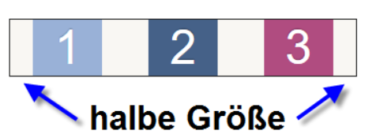
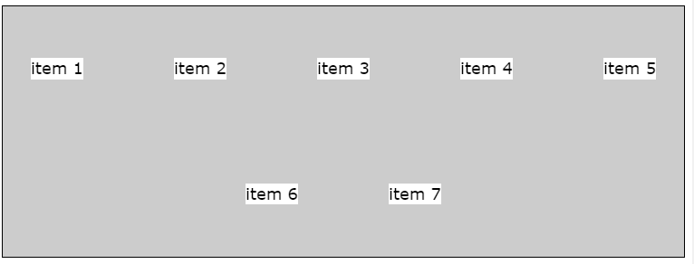
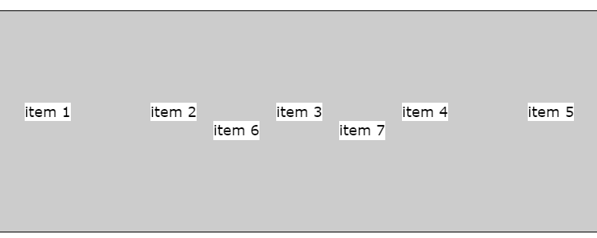
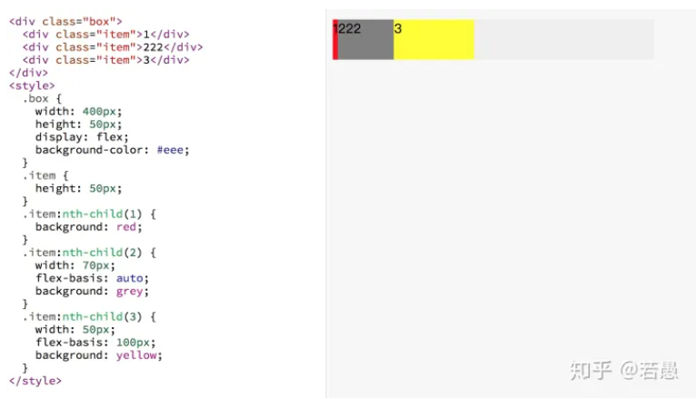
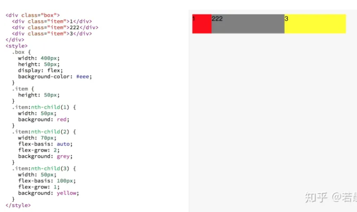

# 1 流式布局(百分比布局)

- 流式布局，就是百分比布局，也称非固定像素布局。
- 通过盒子的宽度设置成百分比来根据屏幕的宽度来进行伸缩，不受固定像素的限制，内容向两侧填充。

```html
<head>
    <meta charset="UTF-8">
    <meta name="viewport" content="width=device-width, initial-scale=1.0">
    <meta http-equiv="X-UA-Compatible" content="ie=edge">
    <title>Document</title>
    <style>
        * {
            margin: 0;
            padding: 0;
        }

        section {
            width: 100%;
            max-width: 980px;
            min-width: 320px;
            margin: 0 auto;
        }

        section div {
            float: left;
            width: 50%;
            height: 400px;
        }

        section div:nth-child(1) {
            background-color: pink;
        }

        section div:nth-child(2) {
            background-color: purple;
        }
    </style>
</head>

<body>
    <section>
        <div></div>
        <div></div>
    </section>
</body>
```


# 2 flex布局 (使用 flexbox)

| 传统布局            | flex弹性布局             |
| --------------- | -------------------- |
| 兼容性好            | 操作方便，布局极为简单，移动端应用很广泛 |
| 布局繁琐            | PC 端浏览器支持情况较差        |
| 局限性，不能再移动端很好的布局 | IE 11或更低版本，不支持或仅部分支持 |

建议：

1. 如果是PC端页面布局，我们还是传统布局。
2. 如果是移动端或者不考虑兼容性问题的PC端页面布局，我们还是使用flex弹性布局

## 2.1 flex布局原理

flex 是 flexible Box 的缩写，意为"弹性布局"，用来为盒状模型提供最大的灵活性，任何一个容器都可以指定为 flex 布局。

- 当我们为父盒子设为 flex 布局以后，<mark>子元素的 float、clear 和 vertical-align 属性将失效。</mark>
- 伸缩布局 = 弹性布局 = 伸缩盒布局 = 弹性盒布局 =flex布局

采用 Flex 布局的元素，称为 Flex 容器（flex container），简称"容器"。它的所有子元素自动成为容器成员，称为 Flex 项目（flex item），简称"项目"。


- 上述例子 div 就是 flex父容器。
- 上述例子 span 就是 子容器 flex项目
- 子容器可以横向排列也可以纵向排列

总结 flex 布局原理：就是通过给父盒子添加 flex 属性，来控制子盒子的位置和排列方式。

## 2.2 初体验

1 搭建HTML结构

```html
<div>
  <span>1</span>
  <span>2</span>
  <span>3</span>
</div>
```

2 CSS样式

span 直接给宽度和高度，背景颜色，还有蓝色边框
给 div 只需要添加 display: flex 即可

```html
<head>
    <meta charset="UTF-8">
    <meta name="viewport" content="width=device-width, initial-scale=1.0">
    <meta http-equiv="X-UA-Compatible" content="ie=edge">
    <title>Document</title>
    <style>
        div {
            display: flex;
            width: 80%;
            height: 300px;
            background-color: pink;

        }

        div span {
            /* width: 150px; */
            height: 100px;
            background-color: purple;
            margin-right: 5px;
            flex: 1;
        }
    </style>
</head>

<body>
    <div>
        <span>1</span>
        <span>2</span>
        <span>3</span>
    </div>
</body>
```


# 3 flex-container (父项)
转变为 flex-container
- 使用 `display: flex` (行为像 block 元素), 作者 使用 `display: flex | inline-flex`  (行为像 inline 元素)
- it makes all direct children to flex-items.  </mark>所有儿子 会被转变为 flex-items . 孙子就不会被转变.  </mark>
- Flex-items can than be arranged in column or in row.


## 3.1 flex-Container 的属性总览
flex-Container 指的是 父项

以下有 6 个属性是对父元素设置的

|properties |description |
|--|---|
|display| sets the flex-container, which can be block (flex) or inline (inline-flex).|
|flex-direction|设置主轴的方向. sets the axes. The value row is default and sets the main-axis horizontal and the cross-axis vertical.|
|flex-wrap|设置子元素是否换行. lets the flex-items wrap, if there is not enough room, or will fit them all in one line without wrapping them. <br> 其他方法: You can make single-line-containers or multi-lined with `wrap`.|
|flex-flow|复合属性，相当于同时设置了 flex-direction 和 flex-wrap. It combines flex-direction and flex-wrap.|
|justify-content|设置主轴(hauptachse)上的子元素排列方式. it aligns all flex-items along the main-axis.|
|align-items|设置侧轴(Kreuzachse, cross achx)上的子元素排列方式（单行）. 当转行是的时候, 显示出来的两行之间有间隔 <br> it aligns them along the cross-axis, over a single line.|
|align-content|设置侧轴上的子元素的排列方式（多行）.  当转行是的时候, 显示出来的两行之间无间隔 间隔. 有umbruch ja oder nein <br>it aligns the flex-items along the cross axis, but only in multi-lined containers with enough space along the cross-axis.|
|gap|applies space between items. item 之间的间隙， 这样就会显示出间隙.  <br> You can specify further <code>row-gap</code> or <code>column-gap</code> |

例子: 


```html
    <article id="expContainer">
        <h2>Examples for container properties</h2>
        <p>The example uses div-containers, but the properties can be applied to all elements.</p>
        <div>
            <div>item 1</div>
            <div>item 2</div>
            <div>item 3</div>
            <div>item 4</div>
            <div>item 5</div>
            <div>item 6</div>
            <div>item 7</div>
        </div>
    </article>
```

```css
#expContainer > div,
#expItem > div{
    background-color: hsla(240,0%,80%,1);
    border: 1px solid;
    height: 40vh;
}
```

## 3.2 flex-direction设置主轴方向

### 3.2.1 主轴和侧轴 main-axis and the cross-axis.

主轴和侧轴：在 flex 布局中，是分为主轴和侧轴两个方向，就是 main-axis and the cross-axis.
The axes are important for setting all directions properties, because they are not assigned horizontally or vertically but to main- and cross-axis.

同样的叫法有：行和列、x轴和y轴

- 默认主轴方向就是 x 轴方向，水平向右
- 默认侧轴方向就是 y 轴方向，水平向下


```css
<head>
    <meta charset="UTF-8">
    <meta name="viewport" content="width=device-width, initial-scale=1.0">
    <meta http-equiv="X-UA-Compatible" content="ie=edge">
    <title>Document</title>
    <style>
        div {
            /* 给父级添加flex属性 */
            display: flex;
            width: 800px;
            height: 300px;
            background-color: pink;
            /* 默认的主轴是 x 轴 行 row  那么y轴就是侧轴喽 */
            /* 我们的元素是跟着主轴来排列的 */
            /* flex-direction: row; */
            /* 我们可以把我们的主轴设置为 y轴 那么 x 轴就成了侧轴 */
            flex-direction: column;
        }

        div span {
            width: 150px;
            height: 100px;
            background-color: purple;
        }
    </style>
</head>

<body>
    <div>
        <span>1</span>
        <span>2</span>
        <span>3</span>
    </div>
</body>
```


### 3.2.2 flex-direction属性决定主轴的方向

- flex-direction 属性决定主轴的方向（即项目的排列方向）
- 注意： 主轴和侧轴是会变化的，就看 flex-direction 设置谁为主轴，剩下的就是侧轴。而我们的子元素是跟着主轴来排列的

| 属性值            | 说明          |
| -------------- | ----------- |
| **row**        | **默认值从左到右** |
| row-reverse    | 从右到左        |
| column     | 从上到下    |
| column-reverse | 从下到上        |


## 3.3 flex-wrap (设置子元素是否换行)

默认情况下，项目都排在一条线（又称”轴线”）上。flex-wrap属性定义，flex布局中默认是不换行的。

 `nowrap`： 意思就是如果按照我们设置的盒子大小. 
 - 例如 一行只能装 3 个盒子，但是我们有 5 个盒子，
 - 那么 flex 布局默认会给我们塞上去，会越出盒子显示。但所有的盒子 丢在一行显示 不换行 . 
 - 这样导致有些盒子就看不见了 , 因为超出了可视范围 


| 属性值      | 说明      |
| -------- | ------- |
| nowrap   | 默认值，不换行 |
| **wrap** | **换行**  |

```html
<head>
    <meta charset="UTF-8">
    <meta name="viewport" content="width=device-width, initial-scale=1.0">
    <meta http-equiv="X-UA-Compatible" content="ie=edge">
    <title>Document</title>
    <style>
        div {
            display: flex;
            width: 600px;
            height: 400px;
            background-color: pink;
            /* flex布局中，默认的子元素是不换行的， 如果装不开，会缩小子元素的宽度，放到父元素里面  */
            /* flex-wrap: nowrap; */
            flex-wrap: wrap;
        }

        div span {
            width: 150px;
            height: 100px;
            background-color: purple;
            color: #fff;
            margin: 10px;
        }
    </style>
</head>

<body>
    <div>
        <span>1</span>
        <span>2</span>
        <span>3</span>
        <span>4</span>
        <span>5</span>
    </div>
</body>
```


## 3.4 flex-flow

flex-flow 属性是 flex-direction 和 flex-wrap 属性的复合属性

```css
flex-flow: row wrap;
```


```html
<head>
    <meta charset="UTF-8">
    <meta name="viewport" content="width=device-width, initial-scale=1.0">
    <meta http-equiv="X-UA-Compatible" content="ie=edge">
    <title>Document</title>
    <style>
        div {
            display: flex;
            width: 600px;
            height: 300px;
            background-color: pink;
            /* flex-direction: column;
            flex-wrap: wrap; */
            /* 把设置主轴方向和是否换行（换列）简写 */
            flex-flow: column wrap;
        }

        div span {
            width: 150px;
            height: 100px;
            background-color: purple;
        }
    </style>
</head>

<body>
    <div>
        <span>1</span>
        <span>2</span>
        <span>3</span>
        <span>4</span>
        <span>5</span>
    </div>
</body>
```

## 3.5 justify-content (设置主轴上的子元素排列方式)

- justify-content 属性定义了项目在主轴上的对齐方式
- **注意： 使用这个属性之前一定要确定好主轴是哪个**

| 属性值               | 说明                          |
| ----------------- | --------------------------- |
| **flex-start**    | ** 默认值就是这个** , 从头部开始 <br>如果主轴是x轴，则从左到右. 所以说右边的区域可能被空出来 <br >  如果主轴是y轴，则从上到下. 所以说下边的区域可能被空出来|
| flex-end          | 从尾部开始排列,    所以说左边的区域可能被空出来             |
| **center**        | **在主轴居中对齐(如果主轴是 x 轴则水平居中)** |
| **space-around**  | **平分剩余空间**,    两边不贴边, 两边的 leerraum 的空间, 是 对于item 之间的空间  的一半.  对于item 之间的空间 都是 等距的        |
| **space-between** | **先两边贴边，再平分剩余空间🔥** , 对于item 之间的空间 都是 等距的        |
|space-evenly|  两边不贴边, 两边的 leerraum 的空间, 是 对于item 之间的空间  是一样的  . der Platz am Anfang und am Ende genauso groß ist wie zwischen den einzelnen Items |

### 3.5.1 space-around, space-between, space-evenly
**space-around**: 
两边不贴边, 两边的 leerraum 的空间, 是 对于item 之间的空间  的一半.  对于item 之间的空间 都是 等距的   
Bei space-around wird der verfügbare Leerraum zwischen die Items verteilt und auch am Anfang und am Ende ergänzt. Das Besondere: Am Anfang und Ende ist allerdings nur halb so viel Platz wie zwischen den Items.


**space-between**: 
**先两边贴边，再平分剩余空间🔥** , 对于item 之间的空间 都是 等距的 


**space-evenly**
两边不贴边, 两边的 leerraum 的空间, 是 对于item 之间的空间  是一样的  
der Platz am Anfang und am Ende genauso groß ist wie zwischen den einzelnen Items.


### 3.5.2 例子  (space-between)

```html
<head>
    <meta charset="UTF-8">
    <meta name="viewport" content="width=device-width, initial-scale=1.0">
    <meta http-equiv="X-UA-Compatible" content="ie=edge">
    <title>Document</title>
    <style>
        div {
            display: flex;
            width: 800px;
            height: 300px;
            background-color: pink;
            /* 默认的主轴是 x 轴 row */
            flex-direction: row;
            /* justify-content: 是设置主轴上子元素的排列方式 */

            /* justify-content: flex-start; */

            /* justify-content: flex-end; */

            /* 让我们子元素居中对齐 */
            /* justify-content: center; */

            /* 平分剩余空间 */
            /* justify-content: space-around; */

            /* 先两边贴边， 在分配剩余的空间 */
            justify-content: space-between;
        }

        div span {
            width: 150px;
            height: 100px;
            background-color: purple;
        }
    </style>
</head>

<body>
    <div>
        <span>1</span>
        <span>2</span>
        <span>3</span>
        <span>4</span>
    </div>
</body>
```

主轴为x轴: 


主轴为y轴


## 3.6 align-items (设置侧轴上的子元素排列方式(单行))

该属性是控制子项在侧轴（默认是y轴）上的排列方式 在子项为单项（**单行**）的时候使用

| 属性值            | 说明               |
| -------------- | ---------------- |
| **flex-start** | **从上到下**         |
| flex-end       | 从下到上             |
| **center**     | **挤在一起居中(垂直居中)** |
| **stretch**    | **拉伸(默认值)**      |


```html
<head>
    <meta charset="UTF-8">
    <meta name="viewport" content="width=device-width, initial-scale=1.0">
    <meta http-equiv="X-UA-Compatible" content="ie=edge">
    <title>Document</title>
    <style>
        div {
            display: flex;
            width: 800px;
            height: 400px;
            background-color: pink;
            /* 主轴是 y 轴 column */
            flex-direction: column;
            /* 设置主轴上的子元素居中 */
            justify-content: center;
            /* 设置侧轴上的子元素居中 */
            align-items: center;

        }

        div span {
            width: 150px;
            height: 100px;
            background-color: purple;
            color: #fff;
            margin: 10px;
        }
    </style>
</head>

<body>
    <div>
        <span>1</span>
        <span>2</span>
        <span>3</span>
    </div>
</body>
```


## 3.7 align-content (设置侧轴上的子元素的排列方式(多行))

设置子项在侧轴上的排列方式 并且只能用于子项出现 换行 的情况（多行），在单行下是没有效果的。

| 属性值               | 说明                      |
| ----------------- | ----------------------- |
| **flex-start**    | **默认值在侧轴的头部开始排列**       |
| flex-end          | 在侧轴的尾部开始排列              |
| **center**        | **在侧轴中间显示**             |
| **space-around**  | **子项在侧轴平分剩余空间**         |
| **space-between** | **子项在侧轴先分布在两头，再平分剩余空间** |
| **stretch**       | **设置子项元素高度平分父元素高度**     |


```html
<head>
    <meta charset="UTF-8">
    <meta name="viewport" content="width=device-width, initial-scale=1.0">
    <meta http-equiv="X-UA-Compatible" content="ie=edge">
    <title>Document</title>
    <style>
        div {
            display: flex;
            width: 800px;
            height: 400px;
            background-color: pink;
            /* 默认主轴是 x 轴 */
            /* 换行 */
            flex-wrap: wrap;
            /* 因为有了换行，此时我们侧轴上控制子元素的对齐方式我们用 align-content */

            /* align-content: flex-start; */
            /* align-content: center; */
            /* align-content: space-between; */
            align-content: space-around;
        }

        div span {
            width: 150px;
            height: 100px;
            background-color: purple;
            color: #fff;
            margin: 10px;
        }
    </style>
</head>

<body>
    <div>
        <span>1</span>
        <span>2</span>
        <span>3</span>
        <span>4</span>
        <span>5</span>
        <span>6</span>
    </div>
</body>
```


## 3.8 align-content 和 align-items 区别
https://zhuanlan.zhihu.com/p/87146411

### 3.8.1 定义

-   align-items：
    -   作用对象：弹性盒子容器(flex containers)；
    -   描述：该属性可以控制弹性容器中**成员**在当前**行内**的对齐方式。
    -  当成员设置了align-self 属性时，父容器的 align-items 值则不再对它生效；
    -   w3c标准原文：[链接](https://link.zhihu.com/?target=https%3A//www.w3.org/TR/2018/CR-css-flexbox-1-20181119/%23align-items-property)
- align-content：
    -   作用对象：多行弹性盒子容器(multi-line flex containers)；
    -   描述：当弹性容器在正交轴方向还存在**空白**时，该属性可以控制其中**所有行**的对齐方式。
    -  **Note**：该属性无法作用于单行 (flex-wrap: no-wrap) 弹性盒子；
    -   w3c标准原文：[链接](https://link.zhihu.com/?target=https%3A//www.w3.org/TR/2018/CR-css-flexbox-1-20181119/%23align-content-property)

### 3.8.2 对比
相同点：
-   都被用来设置对齐行为。

不同点：
-   align-items 的设置对象是行内成员 (同一行的成员 );
-   align-content 的设置对象是所有行，且只有在多行弹性盒子容器中才生效。

1.  align-items 的上下文是行内，align-content 的上下文是弹性盒子容器；
2.  align-items 控制成员的对齐行为，align-content 控制所有行的对齐行为。

适用情况: 
- align-items 适用于单行情况下， 只有上对齐、下对齐、居中和 拉伸
- align-content 适应于换行（多行）的情况下（单行情况下无效）， 可以设置 上对齐、 下对齐、居中、拉伸以及平均分配剩余空间等属性值。
- 总结就是单行找 align-items, 多行找 align-content
  

### 3.8.3 例子: 以 center 关键字为例
https://zhuanlan.zhihu.com/p/87146411
文档对两个属性 cetner 关键字的描述：
-   align-items：行内成员会在其边界盒正交轴上被居中（如果行正交尺寸小于行内成员尺寸，行内成员将会在正交轴两方向等量溢出）。[链接](https://link.zhihu.com/?target=https%3A//www.w3.org/TR/2018/CR-css-flexbox-1-20181119/%23valdef-align-items-center)；
-   align-content：<u>所有行被集中(挤)在弹性容器（正交轴）中间</u>。它们彼此之间齐平，并且跟弹性盒子正交起始边界的空白与跟弹性盒子正交结束边界的空白相等。（如果溢出空白为负数，所有行将会在正交轴两方向等量溢出）[链接](https://link.zhihu.com/?target=https%3A//www.w3.org/TR/2018/CR-css-flexbox-1-20181119/%23valdef-align-content-center)。

接下来我们先根据定义预测对齐的行为，再运行代码验证看是否一致。戳[这里](https://link.zhihu.com/?target=https%3A//jsfiddle.net/TabrisK/m4azgrxy/4/)自己动手验证。

列出所有会产生影响的条件，包括：是否自动换行 (flex-wrap: wrap/no-wrap)，一行和多行，留和不留多余空白。3个条件排列组合后有8中可能。

### 3.8.4 例子1:


```css
#expContainer > div{
    display: flex;
    column-gap: 100px;
    row-gap: 0px;


    /* multiline */
     flex-flow: row wrap;
    justify-content: center;
    /* align-items: center;  */
    align-content: center;

  

}
```

align-items: center;
可以看到 因为 wrap , 不同行之间有很大的间隔 , 虽然  row-grap: 0px 


align-content: center;
可以看到 因为 wrap , 不同行之间没有间隔, 因为 row-grap: 0px 



## 3.9 gap 
it applies space between items. item 之间的间隙， 这样就会显示出间隙.  
https://developer.mozilla.org/zh-CN/docs/Web/CSS/gap

gap : xx    用一个值 去设置 两个方向的 间隙
gap: xx yy    xx 为 主轴方向的间隙, yy为副轴方向的间隙
```
/* One <length> value */
gap: 20px;
gap: 1em;
gap: 3vmin;
gap: 0.5cm;

/* One <percentage> value */
gap: 16%;
gap: 100%;

/* Two <length> values */
gap: 20px 10px;
gap: 1em 0.5em;
gap: 3vmin 2vmax;
gap: 0.5cm 2mm;

/* One or two <percentage> values */
gap: 16% 100%;
gap: 21px 82%;

/* calc() values */
gap: calc(10% + 20px);
gap: calc(20px + 10%) calc(10% - 5px);

/* Global values */
gap: inherit;
gap: initial;
gap: revert;
gap: revert-layer;
gap: unset;
```


### 3.9.1 row-gap 和 column-gap
You can specify further <code>row-gap</code> or <code>column-gap</code> 

!!!注意:  row-gap 和 column-gap 对应的方向和 你定义那个方向是主轴 是相关的
row-gap: 一直是副轴方向 的间隔
column-gap: 一直是主轴方向的间隔 

当 flex-direction: row 
- row-gap: 副轴方向/垂直方向, 上下之间的,  两个 item 的间隔, 
- column-gap: 主轴方向/水平方向, 左右之间的, 两个 item 的间隔

当 flex-direction: column 
- row-gap: 副轴方向/水平方向, 左右之间的, 两个 item 的间隔
- column-gap: 主轴方向/垂直方向, 上下之间的,  两个 item 的间隔,


```css
#expContainer > div{

    display: flex;

    gap: 60px;
    row-gap: 60px;
    column-gap: 60px;

    /* multiline */

     flex-flow: row wrap;

    justify-content: center;

    /* align-items: center;  */

    align-content: center;

  

}
```


# 4 flex-item (子项) 
<mark>Flex-item 也可以作为 其他的元素的 flex-container , 只要 Flex-item 中给入了 `display: flex`  </mark>


## 4.1 常见属性
使用这些属性是的 flex-item 区别于其他的 flex-item. With these properties you can align each flex-item itself and different from the other flex-items.
<mark> 当父元素不是 flex-container 的时候, 无法使用 flex-item 的特性 </mark>


|properties |description |
|--|---|
|flex-grow| 默认值为1. 就是通过鼠标, 让阅览器的view area变大变小. 1就是, item可以根据 窗口的大小 膨胀<br>allows the flex-item grow bigger along the main-axis, if there is space. The values are positive integers and they can be used as proportions.|
|flex-shrink|默认值为0, 就是通过鼠标, 让阅览器的view area变大变小. 0就是 item 不可以根据 窗口的大小 缩小.  <br> allows the flex-item to shrink, analog to flex-grow.|
|flex-basis| sets the initial size of the flex-item.  这个参数是设置 主轴方向的 intial size, 不是固定于 水平方向 或者 垂直方向. 要靠主轴设置的是哪个方向的|
|flex| 控制子项目占的分量. 这个项可以代替 在父元素中写入 `display: flex` <br>combines flex-grow, flex-shrink and flex-basis. <br> Allways use the shorthand, 就是 flex 这项.  so you have control over all three values <br> Default values are flex: 0 1 auto. |
|align-self |控制子项自己在侧轴的排列方式. <br> allows a separate alignment for individual items. The value overrides the `align-items` value for all flex-items.|
| order属性|定义子项的排列顺序（前后顺序）. allows for a different order than the given from the HTML document. <br>The default value is 0. <br>Each item can be assigned a number. The lowest number is put to the beginning of the main-axis. <br>If several items have the same value, they are put into source order. |


## 4.2 flex-basis
https://zhuanlan.zhihu.com/p/39052660

这个参数是设置 主轴方向的 intial size, 不是固定于 水平方向 或者 垂直方向. 要靠主轴设置的是哪个方向的
Flex-basis 用于设置子项的占用空间。
- 如果设置了值，则子项占用的空间为设置的值；
- <u>如果没设置, 或者为 auto，那子项的大小为 子项的空间为width/height 的值。</u>


-   对于子项1，flex-basis 如果设置默认是auto，子项占用的宽度使用width 的宽度，width没设置也为 auto，所以子项占用空间由内容决定。
-   对于子项2，flex-basis 为auto，子项占用宽度使用width 的宽度，width 为70px，所以子项子项占用空间是70px。
-   对于子项3，flex-basis 为100px，覆盖width 的宽度，所以子项占用空间是100px。

## 4.3 flex-grow and flex-shrink

值的大小
- 能是 2,3,4,5,...x, 1 或者 0 , nur ganz Zahl , 正值 或者 0
- 给入 负值, 不会报错, 但是完全没有效果 , 
- 给入2 的话, 其 在主轴方向的宽度, 是 给入1 的 item 的2倍. 

### 4.3.1 flex-grow: (用来“瓜分”父项的“剩余空间”)
https://zhuanlan.zhihu.com/p/39052660

- 容器的宽度为400px, 子项1的占用的基础空间(flex-basis)为50px，子项2占用的基础空间是70px，子项3占用基础空间是100px，剩余空间为 400-50-70-100 = 180px。 
- 其中子项1的flex-grow: 0(未设置默认为0)， 子项2flex-grow: 2，子项3flex-grow: 1，所以剩余空间分成3份，子项2占2份(120px)，子项3占1份(60px)。子项1 不占用剩余空间 
- 所以 子项1真实的占用空间为: 50+0 = 50px， 子项2真实的占用空间为: 70+120 = 190px， 子项3真实的占用空间为: 100+60 = 160px。


### 4.3.2 flex-shrink (根据超出的空间 收缩item自己的大小)
https://zhuanlan.zhihu.com/p/39052660

容器的宽度为400px, 子项1的占用的基准空间(flex-basis)为250px，子项2占用的基准空间是150px，子项3占用基准空间是100px，总基准空间为 250+150+100=500px。
容器放不下，多出来的空间需要被每个子项根据自己设置的flex-shrink 进行吸收。 
子项1的flex-shrink: 1(未设置默认为1)， 子项2 flex-shrink: 2，子项3 flex-shrink: 2。
- 子项1需要吸收的的空间为 `(250*1)/(250*1+150*2+100*2) * 100 = 33.33px`，子项1真实的空间为 250-33.33 = 216.67px。
- 同理子项2吸收的空间为`(150*2)/(250*1+150*2+100*2) * 100=40px`，子项2真实空间为 `150-40 = 110px`。
- 子项3吸收的空间为`(100*2)/(250*1+150*2+100*2) * 100 = 26.67px`，真实的空间为`100-26.67=73.33px`。


## 4.4 flex属性

Flex: flex-grow, flex-shrink ,  flex-basis.
默认值为 1 0 auto

### 4.4.1 例子
flex 属性定义子项目分配剩余空间，用flex来表示占多少份数。


```css
.item {
    flex: <number>;    /* default 0*/
}
```

```html
<head>
    <meta charset="UTF-8">
    <meta name="viewport" content="width=device-width, initial-scale=1.0">
    <meta http-equiv="X-UA-Compatible" content="ie=edge">
    <title>Document</title>
    <style>
        section {
            display: flex;
            width: 60%;
            height: 150px;
            background-color: pink;
            margin: 0 auto;
        }

        section div:nth-child(1) {
            width: 100px;
            height: 150px;
            background-color: red;
        }

        section div:nth-child(2) {
            flex: 1;
            background-color: green;
        }

        section div:nth-child(3) {
            width: 100px;
            height: 150px;
            background-color: blue;
        }

        p {
            display: flex;
            width: 60%;
            height: 150px;
            background-color: pink;
            margin: 100px auto;
        }

        p span {
            flex: 1;
        }
    </style>
</head>

<body>
    <section>
        <div></div>
        <div></div>
        <div></div>
    </section>
    <p>
        <span>1</span>
        <span>2</span>
        <span>3</span>
    </p>
</body>
```


## 4.5 align-self (控制子项自己在侧轴上的排列方式)

- align-self 属性允许单个项目有与其他项目不一样的对齐方式，可覆盖 align-items 属性。
- 默认值为 auto，表示继承父元素的 align-items 属性，如果没有父元素，则等同于 stretch。

```html
<head>
    <meta charset="UTF-8">
    <meta name="viewport" content="width=device-width, initial-scale=1.0">
    <meta http-equiv="X-UA-Compatible" content="ie=edge">
    <title>Document</title>
    <style>
        div {
            display: flex;
            width: 80%;
            height: 300px;
            background-color: pink;
            /* 让三个子盒子沿着侧轴底侧对齐 */
            /* align-items: flex-end; */
            /* 我们想只让3号盒子下来底侧 */
        }

        div span {
            width: 150px;
            height: 100px;
            background-color: purple;
            margin-right: 5px;
        }

        div span:nth-child(3) {
            align-self: flex-end;
        }
    </style>
</head>

<body>
    <div>
        <span>1</span>
        <span>2</span>
        <span>3</span>
    </div>
</body>
```


## 4.6 order (定义项目的排列顺序) 

通过这个 可以改变 item 的位置
order 只对 有flex 属性的元素生效. 

数值越小，排列越靠前 ，
- 默认为0。 可以负数, 必须是整数, 负数小于 0 
- 如果主轴是 水平方向的话, 数值约小, item 越靠左
- 如果主轴是 垂直 方向的话, 数值约小 item越靠上


注意：和 z-index 不一样。

### 4.6.1 例子1

```html
<head>
    <meta charset="UTF-8">
    <meta name="viewport" content="width=device-width, initial-scale=1.0">
    <meta http-equiv="X-UA-Compatible" content="ie=edge">
    <title>Document</title>
    <style>
        div {
            display: flex;
            width: 80%;
            height: 300px;
            background-color: pink;
            /* 让三个子盒子沿着侧轴底侧对齐 */
            /* align-items: flex-end; */
            /* 我们想只让3号盒子下来底侧 */
        }

        div span {
            width: 150px;
            height: 100px;
            background-color: purple;
            margin-right: 5px;
        }

        div span:nth-child(2) {
            /* 默认是0   -1比0小所以在前面  */
            order: -1;
        }

        div span:nth-child(3) {
            align-self: flex-end;
        }
    </style>
</head>

<body>
    <div>
        <span>1</span>
        <span>2</span>
        <span>3</span>
    </div>
</body>
```


### 4.6.2 例子2

```html
<article id="expItem">
    <h2>Examples for item properties</h2>
    <p>The example uses div-containers, but the properties can be applied to all elements.</p>
    <div>
        <div>item 1</div>
        <div>item 2</div>
        <div>item 3</div>
        <div>item 4</div>
        <div>item 5</div>
        <div>item 6</div>
        <div>item 7</div>
    </div>
</article>

```

```css
/* alignment and order */

#expItem > div > div:first-of-type{
    /* align-self: flex-start; */
    order: 1;
}

div{
    order: 2;
}
```

div 的 order 为 2 的时候


div 的 order 为 -2 的的时候 : 
item1 跑到最后面去了 
