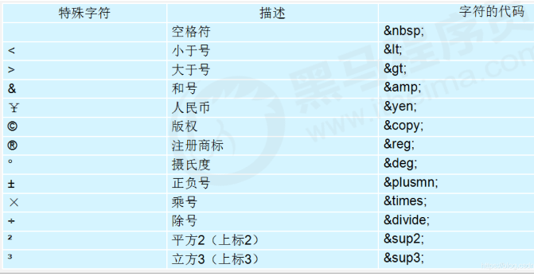

# 标题标签

为了使网页具有语义化，经常使用标题标签，HTML 提供 6 个等级的网页标题标签即 <h1>-<h6>。

```html
<h1>标题标签</h1>
<h1>标题一共六级选,</h1>
<h2>文字加粗一行显。</h2>
<h3>由大到小依次减，</h3>
<h4>从重到轻随之变。</h4>
<h5>语法规范书写后，</h5>
<h6>具体效果刷新见。</h6>
```

单词为 head 简写，从 h1-h6 依据重要性递减。

- 加了标题的文字会变的加粗，字号也会依次变大
- 一个标题独占一行

# 段落标签

`p` 指**paragraph**，意为段落。把文字有条理的显示出来就需要将文字分段显示。在 html 中，`<p>` 标签用于定义段落，将整个网页分成若干个段落。

```
<p>我是一个段落标签</p>
```

标签语义: 把 HTML 文档分割为若干段落。

**特点：**

1. 文本在一个段落中会根据浏览器窗口的大小自动换行。
2. 段落和段落之间保有空隙。
3. 不用段落标签， 只有空行， 并不会起到两端文字的分段效果

# 换行标签

`<br/>` 是 break 缩写，意为打断、换行。

不用换行标签， 直接用回车， 是不会有换行效果的 

标签语义： 强制换行

**特点：**

1. `<br/>` 是个单标签。
2. `<br/>` 标签只是简单地开始新的一行，跟段落不一样，段落之间会插入一些垂直的间距。

# 水平线标签

`<hr/>`

# 文本样式标签

在网页中，有时候需要为文字设置**粗体**、*斜体*或<u>下划线</u>等效果，需要使用 HTML 中的文本格式化标签，使文字以特殊方式显示。

标签语义： 突出重要性，比普通文字重要。

| 语义  | 标签                            | 说明                  |
| --- | ----------------------------- | ------------------- |
| 加粗  | `<strong></strong>`或`<b></b>` | 更推荐`<strong>`，语义更强烈 |
| 斜体  | `<em></em>`或`<i></i>`         | 更推荐使用`<em>`，语义更强烈   |
| 删除线 | `<del></del>`或`<s><s/>`       | 更推荐使用`<del>`，语义更强烈  |
| 下划线 | `<ins></ins>`或`<u></u>`       | 更推荐使用`<ins>`，语义更强烈  |

# 注释标签

注释快捷键为 ctrl + /   或者 ctrl +shift + / 
注释以 <!-- 开始，以--> 结束

团队约定：注释内容前后各一个空格字符，注释位于要注释代码的上面，单独占一行. 不会显示到外部的界面上 

`<!--  注释语句    -->`

# 特殊字符

重点记住：空格、大于号、小于号 这三个，其余的使用的很少，如果需要使用回头查阅即可

| 字符       | 显示  |
| -------- | --- |
| `&nbsp;` | 空格  |
| `&lt;`   | ＜   |
| `&gt;`   | ＞   |
| `&copy;` | ©   |



# div 和 span 标签 （盒子标签）

`<div>` 和 `<span>` 是没有语义的，它们是一个盒子，用来装内容的。

```
<div>这是头部</div>
<span>今日价格</span>
```

div 是 division 的缩写，表示分割、分区。

span 意思是跨度、跨距。

**特点：**

1. div 标签用来布局，但是现在一行只能放一个 div，大盒子。
   
   1. ```html
      <div>这是头部</div>123
      显示为 
      这是头部
      123
      ```
      
      这是头部 不会和 123 一行

2. span 标签用来布局，一行可以多个 span，小盒子。因为 span 是横着的, 可以让 多个span 内的内容， 在同一行显示出来
   
   1. ```html
      <div>百度1</div>
      <div>百度2</div>
      <div>百度3</div>
      
      阅览器中显示的结果为
      百度1 百度2 百度3
      
      这三个词显示在一行
      ```
