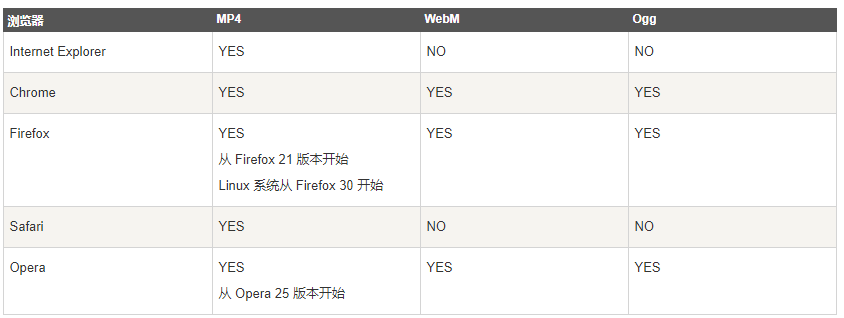
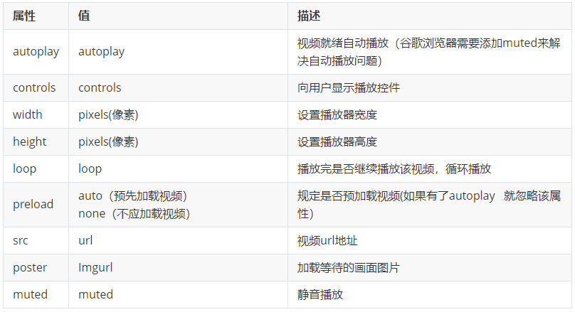
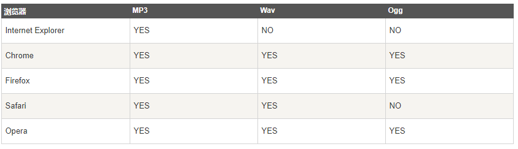
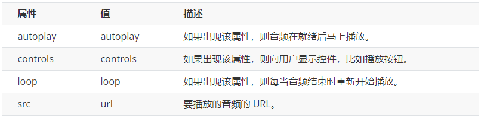

# 1 HTML5新增的音频视频标签

多媒体标签分为 音频 **audio** 和视频 **video** 两个标签 使用它们，我们可以很方便的在页面中嵌入音频和视频，而不再去使用落后的flash和其他浏览器插件了。

因为多媒体标签的 属性、方法、事件比较多，因此我们需要什么功能的时候，就需要去查找相关的文档进行学习使用。


- 音频标签和视频标签使用方式基本一致
- 浏览器支持情况不同
- 谷歌浏览器把音频和视频自动播放禁止了
- 我们可以给视频标签添加 muted 属性来静音播放视频，音频不可以（可以通过JavaScript解决）
- 视频标签是重点，我们经常设置自动播放，不使用 controls 控件，循环和设置大小属性


## 1.1 video视频

当前 `<video> ` 元素支持三种视频格式： mp4， Wav, ogg, 尽量使用 **mp4格式**

**使用语法：**

```html
 <video src="media/mi.mp4"></video>
```

 

### 1.1.1 针对不同的video格式的兼容写法

由于各个浏览器的支持情况不同，所以我们会有一种兼容性的写法，这种写法了解一下即可

```html
这种写法，浏览器会匹配video标签中的source，如果支持就播放，如果不支持往下匹配，直到没有匹配的格式，就提示文本

<video src="media/mi.mp4" controls="controls"  width="300">
    <source src="move.ogg" type="video/ogg" >
    <source src="move.mp4" type="video/mp4" >
    您的浏览器暂不支持 <video> 标签播放视频  //如果上两种格式， 阅览器都不支持， 就显示这句话： 您的浏览器暂不支持 <video> 标签播放视频
</video >
```

### 1.1.2 video 常用属性

 

**属性很多，有一些属性需要大家重点掌握：**

- `autoplay` 自动播放
  - 注意： 在google浏览器上面，默认禁止了自动播放，如果想要自动播放的效果，需要设置 muted属性
- `width` 宽度
- `height` 高度
- `loop` 循环播放
- `src` 播放源
- `muted` 静音播放
- 一般不显示controls，让视频循环播放。 加上 controls 会显示 视频条， 音量大小按钮， 和箭头播放键 

**示例代码：**

```html
<video src="media/mi.mp4" autoplay="autoplay" muted="muted"  loop="loop" poster="media/mi9.jpg"></video>
```

## 1.2 Audio音频

基本使用

当前元素支持三种视频格式： 尽量使用 **mp3格式**
 

**使用语法：**

```html
<audio src="media/music.mp3"></audio>
```

#### 1.2.1.1 兼容写法

由于各个浏览器的支持情况不同，所以我们会有一种兼容性的写法，这种写法了解一下即可

```html
<audio  controls="controls"  >
    <source src="happy.mp3" type="audio/mpeg" >
    <source src="happy.ogg" type="audio/ogg" >
    您的浏览器暂不支持 <audio> 标签。  //如果上两种格式， 阅览器都不支持， 就显示这句话： 您的浏览器暂不支持 <audio> 标签
</audio>
```

**上面这种写法，浏览器会匹配audio标签中的source，如果支持就播放，如果不支持往下匹配，直到没有匹配的格式，就提示文本**

#### 1.2.1.2 audio 常用属性

   

不加上 autoplay="autoplay" ， 这个 音频就不会自动播放

**示例代码：**

```html
<audio src="media/music.mp3" autoplay="autoplay" controls="controls"></audio>
```

