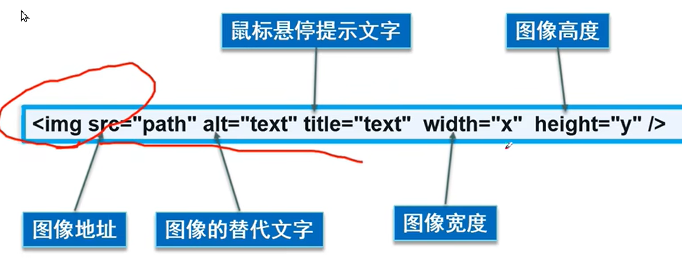

# 1 图像标签 ``, 单标签

在 HTML 标签中，`` 标签用于定义 HTML 标签页面中的图像。为单标签

```html

```

单词 image 的缩写，意为图像。
src 是标签的 必须属性，用于指定图像文件的路径和文件名。

## 1.1 图像标签的属性



属于这个图像标签的特性。

- 标签可以拥有多个属性，必须写在开始标签中，位于<mark>标签名后面</mark>。
- 属性之间不分先后顺序，标签名与属性、属性与属性之间均以空格分开。
- 采取  键值对 的格式   key="value"  的格式
- ``

**图像标签的其他属性**

| 属性       | 属性值  | 说明                                                  |
| -------- | ---- | --------------------------------------------------- |
| `src`    | 图片路径 | 必须写入属性， 不能缺乏                                        |
| `alt`    | 文本   | 替换文本，当图片不显示时显示文字. 显示的就是 alt 这个 key 对象的 value 中的给如的值 |
| `title`  | 文本   | 提示文本。鼠标放到图像上， 会自动显示的提示的文字 in tooltips。              |
| `width`  | 像素   | 图像宽度                                                |
| `height` | 像素   | 图像高度                                                |
| `border` | 像素   | 图像边框粗细, 这个 已经在 html5 中不支持， 在 html4 之后就废弃了           |

## 1.2 Barrierefreiheit 写上 alt 和 title 
Um eine Grafik in eine Seite einzubinden, benötigen Sie zunächst das Standalone-Tag . Dieses wird mit mindestens zwei Attributen gefüllt.
- src ist das erste und wichtigste, da es die Pfadangabe zum Bild darstellt (entweder eine Webadresse angeben oder eine Dateipfad-Adresse).
- alt gibt dem Bild einen Alternativtext, falls es nicht dargestellt werden kann und wird von screenreadern Sehbeeinträchtigten Anwendern vorgelesen. Es dient der Barrierearmut und ist Pflicht.
- title gibt dem Bild einen Text, der beim Drüberfahren mit der Maus erscheint.

## 1.3 Grafiken als Verweise

Von Grafiken können auch Links ausgehen, also Verweise auf eine andere Seite oder auf einen Anker im Dokument. Grafiken werden als Verweise deklariert, indem Sie in einem Link anstelle des Verweistextes das Grafikelement einfügen.

```html
<a href="Pfad zum Ziel">

</a>
```

# 2 路径

## 2.1 相对路径和绝对路径

相对路径： 以引用文件位置为参考基础，而建立出来的目录路径。是相对于 HTML 页面的位置。

| 分类    | 符号    | 说明            | 例子                         |
| ----- | ----- | ------------- | -------------------------- |
| 同级路径  |       | 同一级           | ``        |
| 下一级路径 | `/`   | 位于 HTML 文件上一级 | `` |
| 上一级路径 | `../` | 位于 HTML 文件下一级 | ``     |

绝对路径： 是指目录下的绝对位置，直接到达目标位置，通常是从盘符开始的路径或者完整的网络地址。

例如 D:\web\image.jpg 或者 

完整的网络地址 “https://www.itcases.cn/images/log.gif”, 为网络的绝对地址

# 3 Links 链接标签 `<a>`  双标签 

在 HTML 标签中，`<a>` 标签用于从一个页面链接到另一个页面。

## 3.1 download
`<a download="Dateiname"> `

## 3.2 超链接 href

a 是单词 anchor 的简写，是锚的意思。
`<a href="跳转目标" target="目标窗口的弹出方式">这里显示这个链接对应的文本</a>`
`<a href="Pfad zum gewünschten Ziel" target="Zielfenster">Zieltext</a> `

| 属性       | 作用                                                              |
| -------- | --------------------------------------------------------------- |
| `href`   | 指定链接地址 url，为必须属性。用于指定链接目标的url地址，（必须属性）当为标签应用href属性时，它就具有了超链接的功能 |
| `target` | 指定页面打开方式，`_self`为默认值，`_blank`为在新窗口中打开    

Das Attribut `target` ist dabei optional. Wird es nicht angegeben, wird der Link im gleichen Fenster geöffnet, ansonsten haben Sie folgende Werte zur Auswahl:
- _blank öffnet den Verweis in einem neuen browsing context
- _self öffnet den Verweis in demselben browsing context.
- _parent öffnet den Verweis im browsing content des Eltern Frame. Existiert dieses nicht verhält es sich wie _self.
- _top öffnet den Verweis im obersten browsing content.

### 3.2.1 超链接分类

不仅可以创建文本超链接，在网页中各种网页元素，如图像、表格、音频、视频等都可以添加超链接。

1. 外部链接: 需要添加 http://www.baidu.com   必须以http:// 开头
   1. `<a href="http://www.baidu.com" target="_self">腾讯</a>`
2. 内部链接：网站内部页面之间的相互链接。直接链接内部页面名称即可 
    1. 比如 `< a href="index.html">` 首页
   1. 目前 html 文件 在同级的目录下 有一个 index.html 文件。 就可以直接打开这个内部连接了
4. 空链接: `#`
   1. 如果当时没有确定链接目标时，通常将链接标签的href属性值定义为“#”(即href="#")，表示该链接暂时为一个空链接。
   2. `<a href="#">首页</a>`
   3. 点击后， 没有任何效果， 不会弹跳 
5. 下载链接：地址链接的是文件.exe、压缩包.zip 等。
   1. 如果 href 里面地址是一个文件或者压缩包，会下载这个文件: `<a href="img.zip">点击此处下载</a>`. img.zip 是在 这个 html 同级目录下
6. 网页元素链接：在网页中的各种网页元素。如文本、图像、表格、音频、视频等。
    1. ` <a href="http://www.baidu.com"></a>` 点击这个图片， 就可以进入 baidu 这个 页面了
7. 功能性链接
   1. 网页链接： `<a href="mailto:2323232@qq.com">链接这里会打开邮件发送的app</a>`


### 3.2.2 src 和 href 的区别

一句话概括:**src 是引入资源的, href 是跳转url的**

1. src用于替换当前元素，href用于在当前文档和引用资源之间确立联系。

2. src是source的缩写，指向外部资源的位置，指向的内容将会嵌入到文档中当前标签所在位置；在请求src资源时会将其指向的资源下载并应用到文档内，例如js脚本，img图片和frame等元素。
   1. 当浏览器解析到该元素时，<mark>会暂停其他资源的下载和处理，直到将该资源加载</mark>、编译、执行完毕，图片和框架等元素也如此，类似于将所指向资源嵌入当前标签内。这也是为什么将js脚本放在底部而不是头部。

3. href是Hypertext Reference的缩写，指向网络资源所在位置，建立和当前元素（锚点）或当前文档（链接）之间的链接。
   1. 如果我们在文档中添加那么浏览器会识别该文档为css文件，就会并行下载资源并且<mark>不会停止对当前文档的处理</mark>。这也是为什么建议使用link方式来加载css，而不是使用@import方式。

### 3.2.3 link和@import的区别

1、从属关系区别：  
link属于html标签，而@import是css提供的。  
2、加载顺序区别：  
页面被加载时，link会同时被加载，而@import引用的css会等到页面被加载完再加载。  
3、兼容性区别：  
import只在IE5以上才能识别，而link是html标签，无兼容问题。  
4、dom可操作性区别：  
可以通过JS 操作 DOM ，插入link标签来改变样式；由于 DOM 方法是基于文档的，无法使用@import的方式插入样式  
5、权重区别：  
如果已经存在相同样式，@import引入的这个样式将被该 CSS 文件本身的样式层叠掉，表现出link方式的样式权重高于@import的权重这样的直观效果。  
（简而言之，link和@import，谁写在后面，谁的样式就被应用，后面的样式覆盖前面的样式。）


### 3.2.4 如何 阻止 a 链接跳转
 阻止 a 链接跳转，可给 href 属性设置 javascript:void(0); 或者 javascript:;。 


# 4 Anker  锚点链接： ( 使用 `#`号)

锚点定位：通过创建锚点链接，用户能够快速定位到目标内容。点击链接，可以快速定位到页面中的某个位置。

- 创建一个锚点： 找到目标位置标签，里面添加一个 id 属性 = 名字. 使用相应的id名标注跳转目标的位置。 (找目标).  
    - `<h3 id="two">第2集</h3>`  讲 第2级 这个 标题标签， 定义为 id = two 的所在处
- 跳到某个锚点： 在链接文本的`href`属性中，设置属性为  `#名字的形式`
    - 使用`<a href="#id名">链接文本</a>`创建链接文本（被点击的）   `#` 不能省略
    - `<a href="#two">个人生活</a>`  ， 点击个人生活后， 会跳转到 two 所定义的位置 
    - 也可写成 `<a href=4.链接标签.html#top></a>`

## 4.1 id的命名规则
规定元素的唯一 id。

命名规则：
- 必须以字母 A-Z 或 a-z 开头
- 其后的字符：字母(A-Za-z)、数字(0-9)、连字符("-")、下划线("_")、冒号(":") 以及点号(".")
- 值对大小写敏感
- 不能含有空格

