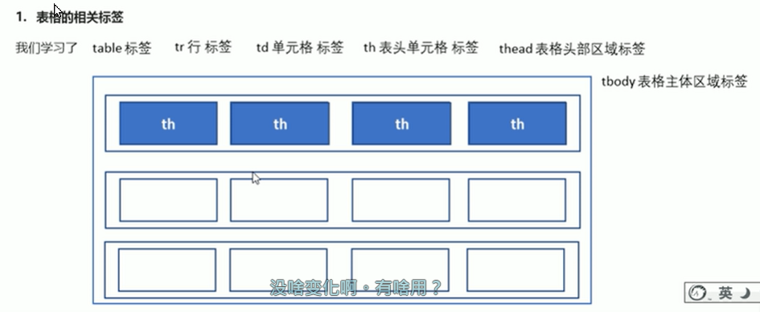
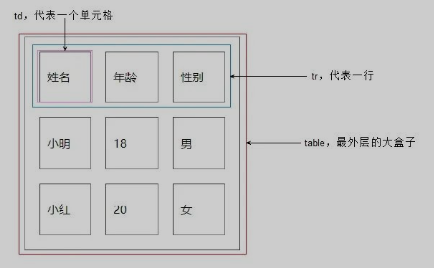
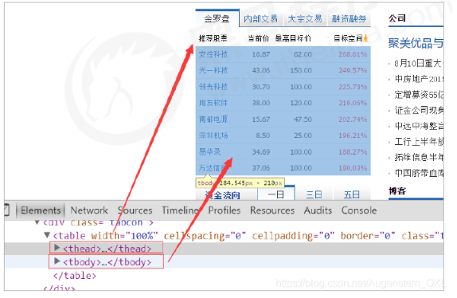
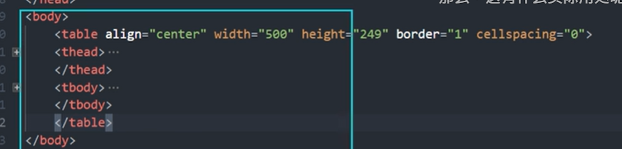
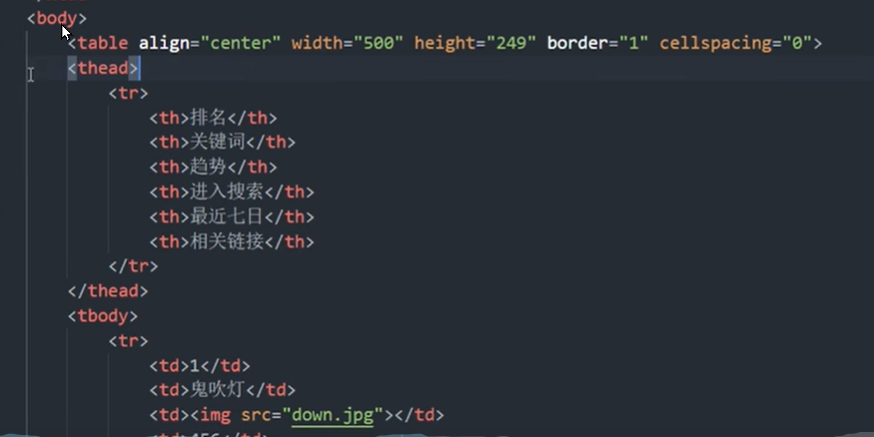
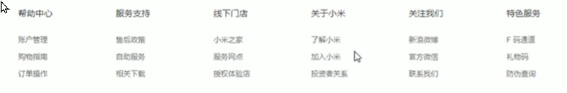
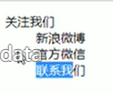

# 1 表格标签

## 1.1 表格的主要作用

表格主要用于显示、展示数据，因为可以让数据显示非常规整，可读性好。 表格不是来布局的，而是来展示数据的。



## 1.2 表格属性

只作了解，后期通过 CSS 来设置。 这些属性都要写到 `<table></table>` 标签中

三参为0，平时开发的我们这三个参数     border  cellpadding  cellspacing  为  0

`<table align=center border="1" cellpadding="20" cellspacing="0" width="500">`

| 属性名           | 属性值               | 描述                                             |
| ------------- | ----------------- | ---------------------------------------------- |
| `align`       | left、center、right | 表格元素对齐方式                                       |
| `border`      | 1 或""             | 规定是否有边框，默认为`""`，表示没有边框                         |
| `cellpadding` | 像素值               | 在一个单元之内， 规定这个单元内， 单元边沿与其单元格内的内容 之间空白的距离，默认 1px |
| `cellspacing` | 像素值               | 规定单元格之间的空白的距离，默认为 2px                          |
| `width`       | 像素值或百分比           | 规定整个表格宽度                                       |
| `hight`       | 像素                | 规定整个表格高度                                       |


## 1.3 表格标题caption

表格标题caption通常这个标题会被居中且显示于表格之上。caption 标签必须紧随 table 标签之后。这个标签只存在 表格里面才有意义。

```html
<table>
   <caption>我是表格标题</caption>
</table>
```


## 1.4 第一种表格结构标签

1. 表格标签 `<table></table>` 用于定义表格的标签。
2. 行标签`<tr></tr>` 标签用于定义表格中的行，必须嵌套在 `<table></table>`中。
3. 单元格标签`<td></td>` 用于定义表格中的单元格，必须嵌套在 `<tr></tr>` 中。
4. 字母 td 指表格数据（table data），即单元格的内容。，现在我们明白，表格最合适的地方就是用来存储数据的。td像一个容器，可以容纳所有的元素。

```html
<body>
    <table>
        <tr>  <th>姓名</th>     <th>性别</th>    <th>年龄</th>        </tr>
        <tr>  <td>林晓</td>     <td>男</td>     <td>18</td>          </tr>  
        <tr>  <td>林晓</td>     <td>男</td>     <td>18</td>          </tr>        
        <tr>  <td>林晓</td>     <td>男</td>     <td>18</td>          </tr>                        
    </table>
</body>
```



### 1.4.1 表头单元格标签 `<th>xx</th>`

一般单元格位于表格的第一行或第一列，表格单元格里面的文本内容 **加粗显示**。 `<th>` 标签表示 HTML 表格的表头部分（table head 的缩写） 表头单元格(`<th>`)也是单元格，常用于表格第一行，突出重要性，表头单元格里面的文字会加粗居中显示。 

表头单元格标签th:一般表头单元格位于表格的第一行或第一列，并且文本加粗居中,只需用表头标签<th></th>替代相应的单元格标签<td></td>即可。

```html
<body>
    <table>
        <tr>  <th>姓名</th>     <th>性别</th>    <th>年龄</th>        </tr>                    
    </table>
</body>
```

## 1.5 第二种表格结构标签

场景：表格可能很长，将表格分割为表格头部和表格主题两大部分。

加强语义化：
- `<thead>` 表示头部区域，
- `<tbody>` 表示主体区域，更好区分表格结构。
-  `<tfoot></tfoot>` 放表格的脚注之类。

注意：

1. 表格头部区域标签`<thead> </thead>`：定义表格头部，且内部必须有`<tr>`标签。
   1. 不要和 <th> 搞混。 thead 是整个 表头区域， 由多个 <th> 组成， 将其包起来
2. 表格主题区域标签 `<tbody></tbody>` ：定义表格主体，存放数据。
3. `<tfoot></tfoot>`: 放表格的脚注之类。
4. 以上标签都放在 `<table></table>` 里面。



### 1.5.1 例子





## 1.6 合并单元格 rowspan, colspan

`<td colspan = "2"></td>`

**合并单元格方式：**

- 跨行合并：rowspan="合并单元格个数"
- 跨列合并：colspan="合并单元格个数"

合并三部曲：

合并的顺序我们按照 先上 后下 先左 后右 的顺序 ,合并完之后需要删除多余的单元格。

1. 确定跨行 or 跨列。
2. 找到目标单元格：跨行取最上面为目标单元格，跨列取最左边为目标单元格。然后在这个单元格中 写入 合并语法就可以了 
   1. `<td colspan="2"></td>`
3. 删除多余单元格。


# 2 列表标签


表格展示数据，列表则用来布局。 列表特点是整齐、整洁、有序，作为布局更方便自由。 根据使用场景不同，列表分为三大类：

- 无序列表
- 有序列表
- 自定义列表

| 标签名         | 定义    | 说明                         |
| ----------- | ----- | -------------------------- |
| `<ul></ul>` | 无序列表  | 里面只能包含li，没有顺序。li里面可以包含任何标签 |
| `<ol></ol>` | 有序列表  | 里面只能包含li，有顺序               |
| `<dl></dl>` | 自定义列表 | 里面只能包含dt和dd，dt和dd里面可以放任何标签 |

`<li>与</li>`之间相当于一个容器，可以容纳所有元素

## 2.1 无序列表 unorder list `<ul>` 

`<ul>` 标签标识 HTML 页面项目中的无序列表，一般以项目符号呈现列表项。

语法格式:

``` html
<ul>
    <li>列表项1</li>
    <li>列表项2</li>
    <li>列表项3</li>
</ul>
```

注意:

1. 各个列表项之间无需，并列关系。
2. `<ul></ul>`中只能包含`<li></li>`，直接在<ul></ul>标签中输入其他标签或者文字的做法是不被允许的。
   1. `<li>与</li>`之间相当于一个容器，可以容纳所有元素
   2. 但在 li 同级的位置， 不允许有 同级的标签 
3. 无序列表带有自己的属性，可用 CSS 修改样式属性。

## 2.2 有序列表 order list `<ol>`

使用 `<ol>` 标签来定义有序列表，`<li>` 来定义列表项。

``` html
<ol type = "A">
    <li>列表项1</li>
    <li>列表项2</li>
    <li>列表项3</li>
</ol>
```

与无需列表类似，有自己的样式属性，通过 CSS 设置。

- `<ul></ul>`中只能包含`<li></li>`，直接在<ul></ul>标签中输入其他标签或者文字的做法是不被允许的。
  - `<li>与</li>`之间相当于一个容器，可以容纳所有元素
  - 但在 li 同级的位置， 不允许有 同级的标签 
- `<ol>`标签中的type属性值为排序的序列号，不添加type属性时，有序列表默认从数字1开始排序。
- 常用的type属性值分别为是1，a，A，i，I
- `<ol reversed="reversed">`中的reversed属性能够让有序列表中的序列倒序排列。
- `<ol start="3">`中的start属性值为3，有序列表中的第一个序列号将从3开始排列。

## 2.3 自定义列表 define list `<dl>`



定义列表常用于对术语或名词进行解释和描述，定义列表的列表项前没有任何项目符号。

`<dl>` 定义描述列表，与 `<dt>` 和 `<dd>` 标签配合使用。
`<dl>` 用于定义描述列表 或者 定义列表， 该标签会与 `<dt>` (定义项目/名字) 和 `<dd> `(描述每一个项目/名字) 一起使用

**注意**
1. dl 里面只能包含 dt 和 dd。

基本语法：

```html
<dl>
  <dt>关于小米</dt>
  <dd>了解虾米</dd>
  <dd>名词1解释2</dd>
  ...
  <dt>名词2</dt>
  <dd>名词2解释1</dd>
  <dd>名词2解释2</dd>
  ...
</dl>
```

显示效果为



# 3 Längere Zitate `<blockquote>` and kurze Zitate `q`

Das Element `<blockquote>` bietet Ihnen die Möglichkeit, Zitate als solche auch maschinenlesbar, z.B. für screenreader oder Suchmaschinen besonders auszuzeichnen. Meist wird dieser Absatz eingerückt, wie im Beispiel zu sehen ist. 
Erstellt wird solch ein Element durch die Tags ` <blockquote>` als einleitendes und `</blockquote> ` als abschließendes Element. 
Für die Quellenangabe wird das Attribut cite verwendet, nicht zu verwechslen mit dem Element `cite` . 

Kurze Zitate werden mit dem Element `q` für quote ausgezeichnet.

```html
 1 <!DOCTYPE html>
 2 <html lang="de">
 3   <head>
 4     <meta charset="utf-8">
 5     <title>Zitate definieren</title>
 6   </head>
 7   <body>
 8     <h1>Ein Zitat mit blockquote</h1>
 9     <p>Hier wird ein bekanntes Gedicht von Goethe zitiert.</p>
10     <blockquote cite="https://de.wikipedia.org/wiki/Wandrers_Nachtlied">
11       Ein Gleiches<br>
12       Über allen Gipfeln<br>
13       Ist Ruh,<br>
14       In allen Wipfeln<br>
15       Spürst du<br>
16       Kaum ein Hauch;<br>
17       Die Vöglein schweigen im Walde.<br>
18       Warte nur, balde<br>
19       Ruhst du auch.
20       </blockquote>
21   </body>
22 </html>
```