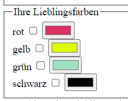

# 表单组成

- 表单域: 它相当于一个容器，用来容纳所有的表单控件和提示信息，可以通过他定义处理表单数据所用程序的url地址，以及数据提交到服务器的方法。如果不定义表单域，表单中的数据就无法传送到后台服务器。
- 表单控件（元素）:   包含了具体的表单功能项，如单行文本输入框、密码输入框、复选框、提交按钮、重置按钮等。
- 提示信息:   一个表单中通常还需要包含一些说明性的文字，提示用户进行填写和操作。


# 表单域

表单域是一个包含表单元素的区域。 
使用 `<form>` 标签用于定义表单域，手机和传递用户信息。 form 标签会将它范围内的表单元素信息提交给服务器。

目前而言，暂时不需要用表单域提交数据，只需要写上 `form` 标签即可。

**语法格式**

```
<form action="url地址" method="提交方式" name="表单域名称">
  各种表单元素控件
</form>
```

**常用属性：**

每个表单都应该有自己表单域。后面学 ajax 后台交互的时候，必须需要form表单域。

| 属性     | 属性值      | 作用                                                     |
| ------ | -------- | ------------------------------------------------------ |
| action | url 地址   | <mark>表示向何处发送表单数据</mark>  <br/>指定接受并处理表单数据的服务器的 url 地址 |
| method | get/post | 用于设置表单数据的提交方式，其取值为get或post                             |
| name   | 名称       | 用于指定表单名称，区分同一个页面中的多个表单域                                |

注意：

1. 写表单元素之前需要有表单域将其包含。
2. 表单域是 `form` 标签。
3. 元素属性值使用双引号语法
4. 元素属性值可以写上的都写上
   1. ```html
      <input type="text" /> 
      <input type="radio" name="name" checked="checked" />
      ```

## GET 和 POST 的区别

| GET                                                            | POST                                                                |
| -------------------------------------------------------------- | ------------------------------------------------------------------- |
| GET在浏览器回退时是无害的                                                 | 而POST会再次提交请求。                                                       |
| GET请求会被浏览器主动cache                                              | 而POST不会，除非手动设置。                                                     |
| GET请求只能进行url编码                                                 | 而POST支持多种编码方式                                                       |
| GET请求参数会被完整保留在浏览器历史记录里                                         | 而POST中的参数不会被保留                                                      |
| GET请求大小一般是(1024字节)，http协议并没有限制，而与服务器，操作系统有关                    | POST理论上来说没有大小限制，http协议规范也没有进行大小限制，但实际上post所能传递的数据量根据取决于服务器的设置和内存大小。 |
| 对参数的数据类型，GET只接受ASCII字符                                         | 而POST没有限制                                                           |
| GET比POST更不安全，因为参数直接暴露在URL上，所以不能用来传递敏感信息。 <br/> 会在url 上暴露提前交的参数 | 不会在 url 上暴露提交的参数。比较安全                                               |

# 表单控件（表单元素）

在表单域中定义各种表单元素，允许用户在表单中输入或选择的内容控件。

表单元素我们学了三大组

- input 输入表单元素

- select 下拉表单元素

- textarea 文本域表单元素

这三组表单元素都应该包含在 form 表单域里面，并且有 name 属性


## input 输入表单元素

`<input>` 标签用于收集用户信#息。

`input` 标签为单标签

Type 属性必须给入


### 更多input felder 的信息

  https://www.mediaevent.de/html/input.html

### input标签中type属性

```
<input type="属性值" />
```

- `type` 属性设置不同属性值来指定不同控件类型
- `input` 标签包含 `type` 属性，决定了输入字段的不同形式：文本字段、复选框、掩码后的文本控件、单选按钮、按钮等。

#### input标签中type属性的常用值

| 属性值      | 描述                           |
| -------- | ---------------------------- |
| button   | 定义可点击按钮                      |
| checkox  | 复选框                          |
| file     | 定义输入字段和“浏览”按钮，供文件上传          |
| hidden   | 定义隐藏的输入字段                    |
| image    | 定义图像形式的提交按钮                  |
| password | 定义密码字段。字符被掩码。                |
| radio    | 定义单选按钮                       |
| reset    | 定义重置按钮，清除表单所有数据。             |
| submit   | 定义提交按钮。重置按钮会清除表单所有数据。        |
| text     | 定义输入字段。用户可输入文本，默认宽度为 20 个字符。 |
| number   |                              |
| range    |                              |
| email    |                              |
| rul      |                              |
| search   |                              |
| color    |                              |
| date     |                              |

##### 文本框text与密码框password

type 属性设置为 text 是文本框
type 属性设置为 password 是密码框

```html
<body>
    <form>
        <!-- text 文本框 用户可以看见里面输入的文字 -->
        用户名：<input type="text"> <br/> 
          <!-- text 文本框 用户看不见里面输入的文字 -->
        密码：<input type="password">
    </form>
</body>
```

##### radio和 checkbox

- `type` 属性设置为 radio 不一定是 单选框 radio是，可以多选, 同时选上好几个radio 没问题的
  - name是表单元素的名字，这里的性别单选按钮必须有相同的名字name，才能实现 只能选一个的功能. 通过这样 就可以将多个 radio 放到一个组里面
- `type` 属性设置为 checkbox 是复选框

```html
<form>
        用户名：<input type="text"> <br> 
        密码：<input type="password"> <br> 
        <!-- radio是单选框，可以多选一 -->
        性别：男<input type="radio"> 女 <input type="radio">
        <!-- checkbox是多选框，可以多选 -->
        爱好：吃饭<input type="checkbox">  睡觉<input type="checkbox">   打游戏<input type="checkbox"> 
</form>

<form>
        用户名：<input type="text" name="username" value="请输入用户名"> <br> 
        密码：<input type="password" name="password"> <br> 
        radio是，可以多选, 同时选上好几个radio 没问题的， 如下 （没写name ）
        性别：男<input type="radio" value="男"> 女 <input type="radio" value="女">
        name是表单元素的名字，这里的性别单选按钮必须有相同的名字name，才能实现 只能选一个的功能。 如下
        性别：男<input type="radio" name="sex" value="男"> 女 <input type="radio" name="sex" value="女">
        <!-- checkbox是多选框，可以多选 -->
        爱好：吃饭<input type="checkbox" name="habby" value="吃饭">  睡觉<input type="checkbox" name="habby" value="睡觉">   打游戏<input type="checkbox" name="habby" value="打游戏"> 
</form>
```


- 对于 `radio` 单选框，必须使 `input` 的 `name` 具有相同的属性值，才能实现多选一。 

- 同理，复选框checkbox 也要有相同的`name`值。使其方法哦一个组里面

- 单选框和复选框可以设置 `checked` 属性，页面打开默认选择按钮。

##### submit和reset

- `type` 属性设置为submit：提交按钮会把表单数据发送到服务器
- ``type` 属性设置为reset：重置按钮会<mark>清除表单中的所有数据</mark>

```html
<input type="submit" value="获取短信验证码"> <br>  在 button 上面显示为 获取短信验证码
<input type="reset" value="重新填写"> <br>  在 button 上面显示为 重新填写
```

##### button和文件域file

- `type` 属性设置为button：是一个按钮
- value 是按钮上面的字

```html
<input type="button" value="获取短信验证码"> <br>  在 button 上面显示为 获取短信验证码
```

##### 文件域file

- `type` 属性设置为file：是一个文件域，可以上传文件

```html
<!-- 文件域：上传文件使用的 -->
上传头像：<input type="file">
```

##### image

```html
<input type="image" src="../image/1.jpg"> 
图片来源与 src 处
点击 这个图片，也会自动提交这个表单
```

##### number


```html
<input type="number" name="num" max="100" min="0" step="10">  
点击上下的步长为10
```

##### 滑块 range


```html
<input type="range" min="0" max="100"  name="音量" step="10">  
点击上下的步长为10
```

##### email， url

```html
<input type="email" name="email"> 
会自动验证你输入的文本里面有没有@键， 没有的话@ 的话， 会报错

<input type="url" name="url"> 
会自动验证你输入的文本里面是不是网址
```

##### 搜索 Search

```html
<input type="search" name="url"> 
```

##### List and Datalist

```html
            <fieldset>
                <legend>Lieblingsspielort</legend>
                <label for="place">Wo spielen Sie am liebsten?</label>
                <input id="place" list="places">
                <datalist id="places">
                    <option value="livingRoom">Wohnzimmer</option>
                    <option value="kitchen">Küche</option>
                    <option value="garden">Garten</option>
                </datalist>
            </fieldset>
```


##### color

<input type="color" value="#DE3163">
<input type="color" value=""> value 值为空时， 会显示为黑色， 黑色为默认值

```html
                <fieldset>
                    <legend>Ihre Lieblingsfarben</legend>
                    <label for="r">rot</label>
                    <!-- Der value kann zur späteren Verarbeitung in anderen Dateien übertragen werden. -->
                    <input id="r" type="checkbox" name="color" value="red">
                    <input type="color" value="#DE3163">
                    <br>
                    <label for="y">gelb</label>
                    <input id="y" type="checkbox" name="color" value="yellow">
                    <input type="color" value="#DFFF00">
                    <br>
                    <label for="g">grün</label>
                    <input id="g" type="checkbox" name="color" value="green">
                    <input type="color" value="#9FE2BF">
                    <br>
                    <label for="b">schwarz</label>
                    <input id="b" type="checkbox" name="color" value="black">
                    <input type="color" value="">
                </fieldset>
```



### input标签的其他属性 (除了 type 属性外)

| 属性        | 属性值     | 描述                     |
| --------- | ------- | ---------------------- |
| name      | 自定义     | 定义 input 元素名称          |
| value     | 自定义     | 规定 input 元素的值          |
| checked   | checked | 规定此 input 元素首次加载时应当被选中 |
| maxlength | 正整数     | 规定输入字段字符的最大长度          |

#### 注意

1. 对于 `radio` 单选框，必须使 `input` 的 `name` 具有相同的属性值，才能实现多选一。 同理，复选框也要有相同的`name`值。

2. 单选框和复选框可以设置 `checked` 属性，页面打开默认选择按钮。

3. 设置 `type` 的值为 `submit`，点击按钮后可以把表单域 form 里面的表单元素里面的值提交给后台。

4. 设置 `type="button"`，普通按钮，后期结合 js 使用

#### name和value属性

name 和 value 是每个表单元素都有的属性值，主要给后端人员使用。

name 是表单元素的名字，要求 单选框和复选框要有相同的name值, value可以不一样

```html
<form>
        用户名：<input type="text" name="username" value="请输入用户名"> <br> 
        密码：<input type="password" name="password"> <br> 
        radio是，可以多选, 同时选上好几个radio 没问题的
        name是表单元素的名字，这里的性别单选按钮必须有相同的名字name，才能实现 只能选一个的功能
        性别：男<input type="radio" name="sex" value="男"> 女 <input type="radio" name="sex" value="女">
        <!-- checkbox是多选框，可以多选 -->
        爱好：吃饭<input type="checkbox" name="habby" value="吃饭">  睡觉<input type="checkbox" name="habby" value="睡觉">   打游戏<input type="checkbox" name="habby" value="打游戏"> 
</form>
```

##### value属性

- value 默认的文本值。有些表单想刚打开页面就<mark>默认显示几个文字</mark>，就可以通过这个value 来设置。
- `用户名:<input type="text"  name="username" value="请输入用户名"> `

##### name属性

- name表单的名字，他的值不会显示出来 

- 这样，后台可以通过这个name属性找到这个表单。 页面中的表单很多，name主要作用就是用于区别不同的表单。name属性：当前input表单的名字，后台可以通过这个name属性找到这个表单，name的主要作用就是用于区别不同的表单

- name属性后面的值，是我们自己定义的。

- radio  如果是一组，我们必须给他们命名相同的名字 name   这样就可以多个选其中的一个啦. name 是表单元素的名字，要求 单选框和复选框要有相同的name值, value可以不一样

- name属性，我们现在用的较少，但是，当我们学ajax 和后台的时候，是必须的。

`<input type="radio" name="sex"  />男`

`<input type="radio" name="sex" />女`

#### checked和maxlength

- checked 属性主要针对于单选框和复选框，主要作用是一打开页面，就可以默认状态下，就已经选中某个表单元素

- maxlength:规定最多输入多少个字符

- 单选按钮和复选框可以设置**checked** 属性

- 当页面打开时候就可以默认选中这个按钮

- <mark>单选框只能给其中一个加checked，</mark> 复选框可以给多个项加上 checked 
  
  - ```html
    Radio 中 
    注意 在 女不能在 写生  checked="checked"了    
    性别:男<input type="radio" name="sex" value="男" checked="checked"> 女 <input type="radio" name="sex" value="女">   
    
    Checkbox 中 可以给多个项加上 checked
    爱好：吃饭<input type="checkbox" name="habby" value="吃饭">  睡觉<input type="checkbox" name="habby" value="睡觉">   打游戏<input type="checkbox" name="habby" value="打游戏"> 
    ```

##### Checked属性

表示默认选中状态。 较常见于 单选按钮和复选按钮。

```html
<input type="radio" name="sex" value="男" checked="checked" />男
<input type="radio" name="sex" value="女" />女 
```

#### 使得这个field 只读 readonly, 禁用disable

- 只读就是不能输入自己的值了

- 禁用是 不能选这个值了


#### 隐藏域 hidden

虽然隐藏了， 但是这个feld 在你看不见的地方还存在。 这个功能可以用来给如一些有默认值的东西， 

```html
<input type="password" name="pwd" value="213123" hidden>
```


#### placeholder 相当于提示的信息

就是没有文本的时候， 这个field 上现实的提示词，一单输入了一个文本后， 这个提示词就不会再出现了

```html
<input type="text" name="username" placeholder="请输入你的用户名">
```


#### required 必须填写， 非空判断

```html
<input type="text" name="username" required>
```

#### pattern 正则表达式

通过正则表达来审核内容

```html
<input type="text" name="username" pattern="">
```

### input 表单元素中的 label 标签

`<label>` 标签为 input 元素定义标注。
`<label>` 标签用于绑定一个表单元素，<mark>当点击 label 标签内的文本时，浏览器自动将焦点转到或者选择对应的表单元素上</mark>，提升用户体验。 
`label`标签的 for属性 应当与相关元素的id 属性相同

例子
作用：用于绑定一个表单元素, 当点击label标签的时候, 被绑定的表单元素就会获得输入焦点。

1. <mark>比如点一下用户名这三个字， 就可以把光标变到它对应的文本框中， 然后就可以输入用户名了</mark>
2. 比如 有几个 radio buttin, 点一下 这个radio Button 对应的文字， 这个 radio 就自动选中了 

**语法** ： <mark>标签的 for 属性与相关元素的 id 属性 的值必须一样， 不然会报错</mark>。

```html
<label for="sex">男</label>
<input type="radio" name="sexyzh" id="sex" />


例子2
<label for="textyzh">用户名:</label>
<input type="text" id="textyzh" />

例子3：

```

#### 如何绑定元素呢

- 第一种用法就是用label标签直接包含input表单， 适合单个表单选择

- 第二种用法 for 属性规定 label 与哪个表单元素绑定(通过id)。

```html
  第一种
  <label> 用户名： 
    <input type="radio" name="usename" value="请输入用户名">   
  </label>

  第二种
  <label for="sex">男</label>
  <input type="radio" name="sex"  id="sex">
```

#### 例子

例子1：  点击" 用户名:" 就可以定位光标到输入框

```html
<form>
<label for="myid "> 用户名:</label> 
  <input type="text" id="myid" />
</form>
```

例子2: 点击" 用户名:" 或按键alt+1, 都可以定位光标到输入框

```html
<form>       
  <label for="myid" accesskey="1"> 用户名:</label>       
  <input type="text" id="myid" tabindex="1" />   
</form>
```

**for 属性**功能：

表示Label 标签要绑定的HTML 元素，你点击这个标签的时候，所绑定的元素将获取焦点。

**acesskey 属性**  
功能：表示访问Label 标签所绑定的元素的热键，当您按下热键，所绑定的元素将获取焦点。  
局限性：accessKey 属性所设置的快捷键不能与浏览器的快捷键冲突，否则将优先激活浏览器的快捷键。

## select 下拉表单元素

`select` 标签设置多个选项让用户选择，节约页面空间。 

- select标签 为 下拉表单元素
- select 中<mark>至少包含一对 option</mark>。
- 在 option 中<mark>定义属性`selected=selected`，当前项即为默认选项</mark>。
- 我们实际开发会用的比较少

**语法**

```html
<html>
<form>
<body>
籍贯:
<select>
    <option>选项1</option>
    <option>选项2</option>
    <option selected="selected">选项3</option>
</select>
<body>
</form>  

</html>
```


#### 例子2


```html
                <fieldset>
                    <legend>Vorlieben</legend>
                    <label for="city">Wählen Sie Ihre Wohnstadt</label>
                    <select id="city">
                        <option value="berlin">Berlin</option>
                        <option value="hamburg">Hamburg</option>
                        <option value="koeln">Köln</option>
                    </select>
                    <label for="game">Wähle Dein Lieblingsspiel</label>
                    <select id="game" multiple>
                        <optgroup label="Kartenspiele">
                            <option value="phase10">Phase 10</option>
                            <option value="11erRaus">11er Raus</option>
                            <option value="uno">Uno</option>
                        </optgroup>
                        <optgroup label="Brettspiele">
                            <option value="mensch">Mensch ärgere Dich nicht!</option>
                            <option value="fang">Fang den Hut</option>
                            <option value="siedler">Siedler von Catan</option>
                        </optgroup>
                    </sel 
```

## text area 文本域表单元素

场景：输入内容较多时。单行不再被满足

textarea 用于定义多行文本输入的控件

cols = “每行中的字符数” ， rows = “显示的函数”，我们在实际开发中不会使用，都是用CSS来改变大小


**语法：**

```html
<html>
<form>
<body>

网站介绍：  // 这是 textarea  这个对应的标题
<textarea name="朱彦博" rows="3" cols="20">
    这是默认的显示的信息 // 这是文本框里面 默认显示的信息 
</textarea>


<body>
</form>  

</html>
```

**文本框和文本域区别**

| 表单                | 名称  | 区别       | 默认值显示            | 用于场景       |
| ----------------- | --- | -------- | ---------------- | ---------- |
| input type="text" | 文本框 | 只能显示一行文本 | 单标签，通过value显示默认值 | 用户名、昵称、密码等 |
| textarea          | 文本域 | 可以显示多行文本 | 双标签，默认值写到标签中间    | 留言板        |
