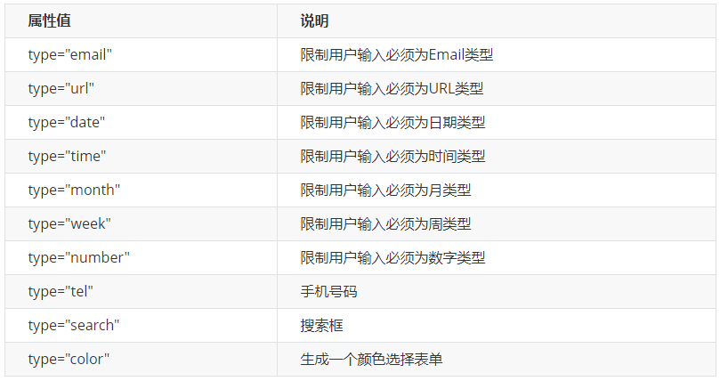
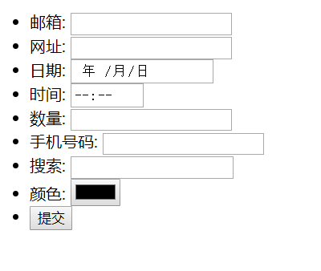
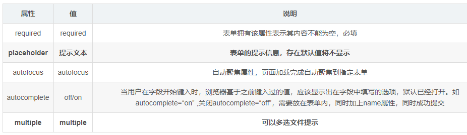
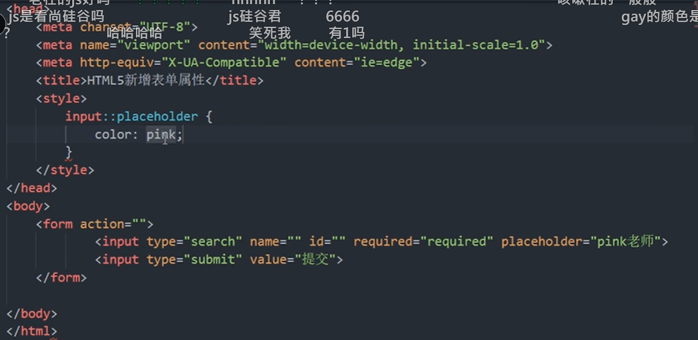
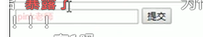

# 1 HTML5新增的表单的 input类型

在H5中，帮我们新增加了很多类型的表单，这样方便了程序员的开发

在这个案例中，熟练了新增表单的用法

## 1.1 html5之前的版本的 常见输入类型（input这个Attribute的 值)

```
text password radio checkbox button file hidden submit reset image
```

## 1.2 HTML新增的输入类型（input这个Attribute的 值）

类型很多，我们现阶段**重点记忆三个**： **`number` `tel` `search`

 

 

案例代码：
```html
<!-- 我们验证的时候必须添加form表单域 -->
<form action="">
    <ul>
        <li>邮箱: <input type="email" /></li>
        <li>网址: <input type="url" /></li>
        <li>日期: <input type="date" /></li>
        <li>时间: <input type="time" /></li>
        <li>数量: <input type="number" /></li>
        <li>手机号码: <input type="tel" /></li>
        <li>搜索: <input type="search" /></li>
        <li>颜色: <input type="color" /></li>
        <!-- 当我们点击提交按钮就可以验证表单了 -->
        <li> <input type="submit" value="提交"></li>
    </ul>
</form>
```

# 2 HTML5新增表单属性



```html
 <form action="">
        <input type="search" name="sear" id="" required="required" placeholder="pink老师" autofocus="autofocus" autocommplete="off">
        <input type="submit" value="提交">
    </form>
```

## 2.1 可以通过以下设置方式修改placeholder里面的字体颜色 (css 方式)

``` css
input::placeholder {
    color: pink;
}
```




